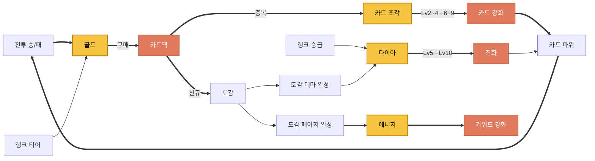

# 재화 사이클 — 무엇을 어디에 쓰는가

> **이 문서가 재화 체계의 진실원이다.** [`ENHANCE_ECONOMY.md`](./ENHANCE_ECONOMY.md)는 옛 2재화(골드·다이아) 전제로 쓰였고 "도감 방치 생산 → 다이아"라는 폐기된 전제를 깔고 있다. 수치·경로는 이 문서를 따르고, 그쪽은 *왜 재화의 성격이 달라야 하는가* 논거로만 읽는다.

## 원칙 — 재화 하나 = 출처 한 계열 + 소비 한 계열

재화가 여러 소비처를 가지면 유저는 매번 "이걸 A에 쓸까 B에 쓸까"를 저울질해야 한다. 캐주얼 게임에서 그 저울질은 재미가 아니라 피로다. 그래서 **재화마다 나가는 문을 하나로 고정**한다.

| 재화 | 출처 | 소비 |
|---|---|---|
| **골드** | 전투 승/패 · 랭크 티어 달성 | **카드팩 구매** |
| **카드 조각** | **카드팩 중복 카드** | **카드 강화** (Lv2~4 · 6~9) |
| **다이아** | 랭크 등급 승급 · 도감 테마 완성 | **진화** (Lv5 · Lv10) · 울트라팩 |
| **에너지** | 도감 페이지 완성 | **키워드 강화** |

## 사이클

**주 순환은 한 줄이다: 전투 → 골드 → 카드팩 → 중복 → 조각 → 강화 → 더 센 카드 → 전투.**
카드팩이 두 갈래(신규는 도감으로, 중복은 조각으로)로 갈라져서 팩을 여는 행위에 버리는 결과가 없다.

## 왜 조각을 갈랐나 (2026-08-18)

그전엔 골드가 전투 보상·랭크 보상·중복 환급을 전부 받아서 카드팩과 카드 강화 양쪽으로 나갔다. 재화가 부족해서가 아니라 **성장축마다 자기 재화가 없어서** 비용이 골드 하나에 몰린 것이다. 그래서 "골드가 다 한다"가 됐고, 재화별 용도를 한 문장으로 말할 수 없었다.

중복 카드를 조각의 유일한 출처로 둔 이유는 **중복이 원래 손해로 느껴지는 사건**이기 때문이다. 손해를 강화 재료로 바꾸면 팩을 여는 이유가 하나 더 생긴다. 반대로 조각을 전투에서도 주면 조각이 다시 "흐름 재화"가 되어 골드 자리를 그대로 물려받는다 — 그러면 갈라놓은 의미가 없다.

## 진화는 별도 시스템이 아니다

Lv4→5, Lv9→10 레벨업의 소모 재화가 다이아일 뿐이다. 유저가 보는 건 강화 버튼 하나고, 두 지점에서 아이콘만 바뀐다. 진화 화면·규칙을 따로 만들지 말 것.

## 수치 (전부 데이터 — 코드 수정 없이 조정)

**카드 강화** (`Assets/SO/CardGrowth/CardGrowthConfig.asset`의 `levelSteps`)

| Lv | 2 | 3 | 4 | 5 | 6 | 7 | 8 | 9 | 10 |
|---|---|---|---|---|---|---|---|---|---|
| 재화 | 조각 | 조각 | 조각 | **다이아** | 조각 | 조각 | 조각 | 조각 | **다이아** |
| 비용 | 4 | 6 | 9 | 15 | 14 | 18 | 23 | 28 | 35 |
| 성공률 | 1 | 1 | 1 | 1 | 0.9 | 0.8 | 0.7 | 0.6 | 1 |

만렙까지 조각 102 + 다이아 50. **강화 실패는 페널티가 아니라 조각 싱크를 무한하게 만드는 장치다**(도감을 다 채운 뒤에도 소모처가 죽지 않게).

**중복 환급** (스펙시트 `CardPack` 표의 `refundType` / `refundAmount`)

| 팩 | 가격 | 중복 1장당 |
|---|---|---|
| 일반 팩 | 골드 110 | 조각 2 |
| 스페셜 팩 | 골드 140 | 조각 3 |
| 울트라 팩 | 다이아 30 | 조각 8 |

6장 중 3장 중복 가정 시 일반 팩 1개 ≈ 조각 6. 카드 한 장 만렙(조각 102) ≈ 팩 17개 ≈ 골드 1,870 ≈ 전투 19승.

## 코드에서의 진실원

| 무엇 | 어디 |
|---|---|
| 재화 종류 | `OutGame/Currency/ECurrencyType.cs` — **`Count` 앞에만 추가**(세이브 인덱스) |
| 잔액 | `OutGame/Currency/CurrencyManager.cs` (`Earn`/`Spend`/`CanAfford`) |
| 세이브 | `OutGame/Save/2.Domain/CurrencySaveData.cs` — 인덱스 = `(int)ECurrencyType` 인 `balances` |
| 아이콘·표시명 | `OutGame/Currency/CurrencyLook.cs` + `Assets/SO/Currency/CurrencyLook.asset` — **재화 그림이 갈리는 UI는 전부 여기만 본다** |
| 강화 비용 | `CardGrowthConfig.levelSteps[].costCurrency` / `.cost` |
| 중복 판정·환급 | `CardPackOpener.GrantAndRefund` — `OwnershipManager.Grant()==false` 가 곧 중복 |
| 환급 재화·액수 | `CardPackData.RefundType` / `RefundAmount` — **스펙시트가 SO 저작값을 덮는다** |

> 재화를 하나 더 늘릴 때 손댈 곳은 **enum 한 줄 + `CurrencyLook.asset` 한 칸 + HUD 프리팹 한 장**이다. 세이브·잔액·연출은 `Count` 기반이라 따라온다.

## 스코프 밖 (기록)

- **도감 방치 생산은 폐기.** `CollectionProductionManager` 코드는 남아 있지만 기획상 죽었다. 도감 보상은 페이지/테마/전체 완성 3단만.
- 팩 확률 보정은 재화가 아니라 카드팩 자체가 맡는다(일반 랜덤 / 등급별 풀 / 확정팩).
- `EPackOpenResult.InsufficientGold` 는 이름이 재화 중립이 아니다(`InsufficientCurrency` 가 맞다). 참조가 흩어져 있어 별건.

## 남은 저작 (2026-08-18 기준)

- **스펙시트 `CardPack` 표의 `refundType`이 아직 `Gold`다.** SO(`Assets/SO/CardPack/**`)에는 `Shard`로 저작해 뒀지만 시트가 SO를 덮으므로 **런타임 환급은 여전히 골드로 나간다.** 구글시트에서 `refundType`을 `Shard`, `refundAmount`를 2/3/8(일반/스페셜/울트라)로 고치고 `CookApps > SpecData` 창에서 재생성해야 반영된다. 붙여넣을 행은 `docs/SpecData/CardPack_sheet.csv`에 이미 반영해 뒀다(이 파일은 내보낸 사본이라 그 자체로는 게임에 영향이 없다).
- **재화 아이콘 4종은 Layer Lab 키트에서 임시 전용한 것이다** — 조각은 초록 육각 보석(`Itemicon_Gem_Green`). 전용 아트가 나오면 `CurrencyLook.asset` 한 칸만 갈아끼우면 된다.
- 조각 잔액은 상단 바에 없다(칩 3개로 이미 화면 폭을 넘긴다). **맥락 재화**로 카드 상세 하단과 팩 개봉 오버레이에만 뜬다.
