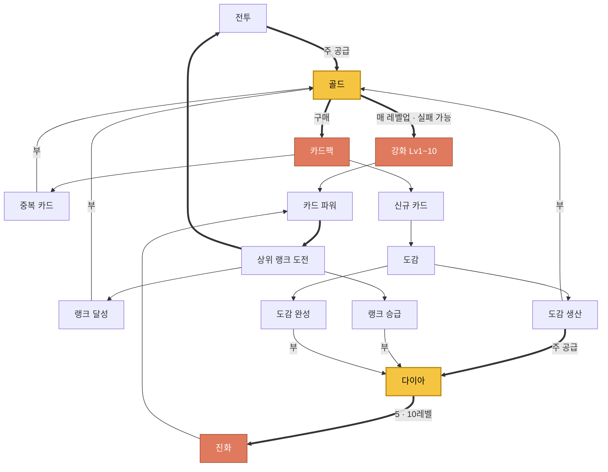

# 카드 강화 — 재화 생산/소모 사이클

> **구현 상태(2026-08-04)**: 소모 축(강화 Lv1~10 · 실패 확률 · 진화 게이트 Lv5/Lv10 · 다이아)은 **코드 완료**. 공급 축은 골드만 살아 있고 **다이아 공급은 아직 디버그 치트뿐**이라 위 사이클의 "다이아 순환"은 미가동이다(도감 생산 → 다이아 배선이 다음 단계). 구조·잔여 작업은 [`STRUCTURE.md`의 "카드 성장" 절](./STRUCTURE.md)과 [`OUTGAME_BOARD.md`의 `PKG-GROWTH-*`](./OUTGAME_BOARD.md). **이 문서는 기획(왜)의 진실원이며 구현 상태로 내용을 고치지 않는다.**

## 두 재화의 성격이 다르다 — 이게 뼈대

|  | 골드 | 다이아 |
|---|---|---|
| 성격 | **흐름(flow)** | **저량(stock)** |
| 공급 동력 | 플레이 **행위**에 비례 | **시간** 경과에 비례 |
| 소모 빈도 | 상시·연속 (매 레벨업, 매 카드팩) | 이산·희소 (카드당 2회뿐) |
| 유저 체감 | "쓰면서 번다" | "모아뒀다 쓴다" |

골드는 **세션 길이**를, 다이아는 **리텐션**을 보상한다. 진행하려면 둘 다 필요해서 한쪽만 파고들어선 못 나아간다.

## 사이클 전체도



> 굵은 화살표 = 주 순환 / 얇은 화살표 = 부 공급. 노란색 = 재화, 주황색 = 소모처.

**닫힌 순환 두 개가 카드팩에서 맞물린다:**

- **골드 순환(빠름)**: 전투 → 골드 → 강화 → 파워↑ → 더 나은 전투 보상
- **다이아 순환(느림)**: 카드팩 → 도감 확장 → 다이아 생산량↑ → 진화 → 파워↑

## 세 겹의 루프 — 시간 축이 다르다

| 루프 | 주기 | 동력 | 소모처 | 유저의 말 |
|---|---|---|---|---|
| **세션** | 분 | 전투 보상 골드 | 강화 레벨업 시도 | "한 판만 더" |
| **일간** | 시간~일 | 도감 생산 다이아 | 진화 | "수확하러 들어가야지" |
| **성장** | 주 | 골드 대량 | 카드팩 → 도감 확장 | "도감을 채워야 뚫린다" |

세 루프가 각각 다른 재화·다른 시간축을 써서 서로를 잠식하지 않는다. 접속 이유가 세 종류로 나온다.

## 강화 실패는 페널티가 아니라 엔진이다

실패 확률의 진짜 기능은 **골드 싱크를 무한대로 만드는 것**이다.

비용이 고정이면 유저가 "N판 하면 레벨업"을 계산해버린다 → 목표가 유한해지고 달성 순간 골드가 남는다. 확률이 있으면 필요량이 예측 불가능해져서 **골드가 항상 조금 부족한 상태로 유지**된다. 결과적으로 도감을 다 채워 카드팩이 무의미해진 뒤에도 골드 소모처가 죽지 않는다.

## 다이아는 유통되는 재화가 아니라 '문'이다

5·10레벨 두 지점에서만 소모된다. 그래서 만들어지는 행동 전환이 이 설계에서 가장 좋은 부분이다:

```
강화하다 5레벨 도달 → 다이아 부족 → 진화 막힘
    → "다이아를 더 빨리 벌려면?" → 도감 생산 칸을 늘려야 함
    → 카드팩 구매(골드 소모) → 도감 확장 → 다이아 생산량↑
    → 진화 해금 → 다시 강화
```

**수직 성장(강화)이 막히면 유저가 수평 성장(수집)으로 밀려나고, 그 수평 성장이 수직 성장의 연료를 만든다.** 브레인스토밍의 "강화 vs 카드깡" 갈림길이 배타적 선택이 아니라 **하나의 순환**으로 합쳐졌다.

## 병목이 왕복한다

| 구간 | 병목 | 유저가 하는 일 | 이탈 위험 |
|---|---|---|---|
| 초반 | 골드 | 강화와 카드팩이 같은 골드를 두고 경쟁 | 낮음 (선택의 재미) |
| 중반 | **다이아** | 5레벨 벽 → 도감 채우기로 전환 | 중간 (방치 대기) |
| 후반 | 골드 | 도감 완성 → 고레벨 실패율이 골드를 태움 | 낮음 |
| 엔드 | — | 전 카드 10레벨 | **높음 (목표 소진)** |

한 재화만 계속 부족하면 지루한데, 골드 → 다이아 → 골드로 번갈아 부족해서 할 일이 계속 바뀐다.

## 사이클 건전성

| 재화 | 유입 | 유출 | 유출 성격 | 판정 |
|---|---|---|---|---|
| 골드 | 4경로 | 2 (강화·카드팩) | 확률 기반 = **실질 무한** | 건전 |
| 다이아 | 3경로 | **1 (진화)** | 고정 횟수 = **유한·소량** | 구멍 |

---

## 사이클을 깨는 지점 2개

**① 다이아 잉여 — 유출이 하나뿐.**
유입 3 대 유출 1인데, 유출 총량이 유한하고 작다. 실제로 강화하는 건 덱에 넣는 소수 카드고 카드당 2회뿐이다. 도감이 완성되면 다이아는 소모처 없이 무한 적립되고, **그 순간 진화 게이트가 무력화되면서 위의 '문' 전환이 작동을 멈춘다.**

튜닝으로는 못 막는다 — 생산량을 낮추면 중반 벽이 과해지고, 높이면 후반에 넘친다. 방향은 셋 중 하나다: 진화 비용 차등화로 유출 총량을 키우거나, 다이아에 두 번째 소모처를 주거나, 도감 완성 시점에 다이아 파이프 자체를 종료시키거나.

**② 난이도 곡선 — 사이클의 시동 조건.**
이 사이클 전체의 출발점은 "이기기 힘들다"는 압력인데, 현재 랭크는 표시용이고 AI 난이도가 고정이라 그 압력이 없다. 리스크가 아니라 **전제**다. 이게 없으면 위 순환은 전부 작동은 하되 유저가 돌릴 이유가 없다.

**부수적으로**, 키워드 강화(에너지)를 보류하면서 **도감을 깊이 팔 추가 동기가 사라졌다.** 현재 행 완성의 보상은 "생산 시작" 하나뿐이라 그 가치가 전부 다이아 생산량으로만 표현되는데, ①과 겹치면 후반 도감의 매력이 같이 무너진다.
