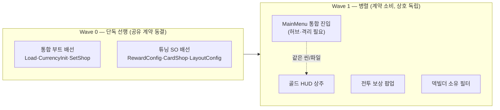

O# 아웃게임 시스템 로드맵 — 도메인 분류 · 태스크 · 순서

> 목표 성장 루프를 붙이기 위한 아웃게임(메타 진행) 전체 계획.
> 구현 세부(스키마 필드·API 시그니처)는 확정하지 않고 담당 에이전트가 경계·규약 안에서 결정한다.
> 상세 규약의 진실원은 코드와 `.claude/agents/outgame-engineer.md`.

## 목표 성장 루프

```
대전 → 재화(골드) 획득 → 카드팩 구매 → 신규 카드셋 획득 → 덱 강화 → (상위 랭크 도전)
        ↑ 남은 카드 수 비례            ↑ 도감이 골드 상시 생산(오프라인 누적·수확)
```

현재 프로젝트는 전투(인게임)만 존재하고 아웃게임 요소가 전무하다. 재화·카드 소유권·세이브(덱 제외)·시간/생산 개념이 0건이며 `Assets/Scripts/Currency/` 빈 폴더만 예약돼 있다.

## 확정 스코프

| 항목 | 결정 |
|---|---|
| 범위 | 전체 루프를 **단계별 Phase**로 순차 구현 (기반→성장). 뽑기·카드팩·전투보상 포함 |
| 재화 | **단일 골드** — 전투 보상·도감 생산·카드팩 구매가 하나의 골드 공유 |
| 랭크 | **2단 분리**(2026-07-27 갱신). **표시용 티어 진행도 = 도메인 H로 로컬 구현**(AI전 결과로 포인트 가감, 보상·난이도·매칭 영향 없음). **PvP 실력 랭크 = 여전히 범위 밖** — 서버 권위 전환과 함께 기획 |

## 반드시 지킬 경계·규약

근거: `docs/ARCHITECTURE.md` §9, `.claude/agents/outgame-engineer.md`

- **의존 방향 단방향**: `UI → 아웃게임 레이어 → Card(읽기 전용)`. 아웃게임 레이어는 **`Battle/`·`Network/`(CardRegistry 포함) 참조 금지**(반대 방향 `Battle → 범용 서비스`는 허용 — `RewardService`/`CurrencyManager` 등, 선례 `DeckConfig`→`DeckSaveManager`). `Battle/`·`Network/`·전투 규칙·와이어 프로토콜 **수정 금지**(전투 종료 시 보상 지급 트리거만 예외적으로 battle-engineer가 담당 — D 참조).
- **배치**: 로직·데이터 → `Assets/Scripts/Currency/`(및 신규 최상위 폴더), 화면 → `Assets/Scripts/UI/Collection/`. **`.unity`·프리팹 편집은 범위 밖** — "무엇을 어느 프리팹에 붙일지"만 문서화.
- **세이브 규약**: 식별자는 **문자열 키(인덱스 금지)**, 하위호환(필드 추가만), **버전 필드 필수**, 부트 순서 `[DefaultExecutionOrder(-100)]`, **로드 실패 시 진행도 0 덮어쓰기 금지**. 선례: `DeckSaveManager.cs`.
- **마스터 데이터 드리프트**: 카드 전체 목록이 이미 3곳(`CardRegistry.asset`/`MainMenuInitializer.cs:8`/`DeckBuilderUI.cs:10`)에 중복. 아웃게임이 **4번째 목록이 되면 안 됨** — 기존 목록을 주입받는 단일 창구를 세운다(B).
- **시각·생산**: 생산은 `(마지막 정산 시각, 현재 시각) → 생산량` **경과시간 순수 함수** + 상한 클램프(`Update` 누산 금지). 시각은 **단일 창구**로 감싸 디버그 시간 점프 가능. 저장 UTC, 시계 역행 처리 정의.
- **재화 서비스**: **범용**(컬렉션 전용 필드 금지), 잔액 변경 **단일 진입점**, 차감은 **성공/실패 반환**(음수 잔액 금지), 변경 이벤트로 UI 갱신.
- **표시명 정본**: `CardData.displayName`. 세이브 키는 `DeckSaveManager`와 동일하게 안정적 문자열 키.
- **관용구**: "순수 static 파사드 + SO 설정(미배선 시 기본 fallback)"(`GameTiming`/`SynergyResolver`). 공용 재사용: `UIPoolManager`·`PooledUIBase`·`DataLibrary`·`UIAnimator`·`SoundManager`. 신규 UI 프리팹은 Addressable + `UIPrefab` 라벨 필수.

---

## 도메인 분류 (6개)

| # | 도메인 | 책임 | 담당 |
|---|---|---|---|
| **A** | 기반 인프라 | 세이브 스토어 · 시각 단일창구 · 재화 서비스(단일 골드) | outgame-engineer |
| **B** | 마스터·소유 데이터 | 카드 마스터 단일창구(읽기) · 카드 소유권 모델 | outgame-engineer |
| **C** | 도감 생산 | 행 파생 모델 · 오프라인 생산 · 완성 보상 | outgame-engineer |
| **D** ✅ | 전투 보상 브리지 | 전투 종료 시 남은 카드 수 → `RewardService`로 직접 골드 지급 | battle-engineer + outgame-engineer |
| **E** | 카드팩 경제 | 팩 정의 · 구매(골드 차감) · 드로우 → 소유 부여 | outgame-engineer |
| **F** | 아웃게임 UI | 골드 HUD · 도감 갤러리 · 상점 · 덱빌더 소유 필터 | UI(배선 문서화) |
| **G** | 신규 유저 온보딩 | 첫실행 감지(소유==0) → 스타터팩(6장) 개봉 → 튜토리얼 전투 직행 라우팅 | outgame-engineer + UI (+battle-engineer 선택) |
| **H** | 랭크(표시용 티어) | 전투 결과 → 포인트 가감 · 티어 파생 · 로비 배지 표시 | outgame-engineer + battle-engineer(훅 1줄) |

> **PvP 실력 랭크**는 여전히 별도 도메인 없이 문서 표기만 — 서버 권위 전환(ARCHITECTURE §10 리스크①)과 함께 기획. 도메인 H는 그 전 단계로, **실력 지표가 아니라 표시용 진행도**(칭호)다. 근거는 H 절 참조.

---

## 도메인별 세부 태스크

### A. 기반 인프라 — 모든 도메인의 토대
`Assets/Scripts/Currency/` 및 신규 최상위 폴더(예: `Assets/Scripts/Save/`, `Assets/Scripts/Time/`)

- **A-1 세이브 스토어**: 범용 로컬 JSON 세이브 컨테이너(`DeckSaveManager` 패턴). 버전 필드, 로드 실패 시 진행도 보존. 타 도메인이 각자 섹션을 얹는 구조.
- **A-2 시각 단일 창구**: `DateTime.UtcNow` 래핑 static 파사드 + 디버그 시간 오프셋 주입.
- **A-3 재화 서비스(단일 골드)**: 범용 `CurrencyService`(static 파사드). 잔액/적립/차감(성공·실패 반환)/변경 이벤트. 통화 종류 파라미터화. 세이브 스토어에 영속.

### B. 마스터·소유 데이터
- **B-4 카드 마스터 단일 창구**: 새 목록 없이 부트 시 `MainMenuInitializer.allCards` 주입받는 `CardCatalog`(읽기). 카드 안정 키 규약 확정.
- **B-5 카드 소유권 모델**: 소유 카드 집합(문자열 키) 영속. 기존 9장 기본 소유 마이그레이션. 디버그 해금 도구.

### C. 도감 생산
- **C-6 행 파생 모델**: 전체 카드를 3열로 갈라 행 데이터 파생(하드코딩 금지), 소유 3칸 완성 판정.
- **C-7 행 생산 상태 머신**: 상태 4종(잠김/생산중/수확가능/상한도달), 경과시간 순수함수 생산, 상한 클램프, 오프라인 누적 후 수확 → 재화 적립.
- **C-8 행 진행도 영속**: 마지막 정산 UTC·누적량을 행의 안정 키(카드 키 파생)로 저장. 카드 추가에도 기존 행 진행도 불변.
- **C-9 완성 보상**: 도감 전체 완성 1회성 보상 + 수령 플래그(영속).
- **C-10 생산 튜닝 SO**: 쿨타임·행당 생산량·상한 설정.

### D. 전투 보상 브리지 (경계 교차) — ✅ 구현 완료

> **최종 구조(구현됨)**: 초기 계획의 "중립 캐리어(BattleResult) → 로비 소비" 우회 레이어는 **폐기**. 소비자가 보상 지급 하나뿐이라 캐리어·씬간 전달·로비 소비가 순수 오버헤드였고, `CurrencyManager`는 메타 진행이 아니라 **범용 재화 매니저**라 전투가 직접 참조해도 방향상 문제없음(선례: `DeckConfig`→`DeckSaveManager`). 그래서 전투 종료 시점에 `RewardService.GrantBattleReward(...)`로 **직접 지급**한다. 트레이드오프: 전투 엔진이 "보상"을 알게 됨 → 보상 없는 전투(튜토리얼 등) 필요 시 분기 필요(→ G-보상분기에서 대응, 선택·후속).

- **D-11 (battle) 결과 산출·지급 트리거**: `TurnRunner`의 4개 승패 확정 지점(`CheckGameOver()` 승/패, `HandlePlayerLeft()`, `HandleOpponentLeftDuringInit()`)에서 헬퍼 `CaptureResult(bool won)` 호출. 인스턴스 플래그 `resultCaptured`로 **전투당 1회 보장**(이탈-부전승 등 후속 콜백이 결과를 덮어쓰는 레이스 차단). 남은 카드 수 = `playerField.GetActiveCards().Count + playerField.WaitingCount`(항상 로컬=나, 모드 분기 없음). 멀티에서도 각 클라가 자기 로컬 값으로 자기 `CurrencyManager`에 지급 → RPC 불필요, 결정론 무관.
- **D-12 (신규 `Assets/Scripts/Reward/`)**: `RewardService`(static 파사드 + SO fallback, `GameTiming` 관용구) — `GrantBattleReward(bool won, int remainingCards)` : 환산 → `CurrencyManager.Earn(Gold)` → `Save()`(즉시 영속) → 지급액 반환(F-20 팝업용). `RewardConfig`(SO): `goldPerCard`/`winBonus`/`lossBonus`/`minGold`/`maxGold`. 환산식 `clamp(remainingCards*goldPerCard + (won?winBonus:lossBonus), minGold, maxGold)` — **하한=minGold floor**(패배·소액도 최소 보장). ※ `SetConfig` 배선은 미완 → 코드 기본값 fallback 동작(프리팹/씬 배선은 F/튜닝 단계로 이월).
- **D-13**: 별도 로비 소비 단계 **없음**(캐리어 폐기로 불필요). `MainMenuInitializer`는 관여 안 함.

### E. 카드팩 경제
- **E-14 팩 정의 SO**: 팩 종류·가격(골드)·포함 카드 풀·드로우 수.
- **E-15 구매·드로우**: `TryPurchase` → `TrySpend`(실패 시 중단) → 드로우(로컬 랜덤) → `Grant`. 중복 처리 규칙 확정.
- **E-16 획득 결과 데이터**: 신규/중복 구분해 UI 전달.

### F. 아웃게임 UI (프리팹은 문서화만)
`Assets/Scripts/UI/Collection/` 등. 팝업 `PooledUIBase`+`UIPoolManager`, 화면 `MainMenuManager` 패널 토글.

- **F-17 골드 HUD**: 로비·도감·상점 헤더. `CurrencyService.OnChanged` 구독.
- **F-18 도감 갤러리**: 세로 스크롤 3열(행 자동 확장), 행별 생산·수확, 카드 상세+틸트, 완성 보상 버튼.
- **F-19 상점 화면**: 팩 목록·구매·드로우 연출.
- **F-20 전투 보상 팝업**: 로비 진입 시 획득 골드 연출.
- **F-21 덱빌더 소유 필터**: `DeckBuilderUI.InitializeSlots`를 소유 카드만/미소유 비활성으로 필터.
- **F-22 배선 문서**: 신규 프리팹 목록 + Addressable `UIPrefab` 라벨 등록 + `MainMenuManager` 진입 버튼 위치.

### G. 신규 유저 온보딩 (첫 게임 흐름)

> 목표 루프의 **진입부**: 신규 유저가 로비를 보기 전에 스타터 카드 6장을 획득하고 첫 전투(튜토리얼)를 경험하게 한다.
> 핵심 성질: **G도 자체 세이브가 없다.** 첫실행 판정을 `OwnershipManager.OwnedCount==0`으로 하고, 스타터팩은 기존 E 파이프라인(구매=즉시개봉)을 price=0으로 재사용한다. → 소유 6장이 채워지면 다음 부트부터 자동으로 로비 직행.
> 기존 자산 재사용: 개봉 뷰 `PackOpeningView`/`RevealCardView`(F-19), 획득·영속 `CardPackOpener`→`OwnershipManager.Grant`(E), 첫 전투 `TutorialConfig`(Battle).
> ⚠️ 이 도메인은 동결 계약 2개(**소유 API의 GrantDefaults 동작**, **부트 진입 순서**)를 바꾸므로 그 둘은 🔴 순차 게이트로 먼저 동결한다(BOARD 참조).

- **G-23 소유 기본지급 제거(계약 변경)**: `OwnershipManager.GrantDefaults()`의 카탈로그 전체 자동지급을 제거 → 신규 유저 소유 0. `Init` 경로에서 호출 차단/no-op. 판정 기준 `OwnedCount==0` 확립. 소비처(도감·덱빌더 소유필터) 회귀 확인.
- **G-24 로비 첫실행 리다이렉트(BootScene 없음)**: 앱은 기존대로 `LobbyScene`(index 0) 직행. 로비 상주 `LobbyFirstRunRedirect.Start`(MainMenuInitializer.Awake[-100] 주입 후)가 `HasAnyOwnedSaved()==false`면 `TryPurchase(starter)`→캐리어→`LoadScene("PackTest")`(실패 시 로비 유지). 상점→팩 전환과 동일 경로를 첫실행이 자동으로 탄다.
- **G-25 스타터팩 정의**: `CardPackData`(SO) 재사용 — `price=0`·`drawCount=6`·`pool`=기본 6장. `StarterPack.asset` 생성(에디터). packId ↔ 온보딩 뷰 정합.
- **G-26 개봉 화면(3D 팩 뜯기)**: 공용 팩 오픈 씬 `PackTest.unity`(상점 개봉과 공유). 구매는 **뷰 밖**(상점/부트)에서 끝나고 결과를 캐리어 `PackHandoff`로 전달 → `PackTearOpenView`가 3D `CardPack.prefab` 등장 → **가로 드래그로 SealStrip 뜯기**(`PackTearHandle`) → 스택→넘김→2×3 그리드(구 로직 이식) → `OnOpenComplete`. 순수 뷰(구매·소유 미참조).
- **G-27 구매 캐리어 + [획득] 목적지**: `PackHandoff`(static, Pack·NextScene·StartTutorial) — 구매한 쪽이 "이 팩 열고 획득 후 이 씬으로(+튜토리얼)"를 실어 전달. `PackAcquireController` — 캐리어 소비→`BeginOpen`, `OnOpenComplete`시 **[획득] 버튼** 노출, 클릭 시 `StartTutorial`이면 `TutorialConfig.Begin(scenario)` 후 `NextScene` 이동. **첫시작 재판정 없이 캐리어 값으로만 분기**(구 `FirstStartBattleRedirect` 폐기). `BootRouter` 첫시작 분기가 `TryPurchase(starterPackId)`→캐리어 세팅(Battle+튜토리얼)→PackTest 로드(실패 시 로비 fallback). 전투 종료 후 `GameResultPopup`가 `LobbyScene` 복귀.
- **G-보상분기(선택, 경계 교차)**: D-11 노트대로 전투 종료 시 `RewardService.GrantBattleReward`가 무조건 지급 → 튜토리얼 전투도 골드 발생. 미지급이 목표면 `TurnRunner.CaptureResult`/`RewardService`에 `TutorialConfig.IsActive` 가드 1개(**battle-engineer**). 우선순위 낮음(지급 허용해도 무해) → 후속 분리 가능.

> **세이브 스키마 불변(권장)**: 판정을 `OwnedCount==0`으로 하므로 `UserSaveData` 변경 없음. **엣지**: 개봉(6장 영속) 후 전투 전 종료 시 다음 부트는 로비 직행(튜토리얼 전투 미경험) — 허용 동작. 전투까지 보장하려면 후속으로 `tutorialBattleDone` 플래그(필드 추가만).

### H. 랭크 — 표시용 티어 진행도 (2026-07-27 설계 승인)

> 목표 루프의 **엔드포인트 표기**를 실물로 세운다. 단 **실력 지표가 아니라 진행도 표시**(칭호)다.
>
> **왜 로컬 구현이 가능한가 — 스코프를 표시용으로 좁혔기 때문**: 실측상 로비 Match 탭은 `LobbyMatchLauncher.StartAiBattle` 하나만 배선돼 **100% AI전**이고, `RandomMatchPanel`/`MultiplayerLobbyPanel`은 `MainMenu.unity`에만 있는데 **그 씬을 런타임에 로드하는 코드가 프로젝트에 없다**. 게다가 Fusion Shared + 공격 RPC 무검증이라 서버 권위 없이는 랭크 위조가 가능하다(ARCHITECTURE §10 리스크①). 그래서 **보상·난이도·매칭에 일절 영향을 주지 않는 표시 전용**으로 한정했다 — 위조돼도 잃는 게 없으므로 서버 권위가 전제되지 않는다. PvP 실력 랭크를 하려면 (a) 랜덤매칭 UI의 로비 이식 (b) 서버 권위 전환이 선행이다.

**확정 스코프**

| 항목 | 결정 |
|---|---|
| 성격 | 표시용 진행도. **보상·난이도·매칭 영향 없음** |
| 승강 | 포인트 누적 + 티어 구간 (승 +N / 패 −M) |
| 난이도 | **고정** — `AIDeckConfig`·`EnemyTurn` 무수정 |
| 강등 | **티어 강등 없음**, 포인트만 감소 |
| 표시 | 배지 = 티어(스프라이트) / 오벌 = 포인트. **씬 노드 신규 생성 0** |
| 티어 테이블 후속 수정 | 소급 강등 **수용** — SO 툴팁에 "임계치는 하향만" 저작 규칙 |

- **H-28 랭크 세이브 슬롯**: `RankSaveData { long points }` + `UserSaveData.rank` 슬롯. 필드 추가만이라 **VERSION 1 유지**(`tutorial` 슬롯 선례).
- **H-29 랭크 창구**: `RankManager`(static). **캐시 없이 세이브 슬롯 직접 읽기**(`OutgameTutorialProgress` 패턴) → `GameManager.Boot()` **무수정**(부트 계약 무접촉). 예외를 던지지 않는다(config null·빈 tiers·슬롯 null 전부 폴백).
- **H-30 튜닝 SO**: `RankConfig` — 티어 테이블(`displayName`/`requiredPoints`/`badge`) + `winPoints`/`losePoints`. **`tiers`는 C# 필드 초기화자로 기본 테이블을 채운다** — `List<>`는 `CreateInstance` fallback에서 빈 리스트가 되고, `DataLibrary`가 **BattleScene에 없어** 전투 씬 직접 Play 시 항상 fallback이 타기 때문. 주입은 `DataLibrary`(전역, `RewardService.SetConfig` 선례).
- **H-31 (battle) 전투 훅** ✅ **완료(2026-07-27)**: `TurnRunner.CaptureResult`에서 **보상 지급 뒤** `RankManager.ApplyBattleResult(_won)`. 보상이 이미 영속된 뒤라 랭크가 실패해도 골드는 안전. **`_won`의 첫 소비자**(현재 보상 공식은 승패 무관). ⚠️ **원안의 멀티 배제 게이트(`if (!DeckConfig.IsMultiplayer)`)는 제거됨** — 어뷰징 차단은 프로토 스코프 밖이라 모든 전투 결과를 무조건 가감(사용자 결정 2026-07-27). 아래 "멀티 제외"·"별도 disconnectWin 가드 불필요" 항목도 이 결정으로 무효.
- **H-32 랭크 HUD**: `RankHud` — `RankBadge`(Image)·`RankPower` 내부 TMP 바인딩. **최초 렌더는 `Start()`**(아래 주의 참조).

**불변식 4개**

1. **티어 = `points`의 순수 파생** — "`requiredPoints <= points`를 만족하는 최대 인덱스, 없으면 0 클램프". 도달 티어를 따로 저장하지 않는다(이중 진실원 회피).
2. **강등 없음 = 가감 시 하한 클램프** — `max(points + delta, max(가감 "전" 티어의 requiredPoints, 0))`. 이중 하한이라 음수 불가.
3. **부트 무수정** — 캐시가 없으므로 `Init()`이 없다. `GameManager`가 `BeforeSceneLoad`+`DontDestroyOnLoad`라 어느 씬에서 Play를 시작하든 `Load()`가 끝나 있다.
4. **즉시 `Save()`** — 전투 씬→로비 씬 왕복을 견뎌야 하므로 지연 flush에 맡기지 않는다(`OutgameTutorialProgress.CommitStep` 선례). `GameManager.Flush()`에 얹는 건 부트 계약 접촉 + pause/quit에만 도는 문제로 **채택 안 함**.

**집계 제외/포함**

- **멀티 제외**: 스코프가 PvP 아님 + 상대 이탈 유도 시 `HandlePlayerLeft`가 `CaptureResult(true)`를 불러 **전투 없이 무한 가산**되는 어뷰징 차단. 부전승 경로 2개는 둘 다 `if (!DeckConfig.IsMultiplayer) return;`으로 시작하므로 **별도 `disconnectWin` 가드 불필요**.
- **튜토리얼 포함**: `PKG-TUT-REWARD`(튜토리얼 보상 미지급 가드)가 "보류(선택)·지급 허용해도 무해"인 현행 정책과 일관. 표시용이라 해악 0이고, 신규 유저가 로비 복귀 시 배지가 켜져 있는 게 온보딩에 유리.

**의도적으로 덜어낸 것** — `OnRankChanged` 이벤트(랭크는 **로비에서 변동할 경로가 0**, 전투 씬에서만 변함 → `Start`/`OnEnable` 재조회로 충분), 구간 진행률 필드(씬에 진행바 없음 = 소비처 0), `ApplyBattleResult` 반환값(결과 팝업 표시를 보류했으므로 소비처 0).

> **⚠️ `RankHud`에 `GoldHud` 패턴을 그대로 복제하면 버그**: `GoldHud`의 `OnEnable` 즉시 렌더가 안전한 건 `CurrencyManager.Init()`이 `BeforeSceneLoad`에서 끝나기 때문이다. `RankConfig` 주입은 `DataLibrary.Awake`(실행순서 0)에서 일어나고 `Tab_Match`·`RankInfo`가 모두 씬에 활성 저장돼 있어 **`RankHud.OnEnable`이 `DataLibrary.Awake`보다 먼저 돌 수 있다**(비결정). 이벤트를 뺐으므로 잘못된 첫 렌더가 그대로 굳는다. → **최초 렌더는 `Start()`**, `OnEnable`은 `m_started` 가드.

> **~~범위 밖(후속)~~ → 편입·구현 완료(H-33, 2026-07-27)**: 씬의 `RankReward`("랭크보상") 버튼이 여는 **티어 달성 보상**. 표시용 진행도였던 랭크가 여기서 **보상 엔드포인트**로 승격된다. 스코프는 골드 1종·20티어 전부·순차 1회 수령.
> 수령 상태는 예고했던 `bool` 플래그가 아니라 **단조 증가 커서** `RankSaveData.claimedCount`(수령 완료 티어 개수)다 — 티어가 20개인데 강등이 없어 수령 집합이 항상 프리픽스이기 때문. 기본값 `0`이 곧 미수령이라 센티널도 필요 없다. 보상량은 `RankTier.rewardGold`로 티어 테이블과 **같은 원소**에 둬 인덱스 드리프트를 구조적으로 차단했다(별도 SO 분리 대비).
> `RankManager`는 **무수정** — 보상은 신규 static 창구 `RankRewardManager`로만 흐르고 달성 판정만 `RankManager.GetInfo()`에 위임한다.
> 결과 팝업의 랭크 변동 연출은 여전히 후속(`Show(long)` 확장은 `WinUI`/`LoseUI` 프리팹 2개 저작 + 완료·검수된 `PKG-POPUP` 재개봉을 유발).

---

## 워크플로우 — 의존 웨이브 & 병렬 규칙

> **이 문서는 "왜/무엇"(전략)의 진실원이다. "누가/언제/진행률"(운영 상태)은 `OUTGAME_BOARD.md`가 소유한다.**
> 초기 기반기(A→B→D→C→E)는 서로가 전제라 순차(Phase)로 쌓았고 **완료**됐다. 그 위의 잔여·신규 작업은
> 대부분 얼어있는 계약을 소비만 하므로 **병렬 개발**이 가능하다 — 그래서 Phase 대신 웨이브 모델을 쓴다.

**핵심 규칙 (병렬 안전성의 근거):**

> **기존 공유 계약을 소비만 하는 작업 = 병렬 가능. 새 공유 계약(재화 API·세이브 스키마·창구·부트 순서)을 만들거나 바꾸는 작업 = 단독 선행 게이트(Wave 0).**

공유 계약 = 여러 곳이 참조하는 표면: `CurrencyManager`·`OwnershipManager`·`CardCatalog`·`GameClock` API, `UserSaveData` 스키마, 통합 부트 순서(`MainMenuInitializer`). 이걸 건드리면 병렬 작업들이 동시에 흔들리므로 **먼저 단독으로 얼린다.**

### 웨이브 구조 (의존 그래프)



- **Wave 0**은 병렬 작업 전부의 전제라 **반드시 먼저·단독**. 지금 남은 Wave 0 = 통합 부트에 `DataSaveManager.Load`+`CurrencyManager.Init`+`CardPackOpener.SetShop` 배선(현재 테스트 씬 `EnsureBoot`로만 우회 중) + 튜닝 SO 에셋 생성·배선.
- **Wave 1**은 사용자가 **여러 세션(터미널)을 켜서 동시 진행**한다. 각각 다른 파일을 만지면 무조건 병렬 안전. **같은 씬/파일을 만지는 패키지(예: `MainMenuManager` 허브)는 같은 세션에서 하나씩 또는 worktree 격리** — 보드의 동시성 등급(🔴/🟠/🟢)으로 관리.

> **병렬의 주체는 사람의 여러 세션**이다(한 세션이 서브에이전트를 팬아웃하는 게 아님). 보드가 세션 간 유일한 공유 상태이므로, 각 세션은 패키지를 `진행`으로 claim한 뒤 작업하고 `완료`로 반납한다. git 격리(브랜치/worktree)·검증 범위는 실행 시점 사용자 재량.

**의존 근거(초기 기반, 완료분):** A(재화)는 D·C·E의 전제. B(소유·창구)는 C·E·F-21의 전제. D는 재화 유입원이라 C보다 앞. E는 B·D가 모두 선 후 성립.

**→ 현재 준비된 병렬군·담당·상태·계약 의존은 [`OUTGAME_BOARD.md`](./OUTGAME_BOARD.md) 참조.**

---

## 대표 참조 파일

- 세이브 선례: `Assets/Scripts/Battle/DeckSaveManager.cs`
- 부트 순서·카드목록 주입: `Assets/Scripts/UI/MainMenu/MainMenuInitializer.cs`(`[DefaultExecutionOrder(-100)]`, `allCards:8`)
- static 파사드+SO fallback 관용구(패턴 참고, Battle 소속): `Assets/Scripts/Battle/Timing/GameTiming.cs`, `Assets/Scripts/Battle/Synergy/SynergyResolver.cs` — D의 `RewardService`/`RewardConfig`가 이 관용구 채택
- 전투 보상 지급(구현됨): `Assets/Scripts/Battle/TurnRunner.cs`의 `CaptureResult`(4개 승패 지점 호출); 환산·지급 `Assets/Scripts/Reward/RewardService.cs`·`RewardConfig.cs`; 남은 카드 수 `Assets/Scripts/Battle/BattleField.cs`(`GetActiveCards`/`WaitingCount`, 둘 다 public)
- 씬 간 캐리어 패턴(참고용, D는 미사용): `Assets/Scripts/Battle/DeckConfig.cs`; 결과 팝업 `Assets/Scripts/UI/Battle/GameResultPopup.cs`
- 덱빌더 소유 필터 지점: `Assets/Scripts/UI/MainMenu/DeckBuilderUI.cs`
- UI 베이스: `Assets/Scripts/UI/UIManager/PooledUIBase.cs`, `UIPoolManager.cs`, `Assets/Scripts/Utils/DataLibrary.cs`

## 검증 방법 (Phase별 E2E)

- **Phase 0**: 디버그로 골드 가감·카드 소유 토글 → 재시작 후 값 유지. 세이브 손상 주입 시 진행도 보존.
- **Phase 1**: 싱글/멀티 승·패·이탈 각각 → 전투 종료 시 남은 카드 수 비례 골드 지급·영속. 전투당 1회(`resultCaptured` 가드)로 중복 지급 없음. HUD 반영은 F-17 구현 후. (환산·지급 로직은 디버그 E2E 8/8 통과, 실전 전투 캡처는 Play 모드 검증 대기)
- **Phase 2**: 행 완성 → 생산 시작, 디버그 시각 점프로 오프라인 누적·상한·수확 검증. 카드 1장 추가 후 기존 진행도·완성 플래그 불변.
- **Phase 3**: 골드로 팩 구매 → 차감·신규 소유 부여 → 덱빌더 소유 카드만 편성. 골드 부족 시 구매 실패.
- **도메인 H(랭크)**: 단위(인메모리 세이브 격리) — ① 승리 반복 → 임계치 넘는 순간 티어 상승 ② **강등 없음**: 승급 직후 패배 반복해도 포인트가 현 티어 임계치 밑으로 안 내려가고 티어 불변 ③ 티어0에서 패배 반복 → 포인트 ≥ 0 ④ **config 미배선**(`SetConfig(null)`)에서 전 API 예외 0 + 기본 테이블로 티어 산출 ⑤ 빈 `tiers` → `TierIndex=-1`, 예외 0 ⑥ 구 세이브(rank 노드 없음) 로드 → `points=0` 정상(VERSION 1 유지). 통합(Play) — 로비→AI전 승/패→로비 복귀 시 배지·포인트 갱신, **보상 회귀**(랭크 추가가 지급 골드에 영향 없음).
- **공통**: Phase 구현 후 `tcg-reviewer` 검수 + 메인이 Unity 콘솔 컴파일 검증.
