# 아웃게임 구조도 (STRUCTURE)

> 사용자의 설계 승인과 구조 파악의 기준 문서.
> 도메인 설계 확정 시, 구조 변경 시마다 갱신한다 (CLAUDE.md 아웃게임 운영 정책).
> 갱신 주체: outgame-engineer 또는 메인. 근거 없는 노드 금지 — 실제 파일이 있거나 승인된 설계여야 한다.


## 도메인 수준 구조 (OUTGAME_ROADMAP 기준)

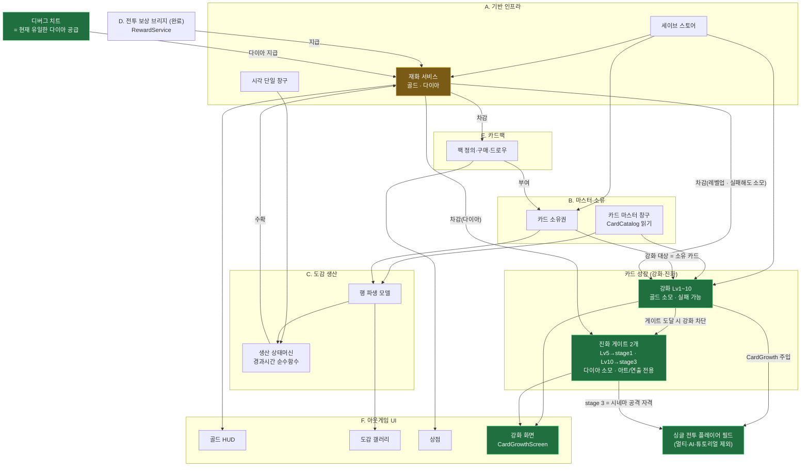
```mermaid
flowchart TD
    subgraph GRP_A["A. 기반 인프라"]
        SAVE["세이브 스토어"]
        TIME["시각 단일 창구"]
        GOLD["재화 서비스<br/>골드 · 다이아"]:::chg
    end
    subgraph GRP_B["B. 마스터·소유"]
        CAT["카드 마스터 창구<br/>CardCatalog 읽기"]
        OWN["카드 소유권"]
    end
    subgraph GRP_C["C. 도감 생산"]
        ROW["행 파생 모델"]
        PROD["생산 상태머신<br/>경과시간 순수함수"]
    end
    D["D. 전투 보상 브리지 (완료)<br/>RewardService"]
    subgraph GRP_E["E. 카드팩"]
        PACK["팩 정의·구매·드로우"]
    end
    subgraph GRP_GROW["카드 성장 (강화·진화)"]
        GRW["강화 Lv1~10<br/>골드 소모 · 실패 가능"]:::new
        EVO["진화 게이트 2개<br/>Lv5→stage1 · Lv10→stage3<br/>다이아 소모 · 아트/연출 전용"]:::new
    end
    subgraph GRP_F["F. 아웃게임 UI"]
        HUD["골드 HUD"]
        GAL["도감 갤러리"]
        SHOP["상점"]
        GRWUI["강화 화면<br/>CardGrowthScreen"]:::new
    end
    BTL["싱글 전투 플레이어 필드<br/>(멀티·AI·튜토리얼 제외)"]:::new
    DBG["디버그 치트<br/>= 현재 유일한 다이아 공급"]:::new

    SAVE --> GOLD
    SAVE --> OWN
    TIME --> PROD
    CAT --> ROW
    OWN --> ROW
    ROW --> PROD
    PROD -->|수확| GOLD
    D -->|지급| GOLD
    GOLD -->|차감| PACK
    PACK -->|부여| OWN
    GOLD --> HUD
    ROW --> GAL
    PACK --> SHOP

    SAVE --> GRW
    CAT --> GRW
    OWN -->|"강화 대상 = 소유 카드"| GRW
    GOLD -->|"차감(레벨업 · 실패해도 소모)"| GRW
    GRW -->|"게이트 도달 시 강화 차단"| EVO
    GOLD -->|"차감(다이아)"| EVO
    DBG -->|"다이아 지급"| GOLD
    GRW -->|"CardGrowth 주입"| BTL
    EVO -->|"stage 3 = 시네마 공격 자격"| BTL
    GRW --> GRWUI
    EVO --> GRWUI

    classDef new fill:#1f6f3f,stroke:#7CFC9E,color:#fff;
    classDef chg fill:#7a5b16,stroke:#f2c14e,color:#fff;
```

> 이 그림에서 성장 노드(`:::new`)는 **도메인 문자를 아직 받지 않았다** — `OUTGAME_ROADMAP.md`의 도메인 분류(A~H) 밖에 신설된 축이라, 로드맵 편입 세션에서 문자를 부여할 때까지 이름으로만 부른다.
> `재화 서비스`가 `:::chg`인 이유: 로드맵의 "단일 골드" 확정 스코프가 진화 비용 때문에 **골드 + 다이아 2종**으로 바뀌었다(보드 변경 로그 2026-08-04). 다만 다이아 **공급 경로는 아직 디버그 치트 하나뿐**이고, `ENHANCE_ECONOMY.md`가 주 공급원으로 설계한 도감 생산 배선은 다음 단계다.

## 클래스 수준 구조 (도메인별)

<!-- 각 도메인 설계 승인 시 이 아래에 클래스도·데이터 흐름 mermaid를 추가한다.
     기존 승인분과 신규분을 구분 표시할 것. -->


### 도감 카드 상세 오버레이 — 좌우 화살표·스와이프 넘기기 (F. UI) — ✅ 코드+검수+프리팹 배선 완료 (2026-08-04, Play 검증 대기)

> 목표: 상세를 닫았다 다시 열지 않고 **도감 배열 순서 그대로** 옆 카드로 넘어간다.
> **순환**(마지막 ↔ 첫 카드가 이어짐, 상점 캐러셀 `PackCarouselView`와 같은 규약), null 슬롯(authoring 누락)은 넘기기가 건너뛴다. `:::new` = 이번 신규.

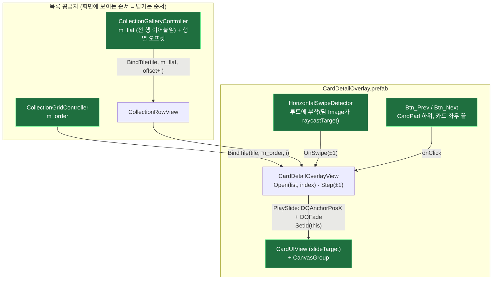
```mermaid
flowchart TD
    subgraph src["목록 공급자 (화면에 보이는 순서 = 넘기는 순서)"]
        GRID["CollectionGridController<br/>m_order"]:::new
        GAL["CollectionGalleryController<br/>m_flat (전 행 이어붙임) + 행별 오프셋"]:::new
        ROW["CollectionRowView"]
    end

    subgraph ov["CardDetailOverlay.prefab"]
        VIEW["CardDetailOverlayView<br/>Open(list, index) · Step(±1)"]
        SW["HorizontalSwipeDetector<br/>루트에 부착(딤 Image가 raycastTarget)"]:::new
        PREV["Btn_Prev / Btn_Next<br/>CardPad 하위, 카드 좌우 끝"]:::new
        SLIDE["CardUIView (slideTarget)<br/>+ CanvasGroup"]:::new
    end

    GRID -->|"BindTile(tile, m_order, i)"| VIEW
    GAL -->|"BindTile(tile, m_flat, offset+i)"| ROW --> VIEW
    SW -->|"OnSwipe(±1)"| VIEW
    PREV -->|"onClick"| VIEW
    VIEW -->|"PlaySlide: DOAnchorPosX + DOFade<br/>SetId(this)"| SLIDE

    classDef new fill:#1f6f3f,stroke:#7CFC9E,color:#fff;
```

**흐름 시퀀스 — 갤러리에서 행 끝 카드를 "다음"으로 넘기기**

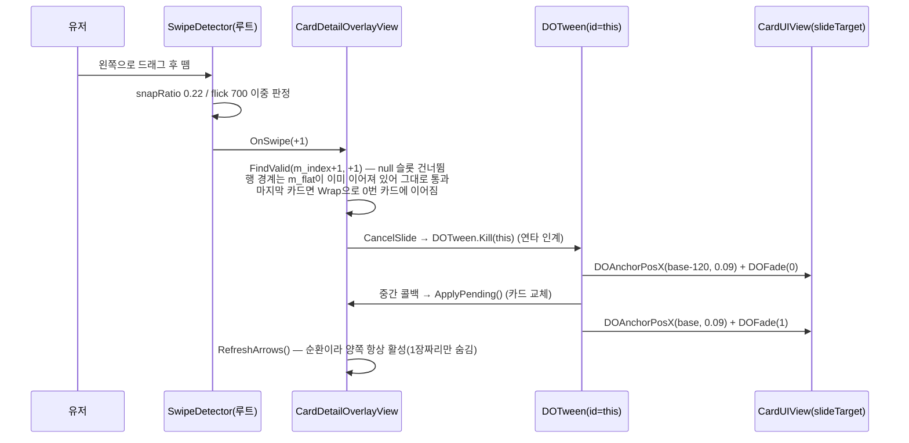
```mermaid
sequenceDiagram
    participant U as 유저
    participant SW as SwipeDetector(루트)
    participant V as CardDetailOverlayView
    participant T as DOTween(id=this)
    participant C as CardUIView(slideTarget)

    U->>SW: 왼쪽으로 드래그 후 뗌
    SW->>SW: snapRatio 0.22 / flick 700 이중 판정
    SW->>V: OnSwipe(+1)
    V->>V: FindValid(m_index+1, +1) — null 슬롯 건너뜀<br/>행 경계는 m_flat이 이미 이어져 있어 그대로 통과<br/>마지막 카드면 Wrap으로 0번 카드에 이어짐
    V->>T: CancelSlide → DOTween.Kill(this) (연타 인계)
    T->>C: DOAnchorPosX(base-120, 0.09) + DOFade(0)
    T->>V: 중간 콜백 → ApplyPending() (카드 교체)
    T->>C: DOAnchorPosX(base, 0.09) + DOFade(1)
    V->>V: RefreshArrows() — 순환이라 양쪽 항상 활성(1장짜리만 숨김)
```


### E. 카드팩 경제 도메인 — ✅ 구현 완료 (2026-07-24, `OutGame/CardPack/`)

> 목표 루프 3단계: `골드 → 카드팩 구매 → 신규 카드셋 획득 → 덱 강화`.
> 핵심 성질: **E는 자체 영속 상태가 없다.** 골드 차감은 `CurrencyManager`가, 카드 소유는 `OwnershipManager`가 이미 영속하므로
> E는 둘을 잇는 **오케스트레이터**일 뿐. **구매=즉시 개봉**(미개봉 팩 재고 없음), 팩 정의는 SO(에디터 데이터), 결과는 소유권에 위임. `:::new` = 이번 신규.

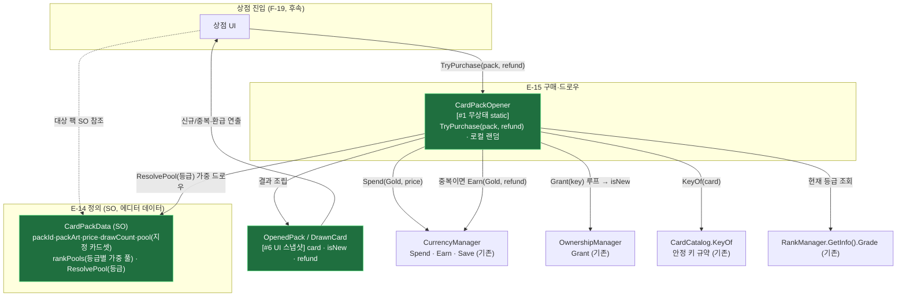
```mermaid
flowchart TD
    subgraph shop["상점 진입 (F-19, 후속)"]
        SHOP["상점 UI"]
    end
    subgraph def["E-14 정의 (SO, 에디터 데이터)"]
        DEF["CardPackData (SO)<br/>packId·packArt·price·drawCount·pool(지정 카드셋)<br/>rankPools(등급별 가중 풀) · ResolvePool(등급)"]:::new
    end
    subgraph svc["E-15 구매·드로우"]
        SVC["CardPackOpener<br/>[#1 무상태 static]<br/>TryPurchase(pack, refund) · 로컬 랜덤"]:::new
    end
    RES["OpenedPack / DrawnCard<br/>[#6 UI 스냅샷] card · isNew · refund"]:::new

    CUR["CurrencyManager<br/>Spend · Earn · Save (기존)"]
    OWN["OwnershipManager<br/>Grant (기존)"]
    KEY["CardCatalog.KeyOf<br/>안정 키 규약 (기존)"]
    RANK["RankManager.GetInfo().Grade (기존)"]

    SHOP -->|"TryPurchase(pack, refund)"| SVC
    SHOP -.->|"대상 팩 SO 참조"| DEF
    SVC -->|"현재 등급 조회"| RANK
    SVC -->|"Spend(Gold, price)"| CUR
    SVC -->|"ResolvePool(등급) 가중 드로우"| DEF
    SVC -->|"KeyOf(card)"| KEY
    SVC -->|"Grant(key) 루프 → isNew"| OWN
    SVC -->|"중복이면 Earn(Gold, refund)"| CUR
    SVC -->|"결과 조립"| RES
    RES -->|"신규/중복·환급 연출"| SHOP

    classDef new fill:#1f6f3f,stroke:#7CFC9E,color:#fff;
```

**흐름 시퀀스 — 팩 구매·개봉 (지정 풀 + 중복 환급)**

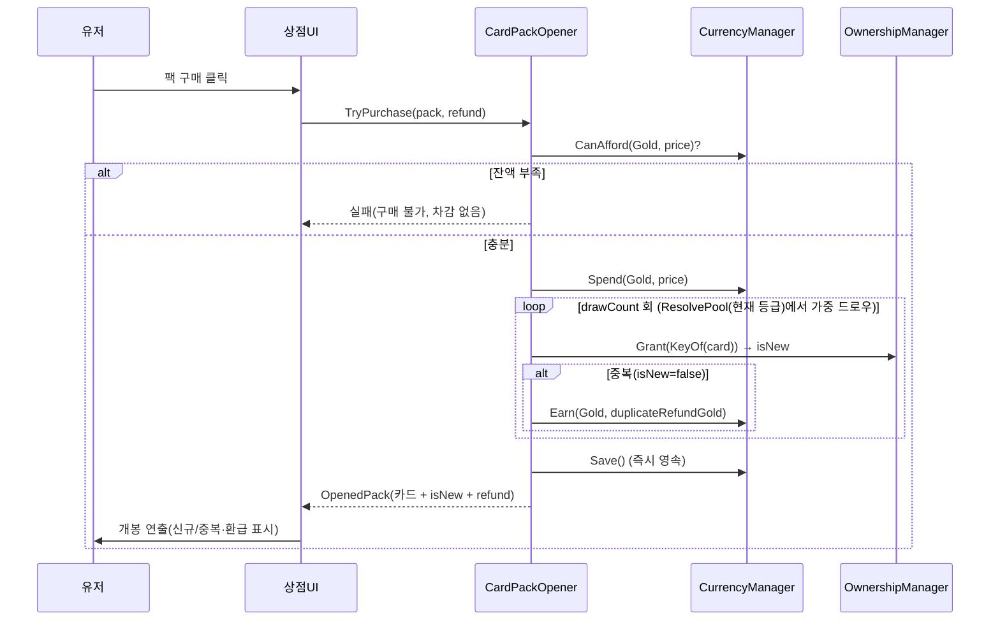
```mermaid
sequenceDiagram
    participant U as 유저
    participant SHOP as 상점UI
    participant SVC as CardPackOpener
    participant CUR as CurrencyManager
    participant OWN as OwnershipManager

    U->>SHOP: 팩 구매 클릭
    SHOP->>SVC: TryPurchase(pack, refund)
    SVC->>CUR: CanAfford(Gold, price)?
    alt 잔액 부족
        SVC-->>SHOP: 실패(구매 불가, 차감 없음)
    else 충분
        SVC->>CUR: Spend(Gold, price)
        loop drawCount 회 (ResolvePool(현재 등급)에서 가중 드로우)
            SVC->>OWN: Grant(KeyOf(card)) → isNew
            alt 중복(isNew=false)
                SVC->>CUR: Earn(Gold, duplicateRefundGold)
            end
        end
        SVC->>CUR: Save() (즉시 영속)
        SVC-->>SHOP: OpenedPack(카드 + isNew + refund)
        SHOP->>U: 개봉 연출(신규/중복·환급 표시)
    end
```

**설계 요지 (원리 카드)**
- **오케스트레이터라 세이브 섹션 없음**: E는 `Spend`·`Earn`(재화)·`Grant`(소유)만 호출하고 모두 이미 영속. E 자체 세이브를 만들면 이중 진실원. 트레이드오프: 구매 이력·pity 카운터가 필요해지면 그때 세이브 섹션 추가.
- **isNew는 Grant 시점에만 안다**: `Grant`는 신규면 true, 이미 소유면 false 반환. 개봉 후엔 전 카드가 `IsOwned=true`라 UI가 사후 판정 불가 → **`OpenedPack`는 생략 불가**(신규 여부·환급의 유일 진실원).
- **팩별 지정 풀**: 드로우 대상은 `CardData` 전체가 아니라 `CardPackData.pool`(에디터 큐레이션). 이는 마스터 목록 복제가 아닌 **부분집합 참조**라 4번째 목록 드리프트 아님. 키는 여전히 `CardCatalog.KeyOf`(단일 규약)로 산출.
- **랭크별 풀 오버라이드 (2026-08-06)**: `rankPools`(`RankPackPool` = minGrade + `WeightedCard` 목록)가 있으면 `ResolvePool(현재 등급)`이 "minGrade ≤ 현재 등급 중 최고 등급" 항목을 적용(등급별 통풀 재저작, 하위 등급과 합산 없음). 매치 없거나 비면 기존 `pool`을 weight 1 취급으로 폴백 → `rankPools` 빈 팩(튜토리얼 3종)은 기존 동작 그대로. weight 0 이하 = 1(균등) 취급, 카드 제외는 리스트 삭제로. 풀 해석은 데이터(`CardPackData`)가 소유 — 상점 미리보기가 생기면 같은 메서드를 쓴다(현재 미리보기 소비자 없음).
- **중복 = 소액 환급**: 장별 `Grant` 반환이 false면 `CurrencyManager.Earn(팩 결제 재화, refundAmount)`. 환급 **액수**는 `TryPurchase`의 인자로 구매처(버튼/첫실행)가 직접 넘기고(상점 SO 전역값 폐기), 환급 **재화 종류**는 `CardPackData.priceType` 하나가 정한다(→ 재화 분리 섹션). Spend/Earn을 한 트랜잭션으로 처리 후 `Save()` 1회.
- **로컬 랜덤(비결정론 무방)**: 아웃게임 최초 랜덤. `Battle/MatchRandom` 재사용 금지(경계), 서비스 내부 `System.Random` 인스턴스.
- **상점 SO(CardShop) 폐기**: 진열 팩 목록·환급 전역값을 쥐던 `CardShop` SO와 `SetShop` 주입을 제거. `CardPackOpener`는 무상태 파사드가 되고, 대상 팩 SO·환급액은 각 구매처 뷰가 인스펙터로 소유해 `TryPurchase(pack, refund)`에 직접 넘긴다(진열=뷰 책임).
- **수정 가능성 높은 지점**: 팩 가격·드로우 수·구성·등급별 풀/확률 = `CardPackData` SO(코드 미수정) / 환급액 = 구매처 뷰의 `duplicateRefundGold` 필드. ("가중 목록으로 확장" 예고는 `rankPools`로 실현.)

| 클래스 | 파일 | 태스크 |
|---|---|---|
| `CardPackData` (SO) | `OutGame/CardPack/CardPackData.cs` — `packId·displayName·packArt(Sprite)·price·drawCount·pool(List<CardData>)·rankPools(List<RankPackPool>)·ResolvePool(ERankGrade)` | E-14 |
| `WeightedCard` · `RankPackPool` (값, co-locate) | `OutGame/CardPack/CardPackData.cs` — `card·weight(0 이하=1)` / `minGrade·cards` | E-14 |
| `CardPackOpener` (static, 무상태) | `OutGame/CardPack/CardPackOpener.cs` — `TryPurchase(CardPackData, long refund)` | E-15 |
| `OpenedPack` · `DrawnCard` (값) | `OutGame/CardPack/OpenedPack.cs` — `card · isNew · refund` | E-16 |

---


> ~~상점 목록(ShopController/ShopPackTileView)·독립 씬·MainMenu 통합 진입~~ — **이번 스코프 전부 제외, 후속.**

---


### G-28 — 개봉 연출 단순화 (클릭 1회 → 패널 fade → 3열 그리드)

> **(2026-07-27) 이 단순화는 되돌려졌다 → 아래 G-29.** 아래 내용은 그 시점의 구조 기록으로 남긴다.

#### 구조 위치 (변경분만)

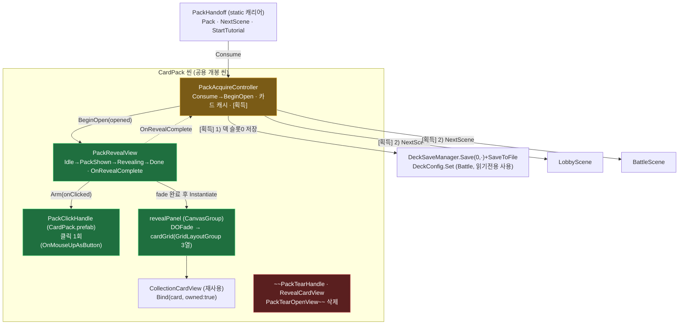
```mermaid
flowchart TD
    HAND["PackHandoff (static 캐리어)<br/>Pack · NextScene · StartTutorial"]

    subgraph scene["CardPack 씬 (공용 개봉 씬)"]
        CTRL["PackAcquireController<br/>Consume→BeginOpen · 카드 캐시 · [획득]"]:::chg
        VIEW["PackRevealView<br/>Idle→PackShown→Revealing→Done · OnRevealComplete"]:::new
        HDL["PackClickHandle (CardPack.prefab)<br/>클릭 1회(OnMouseUpAsButton)"]:::new
        PANEL["revealPanel (CanvasGroup)<br/>DOFade → cardGrid(GridLayoutGroup 3열)"]:::new
        TILE["CollectionCardView (재사용)<br/>Bind(card, owned:true)"]
        DEAD["~~PackTearHandle · RevealCardView<br/>PackTearOpenView~~ 삭제"]:::dead
    end

    DECK["DeckSaveManager.Save(0,·)+SaveToFile<br/>DeckConfig.Set (Battle, 읽기전용 사용)"]
    LOBBY["LobbyScene"]
    BATTLE["BattleScene"]

    HAND -->|"Consume"| CTRL
    CTRL -->|"BeginOpen(opened)"| VIEW
    VIEW -->|"Arm(onClicked)"| HDL
    VIEW -->|"fade 완료 후 Instantiate"| PANEL
    PANEL --> TILE
    VIEW -.->|"OnRevealComplete"| CTRL
    CTRL -->|"[획득] 1) 덱 슬롯0 저장"| DECK
    CTRL -->|"[획득] 2) NextScene"| LOBBY
    CTRL -->|"[획득] 2) NextScene"| BATTLE

    classDef new fill:#1f6f3f,stroke:#7CFC9E,color:#fff;
    classDef chg fill:#7a5b16,stroke:#f2c14e,color:#fff;
    classDef dead fill:#5a1f1f,stroke:#e57373,color:#fff;
```

#### 흐름 시퀀스 — 개봉 1회

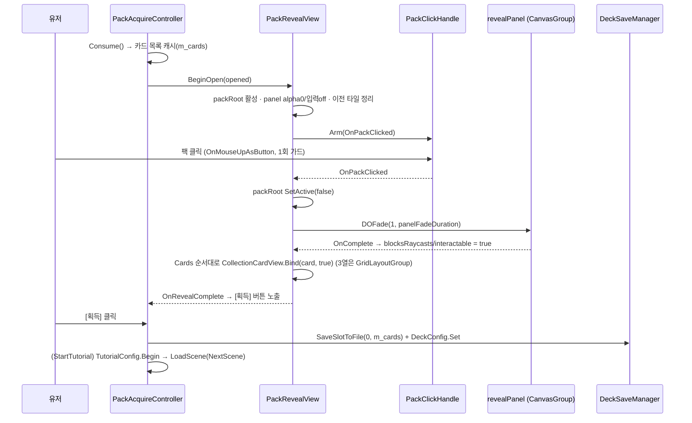
```mermaid
sequenceDiagram
    participant U as 유저
    participant C as PackAcquireController
    participant V as PackRevealView
    participant H as PackClickHandle
    participant P as revealPanel (CanvasGroup)
    participant D as DeckSaveManager

    C->>C: Consume() → 카드 목록 캐시(m_cards)
    C->>V: BeginOpen(opened)
    V->>V: packRoot 활성 · panel alpha0/입력off · 이전 타일 정리
    V->>H: Arm(OnPackClicked)
    U->>H: 팩 클릭 (OnMouseUpAsButton, 1회 가드)
    H-->>V: OnPackClicked
    V->>V: packRoot SetActive(false)
    V->>P: DOFade(1, panelFadeDuration)
    P-->>V: OnComplete → blocksRaycasts/interactable = true
    V->>V: Cards 순서대로 CollectionCardView.Bind(card, true) (3열은 GridLayoutGroup)
    V-->>C: OnRevealComplete → [획득] 버튼 노출
    U->>C: [획득] 클릭
    C->>D: SaveSlotToFile(0, m_cards) + DeckConfig.Set
    C->>C: (StartTutorial) TutorialConfig.Begin → LoadScene(NextScene)
```

#### 원리 카드

- **연출을 인터랙션 1개로 축약**: 드래그 뜯기·카드별 스와이프 스택은 상태·입력 축이 많아 배선 실패가 곧 소프트락이었다. 클릭 1회 + CanvasGroup fade + `GridLayoutGroup`으로 줄여, 좌표 계산 코드를 레이아웃 컴포넌트에 넘겼다.
- **표시 뷰 단일화**: 결과 카드는 도감 타일 `CollectionCardView`를 그대로 재사용(월드 스프라이트 뷰 폐기) → 카드 표시 진실원이 하나(`displayName`/`fullImage`).
- **데드락 방지 우선**: `packHandle`/`revealPanel`/`cardPrefab`/`cardGrid` 미배선·카드 0장 모두 경고 후 `OnRevealComplete`를 발화 — 획득 버튼이 영구히 숨는 경로를 남기지 않는다.

**수정 가능성 높은 지점**: fade 시간·전이 가드 `PackRevealView.cs`(`panelFadeDuration`, `OnPackClicked`) / 덱 저장 슬롯·정책 `PackAcquireController.SaveOpenedDeck`(슬롯 0 고정).

---

### G-29 — 개봉 연출 재확장 (스와이프 뜯기 → 카드 더미 한 장씩 넘기기)

**의도·단계별 상세·열린 항목의 진실원 = [`docs/PACK_OPEN_DIRECTION.md`](../PACK_OPEN_DIRECTION.md).** 여기엔 구조 노드만 남긴다.

#### 구조 위치 (변경분만)

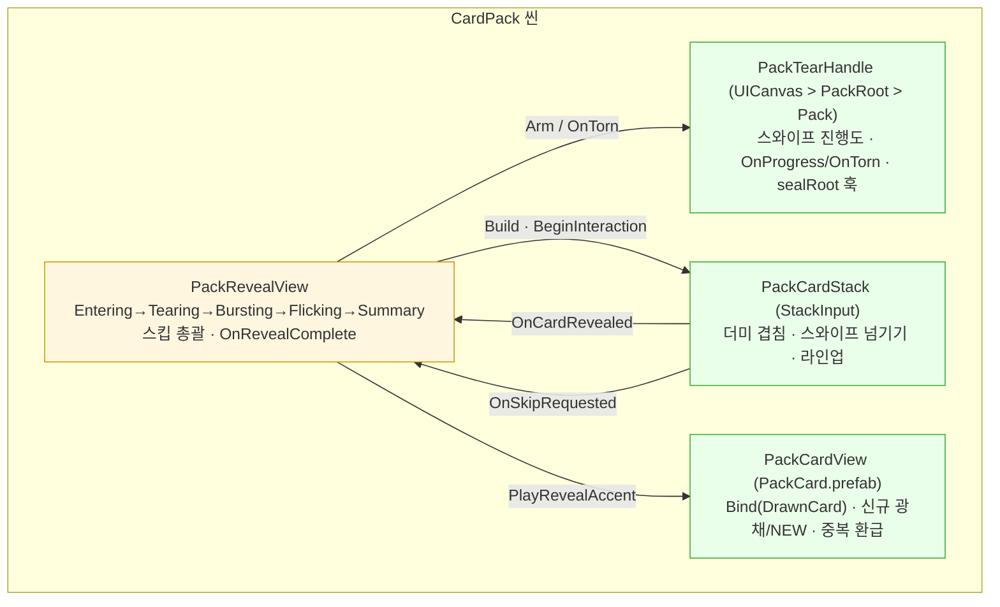
```mermaid
flowchart TD
    subgraph scene["CardPack 씬"]
        VIEW["PackRevealView<br/>Entering→Tearing→Bursting→Flicking→Summary<br/>스킵 총괄 · OnRevealComplete"]:::chg
        TEAR["PackTearHandle (UICanvas > PackRoot > Pack)<br/>스와이프 진행도 · OnProgress/OnTorn · sealRoot 훅"]:::new
        STACK["PackCardStack (StackInput)<br/>더미 겹침 · 스와이프 넘기기 · 라인업"]:::new
        CARD["PackCardView (PackCard.prefab)<br/>Bind(DrawnCard) · 신규 광채/NEW · 중복 환급"]:::new
    end

    VIEW -->|Arm / OnTorn| TEAR
    VIEW -->|Build · BeginInteraction| STACK
    STACK -->|OnCardRevealed| VIEW
    VIEW -->|PlayRevealAccent| CARD
    STACK -->|OnSkipRequested| VIEW

    classDef new fill:#eaffea,stroke:#3a3
    classDef chg fill:#fff6e0,stroke:#c90
```


### G-TUT — 아웃게임 첫시작 튜토리얼 (P1~P4) — ✅ 코드+검수+컴파일 에러 0 (씬 배선·SO 저작 대기) / 2026-07-31 **챕터(N편) 2계층 재편** / 2026-08-03 **기능 해금(잠금) 축 추가**

> 첫실행 온보딩을 "한 번 리다이렉트하고 끝"에서 **영속 진행도 + 스텝 해석 + 강제 안내 게이트** 3축으로 재편한 것.
> `LobbyFirstRunRedirect`를 흡수·삭제하고, 로비↔CardPack↔Battle 왕복과 앱 강제종료를 견디는 진행도를 세이브에 둔다.
> **인게임(전투) 튜토리얼 내부 로직은 범위 밖** — 기존 `TutorialConfig`/`TutorialOverlayUI`를 그대로 쓰고, 아웃게임은 **어느 회차에 어느 시나리오를 넘길지만** 책임진다. `:::new` = 이번 신규.

#### 구조 지도 — 영속(진행도) / 해석(러너) / 수명(브리지) / 표시(게이트) 4층


```mermaid
flowchart TD
    subgraph boot["부트 (BeforeSceneLoad)"]
        GM["GameManager.Boot()<br/>Load → TutorialProgress.Init → CurrencyInit"]:::chg
    end

    subgraph persist["영속 — 세이브만 안다"]
        PRG["OutgameTutorialProgress (static)<br/>IsCompleted · ChapterIndex · StepIndex · Init<br/>CommitStep(챕터,스텝) · Complete · ResetForDebug · JumpForDebug"]:::chg
        SD["TutorialSaveData (슬롯)<br/>outgameChapterIndex · outgameChapterStepIndex<br/>outgameCompleted · migrationChecked<br/>(outgameStepIndex = 플랫 시절 잔재, 동결)"]:::chg
    end

    subgraph run["해석 — 스텝 실행 (씬 오브젝트를 모름)"]
        RUN["OutgameTutorialRunner (static)<br/>IsRunning · ChapterCount · EnsureData · TryGetCurrentStep<br/>EnterCurrentStep · NotifyStepSatisfied<br/>TryGetNext = 자리 올림(빈 챕터 스킵) 단일 진실원"]:::chg
        DATA["OutgameTutorialData (SO)<br/>List&lt;OutgameTutorialChapter&gt;<br/>조립 목록일 뿐 — 종류별 필드·실행은 스텝이 가진다"]:::chg
        CHAP["OutgameTutorialChapter ([Serializable], SO 아님)<br/>label(기획 'N편'과 1:1) · steps · TryGetStep<br/>챕터 하나 = 준비 스텝들 → 전투 스텝"]:::new
        STEP["OutgameTutorialStep (abstract SO) + 6종<br/>WaitClick · BattleEntry · WaitPurchase<br/>WaitPackOpen · AutoPurchase · AutoBattle<br/>Anchor · Completion · LeavesScene · Enter(ctx)<br/>unlocks(기능 해금) · UseDim(딤 사용 여부)"]:::chg
        CTX["OutgameTutorialStepContext (readonly struct)<br/>ChapterIndex · StepIndex + 다음 좌표(러너가 미리 계산)<br/>CommitAdvance · Rollback · CompleteIfLast<br/>스텝이 진행도를 건드리는 유일한 창구<br/>커밋 대상은 주입된 싱크 → G-TUT2"]:::chg
        DATA --> CHAP
        CHAP --> STEP
        RUN -->|"Enter(ctx)"| STEP
        STEP --> CTX
    end

    subgraph scene["씬 레이어 (UI/Tutorial/)"]
        BRG["OutgameTutorialBridge (온보딩 전용)<br/>씬당 1개 — 현재 LobbyScene뿐<br/>(개봉이 씬→로비 오버레이로 이관돼 CardPack 브리지 소멸)<br/>Awake:EnsureData · Start:EnterCurrentStep<br/>온보딩이 끝나면 게이트를 건드리지 않는다 → G-TUT2"]:::new
        GATE["OutgameTutorialGateUI<br/>전면 딤(350) + 타깃 Canvas 승격(351)<br/>포커스링 · 손가락 · 메시지 = 프리팹 저작<br/>onClick 구독으로 완료 감지<br/>UseDim=false면 딤·승격 생략(잠금이 대신 막는다)"]:::chg
        GPF["OutgameTutorialGate.prefab<br/>브리지가 [SerializeField]로 보유<br/>미배선 시 딤+문구 코드 폴백"]:::new
    end

    subgraph anchor["타깃 식별 (씬 경로 문자열 금지)"]
        KEY["EOutgameTutorialAnchor (enum, int 직렬화)<br/>LobbyPlayButton · LobbyPackTab<br/>PackBuyButton · PackAcquireButton"]:::new
        REG["TutorialAnchorRegistry (static)<br/>Register/Unregister/TryGet · OnRegistered"]:::new
        ANC["TutorialAnchor (MonoBehaviour)<br/>OnEnable/OnDisable = 등록/해제"]:::new
        TAB["LobbyTabController.Tab.tutorialAnchor<br/>탭 버튼(프리팹 내부 stripped Button) 대리 등록"]:::chg
    end

    subgraph feat["기능 해금 (딤과 별개 축) — 2026-08-03"]
        FEAT["EOutgameFeature (enum, int 직렬화)<br/>로비 탭 5종 · LobbyPlay · PackBuy/Carousel<br/>DeckCreate/EditToggle/AutoEquip · CollectionHarvest"]:::new
        FLOCK["OutgameFeatureLock (static)<br/>IsUnlocked · Refresh · OnChanged · ForceUnlockAllForDebug<br/>세이브 없음 — 좌표에서 매번 파생(캐시+lazy 무효화)"]:::new
        FLV["FeatureLockView (MonoBehaviour)<br/>interactable + Resources/UI/LockOverlay 런타임 생성<br/>controlInteractable=false면 룩만 담당"]:::new
        FTAB["LobbyTabController.Tab.unlockFeature<br/>탭 버튼에 FeatureLockView 런타임 부착 + Select 가드"]:::chg
    end

    OPENER["CardPackOpener.TryPurchase (E)<br/>Grant→Save 원자 영속"]
    HAND["PackHandoff (static 캐리어)"]
    TUT["TutorialConfig.Begin (Battle, 읽기 사용)"]
    BATTLE["BattleScene<br/>브리지 없음 (복귀 시 로비 브리지가 재개)"]
    OWN["OwnershipManager.HasAnyOwnedSaved<br/>레거시 마이그레이션 판정 전용으로 축소"]:::chg
    DEAD["~~LobbyFirstRunRedirect~~ 삭제<br/>= 스텝 0 AutoPurchase"]:::dead

    GM --> PRG
    PRG <--> SD
    PRG -.->|"Init 1회 판정"| OWN
    DEAD -.-> RUN
    BRG -->|"EnsureData(멱등)"| RUN
    RUN --- DATA
    RUN -->|"StepIndex 읽기 · CommitStep"| PRG
    RUN -->|"AutoPurchase"| OPENER
    RUN -->|"Set(opened, nextScene, false)"| HAND
    RUN -->|"BattleEntry · AutoBattle 진입 시"| TUT
    RUN -->|"AutoBattle → LoadScene(BattleScene)"| BATTLE
    BRG -->|"Ensure(gatePrefab) → Instantiate"| GPF
    GPF --- GATE
    BRG -->|"ShowGate(rect, button, msg)"| GATE
    GATE -->|"onClick → onSatisfied"| BRG
    BRG -->|"NotifyStepSatisfied"| RUN
    ANC -->|"Register/Unregister"| REG
    TAB -->|"Awake 등록"| REG
    KEY --- REG
    BRG -->|"TryGet(anchor) · OnRegistered 대기"| REG
    FEAT --- FLOCK
    STEP -->|"unlocks(누적 합집합)"| FLOCK
    FLOCK -->|"EnumerateUpTo(좌표)"| RUN
    FLV -->|"IsUnlocked · OnChanged 구독"| FLOCK
    FTAB --> FLV
    BRG -->|"ApplyStepOnce · 완주 시 Refresh()"| FLOCK
    GATE -.->|"잠금이 원인이면 경고로 지목"| FLV

    classDef new fill:#1f6f3f,stroke:#7CFC9E,color:#fff;
    classDef chg fill:#7a5b16,stroke:#f2c14e,color:#fff;
    classDef dead fill:#5a1f1f,stroke:#e57373,color:#fff;
```

#### 흐름 시퀀스 — 1편~3편 머리 (부트 → 첫 전투 직행 → 로비 복귀 → 상점 [구매])

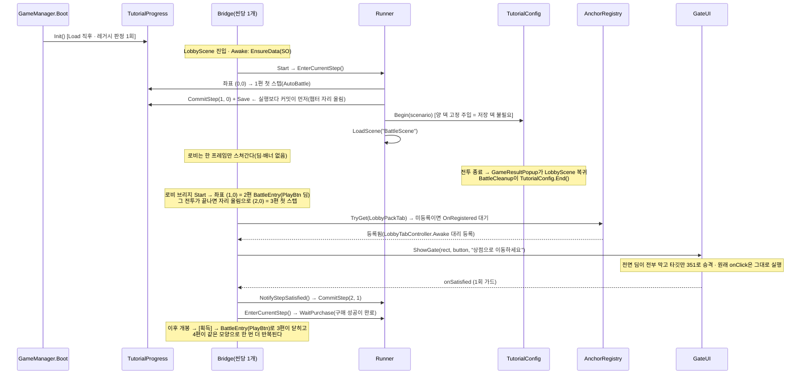
```mermaid
sequenceDiagram
    participant GM as GameManager.Boot
    participant PRG as TutorialProgress
    participant BRG as Bridge(씬당 1개)
    participant RUN as Runner
    participant TUT as TutorialConfig
    participant REG as AnchorRegistry
    participant GATE as GateUI

    GM->>PRG: Init() [Load 직후 · 레거시 판정 1회]
    Note over BRG: LobbyScene 진입 · Awake: EnsureData(SO)
    BRG->>RUN: Start → EnterCurrentStep()
    RUN->>PRG: 좌표 (0,0) → 1편 첫 스텝(AutoBattle)
    RUN->>PRG: CommitStep(1, 0) + Save  ← 실행보다 커밋이 먼저(챕터 자리 올림)
    RUN->>TUT: Begin(scenario) [양 덱 고정 주입 = 저장 덱 불필요]
    RUN->>RUN: LoadScene("BattleScene")
    Note over BRG: 로비는 한 프레임만 스쳐간다(딤·배너 없음)
    Note over TUT: 전투 종료 → GameResultPopup가 LobbyScene 복귀<br/>BattleCleanup이 TutorialConfig.End()

    Note over BRG: 로비 브리지 Start → 좌표 (1,0) = 2편 BattleEntry(PlayBtn 딤)<br/>그 전투가 끝나면 자리 올림으로 (2,0) = 3편 첫 스텝
    BRG->>REG: TryGet(LobbyPackTab) → 미등록이면 OnRegistered 대기
    REG-->>BRG: 등록됨(LobbyTabController.Awake 대리 등록)
    BRG->>GATE: ShowGate(rect, button, "상점으로 이동하세요")
    Note over GATE: 전면 딤이 전부 막고 타깃만 351로 승격 · 원래 onClick은 그대로 실행
    GATE-->>BRG: onSatisfied (1회 가드)
    BRG->>RUN: NotifyStepSatisfied() → CommitStep(2, 1)
    BRG->>RUN: EnterCurrentStep() → WaitPurchase(구매 성공이 완료)
    Note over BRG: 이후 개봉 → [획득] → BattleEntry(PlayBtn)로 3편이 닫히고<br/>4편이 같은 모양으로 한 번 더 반복된다
```


### G-TUT2 — 트리거 기반 튜토리얼 (탭 첫 진입 1회) — 🔄 코드 진행 중 (씬 배선·SO 저작 대기) / 2026-08-03 신설

> G-TUT의 온보딩은 **단조 증가 좌표 하나**뿐이라 "덱 탭에 처음 들어갔을 때 1회" 같은 **선형 시퀀스 밖에서 발화하는 축**을 담을 자리가 없다.
> 온보딩을 손대지 않고 **트리거 축을 병렬로 추가**한다. 표시(`OutgameTutorialGateUI`)·타깃(`TutorialAnchorRegistry`)·스텝 SO(`MessageStep`/`WaitClickStep`)는 **전부 재사용** — 신규는 "언제 발화하고 어디에 1회 낙인을 찍는가"뿐이다.
> 첫 대상은 **덱 탭 / 도감 탭 첫 진입**. 발화 API는 범용이라 이후 "덱 편집 첫 진입" 등이 코드 변경 없이 붙는다.

#### 두 축 대조 — 무엇이 갈리고 무엇이 같은가

| 축 | 온보딩(G-TUT) | 트리거(G-TUT2) |
|---|---|---|
| 발화 | 부트 시 좌표 재개 (pull) | `TriggeredTutorialRunner.Fire(trigger)` (push) |
| 진행 좌표 | 세이브 영속 `(챕터, 스텝)` | **메모리만** — 앱 종료 시 처음부터 |
| 1회 낙인 | `outgameCompleted` 스칼라 | `completedTriggers`에 **완주 시점** 키 1개 |
| 스텝 SO | 공유 | 공유 (단 커밋 대상이 메모리 싱크) |
| 게이트 UI | 공유 (`OutgameTutorialGateUI` 싱글턴) | 공유 |
| 우선순위 | 항상 우선 | 온보딩 `IsRunning` 중엔 발화 억제 |

#### 구조 지도 — 온보딩과 갈리는 지점만

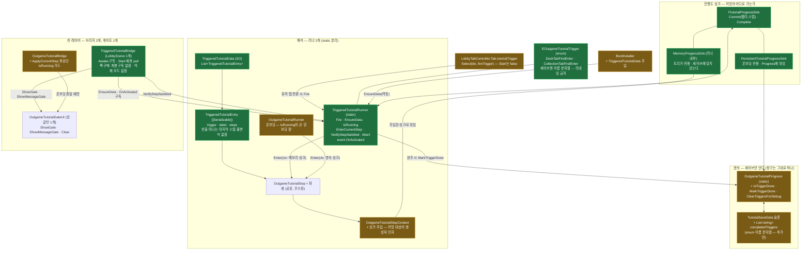
```mermaid
flowchart TD
    subgraph persist["영속 — 세이브만 안다 (창구는 그대로 하나)"]
        PRG["OutgameTutorialProgress (static)<br/>+ IsTriggerDone · MarkTriggerDone · ClearTriggersForDebug"]:::chg
        SD["TutorialSaveData 슬롯<br/>+ List&lt;string&gt; completedTriggers<br/>(enum 이름 문자열 — 추가만)"]:::chg
    end

    subgraph sink["진행도 싱크 — 커밋이 어디로 가는가"]
        ISINK["ITutorialProgressSink<br/>Commit(챕터,스텝) · Complete"]:::new
        PSINK["PersistentTutorialProgressSink<br/>온보딩 전용 · Progress에 위임"]:::new
        MSINK["MemoryProgressSink (러너 내부)<br/>트리거 전용 · 세이브에 닿지 않는다"]:::new
        ISINK --- PSINK
        ISINK --- MSINK
    end

    subgraph run["해석 — 러너 2개 (static 분리)"]
        RUN["OutgameTutorialRunner<br/>온보딩 — IsRunning이 곧 '온보딩 중'"]:::chg
        TRUN["TriggeredTutorialRunner (static)<br/>Fire · EnsureData · IsRunning<br/>EnterCurrentStep · NotifyStepSatisfied · Abort<br/>event OnActivated"]:::new
        TDATA["TriggeredTutorialData (SO)<br/>List&lt;TriggeredTutorialEntry&gt;"]:::new
        TENT["TriggeredTutorialEntry ([Serializable])<br/>trigger · label · steps<br/>씬을 떠나는 마지막 스텝 불변식 없음"]:::new
        STEP["OutgameTutorialStep + 파생 (공유, 무수정)"]
        CTX["OutgameTutorialStepContext<br/>+ 싱크 주입 — 커밋 대상이 생성자 인자"]:::chg
        TDATA --> TENT
        TENT --> STEP
        TRUN -->|"Enter(ctx: 메모리 싱크)"| STEP
        RUN -->|"Enter(ctx: 영속 싱크)"| STEP
        STEP --> CTX
    end

    subgraph scene["씬 레이어 — 브리지 2개, 게이트 1개"]
        BRG["OutgameTutorialBridge<br/>+ ApplyCurrentStep 최상단 IsRunning 가드"]:::chg
        TBRG["TriggeredTutorialBridge (LobbyScene 1개)<br/>Awake:구독 · Start:재개 pull<br/>팩 구매·개봉 구독 없음 · 억제 모드 없음"]:::new
        GATE["OutgameTutorialGateUI (싱글턴 1개)<br/>ShowGate · ShowMessageGate · Clear"]
    end

    KEY["EOutgameTutorialTrigger (enum)<br/>DeckTabFirstEnter · CollectionTabFirstEnter<br/>세이브엔 이름 문자열 → 리네임 금지"]:::new
    TAB["LobbyTabController.Tab.tutorialTrigger<br/>Select(idx, fireTrigger) — Start는 false"]:::chg
    BOOT["BootInstaller<br/>+ TriggeredTutorialData 주입"]:::chg

    TAB -->|"유저 탭 전환 시 Fire"| TRUN
    KEY --- TRUN
    BOOT -->|"EnsureData(멱등)"| TRUN
    TBRG -->|"EnsureData · OnActivated 구독"| TRUN
    TBRG -->|"NotifyStepSatisfied"| TRUN
    TRUN -->|"완주 시 MarkTriggerDone"| PRG
    PRG <--> SD
    CTX -->|"주입된 싱크로 위임"| ISINK
    PSINK --> PRG
    MSINK --> TRUN
    TBRG -->|"ShowGate · ShowMessageGate"| GATE
    BRG -->|"온보딩 중일 때만"| GATE

    classDef new fill:#1f6f3f,stroke:#7CFC9E,color:#fff;
    classDef chg fill:#7a5b16,stroke:#f2c14e,color:#fff;
```


### H. 랭크 — 표시용 티어 진행도 — ✅ 코드 전량 완료(H-28~H-32) + 로비 씬 배선 완료 (2026-07-27)

> 목표 루프의 **엔드포인트 표기**를 실물로 세운다. 단 실력 지표가 아니라 **표시용 진행도**(칭호)다.
> **왜 로컬로 가능한가**: 로비 Match 탭은 100% AI전이고(`LobbyMatchLauncher.StartAiBattle` 단일 배선), PvP UI는 런타임에 도달 불가한 `MainMenu.unity`에만 있다. 클라 권위 + RPC 무검증이라 위조 가능하지만, **보상·난이도·매칭에 아무 영향이 없으므로 위조돼도 잃는 게 없다** → 서버 권위가 전제되지 않는다.
> **H는 자체 계약 소비가 거의 없다** — 재화·소유·생산·팩 어느 것도 안 건드리고, 세이브 슬롯 1개와 전투 종료 훅 1줄만 쓴다. `:::new` = 신규, `:::chg` = 기존 파일 소규모 수정.

#### 구조 지도 — 4갈래(영속 / 판정 / 주입 / 표시)

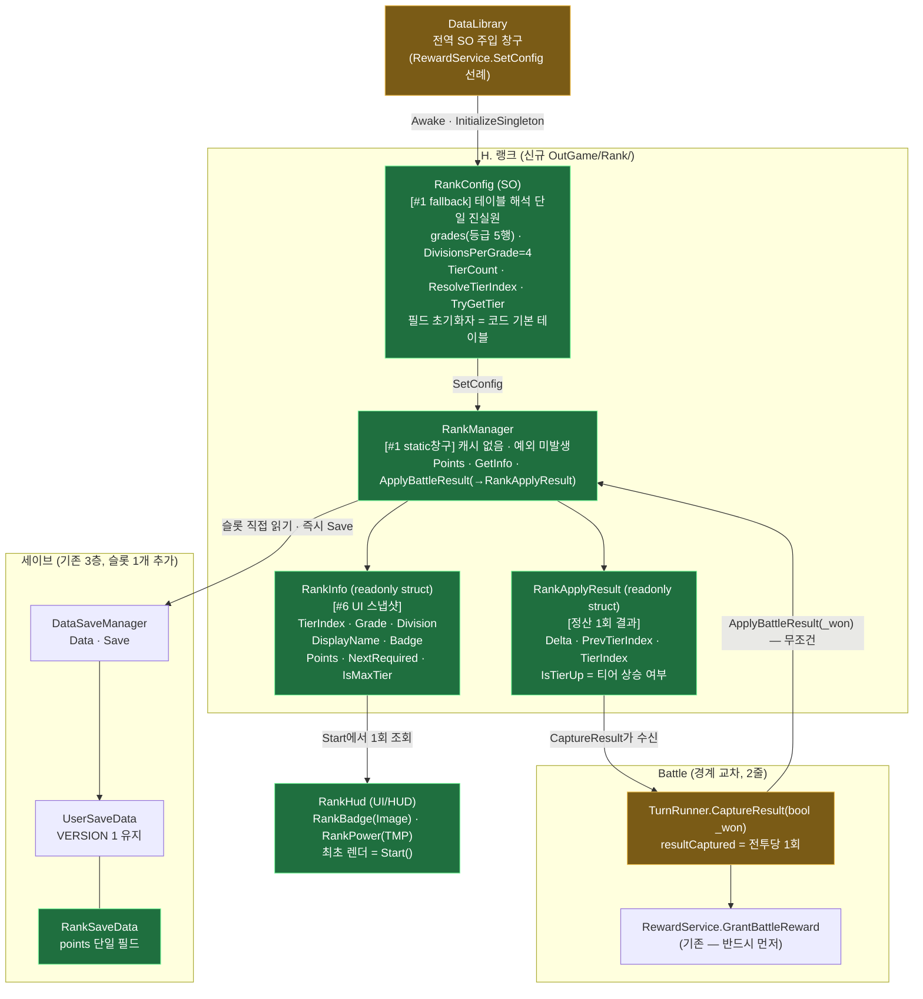
```mermaid
flowchart TD
    subgraph save["세이브 (기존 3층, 슬롯 1개 추가)"]
        DSM["DataSaveManager<br/>Data · Save"]
        USD["UserSaveData<br/>VERSION 1 유지"]
        RSD["RankSaveData<br/>points 단일 필드"]:::new
    end

    subgraph rank["H. 랭크 (신규 OutGame/Rank/)"]
        CFG["RankConfig (SO)<br/>[#1 fallback] 테이블 해석 단일 진실원<br/>grades(등급 5행) · DivisionsPerGrade=4<br/>TierCount · ResolveTierIndex · TryGetTier<br/>필드 초기화자 = 코드 기본 테이블"]:::new
        MGR["RankManager<br/>[#1 static창구] 캐시 없음 · 예외 미발생<br/>Points · GetInfo · ApplyBattleResult(→RankApplyResult)"]:::new
        APPLY["RankApplyResult (readonly struct)<br/>[정산 1회 결과]<br/>Delta · PrevTierIndex · TierIndex<br/>IsTierUp = 티어 상승 여부"]:::new
        INFO["RankInfo (readonly struct)<br/>[#6 UI 스냅샷]<br/>TierIndex · Grade · Division<br/>DisplayName · Badge<br/>Points · NextRequired · IsMaxTier"]:::new
    end

    subgraph battle["Battle (경계 교차, 2줄)"]
        TR["TurnRunner.CaptureResult(bool _won)<br/>resultCaptured = 전투당 1회"]:::chg
        RS["RewardService.GrantBattleReward<br/>(기존 — 반드시 먼저)"]
    end

    DL["DataLibrary<br/>전역 SO 주입 창구<br/>(RewardService.SetConfig 선례)"]:::chg
    HUD["RankHud (UI/HUD)<br/>RankBadge(Image) · RankPower(TMP)<br/>최초 렌더 = Start()"]:::new

    DSM --> USD
    USD --- RSD
    MGR -->|"슬롯 직접 읽기 · 즉시 Save"| DSM
    CFG -->|SetConfig| MGR
    DL -->|"Awake · InitializeSingleton"| CFG
    TR --> RS
    TR -->|"ApplyBattleResult(_won) — 무조건"| MGR
    MGR --> APPLY
    APPLY -->|"CaptureResult가 수신"| TR
    MGR --> INFO
    INFO -->|"Start에서 1회 조회"| HUD

    classDef new fill:#1f6f3f,stroke:#7CFC9E,color:#fff;
    classDef chg fill:#7a5b16,stroke:#f2c14e,color:#fff;
```

#### 흐름 시퀀스 — 전투 종료 → 로비 배지 갱신

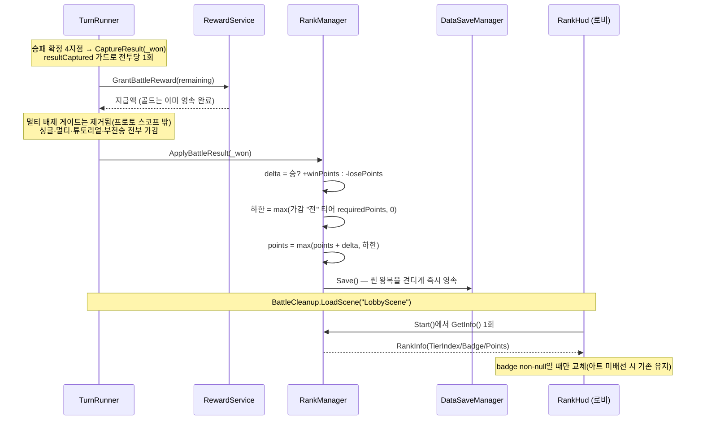
```mermaid
sequenceDiagram
    participant TR as TurnRunner
    participant RS as RewardService
    participant MGR as RankManager
    participant DSM as DataSaveManager
    participant HUD as RankHud (로비)

    Note over TR: 승패 확정 4지점 → CaptureResult(_won)<br/>resultCaptured 가드로 전투당 1회
    TR->>RS: GrantBattleReward(remaining)
    RS-->>TR: 지급액 (골드는 이미 영속 완료)
    Note over TR: 멀티 배제 게이트는 제거됨(프로토 스코프 밖)<br/>싱글·멀티·튜토리얼·부전승 전부 가감
    TR->>MGR: ApplyBattleResult(_won)
    MGR->>MGR: delta = 승? +winPoints : -losePoints
    MGR->>MGR: 하한 = max(가감 "전" 티어 requiredPoints, 0)
    MGR->>MGR: points = max(points + delta, 하한)
    MGR->>DSM: Save() — 씬 왕복을 견디게 즉시 영속
    Note over TR,HUD: BattleCleanup.LoadScene("LobbyScene")
    HUD->>MGR: Start()에서 GetInfo() 1회
    MGR-->>HUD: RankInfo(TierIndex/Badge/Points)
    Note over HUD: badge non-null일 때만 교체(아트 미배선 시 기존 유지)
```


### H-33. 랭크 티어 달성 보상 — ✅ 완료 (2026-07-27, 코드 + 씬 저작)

> 표시용 진행도였던 랭크에 **보상 엔드포인트**를 붙인다. 티어에 도달하면 골드를 **순차로 1회씩** 수령한다.
> **`RankManager`는 무수정** — 보상은 신규 static 창구 `RankRewardManager`로만 흐르고, 달성 판정만 `RankManager.GetInfo()`에 위임한다(동결 계약 무접촉).
> ⚠️ 이 "무수정·동결" 서술은 **H-33 시점 기록**이다. 이후 등급 재설계에서 **동결이 해제**돼 `GetInfo`·`ApplyBattleResult`가 재작성되고 private 헬퍼 3개(`ResolveTierIndex`/`ResolveTierFloor`/`FindNextTier`)가 제거됐다. 공개 API·불변식은 보존됐다(아래 재설계 항목 참조).
> 스코프: 골드 1종(프로젝트 재화가 `Gold` 단일) · 20티어 전부 · 광고 2배 없음.

#### 구조 지도 — 판정/영속/표시

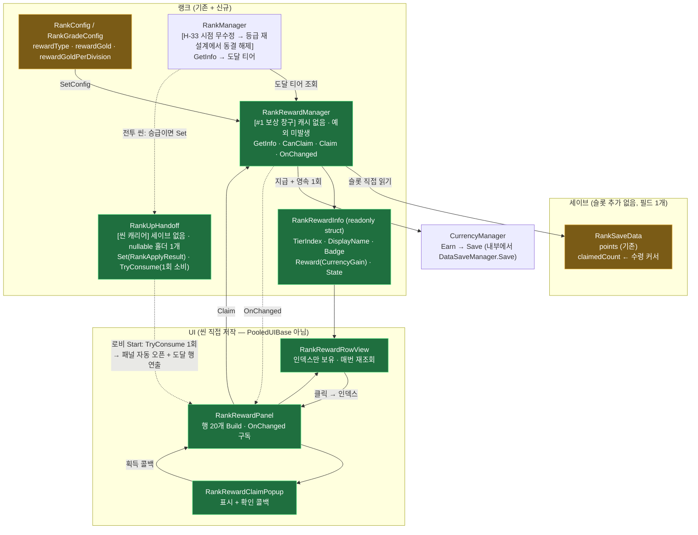
```mermaid
flowchart TD
    subgraph save["세이브 (슬롯 추가 없음, 필드 1개)"]
        RSD["RankSaveData<br/>points (기존)<br/>claimedCount ← 수령 커서"]:::chg
    end

    subgraph rank["랭크 (기존 + 신규)"]
        CFG["RankConfig / RankGradeConfig<br/>rewardType · rewardGold · rewardGoldPerDivision"]:::chg
        MGR["RankManager<br/>[H-33 시점 무수정 → 등급 재설계에서 동결 해제]<br/>GetInfo → 도달 티어"]
        RMGR["RankRewardManager<br/>[#1 보상 창구] 캐시 없음 · 예외 미발생<br/>GetInfo · CanClaim · Claim · OnChanged"]:::new
        INFO["RankRewardInfo (readonly struct)<br/>TierIndex · DisplayName · Badge<br/>Reward(CurrencyGain) · State"]:::new
        HAND["RankUpHandoff<br/>[씬 캐리어] 세이브 없음 · nullable 홀더 1개<br/>Set(RankApplyResult) · TryConsume(1회 소비)"]:::new
    end

    subgraph ui["UI (씬 직접 저작 — PooledUIBase 아님)"]
        PANEL["RankRewardPanel<br/>행 20개 Build · OnChanged 구독"]:::new
        ROW["RankRewardRowView<br/>인덱스만 보유 · 매번 재조회"]:::new
        POP["RankRewardClaimPopup<br/>표시 + 확인 콜백"]:::new
    end

    CUR["CurrencyManager<br/>Earn → Save (내부에서 DataSaveManager.Save)"]

    RMGR -->|"슬롯 직접 읽기"| RSD
    CFG -->|SetConfig| RMGR
    MGR -->|"도달 티어 조회"| RMGR
    RMGR --> INFO
    INFO --> ROW
    PANEL --> ROW
    ROW -->|"클릭 → 인덱스"| PANEL
    PANEL --> POP
    POP -->|"획득 콜백"| PANEL
    PANEL -->|Claim| RMGR
    RMGR -->|"지급 + 영속 1회"| CUR
    RMGR -.->|OnChanged| PANEL
    MGR -.->|"전투 씬: 승급이면 Set"| HAND
    HAND -.->|"로비 Start: TryConsume 1회<br/>→ 패널 자동 오픈 + 도달 행 연출"| PANEL

    classDef new fill:#1f6f3f,stroke:#7CFC9E,color:#fff;
    classDef chg fill:#7a5b16,stroke:#f2c14e,color:#fff;
```


### 매치 덱 선택·편집 (`UI/Match/`) — ✅ 코드+검수 완료 (2026-08-03), 프리팹·씬 저작 대기

전투 진입 직전 화면에서 **덱을 고르고 그 자리에서 수정**하는 흐름. 편집 본체는 로비와 같은 `DeckEditController`를 그대로 쓰고, 매치는 그 위에 셸과 가로 리스트만 얹는다.

#### 구조 위치 (🆕 = 이번 신규)

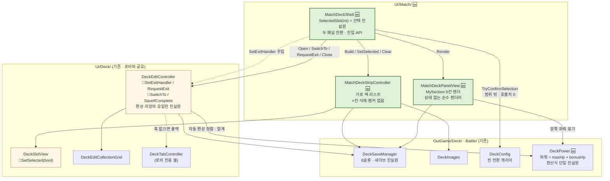
```mermaid
graph TD
    subgraph Match["UI/Match/ 🆕"]
        SHELL["MatchDeckShell 🆕<br/>SelectedSlot(int) = 선택 진실원<br/>두 패널 전환 · 진입 API"]
        PV["MatchDeckPanelView 🆕<br/>MySection 6칸 렌더<br/>상태 없는 순수 렌더러"]
        STRIP["MatchDeckStripController 🆕<br/>가로 덱 리스트<br/>+칸·삭제·앵커 없음"]
    end

    subgraph Deck["UI/Deck/ (기존 · 로비와 공유)"]
        EDIT["DeckEditController<br/>🔸SetExitHandler / RequestExit<br/>🔸SwitchTo / SaveIfComplete<br/>편성·저장의 유일한 진실원"]
        SLOTV["DeckSlotView<br/>🔸SetSelected(bool)"]
        GRID["DeckEditCollectionGrid"]
        TABC["DeckTabController<br/>(로비 전용 셸)"]
    end

    subgraph Data["OutGame/Deck/ · Battle/ (기존)"]
        DSM["DeckSaveManager<br/>6슬롯 · 세이브 진실원"]
        DIMG["DeckImages"]
        DCFG["DeckConfig<br/>씬 전환 캐리어"]
        DPW["DeckPower 🆕<br/>파워 = maxHp + bonusHp<br/>환산식 단일 진실원"]
    end

    SHELL -->|Render| PV
    SHELL -->|Build / SetSelected / Clear| STRIP
    SHELL -->|Open / SwitchTo / RequestExit / Close| EDIT
    SHELL -.->|SetExitHandler 주입| EDIT
    EDIT -.->|훅 없으면 폴백| TABC
    STRIP --> SLOTV
    EDIT --> GRID
    PV --> DSM
    STRIP --> DSM
    STRIP --> DIMG
    EDIT --> DSM
    PV -->|양쪽 파워 표기| DPW
    EDIT -->|자동 편성 정렬 · 합계| DPW
    SHELL -->|TryConfirmSelection<br/>범위 밖 · 호출처 0| DCFG

    style SHELL fill:#dff0d8,stroke:#3c763d,stroke-width:2px
    style PV fill:#dff0d8,stroke:#3c763d,stroke-width:2px
    style STRIP fill:#dff0d8,stroke:#3c763d,stroke-width:2px
    style EDIT fill:#fcf8e3,stroke:#8a6d3b
    style SLOTV fill:#fcf8e3,stroke:#8a6d3b
```

#### 흐름 — 전투 씬 진입 → 덱 확정 → 전투 시작

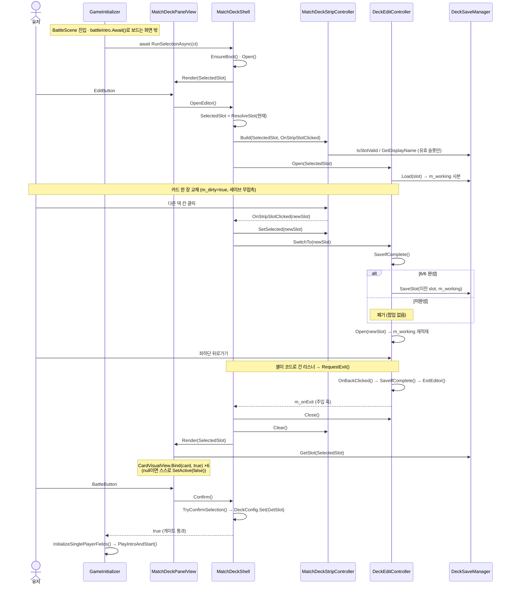
```mermaid
sequenceDiagram
    actor U as 유저
    participant GI as GameInitializer
    participant PV as MatchDeckPanelView
    participant SH as MatchDeckShell
    participant ST as MatchDeckStripController
    participant ED as DeckEditController
    participant SV as DeckSaveManager

    Note over GI: BattleScene 진입 · battleIntro.Await()로 보드는 화면 밖
    GI->>SH: await RunSelectionAsync(ct)
    SH->>SH: EnsureBoot() · Open()
    SH->>PV: Render(SelectedSlot)

    U->>PV: EditButton
    PV->>SH: OpenEditor()
    SH->>SH: SelectedSlot = ResolveSlot(현재)
    SH->>ST: Build(SelectedSlot, OnStripSlotClicked)
    ST->>SV: IsSlotValid / GetDisplayName (유효 슬롯만)
    SH->>ED: Open(SelectedSlot)
    ED->>SV: Load(slot) → m_working 사본

    Note over U,ED: 카드 한 장 교체 (m_dirty=true, 세이브 무접촉)

    U->>ST: 다른 덱 칸 클릭
    ST-->>SH: OnStripSlotClicked(newSlot)
    SH->>ST: SetSelected(newSlot)
    SH->>ED: SwitchTo(newSlot)
    ED->>ED: SaveIfComplete()
    alt 6/6 완성
        ED->>SV: SaveSlot(이전 slot, m_working)
    else 미완성
        Note over ED: 폐기 (팝업 없음)
    end
    ED->>ED: Open(newSlot) → m_working 재적재

    U->>ED: 좌하단 뒤로가기
    Note over SH,ED: 셸이 코드로 건 리스너 → RequestExit()
    ED->>ED: OnBackClicked() → SaveIfComplete() → ExitEditor()
    ED-->>SH: m_onExit (주입 훅)
    SH->>ED: Close()
    SH->>ST: Clear()
    SH->>PV: Render(SelectedSlot)
    PV->>SV: GetSlot(SelectedSlot)
    Note over PV: CardVisualView.Bind(card, true) ×6<br/>(null이면 스스로 SetActive(false))

    U->>PV: BattleButton
    PV->>SH: Confirm()
    SH->>SH: TryConfirmSelection() → DeckConfig.Set(GetSlot)
    SH-->>GI: true (게이트 통과)
    GI->>GI: InitializeSinglePlayerFields() → PlayIntroAndStart()
```

> BackButton은 `Cancel()` → 게이트가 false를 돌려주고, **어디로 돌아갈지는 호스트가 정한다**(셸은 씬을 모른다).


### 카드 성장 — 강화 + 진화 (`OutGame/Growth/`) — ✅ 코드 완료 (2026-08-04) / SO 에셋·씬 배선·진화 아트 대기

> 카드 한 장에 붙는 **영구 성장**. 강화(수직·골드·확률)와 진화(문·다이아·확정)가 한 축에서 맞물린다 —
> 진화는 스탯을 1도 바꾸지 않고 **강화를 여는 열쇠 + 아트/연출 자격**으로만 존재한다.
> 경제 설계(왜 두 재화인가, 왜 실패가 있는가)의 진실원은 [`ENHANCE_ECONOMY.md`](./ENHANCE_ECONOMY.md). 이 절은 **구조**만 다룬다.
> `:::new` = 이번 신규, `:::chg` = 기존 파일 소규모 수정.

#### 구조 지도 — 4갈래(영속 / 판정 / 표시 / 전투 주입)

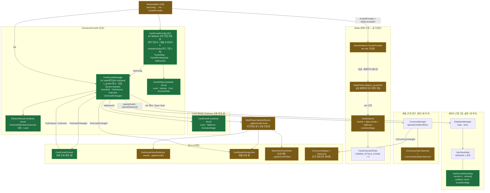
```mermaid
flowchart TD
    subgraph save["세이브 (기존 3층, 슬롯 1개 추가)"]
        DSM["DataSaveManager<br/>Data · Save"]
        USD["UserSaveData<br/>VERSION 1 유지"]
        GSD["CardGrowthSaveData<br/>version=1 · entries[]<br/>cardKey / level / evolutionStage"]:::new
    end

    subgraph growth["OutGame/Growth/ (신규)"]
        CFG["CardGrowthConfig (SO)<br/>[#1 fallback] 곡선 단일 진실원<br/>전역 기본식 + 레벨 오버라이드<br/>evolutionGates(코드 기본 2개)<br/>TryGetStep · TryGetPendingGate · HpBonusAt"]:::new
        MGR["CardGrowthManager<br/>[#1 static창구][#2 Init/Save]<br/>s_growth 캐시 · 로컬 System.Random<br/>GrowthOf · TryEnhance · TryEvolve<br/>OnGrowthChanged"]:::new
        ERES["EnhanceResult (readonly struct)<br/>Outcome(EEnhanceOutcome 6종) · Level"]:::new
        STEP["GrowthStep (readonly struct)<br/>Level · HpGain · Cost · SuccessRate"]:::new
    end

    subgraph neutral["Card/ (Battle·OutGame 공용 중립 값)"]
        CG["CardGrowth (readonly struct)<br/>Level · HpBonus · EvolutionStage"]:::new
    end

    subgraph cur["재화 (기존 창구, 종류 1개 추가)"]
        CUR["CurrencyManager<br/>Spend/CanAfford/Earn"]
        DIA["ECurrencyType.Diamond<br/>+ CurrencySaveData.diamond"]:::chg
    end

    subgraph battle["Battle (경계 교차 — 값 주입만)"]
        GI["GameInitializer.GrowthProvider<br/>set-only 주입점"]:::chg
        BF["BattleField.Initialize(_growthOf)<br/>싱글 플레이어 필드에만 전달"]:::chg
        CI["CardInstance<br/>maxHp = data.maxHp + HpBonus<br/>evolutionStage"]:::chg
        CIN["CardCinematicRules<br/>CINEMA_ATTACK_STAGE = 3"]
    end

    BOOT["BootInstaller [-200]<br/>SetConfig → Init → GrowthProvider"]:::chg
    DPW["DeckPower.MaxHpOf(card, _applyGrowth=true)<br/>아웃게임 표시 단일 진실원"]:::chg

    subgraph ui["표시 (소비만)"]
        SCR["CardGrowthScreen<br/>강화·진화 화면 1장"]:::new
        CVV["CardVisualView.Bind(card, owned, _applyGrowth)"]:::chg
        DET["CardDetailOverlayView<br/>레벨·진화 행"]:::chg
        MPV["MatchDeckPanelView<br/>상대 덱만 _applyGrowth:false"]:::chg
        GHUD["CurrencyHud(type = Diamond)<br/>같은 컴포넌트 재사용"]:::chg
    end

    DSM --> USD
    USD --- GSD
    MGR -->|"Init: 캐시 / Save: flush"| DSM
    CFG -->|SetConfig| MGR
    BOOT --> CFG
    BOOT -->|Init| MGR
    MGR --> CG
    MGR --> ERES
    CFG --> STEP
    MGR -->|"Spend(Gold) / Spend(Diamond)"| CUR
    CUR --- DIA
    BOOT -->|"GrowthProvider = MGR.GrowthOf"| GI
    GI -->|"싱글 · 플레이어 필드만"| BF
    BF -->|"ctor 인자"| CI
    CI --> CIN
    MGR -->|HpBonusOf| DPW
    DPW --> CVV
    DPW --> DET
    DPW --> MPV
    SCR -->|"TryEnhance / TryEvolve"| MGR
    MGR -->|OnGrowthChanged| SCR
    MGR -->|OnGrowthChanged| DET
    CUR -->|OnCurrencyChanged| GHUD

    classDef new fill:#1f6f3f,stroke:#7CFC9E,color:#fff;
    classDef chg fill:#7a5b16,stroke:#f2c14e,color:#fff;
```

#### 흐름 시퀀스 — 강화 1회(실패 포함) → 게이트 → 진화 → 전투 반영

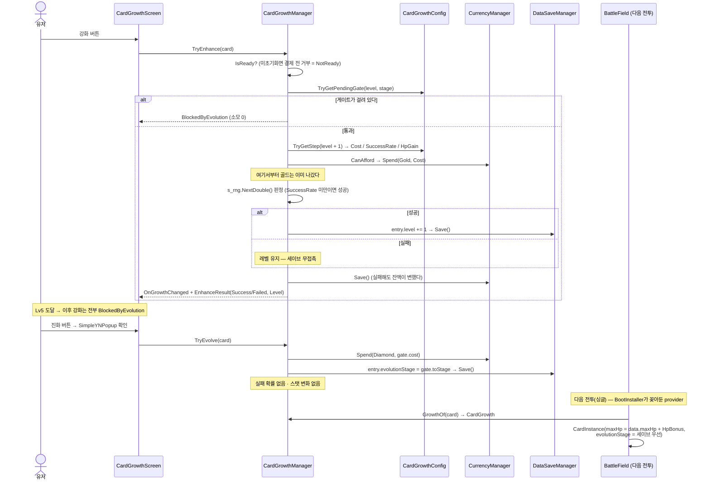
```mermaid
sequenceDiagram
    actor U as 유저
    participant SCR as CardGrowthScreen
    participant MGR as CardGrowthManager
    participant CFG as CardGrowthConfig
    participant CUR as CurrencyManager
    participant DSM as DataSaveManager
    participant BF as BattleField (다음 전투)

    U->>SCR: 강화 버튼
    SCR->>MGR: TryEnhance(card)
    MGR->>MGR: IsReady? (미초기화면 결제 전 거부 = NotReady)
    MGR->>CFG: TryGetPendingGate(level, stage)
    alt 게이트가 걸려 있다
        MGR-->>SCR: BlockedByEvolution (소모 0)
    else 통과
        MGR->>CFG: TryGetStep(level + 1) → Cost / SuccessRate / HpGain
        MGR->>CUR: CanAfford → Spend(Gold, Cost)
        Note over MGR: 여기서부터 골드는 이미 나갔다
        MGR->>MGR: s_rng.NextDouble() 판정 (SuccessRate 미만이면 성공)
        alt 성공
            MGR->>DSM: entry.level += 1 → Save()
        else 실패
            Note over MGR: 레벨 유지 — 세이브 무접촉
        end
        MGR->>CUR: Save() (실패해도 잔액이 변했다)
        MGR-->>SCR: OnGrowthChanged + EnhanceResult(Success/Failed, Level)
    end

    Note over U,SCR: Lv5 도달 → 이후 강화는 전부 BlockedByEvolution
    U->>SCR: 진화 버튼 → SimpleYNPopup 확인
    SCR->>MGR: TryEvolve(card)
    MGR->>CUR: Spend(Diamond, gate.cost)
    MGR->>DSM: entry.evolutionStage = gate.toStage → Save()
    Note over MGR: 실패 확률 없음 · 스탯 변화 없음

    Note over BF: 다음 전투(싱글) — BootInstaller가 꽂아둔 provider
    BF->>MGR: GrowthOf(card) → CardGrowth
    BF->>BF: CardInstance(maxHp = data.maxHp + HpBonus,<br/>evolutionStage = 세이브 우선)
```

---

### 신규 도감 = 카드 앨범 (`OutGame/Album/`) — 테마 → 페이지 → 칸, 보상 3단 — ✅ **데이터 축 + UI 축 + 앨범 저작 완료 (2026-08-06 DATA/UI, 2026-08-07 ASSET) — Play 검증 대기**

> **네이밍 은유 = 스티커 앨범.** 도감(圖鑑)은 **앨범**이고, 앨범에는 **페이지**가 있고, 페이지에는 카드를 꽂는 **칸(슬롯)** 이 있다. 이 은유가 요구된 3계층에 1:1로 맞아떨어져서, 클래스 이름만 읽어도 그게 무엇인지 알 수 있다.
> **"챕터"는 의도적으로 피했다** — 튜토리얼이 이미 `TutorialSaveData.outgameChapterIndex`로 챕터를 쓰고 있어 같은 단어가 두 도메인을 가리키게 된다.
> **"Collection" 접두어도 쓸 수 없다** — 구 도감이 `CollectionTheme`·`CollectionThemeConfig`·`CollectionProgressView` 등으로 이미 점유했고, 병존 기간에 이름이 겹치면 어느 쪽 파일인지 구분이 안 된다.

> 기존 도감(`OutGame/Collection/` 행+생산 축)을 **대체할** 새 축. **이번 플랜에 기존 삭제는 포함하지 않는다 — 병존**하고, 삭제는 후속 정리 패키지로 넘긴다.
> 그래서 신규는 폴더·접두어를 **`Album`으로 물리 분리**한다(`OutGame/Album/` · `UI/Album/`). 구/신 파일이 `OutGame/Collection/`·`UI/Collection/`에 섞이면 후속 삭제가 "라인 단위 수술"이 되지만, 분리해 두면 `rm -r`로 끝난다.

**실측 전제 (설계의 근거)**

- 로비 도감 탭(`LobbyTabController` idx 4 → `Tab_Collection.prefab`)에서 **실제로 도는 건 `CollectionGridController`(평면 4열 그리드) 하나뿐**이다. 행·생산·수확 UI(`CollectionGalleryController`)는 `CollectionScreen.prefab`·`CollectionTest.unity`에만 있고 **역참조 0건 = 로비에서 도달 불가**.
- 테마 축(`CollectionThemes`/`CollectionThemeConfig`/`CollectionThemeListController`/`CollectionThemeRowView`/`CollectionTabController`)은 코드만 있고 **에셋 0건 + 어떤 프리팹·씬에도 미부착 = 완전 휴면**. `Tab_Collection`의 `ThemeTab_All/01~06`은 컨트롤러 없는 **정적 목업**이다.
- ⚠️ **`Boot.prefab:51-55`에 직렬화된 필드는 `cardRegistry`/`collectionLayout`/`tutorialData`/`deckImageCatalog`/`starterDeck` 5개뿐** — `BootInstaller.cs`의 `collectionThemes`·`triggeredTutorialData`·`growthConfig`는 프리팹에 없다(= null). 즉 매 부팅마다 `CollectionThemes`의 "테마 SO 미배선" 경고가 뜨고 있다. 신규 SO 배선도 **반드시 `Boot.prefab` 레벨**에 해야 한다 — `StartScene.unity:423-435`가 일부 SO를 **씬 오버라이드**로 꽂는 바람에 `LobbyScene` 단독 Play에서 null이 되는 기존 함정을 반복하지 않기 위해서다.
- **도감에 "완성 보상 수령" 개념이 코드에 전혀 없다.** 수령 선례는 랭크(`RankRewardManager`)뿐이고, **페이지 개념도 데이터 모델에 없다**(`Tab_Collection`의 `ChapterLabel "01"`은 미배선 장식).
- 카드 총량 = **현재 31장**(`Assets/SO/Cards/*.asset`) / **계획 90장**(사용자 확정 2026-08-06).

**저작 스케일 (사용자 확정 2026-08-06)**

| 항목 | 값 | 성격 |
|---|---|---|
| 페이지 1장 | **3×3 = 9칸** | 프리팹 `GridLayoutGroup` 3열 저작값. 칸 수는 `page.Cards.Count` 파생 — **코드에 `9`도 `3`도 박지 않는다** |
| 테마 1개 | **페이지 수 자유** | `AlbumThemeDef.pages` 리스트 길이. 향후 페이지 추가 가능이 요구사항 |
| 도감 전체 | **90장 계획**(현재 31장) | `CardAlbumConfig.themes` 리스트 길이 |

**실제 저작 (2026-08-07, PKG-ALBUM-ASSET)** — 테마 **9개**. 갤러리 `Content`가 `GridLayoutGroup` 3열이고 목업 셀이 `Cell_00`~`Cell_08` 9개라, **9개가 빈 줄 없이 3×3을 채우는 수**다. 테마 이름·아이콘·순서는 그 목업 셀에서 그대로 옮겼다(자연·동화·영화·요리·불가사의·조각품·우주·바다·축제).

| 테마 | 페이지 | 실카드 | 비고 |
|---|---|---|---|
| `Theme_Nature`(자연) | P1~P4 | **31장** 전부 | 시너지 묶음 배치. P4는 4장 + **null 5칸**(3×3 유지, 완성 모수 제외 → 4/4로 완성 가능) |
| 나머지 8개 | P1 | 0장 | **목업** — 페이지 1장 × null 9칸. 카드가 늘면 여기로 옮겨 담는다 |

**셀 비주얼은 2단이다 (2026-08-07)** — 색만 다르면 **스킨 저작**, 구조가 다르면 **프리팹 교체**.

| 축 | 저작 | 쓰는 때 |
|---|---|---|
| 스킨 3종 | `AlbumThemeDef.icon` / `frame` / `namePlate` | 셀 구조는 같고 **색·아이콘만** 다를 때(현재 테마 9개 전부) |
| 셀 교체 | `AlbumThemeDef.cellPrefab` (`GameObject`) | 테마마다 **셀 구조 자체**가 다를 때. 비우면 갤러리 기본 셀 |

기본 셀은 `Tabs/Album/AlbumThemeCell.prefab`으로 **독립 에셋**이고 `AlbumTabController.cellTemplate`이 이걸 가리킨다. 테마 디자인을 바꾸려면 이 프리팹을 복제·수정해 그 테마의 `cellPrefab`에 꽂으면 된다 — 나머지 테마는 영향받지 않는다.
셀마다 갈리는 비주얼은 실측 **3종뿐**(`Button_Thumb` 프레임 · `Button_Thumb/Icon/Image` 아이콘 · `Button_Thumb/Plate_Name` 이름판)이고 나머지(체크·게이지 배경·Fill·보상 아이콘)는 전부 동일해서, 지금 9테마는 프리팹 1개 + 스킨 저작으로 충분하다.

> **`cellPrefab`이 `AlbumThemeCellView`가 아니라 `GameObject`인 이유** — 저작 축(`OutGame/Album/`)이 UI 축(`UI/Album/`)을 참조하면 병존 경계가 지키려는 의존 방향이 뒤집힌다. 대신 `AlbumTabController.ResolveCellPrefab`이 컴포넌트 유무를 확인하고, 없으면 **기본 셀로 떨어뜨리고 `LogError`** 한다.
> **목업 프리팹에 색을 칠해두는 건 대안이 아니다** — `Build()`가 `galleryContent`의 자식을 전부 `Destroy`한다(템플릿이 프리팹 에셋이 된 뒤로는 `Cell_00`도 예외가 아니다). 런타임 셀은 전부 프리팹 클론이라, 저작하지 않으면 9칸이 **전부 Green 프레임**이 된다. 목업이 알록달록해 보이는 건 에디터에서뿐이다.
> 테마 수가 이미 SO 저작값이므로, 셀 비주얼만 프리팹에 남기면 **이중 진실원**이 된다(테마 추가 시 양쪽을 손대야 하고 순서가 어긋나면 "자연 테마에 동화 프레임"이 조용히 뜬다).
> **템플릿을 프리팹 에셋으로 바꿀 때 같이 고친 함정**: `Build()`의 `cellTemplate.gameObject.SetActive(false)`는 씬 오브젝트 전제였다 — 에셋에 그대로 걸면 **프리팹 파일이 비활성으로 저장**된다. `scene.IsValid()`로 가드한다.
> **셀 교체는 그리드 순서를 잃는다** — `Instantiate`는 항상 맨 뒤에 붙으므로 `Refresh`가 `SetSiblingIndex(i)`로 자리를 되돌린다. 안 하면 저작을 바꾼 테마만 갤러리 끝으로 밀린다.

> **목업 테마도 페이지를 1장은 줘야 한다** — `AlbumPageOverlayView.Open`이 `Pages.Count == 0`이면 "빈 테마"로 판정해 오버레이를 아예 열지 않는다. 셀을 눌렀는데 아무 반응이 없는 것으로 보인다.
> **목업 테마에도 `rewards`를 저작했다** — 빈 리스트면 `AlbumChestView`가 상자를 통째로 숨겨(`SetActive(false)`) 그 셀만 레이아웃이 달라 보인다. 영구 미완성이라 지급은 열리지 않는다.
> **감수한 로그**: 목업 테마는 실카드 0장이라 `ValidateAlbum`이 "카드 0장 페이지" 경고 8건을 낸다. 저작이 채워지면 자연 소멸한다.

> 세 값 **전부 SO 저작값**이라 코드 변경 없이 바뀐다. 테마마다 페이지 수가 달라도 된다(리스트 길이가 곧 페이지 수).
> 현재 31장이므로 **첫 저작은 페이지가 부분적으로 빈다** — 빈 칸은 `null` 슬롯이 되고, `CardAlbum`이 완성 판정 모수에서 제외하므로 "9칸 중 4장만 저작된 페이지"는 `4/4`로 완성 가능하다(아래 함정 절 참조). 카드가 채워지는 대로 저작을 늘리면 그 페이지가 다시 미완성으로 내려가는데, 수령 낙인은 `Claimed` 최우선 판정이라 재지급되지 않는다.

#### 클래스도

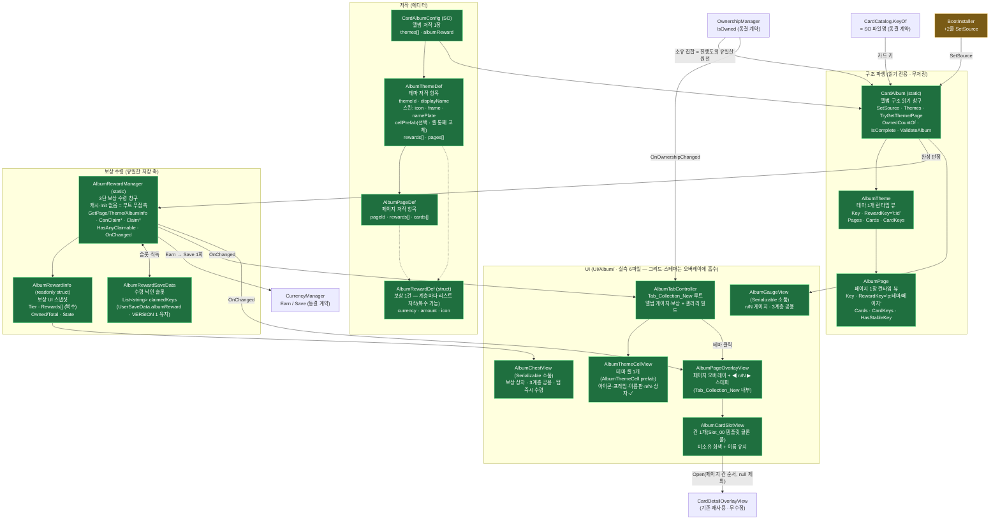
```mermaid
flowchart TD
    subgraph AUTH["저작 (에디터)"]
        CFG["CardAlbumConfig (SO)<br/>앨범 저작 1장<br/>themes[] · albumReward"]:::new
        TDEF["AlbumThemeDef<br/>테마 저작 항목<br/>themeId · displayName<br/>스킨: icon · frame · namePlate<br/>cellPrefab(선택 · 셀 통째 교체)<br/>rewards[] · pages[]"]:::new
        PDEF["AlbumPageDef<br/>페이지 저작 항목<br/>pageId · rewards[] · cards[]"]:::new
        RDEF["AlbumRewardDef (struct)<br/>보상 1건 — 계층마다 리스트 저작(복수 가능)<br/>currency · amount · icon"]:::new
    end
    subgraph DERIVE["구조 파생 (읽기 전용 · 무저장)"]
        BOOK["CardAlbum (static)<br/>앨범 구조 읽기 창구<br/>SetSource · Themes · TryGetTheme/Page<br/>OwnedCountOf · IsComplete · ValidateAlbum"]:::new
        THEME["AlbumTheme<br/>테마 1개 런타임 뷰<br/>Key · RewardKey='t:id'<br/>Pages · Cards · CardKeys"]:::new
        PAGE["AlbumPage<br/>페이지 1장 런타임 뷰<br/>Key · RewardKey='p:테마/페이지'<br/>Cards · CardKeys · HasStableKey"]:::new
    end
    subgraph CLAIM["보상 수령 (유일한 저장 축)"]
        RMGR["AlbumRewardManager (static)<br/>3단 보상 수령 창구<br/>캐시·Init 없음 = 부트 무접촉<br/>GetPage/Theme/AlbumInfo · CanClaim* · Claim*<br/>HasAnyClaimable · OnChanged"]:::new
        RINFO["AlbumRewardInfo (readonly struct)<br/>보상 UI 스냅샷<br/>Tier · Rewards[] (복수)<br/>Owned/Total · State"]:::new
        SAVE["AlbumRewardSaveData<br/>수령 낙인 슬롯<br/>List&lt;string&gt; claimedKeys<br/>(UserSaveData.albumReward · VERSION 1 유지)"]:::new
    end
    subgraph UI["UI (UI/Album/ · 실측 6파일 — 그리드·스테퍼는 오버레이에 흡수)"]
        TAB["AlbumTabController<br/>Tab_Collection_New 루트<br/>앨범 게이지·보상 + 갤러리 빌드"]:::new
        TBTN["AlbumThemeCellView<br/>테마 셀 1개(AlbumThemeCell.prefab)<br/>아이콘·프레임·이름판·n/N·상자·✓"]:::new
        PANEL["AlbumPageOverlayView<br/>페이지 오버레이 + ◀ n/N ▶ 스테퍼<br/>(Tab_Collection_New 내부)"]:::new
        SLOT["AlbumCardSlotView<br/>칸 1개(Slot_00 템플릿 클론 풀)<br/>미소유 회색 + 이름 유지"]:::new
        BOX["AlbumChestView (Serializable 소품)<br/>보상 상자 · 3계층 공용 · 탭 즉시 수령"]:::new
        PROG["AlbumGaugeView (Serializable 소품)<br/>n/N 게이지 · 3계층 공용"]:::new
    end
    OWN["OwnershipManager<br/>IsOwned (동결 계약)"]
    CAT["CardCatalog.KeyOf<br/>= SO 파일명 (동결 계약)"]
    CUR["CurrencyManager<br/>Earn / Save (동결 계약)"]
    BOOTI["BootInstaller<br/>+2줄 SetSource"]:::chg
    DET["CardDetailOverlayView<br/>(기존 재사용 · 무수정)"]

    CFG --> TDEF --> PDEF
    TDEF -.-> RDEF
    PDEF -.-> RDEF
    BOOTI -->|SetSource| BOOK
    CFG --> BOOK
    BOOK --> THEME --> PAGE
    CAT -->|카드 키| BOOK
    OWN -->|"소유 집합 = 진행도의 유일한 원천"| BOOK
    BOOK -->|완성 판정| RMGR
    RMGR --> RINFO
    RMGR <-->|"슬롯 직독"| SAVE
    RMGR -->|Earn → Save 1회| CUR
    TAB --> TBTN
    TAB -->|테마 클릭| PANEL
    PANEL --> SLOT
    RINFO --> BOX
    BOOK --> PROG
    RMGR -->|OnChanged| TAB
    RMGR -->|OnChanged| PANEL
    OWN -->|OnOwnershipChanged| TAB
    SLOT -->|"Open(페이지 칸 순서, null 제외)"| DET

    classDef new fill:#1f6f3f,stroke:#7CFC9E,color:#fff;
    classDef chg fill:#7a5b16,stroke:#f2c14e,color:#fff;
```

#### 확정 설계 결정 5개 (각각 "안 그러면 무엇이 깨지나")

| # | 결정 | 안 그러면 |
|---|---|---|
| 1 | **페이지는 명시 저작**(`List<AlbumPageDef>` + `pageId`). 자동 9청크 금지 | 자동 청크 + 인덱스 키면 카드 1장 삽입에 페이지 내용이 밀려 **이미 준 보상이 다시 Claimable**이 된다(재화 복제). 첫-카드-키로 만들면 삽입 지점 이후 **모든 페이지 키가 새 키**가 되어 낙인이 전멸한다. `CollectionThemes.BuildEmpty()`가 세운 "저작물성 데이터는 자동 생성 금지"의 연장 — 보상이 붙은 페이지는 테마보다 더 강한 저작물이다 |
| 2 | **진행도는 저장하지 않는다** — `OwnershipManager.IsOwned`의 순수 파생. 저장하는 건 **수령 낙인**뿐 | 진행도를 저장하면 기존 생산 축이 겪은 "완성/미완성 전이마다 정산 시각을 당기는" 보정 로직과 세이브 마이그레이션 부채를 그대로 물려받는다 |
| 3 | **수령 낙인 = 접두 네임스페이스 문자열 리스트**(`p:테마/페이지` · `t:테마` · `b`). 랭크의 `claimedCount` 단조 커서 **사용 불가** | 도감 완성은 소유 집합의 함수라 **부분순서**다(3테마를 먼저 완성하고 1테마를 나중에 완성 가능, 카드 추가로 완성이 **취소**되기도 한다). 커서로 표현하면 "3테마 수령"이 "1·2테마 수령"으로 해석된다. 비트마스크는 비트 위치=인덱스라 세이브 규약(인덱스 금지) 정면 위반 |
| 4 | **수령 창구는 캐시·`Init` 없이 세이브 슬롯 직독**(`RankRewardManager` 패턴) → **부트에 줄이 0개 추가** | 캐시를 두면 "부트를 안 거친 씬에서 도감이 열림 → 빈 캐시 → 첫 수령 `Save()` → 기존 낙인 전멸 → 전량 재수령"이 열린다. 기존 매니저들이 `if (!s_initialized) return;`으로 막고 있는 그 경로를 **구조로 없앤다** |
| 5 | **`StateOf`는 `Claimed`를 최우선 검사**, 3종 배타(`Locked`/`Claimable`/`Claimed`) | 완성 후 카드가 추가돼 미완성으로 되돌아간 뒤 다시 완성되면 **재수령이 뚫린다**. 랭크가 같은 이유로 같은 순서를 쓴다 |

#### 병존 경계 — 기존 도감 코드 수정 0

신규가 **읽기만** 하는 것: `OwnershipManager.IsOwned` · `CardCatalog.KeyOf` · `CurrencyManager.Earn`/`Save` · `CardDetailOverlayView.BindTile`(무수정 재사용).
신규가 **참조하지 않는** 것(리뷰 체크리스트): `CollectionThemes` · `CollectionTheme` · `CollectionThemeConfig` · `CatalogRows` · `CatalogRow` · `CollectionProductionManager` · `CollectionThemeListController` · `CollectionThemeRowView` · `CollectionGalleryController` · `CollectionRowView` · `CollectionProgressView` · `CollectionGridController`.

기존 코드 수정은 **3파일 4줄**(BootInstaller·UserSaveData·CollectionThemeConfig), 프리팹은 신규 `Tab_Collection_New` + `LobbyCanvas` 재배선:

| 파일 | 변경 |
|---|---|
| `Core/BootInstaller.cs` | `[SerializeField] CardAlbumConfig albumConfig` + `CardAlbum.SetSource(albumConfig)` (기존 `CollectionThemes.SetSource` 바로 뒤) |
| `OutGame/Save/2.Domain/UserSaveData.cs` | `albumReward` 슬롯 1줄. **`VERSION`은 1 유지**(슬롯 추가는 버전 유지가 규약) |
| `OutGame/Collection/CollectionThemeConfig.cs` | `[CreateAssetMenu]` **봉인**(1줄) — 누군가 구 테마 SO를 새로 만들어 꽂으면 "카드→테마" 매핑이 2벌이 된다. 이게 이중 진실원의 유일한 실질 방어선 |
| `Tab_Collection.prefab` | **무수정으로 변경(2026-08-06 실측)** — 사용자 목업 `Tab_Collection_New.prefab`이 탭을 통째로 대체하고, `LobbyCanvas.prefab`의 `LobbyTabController.tabs[4].content`를 신규 탭 인스턴스로 재배선했다(구 탭 인스턴스는 비활성 병존). 구 `CollectionGridController`는 탭 선택으로 활성화될 경로가 없어져 **가동 중단 목적(BindTile 가로채기 차단)은 동일하게 달성** |
| `Tab_Collection_New.prefab` + `LobbyCanvas.prefab` | UI 컴포넌트 4건 부착 + 배선(MCP 일괄 수술): 목업 퍼시스턴트 onClick 11건 제거, 상자 Button 3곳 추가, 게이지 Fill 3곳 Filled(Horizontal) 전환, `tabs[4].content` 교체 |

#### 배치 규약 (충돌 회피)

- **오버레이는 `Tab_Collection_New.prefab` 안 패널(`Panel_PageOverlay`)로 둔다.** `CardDetailOverlay`처럼 `LobbyCanvas.prefab` 직속에 두면 대기 중인 `PKG-ENTRY`·`PKG-HUD`와 **3항목 클리크**가 되고, `.prefab` YAML은 머지가 불가해 도감이 대기줄에 선다.
- `Tab_Collection_New.prefab`은 `LobbyCanvas` 안 **중첩 인스턴스**다 → **프리팹 에셋 레벨에서만 편집**, 인스턴스 오버라이드 금지(오버라이드를 걸면 `LobbyCanvas.prefab`이 변해 클리크로 승격된다).
- 프리팹 참조는 **프리팹 레벨에 저작**. 씬 오버라이드로 하면 `LobbyScene.unity`가 4번째 경합 파일이 되고, 나중에 누가 Apply All 하면 조용히 어긋난다.
- `sortingOrder`는 **400 미만** 유지(`UIPoolManager` 팝업 400 / 튜토리얼 게이트 350·351·352).

#### 알려진 함정

- **완성 보상은 계층마다 `rewards` 리스트(복수 저작 가능, 2026-08-06).** 빈 리스트 = 보상 미저작 → **상자 숨김 + `Claimable` 불성립**(`CanClaim*`·알림 뱃지 미점등). 단 낙인 검사가 최우선이라 **기수령 낙인은 보상을 비워도 `Claimed` 유지**(재수령 안 뚫림). 수령은 리스트 순회 `Earn`(amount≤0 스킵) 후 `CurrencyManager.Save()` **1회** — 건별 Save 금지. 표시: 상자 아이콘 = 첫 보상, 앨범 `RewardSlot` 3칸 초과 저작은 앞칸만 + 경고.
- **null 슬롯 = 페이지 영구 잠금.** 3×3 페이지에 카드를 4장만 저작하면 나머지 5칸이 영원히 미소유로 잡혀 페이지 완성 보상이 절대 안 열린다(`CollectionThemeSlotView`가 `_card == null`을 미소유와 동일 취급하는 것과 같은 함정). → **`CardAlbum` 한 곳에서 "null 슬롯은 완성 판정 모수에서 제외"를 정의**하고 `n/N` 분모도 거기서만 산출한다.
- **키 폴백에 `displayName`을 넣지 말 것.** `CollectionThemes.ResolveKey`는 `themeId → displayName → theme_{index}` 폴백을 허용하지만 거기는 표시 축이라 리네임 손해가 없었다. 여기서 리네임은 곧 **수령 기록 소실 → 재지급**이다. `themeId`/`pageId`는 필수, 없으면 `HasStableKey = false` + `LogError` + 그 보상 영구 `Locked`.
- **`Claim` 순서 불변식**: `CanClaim 재검증 → 저작 조회 → CurrencyManager.Earn → 낙인 Add → CurrencyManager.Save() 1회 → OnChanged`. `DataSaveManager.Save()`를 따로 앞세우면 **골드 미반영 상태가 디스크에 기록**된다(`CurrencyManager.Save()`가 내부에서 부른다).
- **카드 배치가 두 곳에 저작된다** — 신규 `CardAlbumConfig`(앨범 배치)와 기존 `CollectionLayoutConfig`(생산 행). 카드 1장 추가 시 **두 SO 모두** 손대야 하고, 한쪽만 갱신하면 "도감엔 있는데 생산엔 없는 카드"가 조용히 생긴다. 병존 기간 내내 지속되는 부채이며, 근본 해결(생산도 테마에서 파생)은 이번 스코프 밖이다.

---

### 재화 획득·연출의 재화별 분리 (`OutGame/Currency/`, `UI/HUD/`, `UI/Common/`) — ✅ 코드 완료 (2026-08-06, Play 검증 대기)

**한 줄**: 재화 종류(`ECurrencyType`)가 지급원부터 HUD 숫자 롤업까지 끊기지 않고 흐른다. 이전에는 획득량이 `long` 하나로만 흘러 연출이 골드 전용으로 굳어 있었다.

#### 고친 실제 결함

`LobbyCanvas.prefab`의 `StatusBar_Group_Dark` 루트에는 **HUD가 2장**(`type:0` Gold, `type:1` Diamond) 붙어 있는데, 연출기와 랭크 팝업이 `FindFirstObjectByType<GoldHud>()`로 **아무거나 하나**를 집었다. 어느 쪽이 잡힐지는 컴포넌트 등록 순서에 달렸고, `RankRewardClaimPopup.goldHud`는 미배선(fileID 0)이라 **항상** 그 폴백을 탔다 → 골드 연출이 다이아 텍스트 위에서 노는 경로가 이미 열려 있었다.

#### 세 축

| 축 | 무엇을 | 어떻게 |
|---|---|---|
| **값** | 획득량 `long` → **쌍** | `readonly struct CurrencyGain(Type, Amount)`. 여러 재화가 섞이는 2곳(로비 합산·`HarvestAll`)만 `CurrencyGainBucket`(종류당 1칸 고정 배열, 가변 싱크라 class) |
| **HUD 조회** | 타입 탐색 → **종류 조회** | `CurrencyHud`의 `static Dictionary<ECurrencyType, CurrencyHud>` + `TryGet`. `OnEnable` 등록 / `OnDisable`은 **본인일 때만** Remove(씬 전환 시 새 HUD의 OnEnable이 먼저 돌 수 있다) / `TryGet`이 파괴된 잔재 정리 |
| **연출 상태** | 싱글턴 1벌 → **재화별 슬롯** | `CurrencyGainEffectPlayer`가 `m_bursts`·`m_current`·`m_coinSprites`를 `ECurrencyType.Count` 크기 배열로. 재화별 `CoinBurstEffect`는 **자식 `Burst_{type}` 노드**로 분리 |

#### 단일 진실원

- **팩 결제·환급 재화** = `CardPackData.priceType` **하나**. 구매처(쇼케이스·튜토리얼 스텝)는 환급 **액수**만 넘기고 종류는 팩이 정한다 → `PackShowcaseController`·`TutorialStepDef`·`OutgameTutorialRunner` 시그니처 무변경(따라서 `TutorialStepDefDrawer`의 `"duplicateRefundGold"` 문자열 참조도 그대로 산다).
- **전투 보상 재화** = `BattleReward.rewardType`. **랭크 보상 재화** = `RankGradeConfig.rewardType`(4단계 공용). **생산 행 재화** = 기존 `CatalogRow.RewardType`.
- 세 SO 필드 모두 기본값 `Gold` → **기존 에셋 재저작 불필요**.

#### 흐름

```
지급원                        캐리어                       연출
RewardService.GrantBattleReward → BattleRewardHandoff ─┐
CardPackOpener(→OpenedPack.TotalRefund) → CardPackRewardHandoff ─┤→ CurrencyGainBucket
                                                       └→ LobbyGainEffectDirector
                                                            → CurrencyGainEffectPlayer.BuildGain(bucket)
                                                                → 종류별 CurrencyHud.BeginGainRollUp

CollectionProductionManager.Harvest(→CurrencyGain) / HarvestAll(→Bucket) → CurrencyGainEffectPlayer.Play
RankRewardManager.Claim(RankTier.Reward) → RankRewardClaimPopup
```

캐리어 소비는 **드레인 방식** — `TryConsume(CurrencyGainBucket _into)`가 호출자 버킷에 합친다(`out`으로 새 버킷을 내보내면 로비가 둘을 다시 합칠 API가 하나 더 필요해진다).

#### 개명 (`.cs` + `.cs.meta` 동반 `git mv` → guid 유지, 배선 무손실 실증)

| 전 | 후 | 비고 |
|---|---|---|
| `UI/HUD/GoldHud.cs` | `CurrencyHud.cs` | 프리팹 3곳 배선 유지, Missing Script 0 |
| 위 클래스 `goldText` | `valueText` | **`[FormerlySerializedAs("goldText")]` 필수** |
| `UI/Common/GoldGainEffectPlayer.cs` | `CurrencyGainEffectPlayer.cs` | 씬 인스턴스 0장(전량 런타임 자가설치)이라 개명 리스크 0 |
| `RankTier.RewardGold` · `RankRewardInfo.RewardGold` | `Reward`(`CurrencyGain`) | 직렬화 아님 |

**SO 필드명은 전부 유지**(`goldPerCard`·`minGold`·`rewardGold`·`duplicateRefundGold`·`price`) — 이름만 골드에 고정돼 있고 값은 "액수"로 여전히 유효하다. 개명하면 저작 자산 위험만 늘고 얻는 게 없다.

#### 알려진 잔여 이슈 (스코프 밖)

- **표시 아이콘·코인 스프라이트는 여전히 프리팹에 골드로 굳어 있다** — `GameResultPopup`의 코인, `RankRewardClaimPopup.claimBurst`(스프라이트 + **코인이 날아갈 목적지**), `PackRevealView`의 환급 칩. 숫자·잔액은 종류를 따라가지만 **다이아 랭크 티어를 저작하는 순간 코인은 골드 텍스트로 날아가고 숫자는 다이아에서 오른다**. 재화 아이콘을 `ECurrencyType`으로 조회하는 창구가 다음 수순이다(HUD 이웃 아이콘 차용 `FindIconSpriteNear`는 HUD 경로에서만 동작한다).
- **같은 재화를 두 소스가 동시에 올릴 때의 Hold 경합**은 기존 동작 유지(마지막 Hold가 이김). `Play`(m_current 추적)와 `BuildGain`(호출자 시퀀스에 위임, 미추적)이 같은 종류에서 겹치면 앞 코인이 `ClearCoins`로 걷힌다 — 리팩터링 이전과 동일하며 회귀 아님.
- **같은 종류 HUD 2장 공존 시** 나중에 켜진 쪽이 꺼지면 레지스트리가 비고 살아 있는 쪽이 재등록되지 않는다. 현재 배치(종류당 1장)에선 미발현.
- 비활성 HUD는 등록되지 않으므로 **그 재화 연출이 스킵**된다(이전엔 비활성 HUD를 찾아 숫자만 올렸다). 지급·저장과 무관해 무해.
