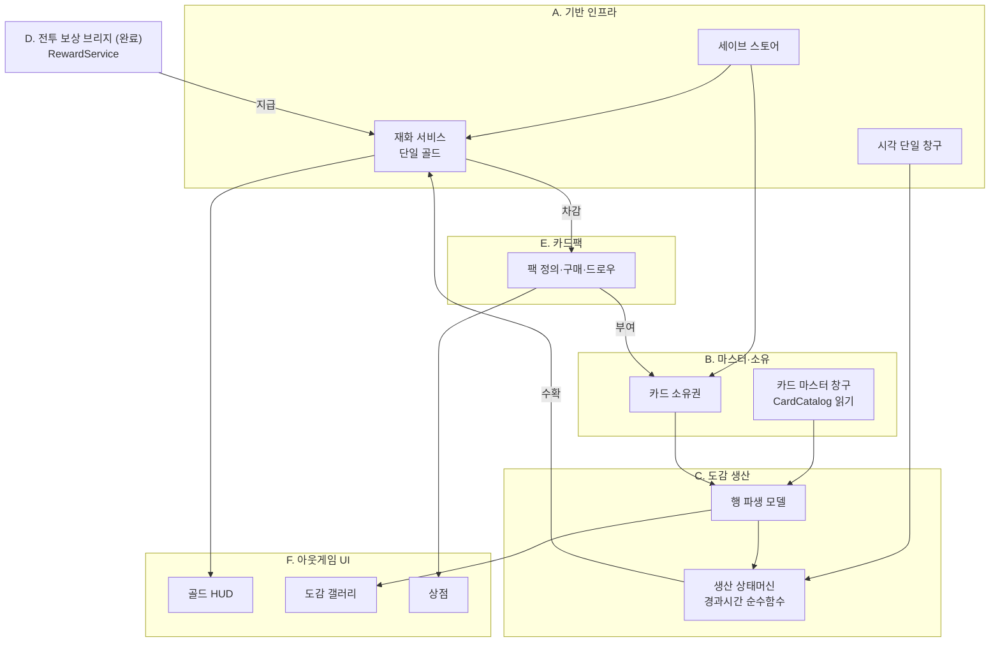
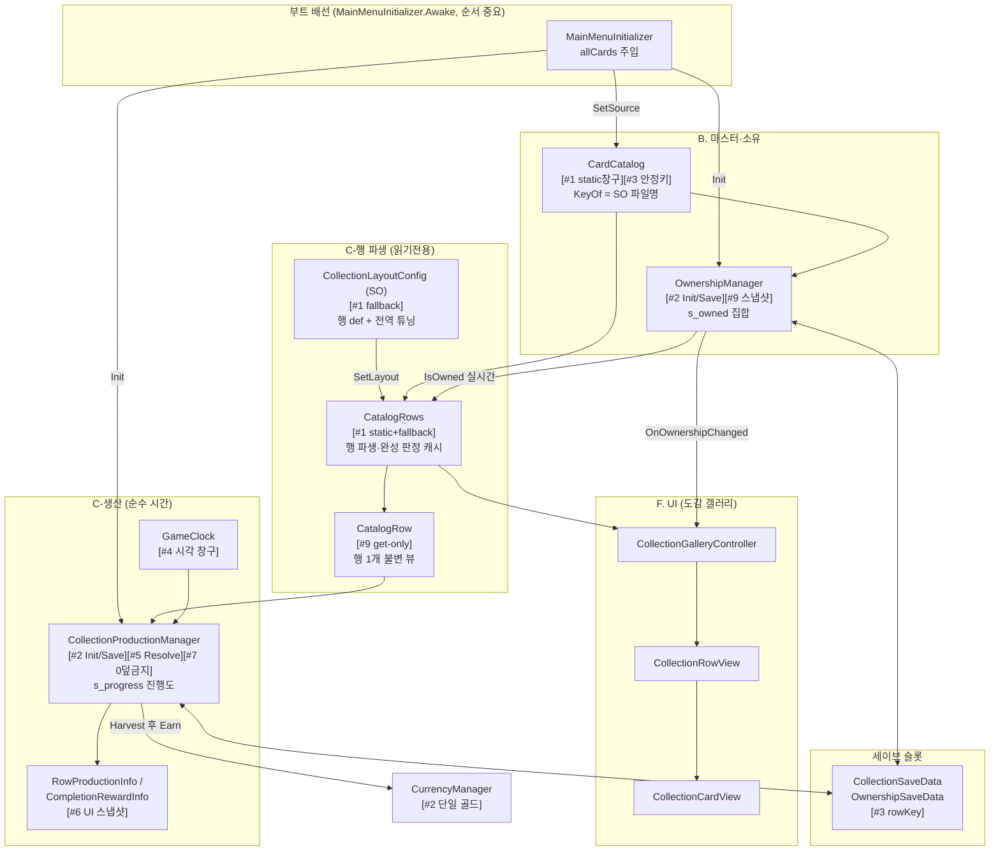
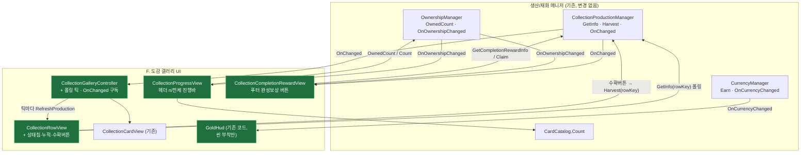
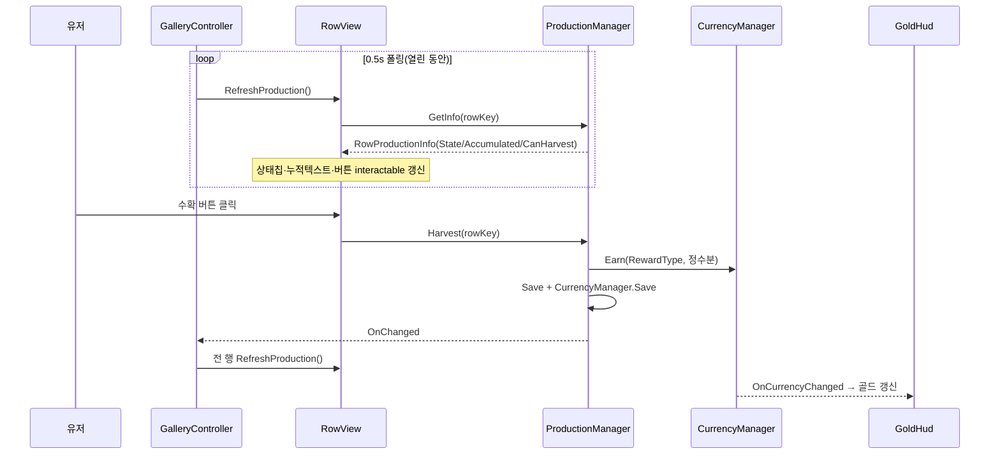
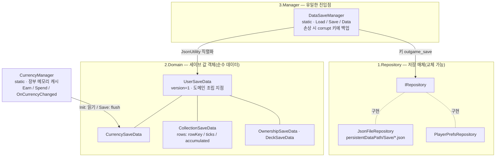
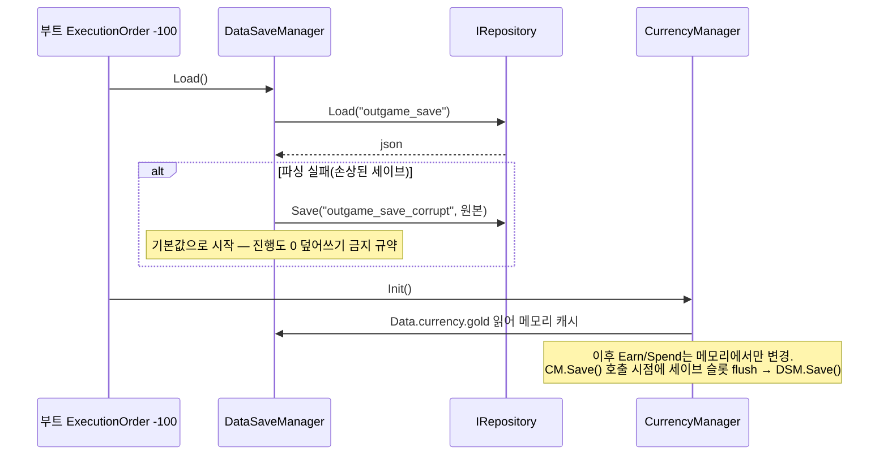

# 아웃게임 구조도 (STRUCTURE)

> 사용자의 설계 승인과 구조 파악의 기준 문서.
> 도메인 설계 확정 시, 구조 변경 시마다 갱신한다 (CLAUDE.md 아웃게임 운영 정책).
> 갱신 주체: outgame-engineer 또는 메인. 근거 없는 노드 금지 — 실제 파일이 있거나 승인된 설계여야 한다.

## 갱신 이력

| 날짜 | 변경 | 승인 |
|---|---|---|
| (초기) | 문서 생성. 도메인 수준 뼈대만 반영, 클래스 수준 구조도는 idioms-onboarding 역주행 및 다음 설계 세션에서 채운다 | - |
| 2026-07-23 | Collection(B/C) 클래스 수준 구조도 추가 (idioms-onboarding 역주행, 구현 완료분 기준) | - |
| 2026-07-24 | Save·재화(A) 섹션 추가 — **시각 브리핑 형식 기준 예시**(구조 지도+시퀀스+원리 카드+파일 지도). 이후 모든 브리핑·recap은 이 형식을 따른다 | - |
| 2026-07-24 | **F-17/F-18 생산 UI 배선 설계 추가 (⬜ 승인 대기)** — 도감 갤러리에 행 생산상태·수확·진행바·완성보상·골드 HUD를 매니저 API에 연결. 신규 노드는 `:::new` 표식 | ⬜ |
| 2026-07-24 | **F-17/F-18 생산 UI 배선 구현 완료 (Phase 2)** — RowView 상태칩·수확, Controller 폴링, ProgressView/CompletionRewardView 신규. 매니저·세이브·재화 계약 불변(순수 소비). 손 배선 인계 `COLLECTION_UI_WIRING.md` | ✅ |

## 도메인 수준 구조 (OUTGAME_ROADMAP 기준)

## 클래스 수준 구조 (도메인별)

<!-- 각 도메인 설계 승인 시 이 아래에 클래스도·데이터 흐름 mermaid를 추가한다.
     기존 승인분과 신규분을 구분 표시할 것. -->

### Collection 도메인 (B. 마스터·소유 + C. 도감 생산) — 구현 완료

각 노드 옆 `[관용구 #n]`은 `docs/IDIOMS.md` 항목 번호.

**핵심 흐름 2줄**
- 소유: 부트가 `CardCatalog.SetSource → OwnershipManager.Init` → 갤러리가 `CatalogRows.Rows`를 그리고 `IsOwned`로 잠금 표시 → `Grant/Revoke` 시 `OnOwnershipChanged`로 재바인딩.
- 생산: 완성 행을 조회하면 `Resolve`가 `GameClock.Since(lastSettle)`로 경과분 누적(cap 클램프) → `Harvest`가 정수분을 `CurrencyManager.Earn`, 소수 보존 후 즉시 영속.

---

### F-17/F-18 도감 생산 UI 배선 (F. UI) — ✅ 구현 완료 (손 배선 인계 대기)

> 목표: 이미 완비된 `CollectionProductionManager` API(GetInfo/Harvest/HarvestAll/ClaimCompletionReward/OnChanged)를
> 도감 갤러리 UI에 연결. 매니저·세이브·재화 계약은 **변경 없음**(소비만 추가). `:::new` = 이번 신규/확장.

**설계 요지**
- 생산 누적은 시간 함수라 `OnChanged`가 안 뜬다 → 컨트롤러가 **0.5s 폴링 틱**으로 열린 동안 각 행 `RefreshProduction()` 갱신. 수확/완성수령/소유변경은 `OnChanged`/`OnOwnershipChanged`로 즉시 갱신.
- 행 상태 4종 표시: 잠김(수확버튼 off) / 생산중(누적 표시) / 수확가능(버튼 on) / 상한(만땅). 상태는 `GetInfo`의 `State`+`CanHarvest` 조합.
- 매니저/세이브/재화 계약 **불변** — UI는 순수 소비자(경계 준수).

**흐름 시퀀스 — 생산 폴링 + 수확 (Phase 2 구현)**

> 근거: 코드 실물 확인(2026-07-24). `CollectionRowView.cs`(상태칩·수확), `CollectionGalleryController.cs`(Update 폴링+OnChanged), `CollectionProgressView.cs`/`CollectionCompletionRewardView.cs`(신규), 손 배선 `COLLECTION_UI_WIRING.md`.

> 근거: `OutGame/Save/**`, `OutGame/Currency/CurrencyManager.cs` 실물 확인(2026-07-24).

#### 구조 지도 — 이게 전체 어디에 붙어 있나

#### 흐름 시퀀스 — 부트 로드와 재화 캐싱

#### 원리 카드 — 왜 이렇게 생겼나

- **3층 분리(Repository/Domain/Manager)**: 저장 매체 교체가 한 줄(`SetRepository`), 스키마는 값 객체로 고립, 진입점은 하나. — `Save/3.Manager/DataSaveManager.cs`
- **재화 캐싱+flush**: Earn/Spend마다 파일 IO를 안 하려고 메모리 장부로 운영, `CurrencyManager.Save()` 시점에만 영속. **트레이드오프: Save() 누락 시 앱 종료로 장부 유실** → 지급/차감 직후 Save() 호출이 규약. — `Currency/CurrencyManager.cs`
- **CollectionRowProgress 필드 3개의 이유**: `rowKey`는 문자열(인덱스 금지 — 카드 추가돼도 진행도 안 밀림) / `lastSettleUtcTicks`는 long(JsonUtility가 DateTime 직렬화 불가) / `accumulated`는 double(수확 시 정수분만 지급, 소수 잔여 보존). — `Save/2.Domain/CollectionSaveData.cs`

**수정 가능성 높은 지점**: 새 재화 추가 = `ECurrencyType` + `CurrencySaveData` 필드 + `CurrencyManager.Init/Save` 매핑 3곳 동시 수정 / 새 세이브 항목 = `UserSaveData`에 값 객체 필드 추가만(리네임·삭제 금지).

#### 파일 지도 — 다이어그램에서 코드로

| 클래스 | 파일 |
|---|---|
| DataSaveManager | `OutGame/Save/3.Manager/DataSaveManager.cs` |
| IRepository · JsonFileRepository · PlayerPrefsRepository | `OutGame/Save/1.Repository/` |
| UserSaveData 외 값 객체 4종 | `OutGame/Save/2.Domain/` |
| CurrencyManager · ECurrencyType | `OutGame/Currency/` |
