# 아웃게임 구조도 (STRUCTURE)

> 사용자의 설계 승인과 구조 파악의 기준 문서.
> 도메인 설계 확정 시, 구조 변경 시마다 갱신한다 (CLAUDE.md 아웃게임 운영 정책).
> 갱신 주체: outgame-engineer 또는 메인. 근거 없는 노드 금지 — 실제 파일이 있거나 승인된 설계여야 한다.

## 갱신 이력

| 날짜 | 변경 | 승인 |
|---|---|---|
| 2026-07-31 | **튜토리얼 안내 UI 프리팹화 + 사각 구멍 → 타깃 승격 방식 전환 (✅ 코드+프리팹, Unity 컴파일·씬 배선·Play 검증 대기)** — 문제 둘: ① 색·스프라이트·여백이 전부 C# 상수(`HolePadding 12f`·`BannerWidth 900f`·`Color(0,0,0,0.72f)`)라 **리소스를 바꿀 수 없었다**(Layer Lab SimpleCasual에 튜토리얼 전용 에셋이 이미 있는데도 플레인 `Image` 검은 사각형만 사용) ② 타깃 바운딩 박스를 그대로 뚫는 **각진 구멍**이 버튼 모양과 무관하게 남고 유도가 약했다. **① 표시 방식 전환**: 딤 4패널(Top/Bottom/Left/Right) + 매 프레임 구멍 재계산을 폐기하고, **전면 딤 1장**(`raycastTarget=true`)이 전부 흡수 + 타깃 GameObject에 런타임 `Canvas(overrideSorting=true, 351)` + `GraphicRaycaster`를 얹어 딤(350) 위로 **승격**. 클릭 차단은 유지된다(사용자 지정). 앵커 4종 전부 조상 체인에 `Mask`/`RectMask2D`/`ScrollRect`/중첩 `Canvas`가 없음을 실측 확인해 성립 전제를 세웠다. **② sortingOrder 300 → 350/351**(500 아님): `UIPoolManager` 팝업 캔버스가 **400**이라 그 위로 올리면 플레이 스텝의 "유효한 덱이 없습니다"(`MatchFlowController.ShowNoDeckPopup`)·구매 실패 팝업(`PackShowcaseController.ShowFailPopup`)이 딤에 묻히는데, 그때 타깃은 `interactable=true` 그대로라 소프트락 탈출로도 발동하지 않아 **완전 잠김**이 된다. 프리팹의 `Canvas.sortingOrder`는 런타임 상수로 덮어써 저작 사고를 봉쇄. **③ 신규 프리팹** `Assets/Assets/Prefabs/UI/Tutorial/OutgameTutorialGate.prefab`(Blocker/FocusRing/Hand/Message+TMP) — 포커스 링은 `Tutorial_Focus00_Line_White`(92×92 **border 46** 9슬라이스 = 키트 내 유일하게 임의 크기로 늘어나는 링, `fillCenter=false`), 손가락은 `Tutorial_Focus_Icon_Hand`, 문구 프레임은 `ChatFrmae03_Demo_Frame_Light`. 브리지에 `[SerializeField] gatePrefab` 추가 + `Ensure(prefab)`(선례 `TutorialOverlayUI.Ensure`). **④ 해제 단일 창구 `Release()`** — 리스너 해제 + 승격 해제를 묶어 모든 진입점 최상단에서 1회. 갈라 두면 `ShowBanner`·두 번째 `ShowGate`가 이전 타깃 참조를 잃어 **버튼이 모든 UI 위에 영구 잔존**한다. 해제는 `GraphicRaycaster` → `Canvas` 순(`RequireComponent` 역순이면 조용히 실패). 타깃이 이미 `Canvas`를 갖고 있으면 파괴 대신 정렬값 백업·복원, 승격 시 루트에서 `additionalShaderChannels`·`sortingLayerID` 복사(미복사 시 승격 중에만 TMP·그라디언트 깨짐). **⑤ `SetDim(bool)` 명시 API** — `ShowBanner`는 딤 off가 **계약**이다(구 코드는 "4패널 0사이즈"라는 우연한 구현이 지키고 있었다). 전면 딤이 있으면 `PackTearHandle`의 `!IsPointerOverGameObject()` 판정이 화면 어디서나 막혀 **개봉 스와이프가 영영 시작되지 않고**, 그 모드는 `m_armed=false`라 탈출로도 없다. **⑥ 폴백 축소**: 링·손가락 스프라이트가 `Layer Lab/.../ResourcesData/`(= `Resources` 폴더 **아님**)라 코드 경로에서 얻을 수 없다 → 폴백은 딤+문구까지만, 프리팹 미배선 시 `LogWarning` 1회. 포인터 연출은 `localScale`만 트윈(`sizeDelta`/`anchoredPosition`은 `Layout`이 매 프레임 덮어씀), `DOPunchScale` 금지(Kill 시 스케일 미복구) → `DOScale(...).SetLoops(-1, Yoyo)`. **`Runner`·`Progress`·스텝 SO·`TutorialAnchor(Registry)`·`LobbyTabController`·시퀀스 에셋 전부 무수정** | ✅ |
| 2026-07-30 | **덱 세이브를 아웃게임 세이브로 흡수 (이중 진실원 제거) — ✅ 코드, Unity 컴파일·Play 검증 대기** — `decks.json` 독립 파일과 데드 필드 `UserSaveData.deck`이 공존하던 상태를 정리해 **덱 영속화 진실원을 `DataSaveManager.Data.deck` 하나로** 통합. **① `DeckSaveManager`에서 File IO 전면 제거** — 내부 직렬화 타입(`SlotData`/`SaveData`)·`SavePath`·`ReadFileOrEmpty` 삭제, 메모리 3배열(`s_slots`/`s_names`/`s_imageKeys`) + 레지스트리 재수화 구조는 유지(소비자 API가 `CardData` 리스트를 기대). 공개 API 개명 3건: `LoadFromFile`→**`LoadFromSave`**, `SaveSlotToFile`→**`SaveSlot`**, `SaveToFile`→**`SaveAll`**(파일 개념 소멸). 비파괴 계약(단일 슬롯만 반영)과 전량 flush 위험 경고는 새 문맥으로 보존. `Delete`는 전량 flush → `SaveSlot(index, 빈 목록)` 비파괴 경로로 교체. `ReadFileOrEmpty`가 하던 길이·null 정규화는 `NormalizedSlots()`가 승계해 읽기/쓰기 양쪽이 통과(세이브 인스턴스를 제자리 수정 → 같은 배열 공유). **② `DeckSlotSaveData.imageKey` 필드 1개 가산** — `UserSaveData.VERSION`은 **1 유지**(필드 추가만 = 하위호환, 구 세이브는 빈 값 → 표시가 첫 카드 아트로 폴백). 카드 키는 기존대로 `CardCatalog.KeyOf`(=`CardData.name`) 안정 문자열, 인덱스 저장 없음. **③ 레거시 `decks.json` 1회 이관** — `LoadFromSave` 첫머리에서 "세이브에 덱 0개 + 파일 존재"일 때만 구 포맷(`slotName`/`cards`/`imageKey`)을 옮기고 `DataSaveManager.Save()` 후 원본을 **`decks_migrated.json`으로 rename**(삭제 금지 — corrupt 백업 선례와 같은 결). **재실행 가드는 이관 결과 자체**(덱이 생기면 조건이 거짓) — 완료 플래그 필드를 추가하지 않았다. 파일 IO 예외는 경고 로그만 남기고 진행(부트 사망 금지, 기존 세이브 무보존 손상 없음). **④ 파일 이동** `Assets/Scripts/Battle/DeckSaveManager.cs` → **`Assets/Scripts/OutGame/Deck/DeckSaveManager.cs`**(.meta 동반 이동으로 guid 보존 — static 클래스라 씬 참조 0이지만 규약 준수). 이제 아웃게임 세이브 소비자이므로 `Battle/` 밖. 호출처 5곳 갱신(`BootInstaller`·`StarterDeck`·`DeckEditController`·`DeckBuilderUI`×2) | ✅ |
| 2026-07-30 | **디버그 전체 해금 런타임 입구 추가 (덱 연동 테스트용)** — 덱 편성은 소유 카드만 허용하므로(`DeckEditCollectionGrid.Build`의 `OwnershipManager.IsOwned` 필터) 인게임 덱 테스트에 전체 해금이 선행돼야 한다. 기존 `OwnershipDebugTool`은 **인스펙터 ContextMenu**뿐이라 플레이 중 손이 닿지 않았다 → 신규 서브트리 `OutGame/Debug/` 2파일. **① `OutgameDebugActions`(static)** = 디버그 조작 단일 창구(전체 해금/회수/현황 로그/튜토리얼 완료·리셋). `OwnershipDebugTool`은 이 창구로 **위임만** 하도록 축소(두 입구가 각자 구현하면 이중 진실원). **② `OutgameDebugOverlay`** = `[RuntimeInitializeOnLoadMethod(AfterSceneLoad)]`로 **자기 자신을 띄우는** IMGUI 패널(우상단 [DEBUG] 또는 **F8**) — 씬·프리팹 배선 0건이 설계 목적(테스트 씬 단독 Play 포함 어디서나 동일). 파일 전체를 `#if UNITY_EDITOR \|\| DEVELOPMENT_BUILD`로 감싸 릴리스 빌드엔 클래스 자체가 없다. 라벨은 **ASCII 고정**(IMGUI 기본 폰트에 한글 글리프 없음 — `BootLoadingScreen`의 Quicksand 사례와 같은 함정). 열려 있는 동안 `EventSystem.enabled=false`로 uGUI 입력을 잠근다(IMGUI는 EventSystem 레이캐스트를 막지 못해 패널 클릭이 밑의 뒤로가기·편성 칸까지 때린다). **③ `OwnershipManager.GrantAll(IEnumerable<string>)`/`RevokeAll()`** 추가 — 낱장 `Grant` 반복은 장수만큼 파일 쓰기 + `OnOwnershipChanged` 발화(= 도감 그리드 전량 재빌드)를 유발하므로 대량 경로는 **Save·이벤트 1회**로 접는다. **④ 튜토리얼 스킵 포함 이유**: 튜토리얼 진행 중엔 게이트 딤이 덱 탭을 막아 해금만으론 덱을 못 만든다. `Complete()`만으론 이미 떠 있는 게이트가 남으므로 브리지 `CloseGate`와 같은 `GateUI.Clear()`를 함께 호출. **⑤ `DeckEditController`**: `OnOwnershipChanged` 구독 추가 — 편집 중 해금이 즉시 그리드에 반영되게(재빌드는 컨트롤러가 건다 — "장착중 딤"에 필요한 편성 상태를 아는 쪽이 여기뿐이라는 기존 불변식 유지) | ✅ |
| 2026-07-29 | **부트 로딩을 `LoadingScene`으로 분리 — 2026-07-28 `LoadingCover` 항목의 설계를 대체** — 로딩 화면을 로비에 얹힌 커버가 아니라 **빌드 0번 독립 씬**으로 승격. 이전 설계의 "씬을 떠나면 커버가 파괴돼 켜진 채 전환된다(분기 0줄)" 트릭은 폐기 — 로딩 씬이 로드 완료를 보장한 뒤에만 다음 씬을 로드하므로 트릭이 필요 없다. (전제 정정: 그 커버는 `3c2781d7` 이후 `m_IsActive:0`으로 꺼져 있어 실제로는 동작하지 않고 있었다.) **① 전역 부트를 `Assets/Assets/Prefabs/Boot.prefab`으로 통합** — 루트 `[Boot]`에 신규 `Core/BootInstaller`(`[DefaultExecutionOrder(-200)]`, `static s_booted` 멱등 가드), 자식으로 `DataLibrary`/`SoundManager`/`UIPoolManager`/`SceneTransition`. `MainMenuInitializer` 삭제하고 그 static 사슬(CardCatalog→CatalogRows→Ownership→Production→DeckSave)을 흡수 + `OutgameTutorialRunner.EnsureData`까지 담당. 프리팹을 **LoadingScene·LobbyScene 양쪽에 배치** — 정상 경로는 로딩 씬이 선점하고 로비 사본은 루트째 자멸, 로비 단독 Play는 로비 사본이 부트를 맡는다(개발 편의 보존). 매니저 4종의 `DontDestroyOnLoad(gameObject)`는 자식이 됐으므로 `transform.root.gameObject` 기준으로 교정(DDOL은 루트에만 유효). 단일 GO 집약은 불가 — `SceneTransitionVideo.Awake`의 `SetActive(false)`가 로딩 중인 DataLibrary까지 끄고, 중복 감지 `Destroy(gameObject)`가 서로를 날린다. **② `LoadingCoverView` → `BootLoadingScreen`**(파일+meta 리네임으로 GUID 보존 → 프리팹 재배선 0건). 진행바 공식(`min(LoadProgress, elapsed/minDuration)` + `MoveTowards`)·타임아웃 탈출로는 유지, `IsCovering`·페이드아웃·`canvasGroup` 제거(알파를 내리면 빈 로딩 씬이 한 프레임 드러난다 — 불투명한 채 씬 교체가 정답). break 조건에 `DataLibrary.IsLoaded` 추가(`PercentComplete`가 등록 콜백보다 먼저 1이 될 수 있다). **③ 목적지 판정은 로딩 씬이** — 현재 스텝이 `AutoBattle`이면 `EnterCurrentStep()`으로 전투 직행, 그 외는 `LobbyScene`. `AutoPurchase`까지 여기서 실행하지 않는 이유는 구매 실패 시 씬 전환 없이 돌아와 탈출로 없는 로딩 씬에 갇히기 때문(로비 브리지가 맡는다). 따라서 `OutgameTutorialBridge`의 `IsCovering` 대기(`CoApplyStepAfterCover`) 삭제. **④ 경유 범위는 앱 최초 기동만** — 전투·개봉에서 로비 복귀는 직행(이전 설계가 겸하던 복귀 히칭 은폐는 포기). 빌드 세팅 `0 Loading / 1 Lobby / 2 Battle / 3 CardPack`, Fusion은 경로 기반 조회라 무수정 | ✅ |
| 2026-07-28 | **카드팩 개봉 3D → 2D uGUI 전환 (🔵 진행중 — 코드 주석·문서 완료, 씬 재구성은 사용자)** — `CardPack.unity`에서 팩만 3D(절차적 메시 + URP Lit)로 남아 있었는데, **머티리얼 3종에 텍스처가 하나도 없어**(전 슬롯 `fileID: 0`) 3D가 만들어내는 건 단색 실루엣 + 라이팅뿐이었다. 그 하나 때문에 씬이 Perspective 카메라·Directional Light·콜라이더·스카이박스 ambient를 끌고 다닌다 → 팩을 UI Image로 옮겨 렌더 계층을 하나로 합친다. **목표는 동작 동등성 유지** — 룩·타이밍·입력 규칙을 그대로 두고 구현 매체만 바꾼다(`PACK_FEEL_PLAN.md`의 게임필 개선은 이 결정으로 **폐기**). **코드 로직 변경 0** — 조사 결과 3D 의존이 이미 거의 없었다: `PackCardStack`·`PackResultGrid`·`PackCardView`는 순수 uGUI(0건), `PackTearHandle`은 `Input.mousePosition` 폴링이라 `OnMouse*`·콜라이더·`Camera` 참조가 애초에 없고, `PackRevealView`는 `Transform`/`GameObject` 인터페이스뿐이라 RectTransform에 그대로 동작한다. `CardPack.prefab:38`의 `BoxCollider`는 아무도 안 보는 **vestigial**(코드베이스 전수 grep에서 `Physics`/`Collider`/`OnMouse` 0건). 그래서 산출물은 **주석·Tooltip 정리 + 씬 배선 스펙 + 문서 개정**뿐이다. 목표 노드: `UICanvas > BG`(Image, `shakeTarget`) · `PackRoot`(빈 컨테이너) `> Pack`(Image + `PackTearHandle`) `> Seal`(Image) — **세 Image 전부 `raycastTarget` OFF**(안 그러면 `PackTearHandle.IsPointerOverUI()` 가드에 막혀 팩 위에서 시작한 드래그로 개봉이 안 된다). 환산 기준 **270.2 참조px/world**. 함정 2개를 문서화: ① `PackRevealView`가 매 `BeginOpen`마다 `packRoot.localScale`을 1로 스탬프하므로 **팩 크기를 `localScale`로 주면 안 된다**(`sizeDelta`로) ② `shakeTarget`에 팩을 걸면 셰이크 시작 직후 `SetActive(false)`라 no-op → **배경**에 건다(오늘 화면에서 실제로 흔들리던 것도 BG 하나였다). 단위 혼재(`tearDistance`=디바이스px ↔ `flickThreshold`=참조px)는 **알려진 편차로 기록만**(동등성 원칙과 충돌). 상세·씬 배선 체크리스트의 진실원 = [`docs/PACK_OPEN_DIRECTION.md`](../PACK_OPEN_DIRECTION.md) | ✅ |
| (초기) | 문서 생성. 도메인 수준 뼈대만 반영, 클래스 수준 구조도는 idioms-onboarding 역주행 및 다음 설계 세션에서 채운다 | - |
| 2026-07-28 | **카드 비주얼 통일 (✅ 코드+프리팹+검수+컴파일 완료, Play 검증 대기)** — 인게임 `CardView.prefab`은 월드스페이스 SpriteRenderer(루트 Transform·BoxCollider2D 입력), 로비는 ScreenSpaceOverlay uGUI라 **프리팹 복사가 불가** → 비주얼 레이어만 uGUI로 미러링. `CollectionCardView` → **`CardVisualView`**(`Scripts/UI/Common/`, **.meta 동반 이동으로 guid `6f92e16a…` 보존** → 씬·프리팹 배선 무손실), `Bind(CardData,bool)` 시그니처 불변. 신규 `CardKeywordIconView`/`CardSynergyBadgeView` + 프리팹 `UI/Common/CardKeywordIcon`·`CardSynergyBadge`. `Card.prefab`에 `Frame`/`HpPanel`/`KeywordIconRoot`/`SynergyBadgeRoot` 추가(**697줄 추가·삭제 0**, 기존 노드 보존) → 이 한 곳이 도감 그리드·도감 생산행·덱편집 타일·드래그 고스트 4곳의 공유 원본. **표시 규칙 단일 진실원 `Assets/Scripts/Card/CardVisualRules.cs`** 신설(키워드 순회 순서·시너지 dedupe·`활성 우선→requiredCount 내림차순` 정렬·`MaxSynergyBadges=3`)을 `CardView`/`CardVisualView`가 공유 — 이전엔 아웃게임이 정렬 **전** 상한을 적용해 배지 순서가 갈라질 수 있었다(현 에셋 6장은 이미 내림차순이라 화면 변화 0). 아트 소스 `fullImage`→**`battleImage`**(40장 전수 보유, 폴백 0). 범위 밖: `DeckEditSlot`(편성 6칸)·`PackCard`·`DeckCard` | ✅ |
| 2026-07-28 | **카드 비주얼 통일 2차 — 남은 3종 (✅ 코드+프리팹+컴파일 완료, Play 검증 대기)** — 1차에서 범위 밖이던 3종을 같은 진실원에 붙였다. **`DeckEditSlot`/`PackCard`**: `Background`에 `CardVisualView`를 부착하고 `Card.prefab`과 같은 노드 세트를 추가 → `DeckEditSlotView`/`PackCardView`는 `portrait`/`nameText` 직렬화 필드를 버리고 `cardVisual.Bind(card, true)` 한 줄로 위임(슬롯 상태·강조 축만 각자 담당). **`Frame`과 `EmptyMark`는 `Background` 밖(루트)에 둔다** — `Bind(null)`이 `Background`를 통째로 끄므로 안에 있으면 빈 칸에서 테두리·빈칸표시까지 사라진다. 같은 이유로 두 프리팹의 `CardVisualView.frame`은 **의도적 미배선**(프레임은 카드별 데이터가 아니라 슬롯 크롬). **`DeckCard`**는 카드가 아니라 "덱 한 칸"(번호·배너·덱이름)이라 HP/키워드/시너지를 얹지 않고 `Tile`에 `Frame`만 씌워 크롬만 맞춤 + `Tile` 흰색→어두운색, `Number` 검정→금색(대비 확보). 아트 폴백은 `CardVisualRules.PickCardArt`로 이관(`deckPreview` 우선은 목적 전용 필드라 호출부 `DeckListController`에 남김). 부수 보정: `PackCard`의 NEW 리본이 우상단 HP와 겹쳐 좌상단으로 이동, `DeckEditSlot` 루트 금색→어두운색(빈 칸/채운 칸 바탕 일치). **미해결(이번 변경 이전부터)**: `DeckCard.prefab`의 `NamePill`/`Banner` Image가 `enabled=false`이고, 프리팹 저작 495×700 vs 씬 셀 480×780 불일치로 세로 80px 여백이 생겨 덱 이름이 타일에서 떨어져 보인다 | ✅ |
| 2026-07-23 | Collection(B/C) 클래스 수준 구조도 추가 (idioms-onboarding 역주행, 구현 완료분 기준) | - |
| 2026-07-24 | Save·재화(A) 섹션 추가 — **시각 브리핑 형식 기준 예시**(구조 지도+시퀀스+원리 카드+파일 지도). 이후 모든 브리핑·recap은 이 형식을 따른다 | - |
| 2026-07-24 | **F-17/F-18 생산 UI 배선 설계 추가 (⬜ 승인 대기)** — 도감 갤러리에 행 생산상태·수확·진행바·완성보상·골드 HUD를 매니저 API에 연결. 신규 노드는 `:::new` 표식 | ⬜ |
| 2026-07-24 | **F-17/F-18 생산 UI 배선 구현 완료 (Phase 2)** — RowView 상태칩·수확, Controller 폴링, ProgressView/CompletionRewardView 신규. 매니저·세이브·재화 계약 불변(순수 소비). 손 배선 인계 `COLLECTION_UI_WIRING.md` | ✅ |
| 2026-07-24 | **씬/프리팹 실배선 완료 (`CollectionTest.unity`)** — RowView `stateLabel`/`harvestButton`/신규 `productionFill`(Fill을 Filled로 전환·진행바 구동)+Status 활성화, 씬 `CompletionRewardView`(BottomBar)·`GoldHud` 부착. `EnsureBoot`에 Load/CurrencyInit 보강. 에디터 검증: 5h경과 fill 0→0.208, 수확 gold 0→50, 에러 0 | ✅ |
| 2026-07-24 | **생산 진행바 = 단위 사이클 + 행별 전용 뷰로 정리** — 진행바 의미를 `누적/상한`→`다음 1단위까지 사이클 진행률`(`CycleProgress01`)로. `CollectionProgressView`를 소유 집계 바에서 **행별 생산 진행바**로 재작성(행 키 `Bind`), RowView는 원시 `productionFill` 제거 후 이 뷰에 위임. 프리팹 `Status/Progress`에 ProgressView 부착. 저장·수확 계약 불변 | ✅ |
| 2026-07-24 | **E. 카드팩 경제 클래스 구조 추가 (⬜ 설계 승인 대기)** — `CardPackData`/`CardShop`(SO)·`CardPackOpener`(static)·`OpenedPack`(값). E는 자체 세이브 없는 **A(재화)·B(소유) 오케스트레이터**. 구매=즉시개봉(팩 재고 없음)·**팩별 지정 풀 드로우**·**중복 시 소액 골드 환급**. 신규 노드 `:::new` | ⬜ |
| 2026-07-24 | **E. 카드팩 경제 구현 완료 (E-14/15/16)** — `OutGame/CardPack/`에 4파일 생성. 설계와 일치. API 확정: 배선 `SetShop(CardShop)`, 결과 `OpenedPack`(class)+`DrawnCard`(readonly struct)+`EPackOpenResult`(enum: Success/PackNotFound/InsufficientGold/EmptyPool/SpendFailed). 로컬 `System.Random`. 재화·소유 계약 순수 소비(불변). SO 에셋 생성·상점 배선은 사용자/메인 검증 | ✅ |
| 2026-07-24 | **tcg-reviewer 심화 재검 반영 (2건 수정)** — ① **무료팩 허용**: 공유 재화 API `CurrencyManager.Spend` 계약 변경(0 이하 거부→음수만 거부, 0은 잔액변경 없이 성공). price=0 팩 구매 가능해짐(사용자 지시). Spend 사용처는 CardPackOpener 1곳뿐 → 회귀 없음. ② **null 풀 방어**: 드로우 시 null 카드 항목 `continue` 스킵(환급 오지급 차단). #3 저장순서(유저 유리, 재화 유실 없음)는 프로토타입 무시·기록만. 컴파일 에러 0 | ✅ |
| 2026-07-28 | **첫 실행 로비 은폐 — `LoadingCover` 도입 (✅ 코드+씬배선+정적검증, Play 검증 대기)** — `AutoBattle` 직행으로 바꾼 뒤에도 **로비가 눈에 보이는** 문제. 원인은 한 프레임 깜빡임이 아니라 **동기 `SceneManager.LoadScene`이 호출 즉시가 아니라 다음 프레임 `EarlyUpdate.UpdatePreloading`에서 언로드·로드를 돌리기 때문** — 프레임 N이 present된 뒤 로드가 끝날 때까지 그 화면(로비)이 유지된다. 해결: 신규 `Assets/Scripts/UI/Common/LoadingCoverView.cs` + `LobbyScene` 루트 `LoadingCover`(Canvas **order 1000** = `UIPoolManager` 400·`GateUI` 300 위, Scaler 1080×1920 = `LobbyCanvas`와 동일 좌표계, `GraphicRaycaster`+`CanvasGroup`, **씬에 활성 상태로 저작**). 자식은 `Backdrop`(단색 불투명 — Layer Lab `Background`는 `preserveAspect=0` 데모 아트라 불투명·비율 보장을 아트와 분리) + `LoadingArt`(`LoadingBar_common.prefab` 인스턴스를 **Completely 언팩** — 서드파티 데모라 패키지 갱신이 씬 노드를 흔들거나 우리 수정이 오버라이드로 쌓이면 Revert 사고). **해제 방식이 설계의 핵심**: `Start` 코루틴이 `yield return null` 1프레임 뒤 페이드아웃하는데, 코루틴 재개(`ScriptRunBehaviourUpdate`)가 `UpdatePreloading`보다 **뒤**라 ① 씬을 떠나면 커버가 파괴돼 코루틴이 재개되지 않고 켜진 채 전환되고 ② 머무르면 정상 해제된다 — **분기 코드 0줄**. 러너/브리지에 "씬 전환 걸었음" static 플래그를 두는 대안은 폐기(모든 전환 호출부가 세팅해야 하는 계약이 생기고 누락 하나가 영구 검은 화면; 자동 해제는 어긋나도 최악이 "원래 증상 복귀"). 진행바·스피너는 **정지 장식**(동기 로드가 메인스레드를 막는 동안 트위닝하면 임의 값에서 얼어붙어 오히려 프리즈로 읽힌다 — 원본 프리팹에 Animator가 없는 것이 곧 정답), `Slider` 고정폭 2003.5는 1080 기준 좌우 여백으로 교정, `Text_Value`는 `MalgunGothic_TMP`로 교체(Quicksand SDF엔 한글 글리프 없음). 공개 API 없음(`Show`/`Hold`/`SetProgress`는 호출부가 없어 데드코드가 된다). **`OutgameTutorialRunner`·`OutgameTutorialBridge`·`MainMenuInitializer`·`GameManager` 전부 무수정** — 코드 변경은 신규 1파일. ⚠️ 커버가 항상 활성이라 **전투·개봉 씬에서 로비 복귀 시에도** 1프레임+페이드 동안 뜬다(로비 진입마다 도는 `MainMenuInitializer.Awake` 동기 초기화 히칭을 함께 가린다 — 의도) | ✅ |
| 2026-07-28 | **G-TUT 온보딩 진입 단축 — 첫 전투 직행 (✅ 코드+에셋+컴파일 검증)** — 사용자 결정: 첫 실행의 "자동 팩 구매 → 3D 개봉 → [획득] → 로비 [플레이]" 4단계 앞머리를 걷어내고 **부트 직후 곧장 첫 튜토리얼 전투**로 보낸다. `EStepKind`에 `AutoBattle = 5` 추가(SO int 직렬화 규칙대로 **끝에만** 추가) + 러너에 `EnterAutoBattle`(`TutorialConfig.Begin(scenario)` → `LoadScene("BattleScene")`, 상수 `BattleScene` 신설). `AutoPurchase`와 같은 **커밋 선행** 불변식 — 씬을 떠나면 롤백 지점이 없어 커밋을 미루면 전투 중 강제종료가 이 스텝을 무한 반복시킨다(구매와 달리 되돌릴 부작용이 없어 롤백 분기 자체가 없다). 첫 전투의 양 덱은 `TutorialConfig`가 고정 주입하므로(`GameInitializer.InitializeSinglePlayerFields`) **저장 덱이 0인 신규 유저도 그대로 진입**한다 → `LobbyMatchLauncher`의 유효덱 가드는 무수정(이 경로를 타지 않음). 첫 카드 소유는 전투 1 종료 후 기존 구매 사이클이 담당. 에셋은 14→**11스텝**(0=`AutoBattle`, 1~5·6~10 구매 사이클 2회). ⚠️ 진행 중이던 세이브는 인덱스가 3칸 밀리므로 `OwnershipDebugTool` 리셋 필요 | ✅ |
| 2026-07-27 | **PKG-BOOT 통합 부트 배선 (✅ 구현+검수 완료)** — `MainMenuInitializer`에 `[SerializeField] CardShop cardShop` + `CardPackOpener.SetShop(cardShop)` 1줄 추가. `Load`/`CurrencyInit`은 `GameManager.Boot()`가 이미 소유 → 중복 미추가(부트 2계층 확정). null→빈 상점 fallback으로 PKG-TUNE 에셋과 독립 진행. 계약 동결 표 "통합 부트 순서" 🧊 동결. tcg-reviewer 검수: 발견 0(경계·이중진실원·계약 무결). 에셋 배선·Play 통합검증은 사용자 재량 | ✅ |
| 2026-07-24 | **F-19 카드팩 개봉 루프 (✅ 구현+검수 완료)** — 스코프 최종 축소: 상점 목록·독립 씬·MainMenu 진입 전부 제외. **카드팩 클릭→개봉 연출+카드 순차 등장→획득** 루프만. `PackOpeningView`(연출 오케스트레이션·옵션 EnsureBoot)+`RevealCardView`(카드 등장 애니·신규/중복 뱃지) 2클래스. 단일 팩 버튼(고정 packId), 팝업 풀링 미사용(씬 상주 뷰), DOTween 연출. 순수 뷰(세이브 없음), E `CardPackOpener` 소비. **tcg-reviewer 검수: 계약·경계·이중처리 무결, 코루틴 안전성 2건(좀비 잠금·트윈 미정리) 수정**(try/finally+OnDisable StopAllCoroutines/DOKill, RevealCardView OnDestroy DOKill). 컴파일 0. 연출·배선은 Play 검증 대기 | ✅ |
| 2026-07-24 | **F-19 개봉 인터랙션 재구현 (스택→드래그 넘김→2×3 그리드)** — `PackOpeningView`를 순차 등장 코루틴에서 **상태머신(Idle/Stacking/Grid)** 으로 재작성. `RevealCardView`에 월드 드래그(`OnMouseDown/Drag/Up`+`ScreenToWorldPoint`)·`SetDraggable`/`SetSortingOrder`/`FadeIn/Out`/`MoveTo`·`SetSwipeCallback` 추가(스케일인 Reveal→데이터 바인딩만). 넘긴 카드는 파괴 안 하고 그리드 재사용. 재진입=상태가드, `OnDisable`에서 카드 트윈 `KillAllTweens`. 계약(CardPackOpener/OpenedPack/CurrencyManager/OwnershipManager) 불변·순수 뷰. 컴파일·드래그/연출은 메인/사용자 검증 대기 | ✅ |
| 2026-07-24 | **tcg-reviewer 검수 + nit 3건 수정** — critical/warn 0(이중처리·계약·경계·재클릭·좀비트윈 무결). 개선: ① Grid enum 데드상태→그리드 연출 완료까지 Grid 유지 후 Idle(`CoGridToIdle`) ② 드래그 중 `SetDraggable(false)` 시 홈으로 즉시 리셋(잔상 방지) ③ 복귀 중 재드래그 드리프트→홈 슬롯(`m_homeLocalPos`) 기준 고정. OnDisable 잔상 2건은 의도(다음 개봉 ClearSpawned 정리)로 유지. 컴파일 0 | ✅ |
| 2026-07-27 | **PKG-TUNE 튜닝 SO 부트 배선 (✅ 코드+검수 완료)** — 미배선이던 두 SO 부트 주입을 코드로 실현: `RewardService.SetConfig`→`DataLibrary.InitializeSingleton`(GameTiming 선례 복제, `[SerializeField] BattleReward`), `CatalogRows.SetLayout`→`MainMenuInitializer.Awake`(SetSource 직후, `[SerializeField] CollectionLayoutConfig`). 보상 공식은 현행 유지(승패 무관 `Max(cards×perCard, minGold)`, 필드 확장 없음 — 사용자 결정). `BattleReward` Tooltip 오타만 수정. CardShop은 PKG-BOOT 배선분 재사용. 미배선(null) 시 기존 fallback 보존(null-safe). tcg-reviewer: critical/warn 0(경계·이중진실원·계약·결정론 무결). 에셋 생성·인스펙터 할당·Play E2E는 사용자 인계 | ✅ |
| 2026-07-24 | **구매 흐름 디버그 E2E 검증 통과 (Unity_RunCommand, 인메모리 격리)** — 6케이스: 잔액부족(InsufficientGold·차감0)/성공신규(−50+환급, 소유부여)/중복환급(−50+10×중복)/무료팩(price0 Success=Spend수정검증)/팩없음(PackNotFound·차감0)/실SO진단. 차감·환급 산술 정확, 격리로 실 세이브 미오염 확인. **미결(사용자 조치): 실제 `NormalPack.Pool` 비어있음(poolCount=0→EmptyPool), packId='0'** — 에디터에서 Pool 카드 채우고 packId 의미있는 값 권장 | ✅ |
| 2026-07-27 | **G. 신규 유저 온보딩 도메인 구조 추가 (⬜ 설계 승인 대기)** — 첫실행(소유==0) 감지 → 스타터팩(price0·6장) 개봉(F-19 뷰 재사용) → 튜토리얼 전투(TutorialConfig) 직행. 신규: `BootScene`+`BootRouter`(index0 라우팅), `FirstTimeOnboardingController`. 계약변경 2건(GrantDefaults 미지급·부트 앞단 라우팅)은 🔴 선행. G도 자체 세이브 없음(OwnedCount 판정). 신규 노드 `:::new` | ⬜ |
| 2026-07-27 | **G-27 PKG-FIRSTBATTLE 온보딩 컨트롤러 (✅ 코드, 컴파일 검증 대기)** — 신규 `Assets/Scripts/UI/Onboarding/FirstTimeOnboardingController.cs`(MonoBehaviour, 온보딩 씬 상주): `[SerializeField] PackOpeningView packView` + `TutorialScenarioData scenario` + `battleSceneName="BattleScene"`. `OnEnable`에서 `packView.OnOpenComplete += 핸들러` 구독 / `OnDisable`에서 해제(누수·중복 구독 방지). 핸들러는 `TutorialConfig.Begin(scenario)` → `SceneManager.LoadScene("BattleScene")` — **`TutorialSetupUI.StartBattle` 호출 패턴 그대로 미러링**(중복 진실원 없음, 동일 API). 중복 전이 차단 `m_transitioned` 가드로 콜백 2회 와도 LoadScene 1회. 개봉 시작은 `PackOpeningView` 자체 팩버튼(순수 뷰)에 위임 — 컨트롤러는 완료만 수신(자동시작 없음, 온보딩 흐름 자연스러움 + 진실원 단일화). 아웃게임 상태(소유·재화) 무접촉 — Grant/차감/Save는 `TryPurchase`가 이미 원자 처리. `Network/` 무수정. **온보딩 씬(.unity) 신설·배선(packView/scenario 할당·Build Settings 등록·`BootRouter.onboardingScene` 지정)은 에디터(사용자) 인계**. Unity 컴파일·개봉→전투 E2E 검증 대기 | ✅(코드) |
| 2026-07-27 | **G-24 부트 라우터 (✅ 코드, 컴파일 검증 대기)** — 신규 `Assets/Scripts/Core/BootRouter.cs`(MonoBehaviour, BootScene 상주): `Start()`에서 첫실행 판정 → 라우팅. 판정은 `OwnedCount`(Init 필요)가 아니라 신규 `OwnershipManager.HasAnyOwnedSaved()`(세이브 슬롯 직접 조회, read-only)로 — BootScene엔 `MainMenuInitializer`가 없어 소유 캐시가 미초기화일 수 있으므로 **씬 config 주입 순서와 무관**하게 안정. 슬롯 매핑(`ownership.ownedCardKeys`)은 여전히 `OwnershipManager` 단일 창구 내부에만. 목적지는 `[SerializeField] lobbyScene="LobbyScene"` / `onboardingScene=""`(후속 PKG-FIRSTBATTLE 배선; **미설정 시 LobbyScene fallback + 경고** → 미존재 씬 크래시 방지). `GameManager`·`Battle/`·`Network/` 무수정. **BootScene(.unity) 신설·빌드 index0 교체는 에디터(사용자) 인계**. Unity 컴파일·부트 E2E 검증 대기 | ✅(코드) |
| 2026-07-27 | **G-23 소유 기본지급 제거 (✅ 구현, 컴파일 검증 대기)** — `OutGame/Collection/OwnershipManager.cs`: `Init()`의 `GrantDefaults()` 호출 제거 + 메서드 **삭제**(no-op 존치 아님; 전체지급 경로는 `OwnershipDebugTool`로 일원화·중복 제거). `OwnershipSaveData.defaultsGranted`는 하위호환 위해 **존치**(미사용 주석화). 공개 API 시그니처 불변, 기존 소유 세이브 보존(읽기만·자동 Save 없음). 회귀 점검: 도감 갤러리 전부 잠김·NRE 없음, 덱빌더는 소유필터 미구현이라 무관. **Unity 컴파일·신규/기존 유저 부트 E2E는 에디터(사용자) 검증 대기** | ✅(코드) |
| 2026-07-27 | **G 진입 = BootScene 제거 + 로비 첫실행 리다이렉트 (✅ 코드, 컴파일 대기)** — 사용자 결정: 별도 `BootScene`/`BootRouter` 폐기. 앱은 기존대로 `LobbyScene`(index0) 직행하고, 로비 상주 신규 `UI/Lobby/LobbyFirstRunRedirect`가 `Start`(MainMenuInitializer.Awake[-100] 주입 후)에서 `HasAnyOwnedSaved()==false`면 `TryPurchase(starterPackId)`→`PackHandoff.Set(opened, "BattleScene", true)`→`LoadScene("PackTest")`, 실패 시 로비 유지. 상점→팩 전환과 동일 경로를 첫실행이 자동으로 탄다. Build Settings에 BootScene 불필요(PackTest/BattleScene만 등록). 잔여 엣지(획득 전 종료 시 튜토리얼 스킵)는 현행 유지 | ✅(코드) |
| 2026-07-27 | **G 카드팩 오픈 3D 뜯기 재구성 (✅ 코드+검수, 씬/컴파일 대기)** — 사용자 결정: `PackOpeningView`(팩버튼 구매) 폐기, **구매를 뷰 밖으로**(상점/`BootRouter`가 `TryPurchase` 후 static 캐리어 `PackHandoff`(Pack·NextScene·StartTutorial)로 전달), 앞단을 **3D `CardPack.prefab` 가로 드래그 봉인뜯기**로 교체. 신규 4: `PackHandoff`(OutGame/CardPack), `PackTearOpenView`(뜯기→스택→그리드, 구 꼬리 이식), `PackTearHandle`(SealStrip 월드드래그), `PackAcquireController`(캐리어 소비·획득버튼·목적지 이동). `BootRouter` 첫시작 분기가 스타터 구매→캐리어→PackTest(실패 시 로비 fallback). 목적지·튜토리얼이 캐리어에 실려 **첫시작 재판정 불필요 → `FirstStartBattleRedirect`·`PackOpenSceneController` 폐기**. 삭제 3파일 GUID 전수검색 참조 0. `RevealCardView` 재사용. tcg-reviewer 검수 진행. **씬 배선(CardPack에 PackTearHandle·MainCamera 태그)·Unity 컴파일은 사용자** | ✅(코드) |
| 2026-07-27 | **G-25/26/27 온보딩 흐름 (✅ 코드+검수, 씬/컴파일 대기) — 흐름 재설계 반영** [※ 아래 항목은 위 3D 뜯기 재구성으로 대체됨] — 사용자 결정: 공용 팩 오픈 씬 `PackTest.unity` 재사용(상점 개봉 = 첫시작 온보딩 공유), 개봉 후 **[획득] 버튼** 클릭 게이트, **일반=로비 고정 / 첫시작=튜토리얼 전투** 분기. 구현: `PackOpeningView.OnOpenComplete`(빈개봉도 발화=데드락 방어), 신규 `UI/Shop/PackOpenSceneController`(획득버튼 게이트·[획득]→`DestinationScene`(기본 로비)·`BeforeLeave` 훅, **Battle 미참조 순수 UI**), 신규 `UI/Onboarding/FirstStartBattleRedirect`(`[RequireComponent]`, 첫시작만 `HasAnyOwnedSaved()`로 판정해 목적지→배틀+`TutorialConfig.Begin`, scenario null이면 로비 fallback). 첫시작 판정은 **개봉 전 Start**에 캡처. tcg-reviewer 2라운드: 경계·타이밍·중복전이 무결, 미배선 소프트락 warn 2건 수정(경고 로그·scenario null 로비 fallback). ~~FirstTimeOnboardingController~~ 폐기(2컴포넌트로 분리). 씬 배선·Unity 컴파일은 사용자 인계 | ✅(코드) |
| 2026-07-27 | **G-28 개봉 연출 단순화 (✅ 코드+검수+씬배선+컴파일 완료, Play 검증 대기)** — 사용자 결정: 드래그 뜯기·카드별 스와이프 스택 전면 폐기. **3D 팩 클릭 1회 → 팩 숨김 → UI 패널(CanvasGroup) fade in → fade 완료 후 3열 GridLayoutGroup 배치 → [획득] → 덱 슬롯0 저장 → 목적지 씬**. 삭제 4: `PackTearOpenView`·`PackTearHandle`·`RevealCardView`·`RevealCardView.prefab`(GUID 잔존 참조 0). 신규 2: `PackRevealView`(Idle→PackShown→Revealing→Done), `PackClickHandle`(OnMouseUpAsButton·Arm/Disarm). 카드 표시는 도감 타일 `CollectionCardView` 재사용(표시 진실원 1개), 3열 좌표 계산은 GridLayoutGroup에 이임. **공유 계약 추가: `DeckSaveManager.SaveSlotToFile(index, deck)`** — 기존 `SaveToFile`은 6슬롯을 통째로 flush해서 `LoadFromFile` 미경유 씬(개봉 씬)에서 다른 덱을 지우므로, 단일 슬롯만 반영하는 비파괴 API로 교체. tcg-reviewer critical 2건(파괴적 전슬롯 flush) → 수정, warn(`m_left` 소프트록·DOTween OnComplete 생존·scenario 미배선) → 수정. 씬 배선 완료(UICanvas/RevealPanel/CardGrid/AcquireButton/EventSystem 신설, CardStackPos·SealStrip 제거, Missing 0·미배선 0). 레이아웃 수치 검증: 420×560 셀 3열×2행, 획득 버튼 비겹침. Play E2E는 사용자 | ✅ |
| 2026-07-27 | **아웃게임 첫시작 튜토리얼 P1~P4 (✅ 코드+검수+컴파일 에러 0, 씬 배선·SO 저작 대기)** — 신규 서브트리 `OutGame/Tutorial/` 6파일: 진행도 단일 창구 `OutgameTutorialProgress`(static), 스텝 해석·실행 `OutgameTutorialRunner`(static), 저작 데이터 `OutgameTutorialData`(SO, `EStepKind{AutoPurchase,WaitClick,BattleEntry}`+`List<Step>`), 타깃 앵커 3종(`EOutgameTutorialAnchor`·`TutorialAnchorRegistry`·`TutorialAnchor`). 신규 `UI/Tutorial/` 2파일: 4패널 딤 강제 게이트 `OutgameTutorialGateUI`(코드 빌드 캔버스 sortingOrder 300), 씬 수명 ↔ static 러너 연결 `OutgameTutorialBridge`(씬당 1개 — LobbyScene·CardPack). **세이브 확장**: `2.Domain/TutorialSaveData.cs` 신규(`outgameStepIndex`/`outgameCompleted`/`migrationChecked`) + `UserSaveData`에 `tutorial` 슬롯 1개 — **`VERSION`은 1 유지**(필드 추가만 = 하위호환, 구 세이브는 노드 없이 기본값). `GameManager.Boot()`에 `OutgameTutorialProgress.Init()` 1줄(Load 직후·CurrencyInit 앞). **`UI/Lobby/LobbyFirstRunRedirect.cs` 삭제** — 첫실행 스타터팩 자동 구매→캐리어→CardPack 전환이 스텝 0 `AutoPurchase`로 흡수됨(존치 시 "소유 0" 판정과 "stepIndex 0" 판정이 같은 사건에 반응해 **이중 구매**). 첫실행 판정 창구가 `OwnershipManager.HasAnyOwnedSaved()` 대리에서 `OutgameTutorialProgress`로 단일화되고, `HasAnyOwnedSaved()`는 **레거시 세이브 마이그레이션 1회 판정 전용**으로 축소(주석만 정정). `LobbyTabController.Tab`에 `tutorialAnchor` 필드 1개 + `Awake` 등록(탭 버튼이 Layer Lab 프리팹 내부 stripped Button이라 컴포넌트 직접 부착 회피). `OwnershipDebugTool`에 진행도 리셋 2종. P5·P6(Pack 탭 앵커 배선·11스텝 저작)은 **아웃게임 레이아웃 확정까지 의도적 보류** — 코드가 레이아웃을 모르게 설계돼(게이트=임의 RectTransform, 타깃=enum 앵커) 보류분은 씬 배선+SO 저작만으로 완료된다 | ✅ |
| 2026-07-27 | **H. 랭크(표시용 티어 진행도) 도메인 설계 승인 (⬜ 구현 대기 — SAVE 게이트만 코드 적용)** — `outgame-design-session` 결과. 스코프를 **표시용**(보상·난이도·매칭 무영향)으로 좁혀 서버 권위 전제를 제거. 신규 4파일(`RankSaveData`·`RankConfig`·`RankManager`·`RankHud`) + 기존 3파일 소규모 수정(`UserSaveData` 1줄·`DataLibrary` 2줄·`TurnRunner.CaptureResult` 2줄). 핵심: **티어 = `points` 순수 파생**(도달티어 별도 저장 금지) · **강등 없음 = 가감 시 하한 클램프** · **캐시 없이 슬롯 직접 읽기 → `GameManager.Boot()` 무수정**. 의도적 제거 3건(`OnRankChanged`·진행률 필드·반환값). 신규 노드 `:::new` | ✅ 설계 |
| 2026-07-27 | **F-20 도감 전체완성 1회성 보상 폐기 → 푸터 일괄수령으로 교체 (✅ 코드+배선, 컴파일·배선 검증 완료)** — 사용자 결정: 완성보상 기능 전면 제거. 삭제: `CollectionProductionManager`의 `s_completionRewardClaimed`·`IsCompletionRewardClaimed`·`CompletionRewardType/Amount`·`CanClaimCompletionReward`·`GetCompletionRewardInfo`·`ClaimCompletionReward`·`CompletionRewardInfo` struct, `CatalogRows.IsAllComplete`/`CompletionRewardType/Amount`, `CollectionLayoutConfig.completionRewardType/Amount`(+`.asset` 키 2줄), `CollectionSaveData.completionRewardClaimed`(**VERSION 1 유지** — 구 세이브의 남은 키는 JsonUtility가 무시, 진행도 무영향). 추가: **`GetTotalHarvestable() → long`**(전 행 수확가능 정수 합계) — 신규 private `HarvestableOf(CatalogRow)`를 `HarvestCore`와 공유해 **표시값 == 실제 지급 총량**(이중 진실원 없음). 뷰 컴포넌트는 **삭제**(`CollectionCompletionRewardView.cs` 제거) — 사용자 판단으로 푸터 로직을 `CollectionGalleryController`가 흡수했다(`harvestAllButton` 필드 1개 + 기존 폴링 틱·`OnChanged`에 편승, 별도 폴링 타이머·구독 중복 제거). 버튼 라벨은 프리팹 저작값 `일괄 수령` 고정(수량 표기 없음), `GetTotalHarvestable() >= 1`일 때만 `interactable`. 배선 3곳(`CollectionScreen.prefab`·`Canvas.prefab`·`CollectionTest.unity`)은 에디터 API로 이관(구 뷰 컴포넌트 제거 + 컨트롤러에 버튼 연결). 검증: 컴파일 성공, 3곳 모두 버튼 바인딩·라벨 정상·Missing Script 0 | ✅ |
| 2026-07-27 | **CardShop(SO) 폐기 — 구매처가 팩 SO·환급액 직접 소유 (✅ 코드+컴파일 완료, 씬 재배선 대기)** — 사용자 결정: 상점 목록·환급 전역값을 쥐던 `CardShop` SO(+`CardShop.cs`·`CardShop.asset`) 및 `MainMenuInitializer.SetShop` 주입 제거. `CardPackOpener`는 **무상태 파사드**가 되고(`s_shop`/`Shop`/`SetShop`/`Packs`/`GetPack` 삭제), API를 `TryPurchase(string packId)`→**`TryPurchase(CardPackData pack, long refundGold)`**로 교체 — 대상 팩 SO와 중복 환급액을 호출부가 직접 넘긴다. 구매처 2곳이 인스펙터로 소유: `PackShowcaseController`(`packData`+`duplicateRefundGold`), `LobbyFirstRunRedirect`(`starterPackId` string→`starterPack` SO+`duplicateRefundGold`). 재화·소유 계약 순수 소비(불변), 로컬 랜덤·null 풀 방어·환급 로직 무변경. Unity 컴파일 에러 0. **씬 재배선(LobbyScene의 FirstRunRedirect `starterPack`·쇼케이스 버튼 `packData` 할당)은 사용자 — 구 string 필드가 SO 참조로 바뀌어 재할당 필요** | ✅(코드) |
| 2026-07-29 | **Tab_Pack 단일 진열 → 좌우 넘김 캐러셀 (✅ 코드+SO+씬배선 완료, Play 검증 대기)** — 참조 구도(중앙 큰 팩 + 좌우 화살표)로 전환. 신규 2파일 `UI/Shop/PackCarouselView.cs`(트랙 슬라이드·스냅·화살표·아이들 포커스) · `UI/Shop/PackCarouselDotsView.cs`(Layer Lab `PageNavi` 기반 점 인디케이터). `CardPackData`에 **`packArt`(Sprite) 1필드 가산** — VERSION 개념 없는 SO라 기존 5개 에셋은 없는 키를 null로 역직렬화(마이그레이션 불요). `PackShowcaseController`는 `packData`(단일) → **`packs`(List) + `carousel`**로 교체하고 `ResolvePack`을 `ResolveDisplay`(목록 해석) + `ResolvePack`(중앙 페이지 = 결제 대상)으로 분리 — `OnAnyPurchased`·`PackHandoff`·`s_transitioning`·`CanAfford` 잠금 **전부 무변경**. 캐러셀은 도메인 무지(그림 N장과 인덱스만 안다) — 돈을 쥔 컨트롤러가 포인터 물리를 소유하지 않게 한 분리(`PackCardStack`/`PackRevealView`와 같은 축). **ScrollRect 미사용** — `IDragHandler`로 `Track.x` 하나만 굴리고 `pageStep = 뷰포트 폭` + `RectMask2D`라 정지 상태에서 이웃 페이지가 완전히 잘린다(코버플로우 아님). 제스처 판정은 `PackCardStack` 이식(캔버스 스케일 보정 · 거리 임계 `snapRatio 0.22` ∥ 속도 플릭 `700` · `Ease.OutCubic`/`OutBack`). 씬: `PreviewStrip`(Thumb×4 목업)·`Pointer`·`Pack_Center` 삭제 → `Carousel > Viewport(PackCarouselView) > Track > PackPage_Template > Art` + `ArrowPrev/Next` + `Dots > DotRoot > Dot_Template > Focus`. **`PackIdleMotion` 코드 무수정 — 오배선만 교정**(`visual`이 자기 자신을 가리켜 매 Update 좌표를 홈으로 대입 = 드래그 원천 차단이었다 → 자식 `Art`로, `floatDistance` 0→16). 진열용 SO 3종 저작(`NormalPack_TEST`/`RarePack_TEST`/`SuperPack_TEST` — price 10/50/200, drawCount 6/6/10로 일부러 갈라 "보이는 팩과 결제된 팩"이 결과로 드러나게) + `NormalPack_TEST`의 `packId` 중복 해소. 에디터 검증: 컴파일 에러 0, Build(3) → 페이지 x=0/1000/2000, 점 3개 focus 이동, 화살표 양끝 비활성, 인덱스 클램프, 중앙 1장만 아이들 활성. Play 중 `TryGetForcedPack=True`(튜토리얼 WaitPurchase) 상태에서 1페이지 고정 + 화살표·점 자동 숨김 확인. 발견·수정: `Destroy`가 프레임 끝 실행이라 같은 프레임 재빌드 시 옛 페이지가 x=0에 겹치던 유령 → 파괴 전 `SetActive(false)`, `SameAsBuilt`에 캐러셀 실물 `PageCount` 대조 추가 | ✅(코드·배선) |
| 2026-07-27 | **H-33 랭크 티어 달성 보상 편입 — ✅ 코드 완료·검수 통과(씬 배선 대기)** — 표시용 진행도였던 랭크에 **보상 엔드포인트**를 붙였다. 신규 4파일(`OutGame/Rank/RankRewardManager.cs` + `UI/Rank/` 3개), 수정 3파일(`RankSaveData.claimedCount` · `RankTier.rewardGold` · `DataLibrary` 1줄). **`RankManager` 무수정**(동결 계약 무접촉) · **`UserSaveData` VERSION 1 유지**(필드 추가만). 핵심: 수령 상태 = **단조 증가 커서**(강등이 없어 수령 집합이 항상 프리픽스 → 정수 1개로 접힘, 기본값 0 = 미수령이라 센티널 불요) · 보상량은 **티어와 같은 원소**(`RankTier.rewardGold`)라 인덱스 드리프트 구조적 차단 · 상태 판정에서 **`Claimed` 최우선**(`RankManager.ResetForDebug` 후 재수령 차단) · 영속은 **`CurrencyManager.Save()` 하나**(중간 상태 디스크 기록 방지). 패널은 사용자 결정으로 **씬 직접 저작**(`PooledUIBase` 아님). tcg-reviewer 계약 위반 0. 상세는 아래 H-33 절 | ✅ |

## 도메인 수준 구조 (OUTGAME_ROADMAP 기준)

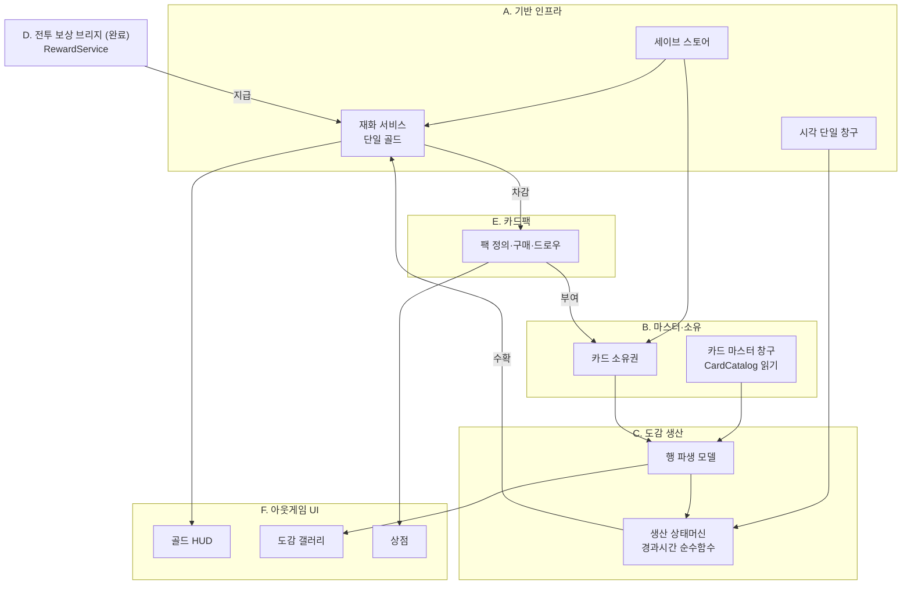

## 클래스 수준 구조 (도메인별)

<!-- 각 도메인 설계 승인 시 이 아래에 클래스도·데이터 흐름 mermaid를 추가한다.
     기존 승인분과 신규분을 구분 표시할 것. -->

### Collection 도메인 (B. 마스터·소유 + C. 도감 생산) — 구현 완료

각 노드 옆 `[관용구 #n]`은 `docs/IDIOMS.md` 항목 번호.


> **부트 2계층(PKG-BOOT 확정)**: 씬무관 전역(`DataSaveManager.Load`·`CurrencyManager.Init`)은 `GameManager.Boot()`(BeforeSceneLoad)가, 씬 카드목록 의존(`SetSource`·`OwnershipManager.Init`·`ProductionManager.Init`)은 `MainMenuInitializer.Awake()`(ExecutionOrder -100)가 담당. `CardPackOpener`는 무상태 파사드가 돼 부트 주입이 없다 — 대상 팩 SO·환급액은 구매처(버튼/첫실행)가 직접 소유해 `TryPurchase`에 넘긴다. `EnsureBoot`(테스트 씬)는 `CardCatalog.IsReady` 가드로 통합 시 no-op.

**핵심 흐름 2줄**
- 소유: 부트가 `CardCatalog.SetSource → OwnershipManager.Init` → 갤러리가 `CatalogRows.Rows`를 그리고 `IsOwned`로 잠금 표시 → `Grant/Revoke` 시 `OnOwnershipChanged`로 재바인딩.
- 생산: 완성 행을 조회하면 `Resolve`가 `GameClock.Since(lastSettle)`로 경과분 누적(cap 클램프) → `Harvest`가 정수분을 `CurrencyManager.Earn`, 소수 보존 후 즉시 영속.

---

### F-17/F-18 도감 생산 UI 배선 (F. UI) — ✅ 씬/프리팹 배선 완료 (CollectionTest.unity)

> 목표: 이미 완비된 `CollectionProductionManager` API(GetInfo/Harvest/HarvestAll/GetTotalHarvestable/OnChanged)를
> 도감 갤러리 UI에 연결. 매니저·세이브·재화 계약은 **변경 없음**(소비만 추가). `:::new` = 이번 신규/확장.

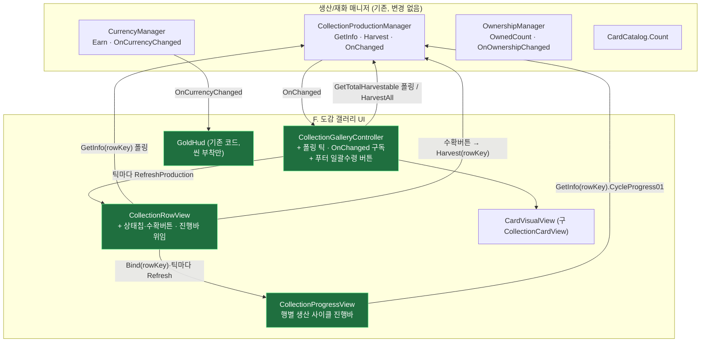

**설계 요지**
- 생산 누적은 시간 함수라 `OnChanged`가 안 뜬다 → 컨트롤러가 **0.5s 폴링 틱**으로 열린 동안 각 행 `RefreshProduction()` 갱신. 푸터 일괄수령 뷰는 소유자(컨트롤러)가 없어 **자체 0.5s 폴링**. 수확/소유변경은 `OnChanged`/`OnOwnershipChanged`로 즉시 갱신.
- 행 상태 4종 표시: 잠김(수확버튼 off) / 생산중(누적 표시) / 수확가능(버튼 on) / 상한(만땅). 상태는 `GetInfo`의 `State`+`CanHarvest` 조합.
- 매니저/세이브/재화 계약 **불변** — UI는 순수 소비자(경계 준수).

**흐름 시퀀스 — 생산 폴링 + 수확 (Phase 2 구현)**

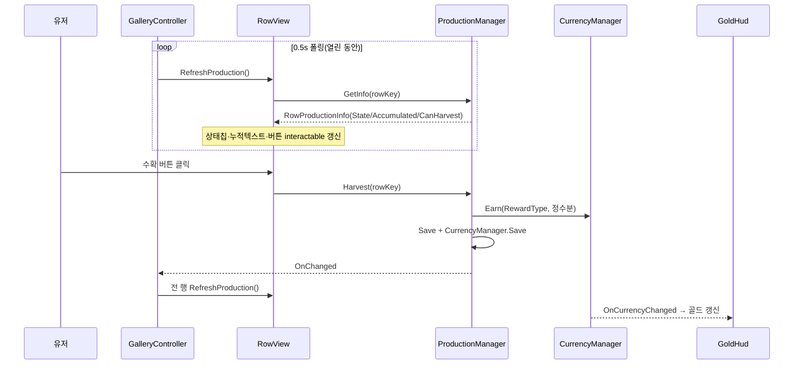

> 근거: 코드 실물 확인(2026-07-27). `CollectionRowView.cs`(상태칩·진행바·수확), `CollectionGalleryController.cs`(Update 폴링+OnChanged+푸터 일괄수령), `CollectionProgressView.cs`.

**실제 배선 결과 (2026-07-24, `Assets/Scenes/CollectionTest.unity` + `CollectionRow.prefab`)**

| 컴포넌트 | 부착 위치 | 연결된 필드 → 대상 |
|---|---|---|
| `CollectionGalleryController` | 씬/프리팹 `CollectionScreen` | `content`→`Gallery/Viewport/Content`, `rowPrefab`→CollectionRow.prefab, `fallbackAllCards`→카드 9장, `harvestAllButton`→`BottomBar`의 일괄수령 Button |
| `CollectionRowView` | `CollectionRow.prefab`(루트) | `cardsContainer`→`Cards`, `cardPrefab`→Card.prefab, `stateLabel`→`Status/StateChip/T`, `harvestButton`→`Status/Action`, `progressView`→`Status/Progress`(ProgressView) (`amountText`는 미배선=옵션) |
| `CollectionProgressView` | `CollectionRow.prefab`의 `Status/Progress` | `fillImage`→`Status/Progress/BarBg/Fill` (`progressText`는 미배선=옵션). **행별 생산 사이클 진행바** |
| `CardVisualView` (구 `CollectionCardView`, `Scripts/UI/Common/`) | `Card.prefab` | `portrait`/`nameText`/`lockOverlay` (기존) + `frame`/`hpPanel`/`hpText`/`bonusHpText`/`keywordIconRoot`/`synergyBadgeRoot`/`keywordIconPrefab`/`synergyBadgePrefab`/`keywordIconConfig` (카드 비주얼 통일) |
| `GoldHud` | 씬 `TopBar/GoldHud` | `goldText`→`GoldHud/Gold` |

**생산 진행바 = 행별 사이클 진행바 (`CollectionProgressView`)**
- **소유 집계 바가 아니다.** 완성된 각 행이 개별 생산하는 재화의 **"다음 1단위까지의 사이클 진행률"** 을 행마다 표시한다. `CollectionProgressView`가 행 키(`Bind(rowKey)`)로 `GetInfo(rowKey)`를 조회해 `Status/Progress/BarBg/Fill`(Filled 가로)을 구동: 생산중=`CycleProgress01`(소수부) / 만땅=1 / 잠김=0. RowView는 진행바를 이 뷰에 **위임**(`Bind`+매 폴링 틱 `Refresh`)하며 원시 Image를 직접 만지지 않는다(단일 책임).
- `RowProductionInfo.CycleProgress01`(파생 프로퍼티 = `AccumulatedRaw - Accumulated`, 소수부): 한 사이클(재화 1단위)이 차면 바가 0으로 리셋되고 누적 정수가 +1(실시간 채움→완료→누적↑). 사이클 길이 = productionCycleSeconds(기본 15초/단위). **저장 스키마·수확 로직 불변**(표시/파생만). `Status` 컨테이너는 프리팹 기본 비활성이라 **활성화**함.
- `CollectionGalleryController.EnsureBoot()`(독립 씬 전용, `CardCatalog.IsReady`면 no-op): `DataSaveManager.Load()` + `CurrencyManager.Init()` 추가 → 테스트 씬에서도 저장된 골드·진행도 로드. 실제 통합 부트에선 IsReady 가드로 미실행.

**수확 코인 연출 (2026-07-31)** — 수확은 `CurrencyManager.Earn` → `OnCurrencyChanged`로 골드 텍스트가 즉시 점프할 뿐 획득 체감이 없었다. 로비 진입 연출과 같은 손맛을 붙이되, 조립 순서(롤업 되감기 → 코인 버스트 → `OnKill` 고정 해제)가 이미 두 곳에 복붙돼 있어 **공용 재생기로 수렴**시켰다.

| 산출 | 경로 | 상태 |
|---|---|---|
| 골드 획득 연출 단일 재생기 (`TryGet`/`Play`/`BuildGoldGain`) | 신규 `UI/Common/GoldGainEffectPlayer.cs` — `GoldHud`·코인 스프라이트를 런타임 자동 탐색, 없으면 `GainEffectLayer`(없으면 캔버스 루트)에 **자가 설치**해 프리팹 편집 0. 출발==수치면 제자리 모드, 다르면 원거리 모드(흩어짐 좁게·수렴 길게) | ✅ 신규 (2026-07-31) |
| 골드 단계 이관 | `UI/Lobby/LobbyGainEffectDirector.cs` — `TryStageGold`가 `BuildGoldGain(null, gold)` 위임 3줄로 축소. 골드 직렬화·`EnsureCoinBurst`·`FindIconSpriteNear` 제거. 캐리어 소비·타이밍·카드 단계는 무수정 | ✅ 이관 (2026-07-31) |
| 원거리 튜닝 주입구 | `UI/Common/CoinBurstEffect.cs` — `Configure`에 `_scatterRadius`/`_gatherDuration` 선택 파라미터 추가(직렬화 고정이면 한 인스턴스로 두 모드를 못 오간다). 기존 호출부 무수정 | ✅ 확장 (2026-07-31) |
| 수확 훅 | `UI/Collection/CollectionRowView.OnHarvestClicked`(출발=`harvestButton`, `RewardType == Gold` 게이트) · `CollectionGalleryController.OnHarvestAllClicked`(출발=`harvestAllButton`, 반환 총합을 골드로 취급) — 둘 다 `Harvest`/`HarvestAll`의 **반환 지급량**을 그대로 연출에 넘긴다 | ✅ 신규 (2026-07-31) |

- **재진입 = coalesce**: `Play`가 이전 시퀀스를 `Kill`한 뒤 새로 만든다. **`Kill` → `BeginGainRollUp` 순서가 정확성의 전부** — 뒤집으면 옛 `OnKill`의 `ReleaseDisplay`가 새 고정을 풀어 숫자가 뒤로 점프한다(`GoldHud.m_held`가 단일 bool). 끝값은 항상 `CurrencyManager.Gold` 직독이라 드리프트 불가.
- **`CoinBurstEffect` 인스턴스는 하나만** — 코인 잔해 정리를 다음 `BuildBurst`의 `ClearCoins()`에 맡기는 구조라 인스턴스가 갈리면 옛 코인이 허공에 굳는다.
- 재생기를 도감 계층에 두지 않은 이유: 화면은 탭 전환에 꺼지고 행 뷰는 `OnEnable`마다 재생성돼 `CoinBurstEffect.OnDisable`이 비행 중 코인을 걷어간다(`RankRewardClaimPopup`이 이미 경고하는 함정).

> **푸터 일괄수령**: 전용 뷰를 두지 않고 `CollectionGalleryController`가 겸한다 — 필요한 게 폴링 틱과 `OnChanged` 구독뿐인데 둘 다 컨트롤러에 이미 있어, 별도 컴포넌트는 같은 배선의 중복이었다. 버튼은 항상 노출하고 `GetTotalHarvestable() >= 1`일 때만 `interactable`(오브젝트 토글 없음 → 자기비활성 버그 소지 자체가 사라졌다). 라벨은 프리팹 저작값 고정(수량 표기 없음). 클릭 시 `HarvestAll()` 1회로 여러 행·여러 재화를 지급하고 영속·통지는 1회로 묶인다.

**배선 검증(에디터 인메모리 세이브, 실 저장 미오염)**: fallback 3행 전량 소유→완성, 행0 빌드→시간점프. RowView→ProgressView 위임으로 바 구동: +3분 `사이클 0.5·바 0.5` → 롤오버 시 `누적 +1·바 0` → +24h `Capped·바 1`. 수확 `earned·gold` 반영, 콘솔 에러 0.


> 근거: `OutGame/Save/**`, `OutGame/Currency/CurrencyManager.cs` 실물 확인(2026-07-24).

#### 구조 지도 — 이게 전체 어디에 붙어 있나

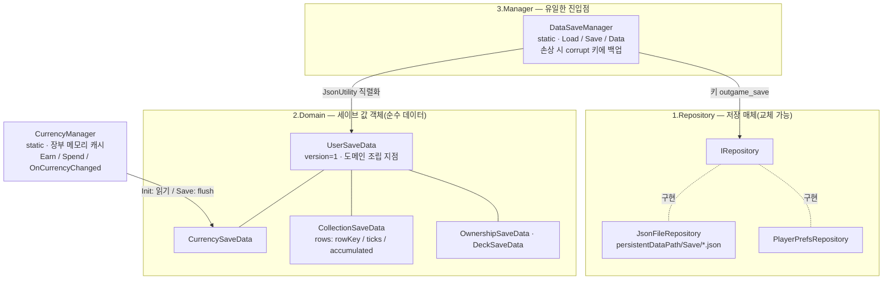

#### 흐름 시퀀스 — 부트 로드와 재화 캐싱

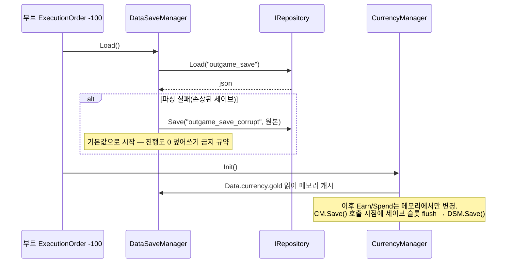

#### 원리 카드 — 왜 이렇게 생겼나

- **3층 분리(Repository/Domain/Manager)**: 저장 매체 교체가 한 줄(`SetRepository`), 스키마는 값 객체로 고립, 진입점은 하나. — `Save/3.Manager/DataSaveManager.cs`
- **재화 캐싱+flush**: Earn/Spend마다 파일 IO를 안 하려고 메모리 장부로 운영, `CurrencyManager.Save()` 시점에만 영속. **트레이드오프: Save() 누락 시 앱 종료로 장부 유실** → 지급/차감 직후 Save() 호출이 규약. — `Currency/CurrencyManager.cs`
- **CollectionRowProgress 필드 3개의 이유**: `rowKey`는 문자열(인덱스 금지 — 카드 추가돼도 진행도 안 밀림) / `lastSettleUtcTicks`는 long(JsonUtility가 DateTime 직렬화 불가) / `accumulated`는 double(수확 시 정수분만 지급, 소수 잔여 보존). — `Save/2.Domain/CollectionSaveData.cs`

**수정 가능성 높은 지점**: 새 재화 추가 = `ECurrencyType` + `CurrencySaveData` 필드 + `CurrencyManager.Init/Save` 매핑 3곳 동시 수정 / 새 세이브 항목 = `UserSaveData`에 값 객체 필드 추가만(리네임·삭제 금지).

#### 파일 지도 — 다이어그램에서 코드로

| 클래스 | 파일 |
|---|---|
| DataSaveManager | `OutGame/Save/3.Manager/DataSaveManager.cs` |
| IRepository · JsonFileRepository · PlayerPrefsRepository | `OutGame/Save/1.Repository/` |
| UserSaveData 외 값 객체 4종 | `OutGame/Save/2.Domain/` |
| CurrencyManager · ECurrencyType | `OutGame/Currency/` |

---

### E. 카드팩 경제 도메인 — ✅ 구현 완료 (2026-07-24, `OutGame/CardPack/`)

> 목표 루프 3단계: `골드 → 카드팩 구매 → 신규 카드셋 획득 → 덱 강화`.
> 핵심 성질: **E는 자체 영속 상태가 없다.** 골드 차감은 `CurrencyManager`가, 카드 소유는 `OwnershipManager`가 이미 영속하므로
> E는 둘을 잇는 **오케스트레이터**일 뿐. **구매=즉시 개봉**(미개봉 팩 재고 없음), 팩 정의는 SO(에디터 데이터), 결과는 소유권에 위임. `:::new` = 이번 신규.

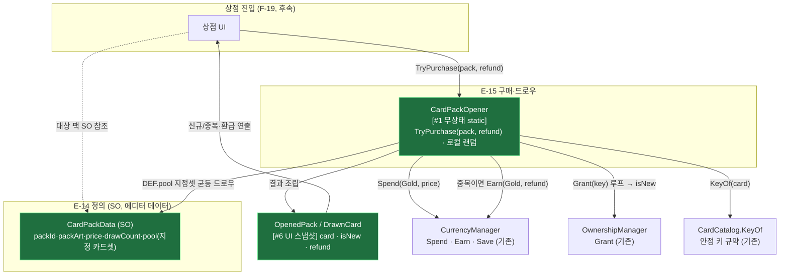

**흐름 시퀀스 — 팩 구매·개봉 (지정 풀 + 중복 환급)**

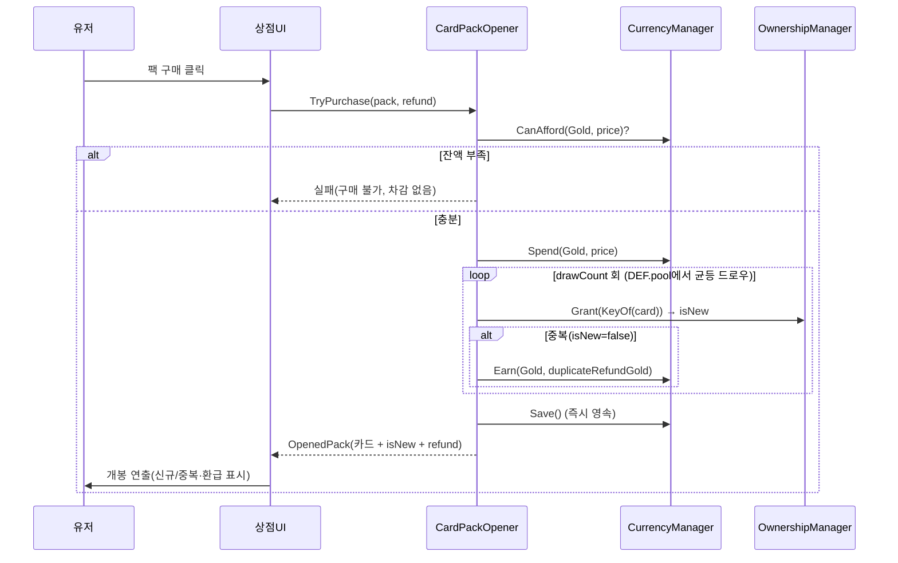

**설계 요지 (원리 카드)**
- **오케스트레이터라 세이브 섹션 없음**: E는 `Spend`·`Earn`(재화)·`Grant`(소유)만 호출하고 모두 이미 영속. E 자체 세이브를 만들면 이중 진실원. 트레이드오프: 구매 이력·pity 카운터가 필요해지면 그때 세이브 섹션 추가.
- **isNew는 Grant 시점에만 안다**: `Grant`는 신규면 true, 이미 소유면 false 반환. 개봉 후엔 전 카드가 `IsOwned=true`라 UI가 사후 판정 불가 → **`OpenedPack`는 생략 불가**(신규 여부·환급의 유일 진실원).
- **팩별 지정 풀**: 드로우 대상은 `CardData` 전체가 아니라 `CardPackData.pool`(에디터 큐레이션). 이는 마스터 목록 복제가 아닌 **부분집합 참조**라 4번째 목록 드리프트 아님. 키는 여전히 `CardCatalog.KeyOf`(단일 규약)로 산출.
- **중복 = 소액 골드 환급**: 장별 `Grant` 반환이 false면 `CurrencyManager.Earn(Gold, refundGold)`. 환급액은 `TryPurchase`의 인자로 구매처(버튼/첫실행)가 직접 넘긴다(상점 SO 전역값 폐기). Spend/Earn을 한 트랜잭션으로 처리 후 `Save()` 1회.
- **로컬 랜덤(비결정론 무방)**: 아웃게임 최초 랜덤. `Battle/MatchRandom` 재사용 금지(경계), 서비스 내부 `System.Random` 인스턴스.
- **상점 SO(CardShop) 폐기**: 진열 팩 목록·환급 전역값을 쥐던 `CardShop` SO와 `SetShop` 주입을 제거. `CardPackOpener`는 무상태 파사드가 되고, 대상 팩 SO·환급액은 각 구매처 뷰가 인스펙터로 소유해 `TryPurchase(pack, refund)`에 직접 넘긴다(진열=뷰 책임).
- **수정 가능성 높은 지점**: 팩 가격·드로우 수·구성 = `CardPackData` SO(코드 미수정) / 환급액 = 구매처 뷰의 `duplicateRefundGold` 필드 / 등급 가중치가 필요해지면 `DEF.pool`을 가중 목록으로 확장.

| 클래스 | 파일 | 태스크 |
|---|---|---|
| `CardPackData` (SO) | `OutGame/CardPack/CardPackData.cs` — `packId·displayName·packArt(Sprite)·price·drawCount·pool(List<CardData>)` | E-14 |
| `CardPackOpener` (static, 무상태) | `OutGame/CardPack/CardPackOpener.cs` — `TryPurchase(CardPackData, long refund)` | E-15 |
| `OpenedPack` · `DrawnCard` (값) | `OutGame/CardPack/OpenedPack.cs` — `card · isNew · refund` | E-16 |

---


> ~~상점 목록(ShopController/ShopPackTileView)·독립 씬·MainMenu 통합 진입~~ — **이번 스코프 전부 제외, 후속.**

---

### G. 신규 유저 온보딩 도메인 — ⬜ 설계 승인 대기 (2026-07-27)

> 목표 루프의 **진입부**. 신규 유저가 로비를 보기 전에 스타터 카드 6장을 얻고 첫 전투(튜토리얼)를 경험한다.
> **G는 자체 영속 상태가 없다** — 카드 획득·영속은 E(`CardPackOpener`→`Grant`), 첫 전투는 Battle(`TutorialConfig`)이 이미 소유. G는 **첫실행 진입 + 개봉 씬 오케스트레이션**만 신설한다(별도 BootScene 없음). `:::new` = 이번 신규.
>
> **⚠️ 2026-07-27 갱신 — 첫실행 진입부는 아래 `G-TUT` 절로 대체됐다.** `LobbyFirstRunRedirect`는 **삭제**됐고 그 역할(스타터팩 자동 구매→캐리어→CardPack 전환)은 튜토리얼 스텝 0(`AutoPurchase`)이 수행한다. 첫실행 판정도 `HasAnyOwnedSaved()==false` 대리에서 **영속 진행도(`OutgameTutorialProgress`)** 로 단일화됐다(`HasAnyOwnedSaved()`는 레거시 마이그레이션 1회 판정 전용으로 축소). 아래 구조 지도·시퀀스의 `LobbyFirstRunRedirect` 경로는 **이력 보존용**이며, 캐리어(`PackHandoff`)→`CardPack` 씬 이후 구간만 현재 실물과 같다.

#### 구조 지도 — 구매(뷰 밖) → 캐리어 → PackTest 3D 뜯기 [^pack2d]

[^pack2d]: 제목의 "3D 뜯기"·"PackTest"는 **이력 보존용 표기**다. 개봉 씬은 `CardPack.unity`로 개명됐고(G-28), 팩은 2026-07-28 **2D uGUI로 전환**돼 3D는 남아 있지 않다. 현행 개봉 화면의 진실원 = [`docs/PACK_OPEN_DIRECTION.md`](../PACK_OPEN_DIRECTION.md) + 코드.

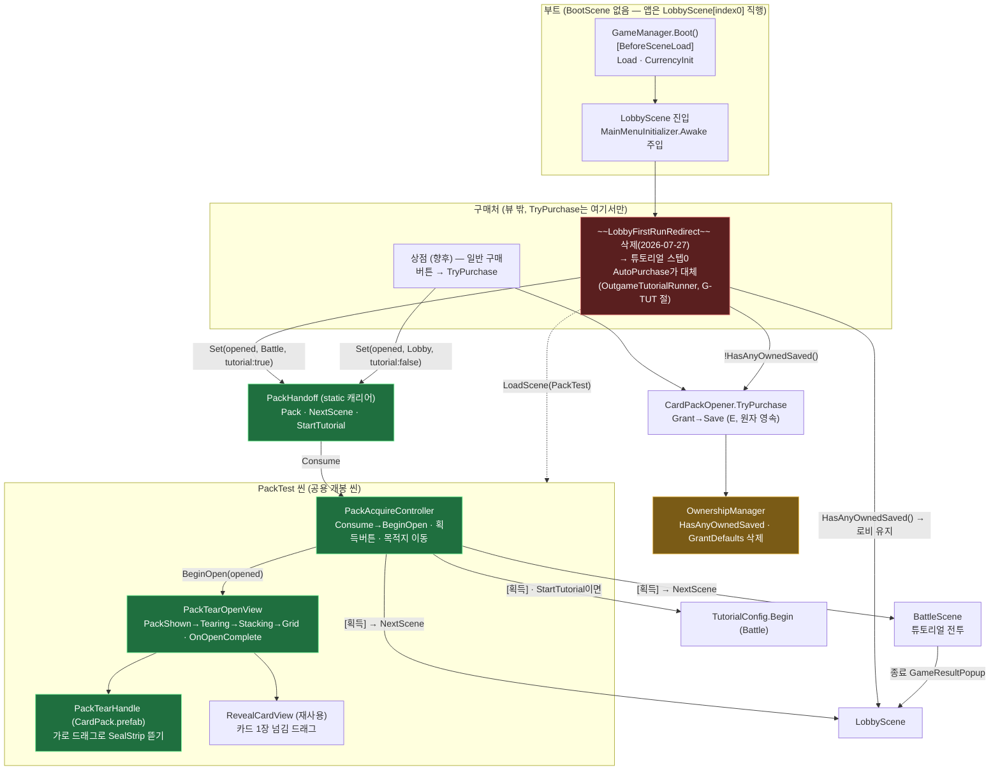

#### 흐름 시퀀스 — 첫 부팅 (로비 진입 → 즉시 리다이렉트 → 3D 뜯기 → [획득] → 튜토리얼 전투) [^pack2d]

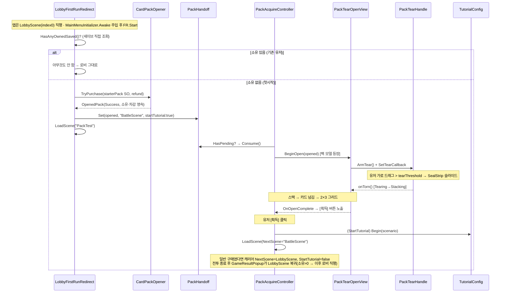

#### 원리 카드 — 왜 이렇게 생겼나

- **구매를 뷰 밖으로, 목적지를 구매한 쪽으로**: `TryPurchase`(소유·차감 원자 영속)와 "획득 후 어디로/튜토리얼 여부"를 상점·`LobbyFirstRunRedirect`가 쥐고 `PackHandoff`에 실어 넘긴다. PackTest는 **첫시작 재판정 없이 캐리어 값으로만 분기** → 별도 리다이렉트 레이어(구 FirstStartBattleRedirect)가 소멸(브레인 1개 = `PackAcquireController`).
- **BootScene 없음(사용자 결정)**: 앱은 기존대로 `LobbyScene`(index 0)으로 직행하고, 로비 상주 컴포넌트가 첫실행만 갈라 즉시 개봉 씬으로 전환한다 — 상점→팩 전환과 동일 경로를 첫실행이 자동으로 탄다. `TryPurchase`는 무상태라 부트 주입 불요 — 대상 팩 SO를 호출부가 직접 소유. **(2026-07-27 갱신)** 그 로비 상주 컴포넌트는 `LobbyFirstRunRedirect`에서 `OutgameTutorialBridge`(스텝 0 `AutoPurchase`)로 대체됐고, 판정 순서도 `MainMenuInitializer.Awake`[-100] 이후 브리지 `Start`가 아니라 **`GameManager.Boot()`가 로드한 진행도**를 읽는 방식이 됐다 → 소유 캐시 준비 여부와 무관.
- **검증된 꼬리 재사용, 리스크는 앞단에 국한**: 스택→넘김→그리드·`OnOpenComplete`는 구 `PackOpeningView`의 상태머신 가드·`OnDisable` 트윈 정리까지 무변경 이식. 새로 만든 건 앞단(3D 팩 등장 + 가로 드래그 뜯기 `PackTearHandle`)뿐.
- ~~**입력은 월드 방식 통일**: 팩(3D BoxCollider)·카드(2D BoxCollider2D)가 같은 `Camera.main` + `OnMouse*` 패턴. 트레이드오프: 씬 카메라 `MainCamera` 태그가 인터랙션 전체를 좌우~~ → **2026-07-28 정정: 이 서술은 그 시점의 `PackTearOpenView`/구 `PackTearHandle` 기준이며 현재 코드에는 해당 사항이 없다.** 지금의 `PackTearHandle`은 `Update()`에서 `Input.mousePosition`을 폴링하고 콜라이더·`Camera`를 참조하지 않는다 → **`MainCamera` 태그 의존 없음.** 실제 함정은 `EventSystem.IsPointerOverGameObject()` 가드로, **팩·배경 Image의 `raycastTarget`이 켜져 있으면 개봉이 막힌다**(갱신 이력 2026-07-28 · [`PACK_OPEN_DIRECTION.md`](../PACK_OPEN_DIRECTION.md) §1).
- **[획득] 버튼 게이트**: 개봉(그리드 배열) 완료 = `PackTearOpenView.OnOpenComplete` → 컨트롤러가 획득 버튼 노출. 유저가 능동적으로 [획득]을 눌러야 전이.
- **소유==0 신호의 함의**: `GrantDefaults` 전체지급을 **끈 것이 전제**(G-23). 판정은 세이브 직접 조회 `HasAnyOwnedSaved()`(G-24)로 씬 config 순서 무관. **(2026-07-27 갱신)** 첫실행 판정 자체는 진행도(`OutgameTutorialProgress`)로 옮겨졌고 `HasAnyOwnedSaved()`는 레거시 마이그레이션 1회 판정에만 쓰인다 — "소유 0"을 첫실행의 **대리 신호로 쓰던 구조가 소멸**(구매 직후 종료 시 온보딩 영구 스킵 구멍의 원인).

**수정 가능성 높은 지점**: 뜯기 판정·연출 `PackTearHandle.cs`(`tearThreshold`/슬라이드) / 첫시작 라우팅 값 → **`OutgameTutorial.asset` 스텝 0**(`pack`/`duplicateRefundGold`/`nextScene`, 코드 미수정) / 캐리어 계약 `PackHandoff.cs`(NextScene·StartTutorial) / 튜토리얼 시나리오 → **스텝 SO의 `BattleEntry.scenario`**(`PackAcquireController.scenario`는 캐리어 `StartTutorial`이 항상 false라 미사용) / 튜토리얼 보상 여부 `TurnRunner.CaptureResult`(선택 가드).

#### 파일 지도 — 다이어그램에서 코드로

| 클래스/에셋 | 파일 | 태스크 |
|---|---|---|
| ~~`LobbyFirstRunRedirect`~~ (로비 상주·첫시작 구매→캐리어→PackTest) | **폐기**(2026-07-27, 파일 삭제) — 스텝 0 `AutoPurchase`(`OutgameTutorialRunner`)가 흡수. 존치 시 "소유 0"·"stepIndex 0" 이중 판정으로 이중 구매 | G-24 → G-TUT |
| ~~BootScene / BootRouter~~ | **폐기** — BootScene 없이 LobbyScene(index0) 직행 + 로비 리다이렉트 | — |
| `PackHandoff` (static 캐리어) | 신규 `Assets/Scripts/OutGame/CardPack/PackHandoff.cs` | G-27 ✅ |
| `CardPackRewardHandoff` (static 캐리어 — 개봉 결과를 로비 연출까지) | 신규 `Assets/Scripts/OutGame/CardPack/CardPackRewardHandoff.cs` — 환급골드 누적 + 획득카드 append, 1회 소비. 지급·소유는 `CardPackOpener.TryPurchase`가 이미 영속했고 이 캐리어는 **표시량만** 나른다. 훅은 `UI/Shop/PackAcquireController.OnAcquirePressed`(`SaveOpenedDeck()` 직후 1줄 + `m_refundGold` 캐시) | 로비 획득 연출 ✅ (2026-07-30) |
| ~~`PackTearOpenView`~~ → `PackRevealView` | `Assets/Scripts/UI/Shop/PackRevealView.cs` | G-28 ✅ (아래 절) |
| ~~`PackClickHandle`~~ → `PackTearHandle` | `Assets/Scripts/UI/Shop/PackTearHandle.cs` — **(2026-07-27) G-29에서 뜯기 제스처 복귀**, `PackClickHandle.cs` 삭제 | G-28 → G-29 ✅ |
| `PackCardStack` / `PackCardView` (더미 스와이프 · 개봉 카드 표시) | 신규 `Assets/Scripts/UI/Shop/PackCardStack.cs` · `PackCardView.cs` | G-29 ✅ |
| `PackAcquireController` (캐리어 소비·획득버튼·목적지 이동) | 신규 `Assets/Scripts/UI/Shop/PackAcquireController.cs` — **(2026-07-30) 덱 저장(`SaveOpenedDeck`)·`DeckConfig.Set` 제거.** 팩을 열 때마다 덱 슬롯이 자동 생성돼 6칸을 잠식하던 동작을 걷어냈다. 첫 덱은 부트의 `StarterDeck`이 보장하고, 편성은 덱 화면의 몫. 전투 덱 폴백은 `LobbyMatchLauncher.TryApplyFirstValidDeck`이 담당 | G-27 ✅ / G-28 덱저장 → **폐기** |
| ~~`RevealCardView`~~ | ~~**폐기**(G-28) — 결과 표시는 `CollectionCardView` 재사용~~ → **(2026-07-27) 개봉 전용 `PackCardView`로 재분리**(G-29). 도감 타일은 잠금 표현이 필요하고 개봉 카드는 신규/중복 강조가 필요해 요구가 갈렸다 | G-28 → G-29 |
| `DeckSaveManager.SaveSlotToFile` (공유 계약 **추가**) → **(2026-07-30) `SaveSlot`으로 개명** | `Assets/Scripts/OutGame/Deck/DeckSaveManager.cs`(구 `Battle/`) — 단일 슬롯만 비파괴 저장(전슬롯 flush 금지). 저장 대상은 `decks.json`이 아니라 `DataSaveManager.Data.deck`. **(2026-07-31) 단서**: 여러 칸이 함께 움직이는 순서 변경(삽입·삭제·압축)은 `SaveSlot`으로 반영할 수 없다 — 반드시 `SaveAll` | G-28 ✅ |
| `OwnershipManager` (GrantDefaults 삭제 + HasAnyOwnedSaved) | `Assets/Scripts/OutGame/Collection/OwnershipManager.cs` | G-23/24 ✅ |
| ~~3D 팩 모델 = `Assets/Assets/Prefabs/CardPack.prefab` (BoxCollider)~~ | **폐기**(2026-07-28 2D 전환) — 팩은 씬 UI 노드(`UICanvas > PackRoot > Pack`(Image + `PackTearHandle`) `> Seal`)로 대체. 프리팹·메시 2종·머티리얼 3종은 색 A/B 대조용으로 Play 검증 전까지만 보존(참조는 `CardPack.unity` 하나뿐, guid 전수 검증 완료). `BoxCollider`는 원래부터 참조 0인 vestigial이었다 | G-28 → G-29 → **폐기** |
| 개봉 전용 카드 = `Assets/Assets/Prefabs/UI/PackUI/PackCard.prefab` | 860×1204 · `Glow`/`NewBadge`/`RefundBadge` | G-29 ✅ |
| 공용 팩 오픈 씬 = `Assets/Scenes/CardPack.unity` | `PackOpenDirector`(`PackRevealView`+`PackAcquireController`+브리지) · `UICanvas`(Overlay) > **`BG`**(Image, `shakeTarget`) · **`PackRoot`**(빈 컨테이너) > **`Pack`**(Image + `PackTearHandle`) > **`Seal`**(Image) · `RevealPanel`(CanvasGroup) > `SkipButton`·`AcquireButton`·`SummaryGroup`·`ResultGrid` · `StackInput`(+`PackCardStack`) > `CardLayer` > `StackAnchor` · `RemainingText` · `TearHint`. **(2026-07-28 2D 전환)** `CardPack` 프리팹 인스턴스·`Directional Light`·BG SpriteRenderer 제거, `Main Camera`는 AudioListener 숙주 겸 백버퍼 클리어용으로만 유지(ClearFlags=Solid Color, Culling Mask=Nothing) — **`MainCamera` 태그 의존 없음**. `DiscardArea`는 실재한 적 없다(문서 오기, 2026-07-28 정정) | G-28 → G-29 → **2D 전환 🔵** |
| `StarterPack.asset` (CardPackData) | 신규 에셋 (사용자) — price0·drawCount6·pool=기본6장 | G-25 |
| `StarterDeck` (신규 유저 기본 덱 지급) | 신규 `Assets/Scripts/OutGame/Deck/StarterDeck.cs` — `GrantIfNoDeck(CardPackData)`. 유효 덱 0개일 때만 pool 앞 6장을 **드로우 없이 고정 순서로** 목록 맨 앞에 삽입(`TryInsertFront`, 좌표 지식 없음) + `OwnershipManager.GrantAll`로 소유권 동시 지급. 정본 SO는 `BootInstaller.starterDeck` 배선으로 고정(packId 조회 안 함 — 중복 에셋 존재) | 스타터덱 ✅ (2026-07-30) |
| ~~`DeckSaveManager.FindFirstEmptySlot`~~ | **폐기**(2026-07-31 큐 전환) — 압축 불변식하에서 `DeckCount`와 같은 값을 반환하면서 "첫 구멍"이라는 다른 개념을 주장했다. `DeckCount`로 흡수 | 스타터덱 → **폐기** |
| **덱 목록 = 큐 (압축 불변식, 공유 계약 **추가**)** | `Assets/Scripts/OutGame/Deck/DeckSaveManager.cs` — **유효 덱은 항상 `[0 .. DeckCount-1]`을 연속 점유하고 `[DeckCount .. SLOT_COUNT-1]`은 전부 빈 칸. 인덱스가 작을수록 최근 덱.** 신규는 맨 앞 삽입, 삭제는 뒤를 앞으로 당김. 세이브 포맷 무변경(`order`/`createdAt` 필드 없음 — 배열 물리 위치가 곧 순서). 구멍 뚫린 구 세이브는 `LoadFromSave` 말미에 1회 압축 후 flush(기존 오름차순 보존, 6장 미만 슬롯은 버림 + 경고). 순서를 바꾸는 API는 메모리를 건드리기 **전에** `s_loaded`를 확인한다 — `SaveAll`이 거부되면 메모리만 재배열된 반쪽 상태로 남기 때문 | 덱 큐 전환 ✅ (2026-07-31) |
| `DeckSaveManager.DeckCount` / `IsFull` / `TryInsertFront` / `TryDeleteAt` (공유 계약 **추가**) | `Assets/Scripts/OutGame/Deck/DeckSaveManager.cs` — `DeckCount`=첫 무효 슬롯 앞까지(=삽입 위치, 전체를 세지 않는다). `TryInsertFront(deck, name, imageKey, out index)`가 name·imageKey를 인자로 받는 건 **삽입이 끝나야 인덱스가 생기기** 때문(삽입 후 `SetName`/`SetImageKey`는 `SaveAll`을 지나쳐 메모리에만 남는다). 소비자: `DeckListController`·`DeckEditController`·`DeckTabController`·`StarterDeck`·`DeckBuilderUI` | 덱 큐 전환 ✅ (2026-07-31) |
| `DeckSaveManager.GetName` vs `GetDisplayName` (공유 계약 **추가**) | `GetName`=저장값 그대로(**빈 문자열 가능**, rename 판정 등 비교 전용) / `GetDisplayName`=표시 전용, 비면 `"덱 N"` 폴백. 폴백을 `GetName`에 두면 덱이 이동할 때 이름이 따라 변하고 rename 판정이 오염된다. **화면에 이름을 찍는 코드는 전부 `GetDisplayName`** | 덱 큐 전환 ✅ (2026-07-31) |
| ~~`PackOpeningView`·`PackOpenSceneController`·`FirstStartBattleRedirect`~~ | **폐기**(구매 분리·캐리어 도입으로 대체) | — |
| (선택) 튜토리얼 보상 가드 | `Assets/Scripts/Battle/TurnRunner.cs` 또는 `Reward/RewardService.cs` | G-보상분기 |

---

### G-28 — 개봉 연출 단순화 (클릭 1회 → 패널 fade → 3열 그리드)

> **(2026-07-27) 이 단순화는 되돌려졌다 → 아래 G-29.** 아래 내용은 그 시점의 구조 기록으로 남긴다.

#### 구조 위치 (변경분만)

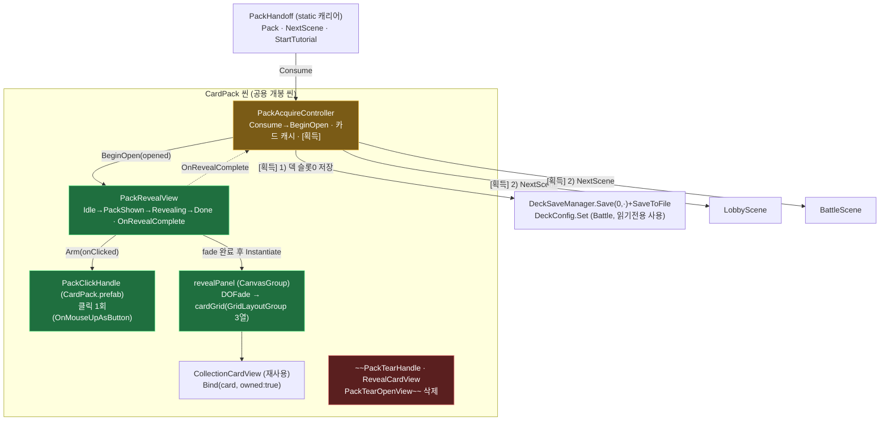

#### 흐름 시퀀스 — 개봉 1회

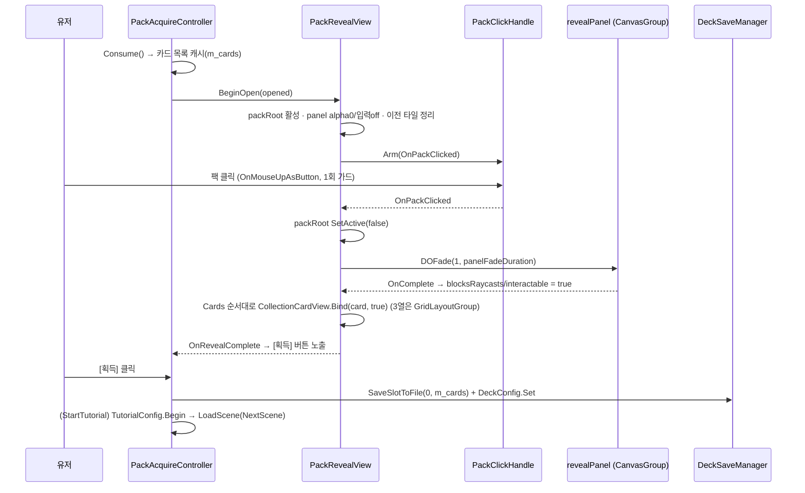

#### 원리 카드

- **연출을 인터랙션 1개로 축약**: 드래그 뜯기·카드별 스와이프 스택은 상태·입력 축이 많아 배선 실패가 곧 소프트락이었다. 클릭 1회 + CanvasGroup fade + `GridLayoutGroup`으로 줄여, 좌표 계산 코드를 레이아웃 컴포넌트에 넘겼다.
- **표시 뷰 단일화**: 결과 카드는 도감 타일 `CollectionCardView`를 그대로 재사용(월드 스프라이트 뷰 폐기) → 카드 표시 진실원이 하나(`displayName`/`fullImage`).
- **데드락 방지 우선**: `packHandle`/`revealPanel`/`cardPrefab`/`cardGrid` 미배선·카드 0장 모두 경고 후 `OnRevealComplete`를 발화 — 획득 버튼이 영구히 숨는 경로를 남기지 않는다.

**수정 가능성 높은 지점**: fade 시간·전이 가드 `PackRevealView.cs`(`panelFadeDuration`, `OnPackClicked`) / 덱 저장 슬롯·정책 `PackAcquireController.SaveOpenedDeck`(슬롯 0 고정).

---

### G-29 — 개봉 연출 재확장 (스와이프 뜯기 → 카드 더미 한 장씩 넘기기)

**의도·단계별 상세·열린 항목의 진실원 = [`docs/PACK_OPEN_DIRECTION.md`](../PACK_OPEN_DIRECTION.md).** 여기엔 구조 노드만 남긴다.

#### 구조 위치 (변경분만)

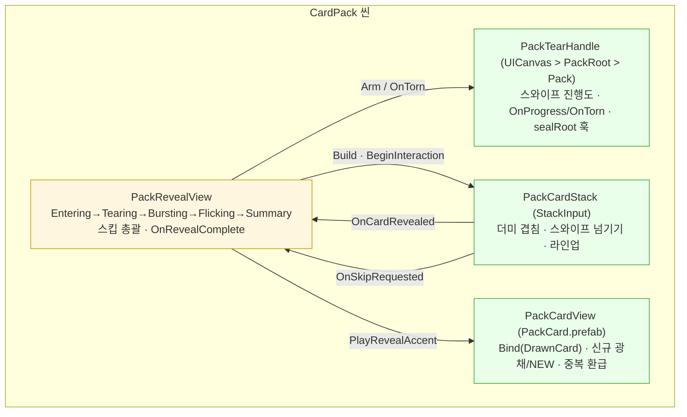

#### 원리 카드

- **G-28의 폐기 사유를 구조로 막았다**: 폐기 이유는 연출 품질이 아니라 "배선 실패 = 소프트락"이었다. 이번엔 `tearHandle`·`cardStack`·`packRoot`·`revealPanel` **어느 것이 비어도 경고 후 다음 단계로 진행**해 요약에 도달하고 `OnRevealComplete`가 발화한다. 카드 0장·`Build` 실패도 같다. 다만 **배선 지점 자체는 늘었다**(과거 4 → `cardLayer`/`stackAnchor`/`sealRoot`/`shakeTarget`/`skipButton` 추가).
- **`IsNew`/`Refund`가 처음으로 화면에 나온다**: G-28은 `Bind(card, true)`로 둘 다 버렸다. 희귀도를 도입하지 않기로 한 이상 이 둘이 연출의 유일한 감정 축이다.
- **좌표계 전제**: 카드와 `stackAnchor`가 모두 `cardLayer`의 자식이고 앵커가 같아야 한다(`anchoredPosition`을 직접 보간). `CardLayer`가 `StackInput`의 **자식**인 것도 필수 — 카드가 raycast를 먹어도 드래그가 부모로 버블링돼야 스택이 입력을 받는다.
- **장수 확장 대응**: 팩은 전부 `drawCount=6`. 밀린 카드는 라인업으로 남지 않고 날아가며 파괴되고, 결과는 `PackResultGrid`가 **새 인스턴스를 3열로** 세운다(마지막 행이 덜 차면 그 행만 가운데 정렬) → 장수가 늘어도 행이 늘 뿐이다. ※ ~~`discardArea`/`discardMaxWidth`로 라인업 간격을 자동 축소~~ 는 실재한 적 없는 서술이다(2026-07-28 정정).
- **스킵 입력이 두 경로인 이유**: 넘기기 단계는 `StackInput` 탭, 그 외는 `SkipButton`. **`RevealPanel`의 `CanvasGroup`이 단계를 갈라놓기 때문**이다 — 분출 전까지 `alpha 0` + `blocksRaycasts false`라 그 아래의 `StackInput`은 뜯기 단계에 입력을 받을 수 없다. ~~3D `OnMouse*`와 uGUI 전체화면 캐처가 충돌하기 때문~~ 은 **근거가 소멸한 서술**이다(2026-07-28 정정 — `PackTearHandle`은 `OnMouse*`를 쓰지 않고 2D 전환으로 3D 자체가 사라졌다).
  - ⚠️ 알려진 문제: `SkipButton`이 씬에서 `RevealPanel`의 **자식**이라 같은 `alpha 0`/`blocksRaycasts false`를 뒤집어쓴다 → **Entering·Tearing 동안 스킵 버튼이 보이지도 눌리지도 않는다**(`PackRevealView.cs:52` 주석과 실배선 불일치). 소프트락은 아니며, 2D 씬 재구성 시 캔버스 직속으로 올리는 것이 권장안. 상세 = `PACK_OPEN_DIRECTION.md` §3 Stage 5.

**수정 가능성 높은 지점**: 뜯기 감도 `PackTearHandle`(`tearDistance`/`commitThreshold`/`flickSpeed`) / 넘기기 감도 `PackCardStack`(`flickThreshold`/`flickSpeed`/`dismissDistance`) / 결과 격자 `PackResultGrid`(`cellWidth`/`cellHeight`/`spacing*`/`cardStagger`) / 분출 타이밍 `PackRevealView`(`burstHold`/`panelFadeDuration`). **값 단위는 한 가지가 아니다** — `PACK_OPEN_DIRECTION.md` §7 표를 먼저 볼 것.

**미완**: SFX 전무(`SoundConfig` 슬롯 추가 필요) · `burstEffect` 파티클 미배선 · 봉인 표현은 `Seal` 통째로 밀기(찢김 아님) · **Play 검증 대기**.

---

### G-TUT — 아웃게임 첫시작 튜토리얼 (P1~P4) — ✅ 코드+검수+컴파일 에러 0 (씬 배선·SO 저작 대기) / 2026-07-31 **챕터(N편) 2계층 재편**

> 첫실행 온보딩을 "한 번 리다이렉트하고 끝"에서 **영속 진행도 + 스텝 해석 + 강제 안내 게이트** 3축으로 재편한 것.
> `LobbyFirstRunRedirect`를 흡수·삭제하고, 로비↔CardPack↔Battle 왕복과 앱 강제종료를 견디는 진행도를 세이브에 둔다.
> **인게임(전투) 튜토리얼 내부 로직은 범위 밖** — 기존 `TutorialConfig`/`TutorialOverlayUI`를 그대로 쓰고, 아웃게임은 **어느 회차에 어느 시나리오를 넘길지만** 책임진다. `:::new` = 이번 신규.

#### 구조 지도 — 영속(진행도) / 해석(러너) / 수명(브리지) / 표시(게이트) 4층

```mermaid
flowchart TD
    subgraph boot["부트 (BeforeSceneLoad)"]
        GM["GameManager.Boot()<br/>Load → TutorialProgress.Init → CurrencyInit"]:::chg
    end

    subgraph persist["영속 — 세이브만 안다"]
        PRG["OutgameTutorialProgress (static)<br/>IsCompleted · ChapterIndex · StepIndex · Init<br/>CommitStep(챕터,스텝) · Complete · ResetForDebug · JumpForDebug"]:::chg
        SD["TutorialSaveData (슬롯)<br/>outgameChapterIndex · outgameChapterStepIndex<br/>outgameCompleted · migrationChecked<br/>(outgameStepIndex = 플랫 시절 잔재, 동결)"]:::chg
    end

    subgraph run["해석 — 스텝 실행 (씬 오브젝트를 모름)"]
        RUN["OutgameTutorialRunner (static)<br/>IsRunning · ChapterCount · EnsureData · TryGetCurrentStep<br/>EnterCurrentStep · NotifyStepSatisfied<br/>TryGetNext = 자리 올림(빈 챕터 스킵) 단일 진실원"]:::chg
        DATA["OutgameTutorialData (SO)<br/>List&lt;OutgameTutorialChapter&gt;<br/>조립 목록일 뿐 — 종류별 필드·실행은 스텝이 가진다"]:::chg
        CHAP["OutgameTutorialChapter ([Serializable], SO 아님)<br/>label(기획 'N편'과 1:1) · steps · TryGetStep<br/>챕터 하나 = 준비 스텝들 → 전투 스텝"]:::new
        STEP["OutgameTutorialStep (abstract SO) + 6종<br/>WaitClick · BattleEntry · WaitPurchase<br/>WaitPackOpen · AutoPurchase · AutoBattle<br/>Anchor · Completion · LeavesScene · Enter(ctx)"]:::chg
        CTX["OutgameTutorialStepContext (readonly struct)<br/>ChapterIndex · StepIndex + 다음 좌표(러너가 미리 계산)<br/>CommitAdvance · Rollback · CompleteIfLast<br/>스텝이 진행도를 건드리는 유일한 창구"]:::chg
        DATA --> CHAP
        CHAP --> STEP
        RUN -->|"Enter(ctx)"| STEP
        STEP --> CTX
    end

    subgraph scene["씬 레이어 (UI/Tutorial/)"]
        BRG["OutgameTutorialBridge<br/>씬당 1개 (LobbyScene · CardPack)<br/>Awake:EnsureData · Start:EnterCurrentStep"]:::new
        GATE["OutgameTutorialGateUI<br/>전면 딤(350) + 타깃 Canvas 승격(351)<br/>포커스링 · 손가락 · 메시지 = 프리팹 저작<br/>onClick 구독으로 완료 감지"]:::chg
        GPF["OutgameTutorialGate.prefab<br/>브리지가 [SerializeField]로 보유<br/>미배선 시 딤+문구 코드 폴백"]:::new
    end

    subgraph anchor["타깃 식별 (씬 경로 문자열 금지)"]
        KEY["EOutgameTutorialAnchor (enum, int 직렬화)<br/>LobbyPlayButton · LobbyPackTab<br/>PackBuyButton · PackAcquireButton"]:::new
        REG["TutorialAnchorRegistry (static)<br/>Register/Unregister/TryGet · OnRegistered"]:::new
        ANC["TutorialAnchor (MonoBehaviour)<br/>OnEnable/OnDisable = 등록/해제"]:::new
        TAB["LobbyTabController.Tab.tutorialAnchor<br/>탭 버튼(프리팹 내부 stripped Button) 대리 등록"]:::chg
    end

    OPENER["CardPackOpener.TryPurchase (E)<br/>Grant→Save 원자 영속"]
    HAND["PackHandoff (static 캐리어)"]
    TUT["TutorialConfig.Begin (Battle, 읽기 사용)"]
    BATTLE["BattleScene<br/>브리지 없음 (복귀 시 로비 브리지가 재개)"]
    OWN["OwnershipManager.HasAnyOwnedSaved<br/>레거시 마이그레이션 판정 전용으로 축소"]:::chg
    DEAD["~~LobbyFirstRunRedirect~~ 삭제<br/>= 스텝 0 AutoPurchase"]:::dead

    GM --> PRG
    PRG <--> SD
    PRG -.->|"Init 1회 판정"| OWN
    DEAD -.-> RUN
    BRG -->|"EnsureData(멱등)"| RUN
    RUN --- DATA
    RUN -->|"StepIndex 읽기 · CommitStep"| PRG
    RUN -->|"AutoPurchase"| OPENER
    RUN -->|"Set(opened, nextScene, false)"| HAND
    RUN -->|"BattleEntry · AutoBattle 진입 시"| TUT
    RUN -->|"AutoBattle → LoadScene(BattleScene)"| BATTLE
    BRG -->|"Ensure(gatePrefab) → Instantiate"| GPF
    GPF --- GATE
    BRG -->|"ShowGate(rect, button, msg)"| GATE
    GATE -->|"onClick → onSatisfied"| BRG
    BRG -->|"NotifyStepSatisfied"| RUN
    ANC -->|"Register/Unregister"| REG
    TAB -->|"Awake 등록"| REG
    KEY --- REG
    BRG -->|"TryGet(anchor) · OnRegistered 대기"| REG

    classDef new fill:#1f6f3f,stroke:#7CFC9E,color:#fff;
    classDef chg fill:#7a5b16,stroke:#f2c14e,color:#fff;
    classDef dead fill:#5a1f1f,stroke:#e57373,color:#fff;
```

#### 흐름 시퀀스 — 1편~3편 머리 (부트 → 첫 전투 직행 → 로비 복귀 → 상점 [구매])

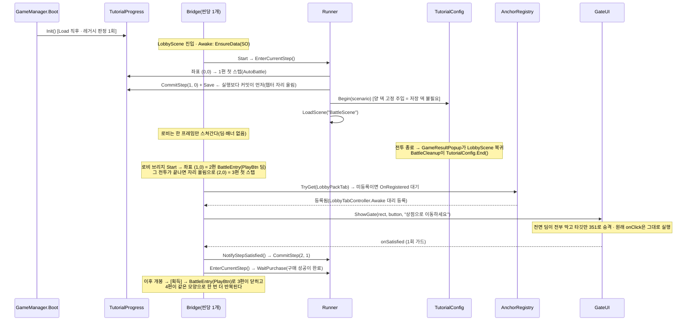

#### 원리 카드 — 왜 이렇게 생겼나

- **완료는 파생이 아니라 스칼라**: `outgameCompleted`가 **진행 좌표보다 항상 우선**한다. 완료를 좌표 비교로 파생시키면 나중에 챕터·스텝을 추가한 순간 **이미 끝낸 유저의 튜토리얼이 되살아난다**. 러너는 `NotifyStepSatisfied`에서 한 번만 `Complete()`를 확정하고, 자동 스텝은 컨텍스트의 `CompleteIfLast()`로 같은 판정을 빌려 쓴다. 2계층이 된 뒤에도 이 축은 그대로다 — `IsRunning`이 좌표를 보기 전에 완료 스칼라부터 걸러내므로, **챕터 재편으로 좌표가 (0,0)으로 되감겨도 완료 유저는 영향받지 않는다**. — `TutorialSaveData.cs` / `OutgameTutorialRunner.cs`
- **챕터 넘김은 자리 올림일 뿐(2026-07-31)**: 저작 축을 기획 언어("튜토리얼 N편")와 1:1로 맞추려 `챕터 → 스텝` 2계층으로 갈랐다. 플랫 12칸은 이미 `전투1 / 전투2 / 상점루프+전투3 / 상점루프+전투4`였는데 **그 경계가 어디에도 적혀 있지 않아** 재사용 에셋(`GoShop`·`OpenPack`·`ClaimCards`)이 어느 편 소속인지 인덱스를 세야만 알 수 있었다. 그런데 이 재편으로 **`OutgameTutorialBridge`·`PackShowcaseController`·`BootLoadingScreen`·스텝 6종의 로직이 한 줄도 바뀌지 않았다** — 챕터 넘김을 별도 단계로 두지 않고 `TryGetNext`의 **자리 올림 한 번**으로 흡수했기 때문이다. 러너가 다음 좌표를 미리 계산해 컨텍스트에 실어주므로 스텝은 자기가 **챕터 끝인지조차 모른 채** `CommitAdvance()`한다(무상태 불변식의 2계층 확장). ⚠️ `TryGetNext`는 완료 판정과 진입 시 `isLast` 판정이 **반드시 공유**해야 한다 — 갈라 놓고 `chapter + 1 >= ChapterCount`로 순진하게 비교하면 뒤에 빈 챕터가 저작된 순간 `isLast`가 영영 false가 되어 완료가 안 찍힌다. 빈 챕터 스킵 루프는 `< ChapterCount` 상한(`!=` 금지)이라 종료가 보장된다. — `OutgameTutorialRunner.TryGetNext`
- **챕터는 SO가 아니다(2026-07-31)**: 스텝을 SO로 가른 근거는 ①종류별 필드만 노출(다형성) ②같은 에셋 재사용, 둘뿐이었다. 챕터는 **종류가 하나고 재사용도 없어** 두 근거가 모두 사라진다 → `[Serializable]` 인라인 클래스(선례: `TutorialScenarioData.ScriptedAttack`). 덕분에 신규 에셋 0개, 챕터 간 스텝 이동이 한 인스펙터 안의 드래그 한 번이다. **전투 시나리오도 챕터로 올리지 않았다** — 올리면 `BattleEntry`/`AutoBattle`이 `scenario`를 잃고 컨텍스트에서 받아야 하는데, 그러면 "진행도를 건드리는 유일한 창구"인 컨텍스트가 저작 데이터 배달부를 겸하고 아웃게임이 Battle 타입을 알게 된다(G-TUT 경계 선언 위반). "N편의 진실원"은 대신 챕터 `label` + **"마지막 스텝이 `LeavesScene`인가" 주입 시 검증**으로 확보한다(챕터 경계 = 씬 전환 경계). 나중에 챕터로 올리는 확장은 언제든 가능하고 반대 방향은 비싸다. — `OutgameTutorialChapter.cs` / `Runner.WarnOnMisauthoredChapters`
- **스텝은 데이터가 아니라 에셋(2026-07-31)**: 한 몸 struct + `EStepKind` switch를 **스텝 SO 6종 + `Completion` 축**으로 갈랐다. ① 저작 화면에 그 종류의 필드만 뜬다(구 struct는 무관한 필드 5개가 항상 노출), ② 반복되는 칸(상점 이동·팩 오픈·카드 획득)을 **같은 에셋 재사용**으로 해결 — 12칸이 에셋 9개, ③ 종류 추가가 파일 1개(구조상 러너·브리지·로딩화면 4곳 동시 수정이 필요했다). 브리지는 이제 스텝 **타입을 모른다** — 기다릴 신호는 `Completion{Auto,Click,PackOpen,Purchase}` 하나로 갈리고, "같은 씬에서 이어갈지"는 `LeavesScene`이 답한다. 스텝이 진행도를 건드리는 창구는 `OutgameTutorialStepContext`뿐이라 **자기가 몇 번째 칸인지 모른 채로도** 커밋·롤백한다(재사용의 전제). 예외로 `BootLoadingScreen`만 `is AutoBattleStep` 타입 검사를 남긴다 — "부트에서 로비를 건너뛴다"는 AutoBattle 한정이라 `Completion == Auto`로 넓히면 `AutoPurchase`까지 걸린다. — `Tutorial/Steps/`
- **커밋이 실행보다 앞선다**: 자동 스텝(`AutoPurchase`·`AutoBattle`)은 `CommitStep(idx+1)`+`Save` **후에** 실행한다. `AutoPurchase`가 반대 순서면 "구매 직후 앱 종료 → 소유는 생겼는데 진행도는 0"이 되어 온보딩이 영구 스킵되고, `AutoBattle`이 반대 순서면 전투 중 강제종료가 그 스텝을 **영원히 되풀이**한다(씬을 떠난 뒤엔 커밋할 지점이 없다). 롤백 분기는 `AutoPurchase`에만 있다 — 구매는 실패할 수 있고(차감 없이 반환되므로 `CommitStep(idx)`로 원상복구) 씬 로드는 실패하지 않는다. — `OutgameTutorialRunner.EnterAutoPurchase` / `EnterAutoBattle`
- **첫 전투는 저장 덱을 요구하지 않는다(2026-07-28)**: 온보딩 앞머리의 팩 구매·개봉을 걷어내 신규 유저는 첫 전투 시점에 소유 카드도 덱도 0이다. 그래도 성립하는 이유는 `GameInitializer.InitializeSinglePlayerFields`가 `TutorialConfig.IsActive`일 때 **양 덱을 시나리오에서 고정 주입**하기 때문 — `DeckConfig`를 아예 읽지 않는다. 그래서 `LobbyMatchLauncher`의 "유효한 덱이 없습니다" 가드는 **손대지 않았다**: `AutoBattle`은 `PlayBtn`을 거치지 않으므로 그 가드를 통과할 일이 없고, 그 가드를 만나는 2·3회차 `BattleEntry`는 이미 첫 팩을 획득한 뒤다.
- **레거시 판정은 계정당 1회(`migrationChecked` 낙인)**: "소유 있음 + 진행도 0 = 구버전 유저" 판정을 매 부트 반복하면, 러너가 아직 한 번도 돌지 못한 상태(SO 미배선·구매 실패 롤백 — **P5·P6 보류 중인 지금의 실제 상태**)에서 수동 구매한 신규 유저까지 완료 처리된다. `stepIndex == 0` 항은 함께 남긴다 — 없으면 **현재 빌드로 진행 중인 세이브**가 업데이트 첫 부팅에 완료 낙인을 맞는다. `ResetForDebug()`는 낙인을 **true로 유지**(되돌리면 남은 소유 탓에 다음 부트가 곧장 완료 처리해 리셋이 무의미). — `OutgameTutorialProgress.Init`
- **타깃은 씬 경로가 아니라 enum 앵커**: 탭 버튼이 Layer Lab 프리팹 내부라 경로 문자열은 취약하고 오타가 검출되지 않는다. `TutorialAnchor`의 `OnEnable/OnDisable`이 그대로 등록/해제가 되므로 **"타깃이 나타나는 시점"을 감지하는 코드가 0줄** — `AcquireButton`의 `SetActive(true)`가 곧 개봉 완료 시점이고, 탭 콘텐츠 토글이 곧 등록 시점이다. enum은 SO에 int로 직렬화되므로 **새 값은 끝에만 추가**(재배치·삭제 금지).
- **~~구멍은 4패널~~ → 타깃을 딤 위로 승격(2026-07-31)**: 구 방식은 타깃 rect 기준 상/하/좌/우 `Image` 4장으로 덮어 타깃만 비웠다(구멍이 물리적 공백이라 클릭 통과가 `ICanvasRaycastFilter` 0줄로 성립). 폐기 이유는 **각진 바운딩 박스 구멍이 버튼 모양과 무관하게 남고 유도가 약해서**다. 현재는 **전면 딤 1장**(`raycastTarget=true`)이 전부 흡수하고, 타깃 GameObject에 런타임으로 `Canvas(overrideSorting=true, sortingOrder=351)` + `GraphicRaycaster`를 얹어 딤(350) 위로 올린다 — 렌더도 레이캐스트도 함께 올라간다(`GraphicRaycaster.sortOrderPriority`가 Overlay에서 `canvas.sortingOrder`를 반환). 성립 전제는 **앵커 조상 체인에 `Mask`/`RectMask2D`/`ScrollRect`/중첩 `Canvas`가 없을 것**(앵커 4종 실측 확인). 완료 감지는 그대로 `onClick` **구독**이라 원래 리스너(`StartAiBattle`·`Select`·`OnBuyPressed`·`OnAcquirePressed`)가 그대로 실행된다.
- **승격 해제는 단일 창구 `Release()`**: 리스너 해제와 승격 해제를 한 메서드로 묶어 `ShowGate`/`ShowBanner`/`HideGate`/`OnDestroy` **모든 진입점 최상단에서 1회** 부른다. 갈라 두면 ① `ShowBanner`가 `m_target`을 직접 비우고 ② 두 번째 `ShowGate`가 이전 타깃 참조를 잃어 **버튼이 모든 UI 위에 영구히 떠 있는** 상태가 남는다. 해제 시 **`GraphicRaycaster`를 먼저 파괴하고 `Canvas`를 나중에** — 반대로 하면 `RequireComponent` 때문에 조용히 실패해 둘 다 남는다. 타깃이 이미 `Canvas`를 저작으로 갖고 있으면 파괴하지 않고 `overrideSorting`/`sortingOrder`/`sortingLayerID`만 백업·복원한다. 승격 시 **루트 캔버스의 `additionalShaderChannels`·`sortingLayerID`를 복사**한다 — 중첩 Canvas는 기본값으로 리셋되므로 복사하지 않으면 승격 중에만 TMP·그라디언트가 깨진다.
- **소프트락 방지 불변식**: 딤이 걸린 채 누를 수 있는 것이 0인 상태를 만들지 않는다. 타깃이 `activeInHierarchy == false`거나 `IsInteractable() == false`면 **딤·승격·포인터를 함께 내리고 게이트는 armed 유지** → 다시 누를 수 있게 되면 자동 복귀(`LateUpdate` 매 프레임 판정이라 게이트가 걸린 *뒤* 잠기는 경로도 커버). 셋을 뒤집는 곳은 `RefreshVisibility` **하나뿐**이다. 승격을 함께 내리는 이유가 하나 더 있다: `overrideSorting=true`는 조상 `CanvasGroup`의 raycast 필터를 끊으므로, 남겨 두면 게임이 막으려던 입력이 튜토리얼 때문에 뚫린다. 타깃에 `Button`이 없으면 아예 게이트를 걸지 않는다.
- **게이트 정렬은 저작 대상이 아니다(하드락 축)**: `TutorialOverlay(200) < 딤(350) < 타깃(351) < UIPoolManager 팝업(400) < Mulligan(999) < LoadingCover(1000)`. **400을 넘기면 안 된다** — 플레이 스텝에서 뜨는 "유효한 덱이 없습니다"(`MatchFlowController.ShowNoDeckPopup`)와 구매 실패 팝업(`PackShowcaseController.ShowFailPopup`)이 딤에 묻히는데, 그때 타깃 버튼은 `interactable=true` 그대로라 위 탈출로도 발동하지 않아 **완전 잠김**이 된다. 그래서 프리팹의 `Canvas.sortingOrder`는 런타임에 상수로 덮어쓴다(`CacheRoots`).
- **문구 전용 모드에는 딤을 켜지 않는다**: `ShowBanner`(개봉 대기)는 `SetDim(false)`가 계약이다. `PackTearHandle`이 `Input.GetMouseButtonDown(0) && !EventSystem.IsPointerOverGameObject()`로 스와이프 시작을 판정하므로, 전면 딤이 있으면 화면 어디를 눌러도 `true`가 되어 **제스처가 영영 시작되지 않는다**. 게다가 이 모드는 `m_armed=false`라 `LateUpdate`가 돌지 않아 탈출로도 없다. 구 코드에서는 "4패널을 0사이즈로" 두는 **우연한 구현**이 이걸 지켰지만, 지금은 `SetDim(bool)` 명시 API로 못박았다. ⚠️ 딤이 막는 것은 EventSystem 입력뿐이고 raw `Input` 폴러는 오히려 **과차단**된다(`TutorialOverlayUI`가 Physics2D로 남긴 것과 같은 교훈).
- **룩은 프리팹, 폴백은 딤+문구까지만**: 색·스프라이트·여백·펄스 세기가 전부 `OutgameTutorialGate.prefab`의 인스펙터 값이다(구 코드는 `HolePadding 12f` 같은 C# 상수라 디자이너가 손댈 수 없었다). 선례는 `TutorialOverlayUI.Ensure(prefab)` — 프리팹 우선 + 코드 폴백, 폴백 판정은 `[SerializeField] blocker`의 null 여부. ⚠️ 폴백은 **딤+문구까지만** 성립한다: 포커스 링·손가락 스프라이트가 `Layer Lab/.../ResourcesData/`에 있는데 그건 `Resources` 폴더가 **아니라서**(프로젝트 `Resources`는 `Fonts`/`DOTweenSettings`뿐) 코드 경로에서 얻을 방법이 없다 → 프리팹 미배선 시 `LogWarning` 1회로 드러낸다. 포인터 연출은 `localScale`만 트윈한다(`sizeDelta`·`anchoredPosition`은 `Layout`이 매 프레임 덮어써 트윈이 조용히 사라진다). `DOPunchScale`은 Kill 시 스케일을 복구하지 않아 금지 — 선례대로 `DOScale(...).SetLoops(-1, Yoyo)`.
- **좌표는 반드시 스크린 경유**: 타깃의 `rect.size`·`anchoredPosition`을 직접 읽으면 안 된다. 캔버스 `referenceResolution`이 씬마다 달라(`LobbyCanvas` 1080×1920, `CardPack UICanvas` 1440×3120) 그대로 옮기면 배율만큼 어긋난다. `GetWorldCorners → WorldToScreenPoint → ScreenPointToLocalPointInRectangle(게이트 캔버스, camera:null)`이 유일한 경로다(두 씬 모두 `Match=0` 폭 기준이라 스크린 경유만 하면 정확히 일치). 문구는 타깃이 화면 위쪽이면 아래, 아래쪽이면 위로 **뒤집어** 배치한다 — 고정 위치로 두면 하단바 탭 스텝에서 타깃(351)이 문구를 뚫고 나와 깨진 것처럼 보인다.
- **씬 이름을 보지 않는 재개**: 브리지는 씬 로드마다 진행 좌표를 읽어 그대로 재개한다. 앵커가 이 씬에 없으면 조용히 대기하고 나중에 등장하면 켜진다. `AutoPurchase`는 커밋이 실행보다 앞서므로 개봉 씬 브리지가 재실행할 수 없다. 클릭 직후 다음 스텝이 `AutoPurchase`면 진입을 넘긴다 — 방금 누른 버튼의 `LoadScene`과 자동 전환이 경합해 목적지가 뒤집히기 때문.
- **SO 주입은 브리지가(부트가 아니라)**: `CardPack.unity`에는 `MainMenuInitializer`가 없다. static은 씬 전환에 살아남지만 **CardPack 단독 Play**(`PackStandaloneBoot` 워크플로)에서 깨진다 → 브리지가 `Awake`에서 멱등 주입(다른 에셋 주입 시도는 경고 후 기존 유지).
- **전투 시작은 클릭 리스너가 아니라 스텝 진입 시**: `TutorialConfig.Begin`을 `BattleEntry` 진입 순간에 호출한다. 클릭 리스너로 하면 `PlayBtn`의 씬 PersistentCall이 런타임 리스너보다 먼저 `LoadScene`을 돌려 순서 의존이 생긴다. `Begin`은 덱/스크립트 큐 세팅뿐이고 `TutorialConfig`는 휘발이라 재진입도 멱등. → **`LobbyMatchLauncher`·`PackShowcaseController`·`PackAcquireController` 무수정.**

- **개봉 씬은 가이드를 끄고 씬 안내로 대체(2026-07-27)**: `CardPack`은 화면에 3D 팩 하나, 요약엔 [획득] 하나뿐이라 강제 게이트가 길잡이가 아니라 **연출을 가리는 잡음**이다. 브리지에 `suppressGuideUI`(씬 스위치)를 두어 그 씬에서만 딤·배너를 끈다 — **스텝 진행은 불변**. 단 완료 감지 경로가 갈린다: `WaitPackOpen`은 원래부터 `OnAnyPackOpened`가 완료를 확정하므로 배너만 빼면 끝이지만, `WaitClick`의 완료는 **게이트가 대신 걸어주던 `onClick` 구독**이라 게이트를 끄면 브리지가 직접 물어야 한다(`HookSilently`/`DetachSilent`, `m_silentDone` 1회 가드 = `GateUI.m_satisfied`와 같은 역할). `GateUI`는 무수정 — "아무것도 안 그리는 모드"를 넣는 대신 소비처에서 끊었다. ⚠️ 그래서 **`AcquireButton`의 `TutorialAnchor`는 억제 모드에서도 필수**다(떼면 스텝 4·9가 영구 정지).
- **뜯기 안내는 튜토리얼이 아니다**: "스와이프하여 오픈"은 `PackRevealView.tearHint`(씬 저작 TMP + `CanvasGroup`)로, **튜토리얼 진행 여부와 무관하게 항상** 뜯기 대기 중 표시되고 뜯김 확정(`EnterBursting`)에 사라진다. 튜토리얼 배너였다면 2회차 이후 구매에서는 안내가 사라진다 — 조작법은 온보딩이 끝나도 필요하므로 씬의 상시 안내로 둔다. ⚠️ 배치는 **`RevealPanel` 바깥**이어야 한다(그 `CanvasGroup`은 분출 전까지 `alpha 0`이라 그 아래 두면 정작 뜯기 단계에 안 보인다).

**수정 가능성 높은 지점**: 편(챕터) 구성·스텝 순서·문구·팩·시나리오 = `OutgameTutorial.asset`(코드 미수정 — 편 추가·삭제·재배치도 여기서만) / 새 타깃 = `EOutgameTutorialAnchor` 끝에 값 추가 + 씬에 `TutorialAnchor` 부착 / 게이트 외형 = `OutgameTutorialGate.prefab`(딤 색·알파, 포커스 링/손가락 스프라이트, 메시지 프레임, `ringPadding`·`handOffset`·`messageMargin`·펄스 세기 전부 인스펙터 — 코드 무수정. 링/손가락 노드를 꺼 두면 그 요소만 빠진다) / 개봉 씬·전투 씬 경로 = `OutgameTutorialRunner.PackOpenScene` / `BattleScene` 상수 / 개봉 씬 가이드 on·off = 씬 브리지의 `suppressGuideUI` 체크박스 / 첫 전투를 다시 "로비에서 눌러서 시작"으로 되돌리려면 1편의 스텝을 `Step_AutoBattle_First`→`BattleEntry` 계열 에셋으로 갈아 끼우면 된다(코드 무수정) / 특정 편부터 재확인 = `OutgameDebugActions.RestartTutorialFromChapter(n)`.

#### 파일 지도 — 다이어그램에서 코드로

| 클래스/에셋 | 파일 | 패키지 |
|---|---|---|
| `TutorialSaveData` (세이브 값 객체) | 신규 `Assets/Scripts/OutGame/Save/2.Domain/TutorialSaveData.cs` | P1 ✅ / 2026-07-31 좌표 2필드 추가(구 `outgameStepIndex` 동결) |
| `UserSaveData.tutorial` 슬롯 (VERSION 1 유지) | `Assets/Scripts/OutGame/Save/2.Domain/UserSaveData.cs` — 1줄 추가 | P1 ✅ |
| `OutgameTutorialProgress` (static, 진행도 단일 창구) | 신규 `Assets/Scripts/OutGame/Tutorial/OutgameTutorialProgress.cs` | P1 ✅ / 2026-07-31 좌표화 + `JumpForDebug` |
| `GameManager.Boot()` 진행도 Init | `Assets/Scripts/Core/GameManager.cs` — 1줄(Load 직후·CurrencyInit 앞) | P1 ✅ |
| 튜토리얼 리셋 2종(진행도만 / 소유까지) | `Assets/Scripts/OutGame/Collection/Debug/OwnershipDebugTool.cs` — ContextMenu (동작은 `OutgameDebugActions`에 위임) | P1 ✅ |
| 디버그 조작 단일 창구(해금·회수·튜토리얼 완료/리셋/N편 점프) | 신규 `Assets/Scripts/OutGame/Debug/OutgameDebugActions.cs` | 2026-07-30 ✅ / 2026-07-31 `RestartTutorialFromChapter` |
| 런타임 디버그 패널(자기 부트스트랩 IMGUI, F8, dev 전용) | 신규 `Assets/Scripts/OutGame/Debug/OutgameDebugOverlay.cs` | 2026-07-30 ✅ |
| `EOutgameTutorialAnchor` (enum 키) | 신규 `Assets/Scripts/OutGame/Tutorial/EOutgameTutorialAnchor.cs` | P2 ✅ |
| `TutorialAnchorRegistry` (static 등록소 + `OnRegistered`) | 신규 `Assets/Scripts/OutGame/Tutorial/TutorialAnchorRegistry.cs` | P2 ✅ |
| `TutorialAnchor` (MonoBehaviour, 수명주기 등록) | 신규 `Assets/Scripts/OutGame/Tutorial/TutorialAnchor.cs` | P2 ✅ |
| `OutgameTutorialData` (SO, `List<OutgameTutorialChapter>` 조립 목록) | `Assets/Scripts/OutGame/Tutorial/OutgameTutorialData.cs` — `Create → Card Battle/Outgame Tutorial` | P2 ✅ / 2026-07-31 스텝 SO화 → 챕터 2계층 |
| `OutgameTutorialChapter` (`[Serializable]`, 기획 "N편" 1:1) | 신규 `Assets/Scripts/OutGame/Tutorial/OutgameTutorialChapter.cs` | 2026-07-31 ✅ |
| `OutgameTutorialGateUI` (전면 딤 + 타깃 승격 + 포인터, `Ensure(prefab)` 파사드) | `Assets/Scripts/UI/Tutorial/OutgameTutorialGateUI.cs` | P3 ✅ / 2026-07-31 4패널 구멍 → 승격 방식 재작성 |
| `OutgameTutorialGate.prefab` (딤·포커스링·손가락·메시지 저작본, Canvas order 350) | 신규 `Assets/Assets/Prefabs/UI/Tutorial/OutgameTutorialGate.prefab` — 스프라이트는 Layer Lab SimpleCasual `Tutorial_Focus00_Line_White`(9슬라이스 border 46) · `Tutorial_Focus_Icon_Hand` · `ChatFrmae03_Demo_Frame_Light` | 2026-07-31 ✅ |
| `OutgameTutorialBridge.gatePrefab` (게이트 프리팹 보유) | `Assets/Scripts/UI/Tutorial/OutgameTutorialBridge.cs` — 필드 1 + `Ensure()` 호출 2곳 | 2026-07-31 ✅ |
| `OutgameTutorialRunner` (static, 좌표 해석·스텝 실행) | 신규 `Assets/Scripts/OutGame/Tutorial/OutgameTutorialRunner.cs` | P4 ✅ / 2026-07-31 `TryGetNext` 자리 올림 + 저작 검증 |
| `OutgameTutorialBridge` (씬당 1개, 수명 연결) | 신규 `Assets/Scripts/UI/Tutorial/OutgameTutorialBridge.cs` | P4 ✅ |
| `OutgameTutorialBridge.suppressGuideUI` (개봉 씬 가이드 off + 클릭 직접 구독) | `Assets/Scripts/UI/Tutorial/OutgameTutorialBridge.cs` — 필드 1 + `HookSilently`/`OnSilentClicked`/`DetachSilent` | G-HINT ✅ |
| `PackRevealView.tearHint` (뜯기 상시 안내, 튜토리얼 무관) | `Assets/Scripts/UI/Shop/PackRevealView.cs` — 필드 2 + `SetTearHint` | G-HINT ✅ |
| `LobbyTabController.Tab.tutorialAnchor` (탭 버튼 대리 등록) | `Assets/Scripts/UI/Lobby/LobbyTabController.cs` — 필드 1 + `Awake` 3줄 | P4 ✅ |
| `OwnershipManager.HasAnyOwnedSaved` 용도 축소(주석) | `Assets/Scripts/OutGame/Collection/OwnershipManager.cs` — 레거시 마이그레이션 판정 전용 | P4 ✅ |
| ~~`LobbyFirstRunRedirect`~~ | **삭제** — 스텝 0 `AutoPurchase`가 흡수 | P4 ✅ |
| `AutoBattleStep`(구 `EStepKind.AutoBattle` + `Runner.EnterAutoBattle`/`BattleScene` 상수) | `Assets/Scripts/OutGame/Tutorial/Steps/AutoBattleStep.cs` | 2026-07-28 ✅ / 2026-07-31 SO 이관 |
| 스텝 SO 계층 (`OutgameTutorialStep` 베이스 + 6종 + `EOutgameTutorialCompletion` + `OutgameTutorialStepContext`) | 신규 `Assets/Scripts/OutGame/Tutorial/Steps/` 9파일 — `Create → Card Battle/Outgame Tutorial/Step/…` | 2026-07-31 ✅ |
| 스텝 에셋 9개 (`Step_AutoBattle_First`·`Step_BattleEntry_2/3/4`·`Step_GoShop`·`Step_BuyPack_Starter/Default`·`Step_OpenPack`·`Step_ClaimCards`) | 신규 `Assets/SO/TutorialConfig/Outgame/Steps/` | 2026-07-31 ✅ |
| `LoadingCoverView` (첫 프레임 은폐 커버, 자동 해제) + 씬 노드 `LobbyScene/LoadingCover`(order **1000**) | 신규 `Assets/Scripts/UI/Common/LoadingCoverView.cs` · `Assets/Scenes/LobbyScene.unity` | 2026-07-28 ✅ |
| `Assets/SO/TutorialConfig/Outgame/OutgameTutorial.asset` (4챕터 12칸) | 저작 완료 — 1편 첫 전투 / 2편 두 번째 전투 / 3편 상점과 첫 팩 / 4편 두 번째 팩. 2026-07-31 **챕터 2계층으로 재저작**(스텝 에셋 9개 그대로 재사용, 신규 에셋 0) | P6 ✅ |

#### 씬/에셋 인계 (코드 밖 — 사용자)

| 씬/에셋 | 작업 |
|---|---|
| `Assets/Scenes/New/LobbyScene.unity` | 구 `LobbyFirstRunRedirect` GameObject의 **Missing Script 제거** 후 `OutgameTutorialBridge` 부착(`data` ← `OutgameTutorial.asset`) / `MatchContent/PlayBtn`에 `TutorialAnchor`(`key = LobbyPlayButton`) |
| `Assets/Scenes/CardPack.unity` | `AcquireButton`에 `TutorialAnchor`(`key = PackAcquireButton`) / `PackOpenDirector`에 `OutgameTutorialBridge`(같은 에셋) |
| `Assets/Scenes/CardPack.unity` (2026-07-27 추가) | ① `PackOpenDirector`의 브리지 → **`Suppress Guide UI` 체크** ② **`UICanvas` 직속**(`RevealPanel`의 **형제**)에 안내 TMP 신규(예: `TearHint`, "스와이프하여 오픈") — `CanvasGroup` 추가 후 **alpha 0으로 저장**, TMP `Raycast Target` 해제 → `PackRevealView.tearHint`에 배선 ③ `AcquireButton`의 `TutorialAnchor`는 **유지**(억제 모드에서도 브리지가 이 앵커로 클릭을 감지) |
| `Assets/SO/TutorialConfig/Outgame/OutgameTutorial.asset` | **4챕터 12칸**(2026-07-31 재저작 완료 — 배선 불필요). 1편=`AutoBattle_First` · 2편=`BattleEntry_2` · 3편=`GoShop`→`BuyPack_Starter`→`OpenPack`→`ClaimCards`→`BattleEntry_3` · 4편=`GoShop`→`BuyPack_Default`→`OpenPack`→`ClaimCards`→`BattleEntry_4`. 편을 늘릴 때는 **마지막 스텝을 전투 스텝으로** 둘 것(아니면 주입 시 경고) |
| `UIPoolManager` 캔버스 | `sortingOrder` **1 → 400** (`LobbyScene.unity` / `MainMenu.unity`). 게이트 300 > 팝업 상속값 1이라 **실패 팝업이 딤 아래로 묻혀 [확인]을 못 누른다**. ⚠️ 2026-07-31 이후 게이트가 350/351이므로 이 400은 **낮추면 안 된다**(같은 하드락이 되돌아온다) |
| `LobbyScene.unity` · `CardPack.unity` (2026-07-31 추가) | 각 씬 `OutgameTutorialBridge`의 **`Gate Prefab` 필드에 `OutgameTutorialGate.prefab` 드래그**. 미배선이면 조용히 코드 폴백(딤+문구만, 링·손가락 없음)으로 떨어지고 콘솔에 `LogWarning` 1회. `CardPack`은 `suppressGuideUI=1`이라 당장 무해하지만 토글 대비해 함께 배선 |

> `nextScene`은 **개봉 후 목적지**이며 `AutoPurchase` 전용이다(개봉 씬 `"CardPack"`·전투 씬 `"BattleScene"`은 러너 상수). `AutoBattle`은 이 필드를 읽지 않는다.
> 개봉 씬 스텝(3·4편의 `WaitPackOpen`·`WaitClick`)의 `guideMessage`는 `suppressGuideUI` 이후 **표시되지 않는다**. 비워도 되고 두어도 무해하다(로비 브리지는 이 스텝들을 만나지 않는다).
> ⚠️ 진행 좌표가 곧 세이브라, 챕터 재편(2026-07-31)으로 **진행 중이던 세이브는 (0,0)으로 되감긴다**(구 `outgameStepIndex`를 환산하지 않는다 — 죽은 12칸 구조를 코드에 하드코딩하지 않으려고). 완료 낙인이 찍힌 세이브는 그대로 완료다. 되감긴 세이브는 부팅이 곧장 1편 전투로 직행하니 버그로 오인하지 말 것 — `ResetTutorialFromScratch`로 소유까지 비우고 확인하는 편이 깔끔하다.
> 게이트 UI는 코드 빌드라 **신규 프리팹·Addressable 등록이 없다**(`UIPrefab` 라벨 체크 대상 아님).

#### P5·P6 해결 내역

- **앵커 배선 완료**: `LobbyTabController.tabs[1].tutorialAnchor = LobbyPackTab` / `PackShowcaseController.packs` ← `NormalPack_TEST`·`RarePack_TEST`·`SuperPack_TEST`(2026-07-29 캐러셀 전환으로 단일 `packData` → 목록) / 그 `buyButton`(BuyBtn_0)에 `TutorialAnchor(PackBuyButton)`.
- **완료 판정이 두 갈래로 갈렸다**: 팩 개봉은 uGUI 게이트를 걸 수 **없고**, 구매는 눌러도 실패할 수 있다.
  - 게이트를 못 거는 이유는 **팩에 `Button`이 없기 때문**이다. `OutgameTutorialGateUI.ShowGate`는 타깃에 `Button`이 없으면 경고 후 게이트를 걸지 않는다(`OutgameTutorialGateUI.cs:57-61`) — 완료 판정을 `onClick` 구독으로만 하는 설계라 버튼이 없으면 "딤은 걸렸는데 완료시킬 방법이 없는" 소프트락이 되기 때문이다. 팩은 그때나 지금이나 `Button`이 아니라 제스처 컴포넌트(`PackTearHandle`)로 조작된다. → `WaitPackOpen`은 딤 없이 배너만 띄우는 `ShowBanner` 경로.
  - ~~"`PackClickHandle`의 물리 클릭이라 … Overlay 딤이 3D를 덮어 강조가 은폐가 된다"~~ 는 **이중으로 낡은 서술**이었다(2026-07-28 정정): ① `PackClickHandle`은 G-29에서 **삭제된 클래스**다(현재 코드베이스에 남은 건 `PackTearHandle.cs:13`의 성격 계승 언급뿐) ② 2D 전환으로 3D 자체가 사라졌다. **결론(`WaitPackOpen` = `ShowBanner` 경로)은 그대로 유효하다** — 근거만 바뀌었다. → kind `WaitPackOpen`(딤 없이 배너만, `GateUI.ShowBanner`)과 `WaitPurchase`(딤만 걸고 클릭은 완료가 아님)를 추가하고, 완료는 **결과 신호**가 확정한다.
  - `PackRevealView.OnAnyPackOpened` / `PackShowcaseController.OnAnyPurchased` (둘 다 static event) → `OutgameTutorialBridge`가 구독. **뷰는 구독자를 모른다** — `TutorialAnchorRegistry.OnRegistered`와 같은 방향의 관용구.
  - `GateUI.ShowGate(_onSatisfied: null)` = 클릭 리스너 미부착(딤 유지). 이것이 `WaitPurchase`의 구현.
- **결과 기반 커밋 해결**: 구매 실패 시 진행도가 앞서 나가지 않는다.
- **튜토리얼 구매 대상 고정**: `WaitPurchase` 스텝의 `pack`/`duplicateRefundGold`가 상점 **진열 목록 자체를 대체한다**(`OutgameTutorialRunner.TryGetForcedPack` → `PackShowcaseController.ResolveDisplay` → 그 팩 1장만 진열 + 캐러셀 입력 잠금). `AutoPurchase`와 같은 원리 — 튜토리얼 중 구매 결과가 저작대로 고정된다. 캐러셀 그림·표시명·가격·구매 잠금 판정이 전부 이 한 목록에서 나오므로 **보이는 팩과 실제 결제가 갈리지 않는다**(우선순위 규칙으로 두면 캐러셀은 팩 A, 가격·결제는 팩 B를 가리키는 상태가 생긴다 — 목록으로 흡수해 구조적으로 차단). 미지정이면 기본 진열 목록(`packs`)로 폴백.
  - 갱신 시점이 둘인 이유: 탭 활성화(`OnEnable`)가 스텝 커밋보다 **먼저** 일어난다(탭 버튼의 `Select` 리스너가 게이트 리스너보다 앞에 등록됨). 그래서 `OutgameTutorialRunner.OnStepChanged`로도 재해석한다.
- **경제 데드락 대응(값 무수정)**: `PackShowcaseController`가 잔액으로 구매 버튼을 잠그고(`CurrencyManager.CanAfford` + `OnCurrencyChanged` 구독), `GateUI.RefreshVisibility`의 기존 소프트락 방어가 딤을 자동으로 걷는다 → 유저가 전투로 골드를 벌고 돌아오면 그 스텝이 그대로 재개된다. Play 실측 후 부족하면 `RewardConfig.minGold` / `NormalPack.price` 조정(코드 무수정).
- **전투 사이 진입 깜빡임 제거**: `BattleEntry` 완료 직후에는 다음 스텝을 이 씬에서 진입시키지 않는다(`PlayBtn`이 이미 `LoadScene`을 걸어 곧 사라질 게이트가 한 프레임 뜬다) — 로비 복귀 시 그 씬의 브리지가 재개한다.

---

### H. 랭크 — 표시용 티어 진행도 — ✅ 코드 전량 완료(H-28~H-32) + 로비 씬 배선 완료 (2026-07-27)

> 목표 루프의 **엔드포인트 표기**를 실물로 세운다. 단 실력 지표가 아니라 **표시용 진행도**(칭호)다.
> **왜 로컬로 가능한가**: 로비 Match 탭은 100% AI전이고(`LobbyMatchLauncher.StartAiBattle` 단일 배선), PvP UI는 런타임에 도달 불가한 `MainMenu.unity`에만 있다. 클라 권위 + RPC 무검증이라 위조 가능하지만, **보상·난이도·매칭에 아무 영향이 없으므로 위조돼도 잃는 게 없다** → 서버 권위가 전제되지 않는다.
> **H는 자체 계약 소비가 거의 없다** — 재화·소유·생산·팩 어느 것도 안 건드리고, 세이브 슬롯 1개와 전투 종료 훅 1줄만 쓴다. `:::new` = 신규, `:::chg` = 기존 파일 소규모 수정.

#### 구조 지도 — 4갈래(영속 / 판정 / 주입 / 표시)

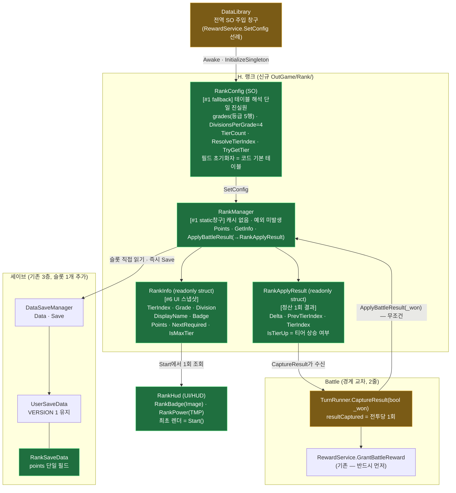

#### 흐름 시퀀스 — 전투 종료 → 로비 배지 갱신

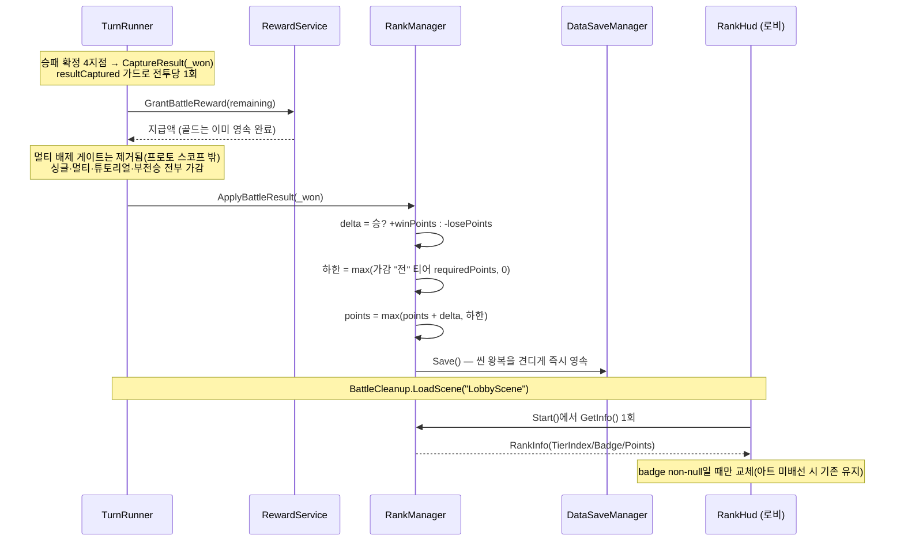

#### 원리 카드 — 왜 이렇게 생겼나

- **티어를 저장하지 않는 이유**: 티어는 `points`의 순수 파생("`requiredPoints <= points`를 만족하는 최대 인덱스, 없으면 0 클램프")이다. 도달 티어를 따로 저장하면 둘이 어긋날 때 어느 쪽이 진실인지 알 수 없다. **트레이드오프: 임계치 테이블을 나중에 상향하면 기존 유저가 소급 강등된다** — "절대 강등 없음"은 본질적으로 *역사적* 불변식이라 포인트만으로는 인코딩되지 않는다. 프로토타입이라 수용하고, SO 툴팁에 **"임계치는 하향만"** 저작 규칙을 남긴다(사용자 결정).
- **강등 없음의 구현**: 별도 상태가 아니라 **가감 시 하한 클램프**다 — `max(points + delta, max(가감 전 티어의 requiredPoints, 0))`. 이중 하한이라 음수도 불가능. 부작용: **갓 승급한 유저는 다음 승리 전까지 패배 비용이 0**(설계된 사각지대, 표시용이라 수용).
- **`Init`이 없는 이유**: 캐시를 두지 않고 세이브 슬롯을 직접 읽는다(`OutgameTutorialProgress` 패턴). 캐시의 유일한 이득인 읽기 성능이 여기선 0인 반면(조회 = 로비 진입당 1회), 캐시의 비용은 **`GameManager.Boot()` 수정 = 통합 부트 순서(동결 계약) 접촉**으로 최대다. `GameManager`가 `BeforeSceneLoad`+`DontDestroyOnLoad`라 **어느 씬에서 Play를 시작하든 `Load()`가 끝나 있다** — 캐시 패턴은 이 보장을 못 준다.
- **보상 뒤에 랭크를 두는 이유**: 랭크가 실패해도 골드는 이미 지급·영속 완료. 또 `RewardService`가 `CurrencyManager.Save()`로 캐시→슬롯 flush를 끝낸 뒤라 랭크의 `DataSaveManager.Save()`가 최신 골드를 쓴다(뒤집으면 낡은 골드 슬롯을 한 번 디스크에 쓰게 됨).
- **`try/catch`를 안 쓰는 이유**: 프로젝트에서 예외를 삼키는 곳은 `DataSaveManager.Load` 하나뿐. 대신 `RankManager`를 **예외를 던질 수 없게** 짠다(config null·빈 `grades`·null 등급 행·범위 밖 인덱스·슬롯 null 전부 폴백 — 등급 재설계 후에는 `RankConfig.ResolveTierIndex`/`TryGetTier`가 이 폴백을 한 곳에서 책임진다) — `RewardService`/`OutgameTutorialProgress`가 쓰는 방식.
- **의도적으로 덜어낸 2건**: ① `OnRankChanged` 이벤트 — 골드와 달리 **랭크는 로비에서 변동할 경로가 0**(전투 씬에서만 변함)이라 `Start`/`OnEnable` 재조회로 충분. 필요해지면 순수 추가라 🟢로 언제든 붙는다. ② 구간 진행률 필드 — 씬에 진행바가 없어 소비처 0.
  - (해제) `ApplyBattleResult` 반환값 — 결과 팝업이 랭크 증감을 연출하게 되면서 소비처가 생겼다. **클램프 뒤 실제 증감**(`저장 후 points - 저장 전 points`)을 돌려주므로 표시액과 저장값이 어긋날 수 없다. `TurnRunner.CaptureResult`가 받아 `GameResultPopup.Show(골드, 랭크델타)`로 넘긴다.
    - (확장, 2026-07-29) 반환 타입이 `long` → **`RankApplyResult`(readonly struct)**로 승격됐다. `Delta`에 더해 `PrevTierIndex`/`TierIndex`를 실어 **승급 여부(`IsTierUp`)를 재조회 없이** 알린다 — 델타만 주면 소비처가 티어를 다시 조회해야 하고, 그 사이 값이 바뀌면 연출과 저장값이 갈린다. 가감 **전** 인덱스는 강등 하한 계산에 이미 쓰던 값을 그대로 재사용해 조회가 늘지 않았다. **정산 후 총 포인트는 담지 않는다** — `RankManager.Points`가 이미 단일 진실원이라 이중 진실원이 된다.
- **수정 가능성 높은 지점**: 티어 수·이름·임계치·승패 포인트 = `RankConfig.asset`(코드 무수정) / 티어 배지 아트 = SO의 `badge` 슬롯 / 집계 제외 규칙(튜토리얼 등) = `CaptureResult`의 조건 1줄.

#### 함정 2개 — 구현 시 반드시

| 함정 | 왜 | 처방 |
|---|---|---|
| `RankHud`에 `GoldHud` 패턴 복제 | `GoldHud`의 `OnEnable` 즉시 렌더가 안전한 건 `CurrencyManager.Init()`이 `BeforeSceneLoad`에서 끝나기 때문. `RankConfig` 주입은 `DataLibrary.Awake`(순서 0)라 `RankHud.OnEnable`이 **먼저 돌 수 있다**(같은 씬, 둘 다 순서 0 = 비결정). 이벤트를 뺐으므로 잘못된 첫 렌더가 그대로 굳는다 | **최초 렌더는 `Start()`**(모든 `Awake` 이후 보장), `OnEnable`은 `m_started` 가드로 탭 재진입만 처리. `DataLibrary`에 `[DefaultExecutionOrder]`를 붙이는 건 전역 부트 계약 접촉이라 금지 |
| `RankConfig.tiers`를 빈 리스트로 방치 | `BattleReward`는 스칼라 필드라 `CreateInstance` fallback에서 기본값이 살지만 **`List<>`는 빈 리스트**가 된다. 게다가 `DataLibrary`는 **BattleScene에 없어서** 에디터에서 전투 씬을 직접 Play하면 **항상** fallback이 탄다 | `tiers`를 **C# 필드 초기화자로 기본 테이블** 채움(필드 초기화자는 `CreateInstance`에서 실행됨). 배지만 null → SO는 "튜닝·아트 주입 전용"으로 강등되고 기능은 코드가 보증 |

#### 씬 배선 (실측, 신규 노드 생성 0) — ✅ 완료

```
LobbyCanvas/LobbyRoot/Content/Tab_Match/MatchContent
├── RankReward  (BasicFrame 프리팹 인스턴스 + Button 추가)  → H-33에서 활성화 + onClick = RankRewardPanel.Open ✅
│   └── RankText (TMP = "랭크보상")   ⚠️ 티어 라벨이 아니라 버튼 캡션 — 건드리지 말 것
└── PlayBtn
    └── RankInfo  (RectTransform만)           ← RankHud 부착 ✅
        ├── RankPower (오벌 프레임 프리팹, 내부 TMP "Text" = "82")  → pointText ✅
        └── RankBadge (Image 230×230, y=+450)                     → badgeImage ✅
```

> 티어명은 **배지 스프라이트로 표현**하기로 결정(사용자) — `RankInfo` 하위에 티어명 TMP를 새로 만들지 않는다.
> `pointText`가 가리키는 TMP는 `RankPower` **프리팹 인스턴스 내부**의 자식(`Text`)이다 — 프리팹 자체를 수정한 게 아니라 씬 인스턴스의 자식을 참조만 한다.

#### 파일 지도 — 다이어그램에서 코드로

| 클래스 | 파일 | 태스크 | 상태 |
|---|---|---|---|
| `RankSaveData` | `OutGame/Save/2.Domain/RankSaveData.cs` (+ `UserSaveData.rank` 슬롯) | H-28 | ✅ 코드 |
| `RankConfig`(SO) · `ERankGrade` · `RankGradeConfig`(저작) · `RankTier`(파생 struct) | `OutGame/Rank/RankConfig.cs` | H-30 | ✅ 코드 (`RankTier.Index`는 **예약 — 읽는 소비처 없음**) |
| `RankManager` · `RankInfo` | `OutGame/Rank/RankManager.cs` | H-29 | ✅ 코드 (`RankInfo.Grade`·`Division`은 **예약 — 읽는 소비처 없음**) |
| 전투 훅 | `Battle/TurnRunner.cs` `CaptureResult` 1줄 | H-31 | ✅ 코드 |
| SO 주입 | `Utils/DataLibrary.cs` 필드1+호출1 | H-30 | ✅ 코드 (`RankConfig.asset`은 사용자 인계) |
| `RankHud` | `UI/HUD/RankHud.cs` | H-32 | ✅ 코드 + 씬 배선 |

#### CORE 구현 결과 (2026-07-27) — 소비자가 알아야 할 것

- **기본 테이블(코드 필드 초기화자)**: **등급 5행 × 4단계 = 20티어**(20행 손저작이 아니라 등급 5행에서 **파생**). `브론즈 1~4(0/25/50/75) → 실버 1~4(100~175) → 골드 1~4(200~275) → 플래티넘 1~4(300~375) → 다이아몬드 1~4(400~475)`, 균등 25포인트 간격. `winPoints=10` · `losePoints=5`. 각 등급 4단계에서 다음 등급 `entryPoints`를 넘기면 **인덱스 연속성으로** 다음 등급 1단계가 된다(브론즈 4 → 실버 1). `RankConfig.asset`이 없어도 이 20티어로 동작한다 → **배지 아트**가 사용자 인계분(등급당 1장 = `RankGradeConfig.badge`, 4단계 공용). `long` 필드에 `[Min]`은 붙이지 않는다(Unity `MinDrawer`가 `intValue`로 잘라낸다 — `BattleReward` 선례).
- **등급 × 단계 재설계(후속)**: 등급이 `ERankGrade` enum으로 승격돼 코드에서 참조 가능해졌고, 승급 규칙이 `RankConfig`의 파생 공식(`tierIndex = gradeIndex * 4 + (division-1)`)으로 명시됐다. 티어 해석은 `RankConfig.ResolveTierIndex` / `TryGetTier` **단일 진실원**에 모였고(두 매니저에 흩어져 있던 `ResolveTierIndex`/`ResolveTierFloor`/`FindNextTier`/`FindTier` 제거), `RankTier`는 저작 class → **파생 `readonly struct`**가 됐다. `DisplayName`은 생성자에서 정규화돼 조회 실패(`RankTier.None`)에도 빈 문자열이 보장된다 — 단 **조회 실패 판정은 `TryGetTier` 반환값으로만** 한다(`None`의 `Index=0`·`Grade=Bronze`는 유효한 브론즈 1과 값으로 구분되지 않는다). 세이브 스키마(`points`/`claimedCount`)와 티어 인덱스 의미는 **불변**.
- **예약 API(읽는 소비처 0, 데드코드 아님)**: `RankInfo.Grade` · `RankInfo.Division` · `RankTier.Index`. 등급을 코드에서 참조 가능하게 만든 것이 이번 재설계의 목적이고, 등급 단위 뱃지/색상 분기·"실버 3" 형태 분해 표시가 붙을 확장 축이다. 제거하지 말 것.
- **최대 티어면 `NextRequired == Points`**(0 아님) — "남은 = `NextRequired - Points`"가 모든 티어에서 성립해 HUD가 `IsMaxTier` 분기 없이 진행률을 계산해도 0 나눗셈이 안 난다.
- **`DisplayName`은 항상 non-null**(미저작·빈 테이블이면 `string.Empty`). **`Badge`는 null 가능** → HUD는 non-null일 때만 스프라이트를 교체한다(아트 미배선 시 씬 기존 이미지 유지).
- **`Config`·`Save()`는 private** — 공개 API는 `Points`/`GetInfo`/`ApplyBattleResult`/`SetConfig`/`ResetForDebug` 5개뿐.
- ⚠️ **이름 겹침**: 로비 씬 노드 `RankInfo`(RectTransform, `RankHud` 부착 지점)와 C# `RankInfo`(struct)는 이름만 같고 무관하다.

#### HUD 구현 결과 (2026-07-27) — 도메인 H 코드 종결

- `RankHud`는 **`RankInfo` 스냅샷의 6필드 중 2개만 소비**한다 — `Badge`(Image 교체) · `Points`(TMP). `DisplayName`은 티어를 배지로 표현하기로 해서 소비처가 없고, `TierIndex`/`NextRequired`/`IsMaxTier`도 미소비(진행바 없음 + `IsMaxTier` 분기는 빈 tiers 오표시 위험).
- **렌더 진입점은 `Render()` 하나**, 호출자는 `Start()`(최초 1회)와 `OnEnable()`(`m_started` 가드 → 탭 재진입만). 이벤트 구독 0이라 `OnDisable`이 없다 — 해제 누락 위험도 구조적으로 없다.
- **배지 진실원은 `RankGradeConfig.badge` 단 하나**(사용자 결정, 등급 재설계 전에는 `RankConfig.tiers[].badge`). HUD에 `Sprite[]` 폴백 배열을 두지 않는다 — 아트 미저작이면 `Badge == null`이라 씬에 배선된 기존 스프라이트가 그대로 남는다.
- 도메인 H는 이걸로 **코드 100% 종결**. 남은 건 전부 에셋/아트: `RankConfig.asset` 저작·배선(✅ 완료), **등급 배지 스프라이트 5장**(등급 단위, 4단계 공용 — L931과 동일 규약). 없어도 20티어 기본 테이블 + 씬 기본 배지로 동작한다.

---

### H-33. 랭크 티어 달성 보상 — ✅ 완료 (2026-07-27, 코드 + 씬 저작)

> 표시용 진행도였던 랭크에 **보상 엔드포인트**를 붙인다. 티어에 도달하면 골드를 **순차로 1회씩** 수령한다.
> **`RankManager`는 무수정** — 보상은 신규 static 창구 `RankRewardManager`로만 흐르고, 달성 판정만 `RankManager.GetInfo()`에 위임한다(동결 계약 무접촉).
> ⚠️ 이 "무수정·동결" 서술은 **H-33 시점 기록**이다. 이후 등급 재설계에서 **동결이 해제**돼 `GetInfo`·`ApplyBattleResult`가 재작성되고 private 헬퍼 3개(`ResolveTierIndex`/`ResolveTierFloor`/`FindNextTier`)가 제거됐다. 공개 API·불변식은 보존됐다(아래 재설계 항목 참조).
> 스코프: 골드 1종(프로젝트 재화가 `Gold` 단일) · 20티어 전부 · 광고 2배 없음.

#### 구조 지도 — 판정/영속/표시


#### 원리 카드 — 왜 이렇게 생겼나

- **수령 상태가 정수 1개인 이유**: 티어는 강등이 없으므로(`ApplyBattleResult`의 하한 클램프) 도달 집합이 항상 `[0..TierIndex]` **프리픽스**다. 수령 집합도 프리픽스로 두면 상태공간이 정수 하나로 접힌다. `bool[20]`이나 키 리스트는 "구멍 뚫린 수령"처럼 **불변식이 허용하지 않는 상태까지 표현**할 수 있어 버그 표면이 넓어지고, 티어 테이블 길이가 바뀌면 마이그레이션이 필요하다.
- **센티널(`-1`) 대신 개수인 이유**: 세이브는 `JsonUtility.FromJson`으로 읽는다. `0`이 곧 "미수령"이면 구 세이브·노드 재작성 어느 경로에서도 "이미 받음"으로 오판할 수 없다. `-1` 초기화자에 의존하면 직렬화기 동작에 안전성이 묶인다.
- **보상량을 등급 행에 넣은 이유**: 별도 SO로 분리하면 두 리스트를 인덱스 정렬 상태로 **사람이** 유지해야 한다(도감이 이미 rowKey 드리프트로 겪은 문제). 임계치와 같은 원소(`RankGradeConfig`)에 두면 어긋남이 구조적으로 불가능하다.
- **`Claimed`를 가장 먼저 판정하는 이유**: `RankManager.ResetForDebug()`는 `points`만 0으로 되돌려 `claimedCount > 도달티어` 구간을 만든다. `Claimable`을 먼저 보면 그 구간에서 **재수령이 뚫린다**.
- **영속을 `CurrencyManager.Save()` 하나로 끝내는 이유**: 그 메서드가 골드를 슬롯에 flush한 뒤 `DataSaveManager.Save()`를 부른다. 앞에 `DataSaveManager.Save()`를 따로 세우면 **"커서만 오르고 골드는 미반영"인 중간 상태가 한 번 디스크에 쓰인다**(그 사이 크래시 = 골드만 유실).
- **행이 스냅샷을 캐싱하지 않는 이유**: `RankRewardRowView`는 티어 인덱스만 들고 `Refresh()`마다 `GetInfo`를 재조회한다. struct를 캐싱하면 수령 후 stale이 되고, 패널이 갱신 때마다 스냅샷을 나눠줘야 해서 결합이 늘어난다.
- **승급 결과를 씬 캐리어로 넘기는 이유 (2026-07-29 추가)**: 정산은 전투 씬에서 끝나는데 보상 패널은 로비에만 있다. 그 사이를 잇는 게 `RankUpHandoff` — `TurnRunner`가 `RankApplyResult`를 통째로 싣고, `RankRewardPanel.Start`가 `TryConsume`으로 1회 꺼내 패널을 자동으로 열고 도달 행을 연출한다(`PackHandoff`의 "1회 소비 후 홀더 비움" 규약 그대로). **자체 세이브 없음** — 포인트는 `ApplyBattleResult`가 이미 즉시 영속했고, 캐리어는 "이번 왕복"의 휘발 컨텍스트만 나른다. bool+int를 나란히 두지 않고 **nullable DTO 홀더 1개**라 "pending 여부"와 "값"이 갈라질 수 없다. 로비 도달 전 연속 전투가 나면 **더 높은 티어가 이기고**(강등·동일 티어는 기존 값 유지), `PrevTierIndex`는 최초 값을 유지한 채 `Delta`를 누적한다 → 캐리어의 의미는 "시작 티어 → 도달 티어, 그 사이 총 증감"이다.
- **패널이 `PooledUIBase`가 아닌 이유**: 사용자 결정으로 씬 직접 저작이다. `UIPoolManager` 캔버스(1440×2960)는 `LobbyCanvas`(1080×1920)와 해상도가 달라 큰 레이아웃에서 좌표계가 어긋난다. 씬 저작이면 Addressable 등록·소팅 오더 문제도 함께 사라지고, 수령 팝업이 패널의 자식이라 항상 그 위에 뜬다.

#### 함정 5개

| 함정 | 왜 | 처방 |
|---|---|---|
| **인스펙터에서 `grades`에 빈 행 추가** | 신규 원소는 `entryPoints=0`·`pointsPerDivision=0`이라 **역순 스캔이 그 행의 4단계를 즉시 매치**한다 → 포인트와 무관하게 전 유저가 최상위 티어로 점프하고, 20행 보상이 통째로 수령 가능해진다(순차 커서가 끝까지 열림) | 저작 규율로만 막는다 — **신규 행은 값을 채운 뒤 저장**. `OnValidate` 검증 가드는 프로토 스코프 밖이라 넣지 않는다 |
| **`grades`에 null 등급 행** | `TierCount`는 null 행도 4티어로 세지만 `TryGetTier`는 그 행에서 `false` → 패널은 행을 만들되 `Claim`이 커서를 못 올려 **그 지점부터 순차 수령이 영구 정지** | 구 `List<RankTier>` 구조와 동일한 성질이라 **회귀 아님**. Unity 직렬화상 null 원소 실현이 어려워 코드 가드 없이 방치(기록만) |
| `rowPrefab`을 Content 안의 목업 행으로 배선 | `Build()`가 Content 자식을 전부 지우면 프리팹 참조가 fake-null이 되어 **다음 Open부터 행 0개** | 원본은 숨기기만 하고 Destroy 제외 + 사본을 `SetActive(true)` (구현 반영됨) |
| ~~`RankConfig.asset`의 `rewardGold`~~ | YAML엔 키가 **없는데** 런타임엔 값이 산다 — Unity가 초기화자로 만든 원소를 재사용하고 없는 필드를 덮어쓰지 않기 때문. 즉 **값이 에셋이 아니라 코드에 묶여 있었다**(전 티어 0골드 표시) | ✅ **해소(등급 재설계 시)**: `grades` 5행을 YAML에 직접 저작하며 `rewardGold`/`rewardGoldPerDivision`를 굳혔다. 코드 필드 초기화자와 값 일치 |
| `RankReward` 활성화만 하고 중복 `RankHud`를 방치 | `Tab_Match`에 붙은 두 번째 `RankHud`의 `badgeImage`가 **`RankReward` 프리팹 내부 Image**를 가리킨다 → 배지 아트를 저작하는 순간 보상 버튼 아이콘이 티어 배지로 덮인다 | 버튼 활성화와 컴포넌트 제거를 **한 세트로** 처리 → ✅ **해소(2026-07-27)**: 활성화와 동시에 `Tab_Match`의 `RankHud` 제거. 정상본(`PlayBtn/RankInfo`) 1개만 잔존 |

#### 씬 저작 (2026-07-27, Unity MCP `Unity_RunCommand`)

`RankRewardOverlay`는 `LobbyCanvas` **직속**(`LobbyRoot` 밖, `DragLayer` 다음 = 최상단 렌더).

```
LobbyCanvas
└── RankRewardOverlay        RankRewardPanel        ← 항상 활성 (OnEnable 구독이 살아야 한다)
    └── Root                                        ← 토글 대상(= root 필드). 저작 기본값 비활성
        ├── Dim              Image(α .72) + Button  → onClick = RankRewardPanel.Close
        ├── Panel            940 × (H−360)
        │   ├── TitleRibbon 560×116 → TitleText "랭크 보상"
        │   ├── CloseButton ⌀104 (onClick 영구배선 없음 — OnEnable이 런타임 등록)
        │   └── Scroll       ScrollRect(vertical)
        │       └── Viewport RectMask2D
        │           └── Content  VerticalLayoutGroup + ContentSizeFitter
        │               └── MockRow_0..2 (디자인타임 목업 — 런타임 Build()가 파괴)
        └── ClaimPopup       RankRewardClaimPopup   ← Root 안 = Root가 꺼지면 구조적으로 못 남는다
            ├── PopupDim     Button → onClick = RankRewardClaimPopup.Hide  (취소 경로)
            └── PopupFrame   760×760 (리본 · 골드 아이콘 · 금액 · [획득])
```

행 프리팹 `RankRewardRow.prefab` (848×208 = 카드 164 + 쉐브론 44):
`RowCard`(연하늘) → `Badge` · `TierName` · `RewardBox`(Button, 골드아이콘+금액) · `Highlight`(9-slice 링, `fillCenter=false` + `pixelsPerUnitMultiplier=4`) · `ClaimedMark` · `LockDim`(raycastTarget ✔ = 미달성 클릭 물리 차단) → `LockIcon`. 형제 순서상 `LockDim`이 최상단.

> **`Highlight`에 `pixelsPerUnitMultiplier`가 필요한 이유**: `BasicFrame_Rectangle01_l`은 원본 92×93에 보더 46/46/46/47이다. 높이 164 카드에 `fillCenter=false`로 깔면 상하 보더 93이 카드 대부분을 먹어 **링이 아니라 노란 판**이 된다. 배율 4로 보더를 ~11px로 줄여야 테두리로 읽힌다.
>
> **상태 아이콘을 보상 박스 안 우측에 두는 이유**: 박스 정중앙에 두면 `x100` 텍스트를 가린다. 박스를 340으로 넓히고 `AmountText`의 `offsetMax`를 −78로 밀어 아이콘 자리를 비웠다.
>
> **캡처 방법**: `LobbyCanvas`는 ScreenSpaceOverlay라 `Unity_Camera_Capture`·`Capture2DScene` 어느 쪽에도 렌더되지 않는다. 검수 스크린샷은 `Root`를 임시 WorldSpace 캔버스에 복제해 찍고 복제본을 지웠다(원본 무접촉).

#### 파일 대응

| 산출 | 경로 | 상태 |
|---|---|---|
| 보상 창구 · `RankRewardInfo` · `ERankRewardState` | `OutGame/Rank/RankRewardManager.cs` | ✅ 신규 |
| 수령 커서 | `OutGame/Save/2.Domain/RankSaveData.cs` (`claimedCount`) | ✅ 필드 추가 |
| 보상 테이블 | `OutGame/Rank/RankConfig.cs` (`RankGradeConfig.rewardGold` + `rewardGoldPerDivision`) | ✅ 필드 추가 |
| SO 주입 | `Utils/DataLibrary.cs` 1줄 | ✅ |
| 패널 · 행 · 수령 팝업 | `UI/Rank/RankRewardPanel.cs` · `RankRewardRowView.cs` · `RankRewardClaimPopup.cs` | ✅ 신규 |
| 승급 씬 캐리어 · `RankApplyResult` | `OutGame/Rank/RankUpHandoff.cs` · `OutGame/Rank/RankManager.cs`(struct 추가 + 반환 타입 승격) | ✅ 신규 (2026-07-29) |
| 전투 보상 씬 캐리어 (보상 도메인 파일 — 같은 1회 소비 캐리어 규약이라 여기 나란히 기재) | `OutGame/Reward/BattleRewardHandoff.cs` · `Battle/TurnRunner.cs`(`CaptureResult` 1줄, `RankUpHandoff.Set` 바로 위) — 지급·영속은 `RewardService.GrantBattleReward`가 이미 끝냈고 캐리어는 표시량만. **F-20에서 폐기했던 캐리어를 로비 획득 연출 요구로 되살림** | ✅ 신규 (2026-07-30) |
| 씬 노드 · 행 프리팹 | `LobbyScene.unity`(`RankRewardOverlay`) · `Assets/Assets/Prefabs/UI/RankUI/RankRewardRow.prefab` | ✅ 저작 완료 (Addressable 등록 없음 — 풀드 UI가 아니다) |
| 알림 점 | `UI/Rank/RankRewardAlertDot.cs` (`HasAnyClaimable` 단일 판정 + `OnChanged` 구독) | ✅ 신규 (2026-07-29, 씬 배선 대기) |
| 팝업 등장·퇴장 연출 | `UI/Common/PopupTransition.cs` (MonoBehaviour 아님 — 씬 저작 뷰가 필드로 소유. 패널·수령 팝업 공용) | ✅ 신규 (2026-07-29) |

- ✅ 해소: 수령 팝업 취소 경로(`PopupDim` Button → `Hide()`, 코드 수정 0) · 중복 `RankHud`(제거 완료) · `HasAnyClaimable` 소비처(`RankRewardAlertDot`) · `OpenAt`의 매회 전행 재생성(최초 1회 `Build` + 이후 `RefreshRows`).
- 미해결(후속 후보): 스크롤 위치가 행 인덱스 비율 근사(행 높이 미반영) · `RankConfig`가 두 static 캐시에 이중 보관(부트가 둘 다 주입해 현재 실해 없음) · 등급 배지 아트 미저작 → 행 프리팹의 별 아이콘 1종이 전 티어 공통.
  - ✅ 목록에서 제거: `RankConfig.asset`의 `rewardGold` YAML 미저작 — 등급 재설계 때 `grades` 5행을 직접 저작하며 해소(위 함정 표 참조).
