# 아웃게임 구조도 (STRUCTURE)

> 사용자의 설계 승인과 구조 파악의 기준 문서.
> 도메인 설계 확정 시, 구조 변경 시마다 갱신한다 (CLAUDE.md 아웃게임 운영 정책).
> 갱신 주체: outgame-engineer 또는 메인. 근거 없는 노드 금지 — 실제 파일이 있거나 승인된 설계여야 한다.

## 갱신 이력

| 날짜 | 변경 | 승인 |
|---|---|---|
| (초기) | 문서 생성. 도메인 수준 뼈대만 반영, 클래스 수준 구조도는 idioms-onboarding 역주행 및 다음 설계 세션에서 채운다 | - |
| 2026-07-23 | Collection(B/C) 클래스 수준 구조도 추가 (idioms-onboarding 역주행, 구현 완료분 기준) | - |
| 2026-07-24 | Save·재화(A) 섹션 추가 — **시각 브리핑 형식 기준 예시**(구조 지도+시퀀스+원리 카드+파일 지도). 이후 모든 브리핑·recap은 이 형식을 따른다 | - |
| 2026-07-24 | **F-17/F-18 생산 UI 배선 설계 추가 (⬜ 승인 대기)** — 도감 갤러리에 행 생산상태·수확·진행바·완성보상·골드 HUD를 매니저 API에 연결. 신규 노드는 `:::new` 표식 | ⬜ |
| 2026-07-24 | **F-17/F-18 생산 UI 배선 구현 완료 (Phase 2)** — RowView 상태칩·수확, Controller 폴링, ProgressView/CompletionRewardView 신규. 매니저·세이브·재화 계약 불변(순수 소비). 손 배선 인계 `COLLECTION_UI_WIRING.md` | ✅ |
| 2026-07-24 | **씬/프리팹 실배선 완료 (`CollectionTest.unity`)** — RowView `stateLabel`/`harvestButton`/신규 `productionFill`(Fill을 Filled로 전환·진행바 구동)+Status 활성화, 씬 `CompletionRewardView`(BottomBar)·`GoldHud` 부착. `EnsureBoot`에 Load/CurrencyInit 보강. 에디터 검증: 5h경과 fill 0→0.208, 수확 gold 0→50, 에러 0 | ✅ |
| 2026-07-24 | **생산 진행바 = 단위 사이클 + 행별 전용 뷰로 정리** — 진행바 의미를 `누적/상한`→`다음 1단위까지 사이클 진행률`(`CycleProgress01`)로. `CollectionProgressView`를 소유 집계 바에서 **행별 생산 진행바**로 재작성(행 키 `Bind`), RowView는 원시 `productionFill` 제거 후 이 뷰에 위임. 프리팹 `Status/Progress`에 ProgressView 부착. 저장·수확 계약 불변 | ✅ |
| 2026-07-24 | **E. 카드팩 경제 클래스 구조 추가 (⬜ 설계 승인 대기)** — `CardPackData`/`CardShop`(SO)·`CardPackOpener`(static)·`OpenedPack`(값). E는 자체 세이브 없는 **A(재화)·B(소유) 오케스트레이터**. 구매=즉시개봉(팩 재고 없음)·**팩별 지정 풀 드로우**·**중복 시 소액 골드 환급**. 신규 노드 `:::new` | ⬜ |
| 2026-07-24 | **E. 카드팩 경제 구현 완료 (E-14/15/16)** — `OutGame/CardPack/`에 4파일 생성. 설계와 일치. API 확정: 배선 `SetShop(CardShop)`, 결과 `OpenedPack`(class)+`DrawnCard`(readonly struct)+`EPackOpenResult`(enum: Success/PackNotFound/InsufficientGold/EmptyPool/SpendFailed). 로컬 `System.Random`. 재화·소유 계약 순수 소비(불변). SO 에셋 생성·상점 배선은 사용자/메인 검증 | ✅ |
| 2026-07-24 | **tcg-reviewer 심화 재검 반영 (2건 수정)** — ① **무료팩 허용**: 공유 재화 API `CurrencyManager.Spend` 계약 변경(0 이하 거부→음수만 거부, 0은 잔액변경 없이 성공). price=0 팩 구매 가능해짐(사용자 지시). Spend 사용처는 CardPackOpener 1곳뿐 → 회귀 없음. ② **null 풀 방어**: 드로우 시 null 카드 항목 `continue` 스킵(환급 오지급 차단). #3 저장순서(유저 유리, 재화 유실 없음)는 프로토타입 무시·기록만. 컴파일 에러 0 | ✅ |
| 2026-07-27 | **PKG-BOOT 통합 부트 배선 (✅ 구현+검수 완료)** — `MainMenuInitializer`에 `[SerializeField] CardShop cardShop` + `CardPackOpener.SetShop(cardShop)` 1줄 추가. `Load`/`CurrencyInit`은 `GameManager.Boot()`가 이미 소유 → 중복 미추가(부트 2계층 확정). null→빈 상점 fallback으로 PKG-TUNE 에셋과 독립 진행. 계약 동결 표 "통합 부트 순서" 🧊 동결. tcg-reviewer 검수: 발견 0(경계·이중진실원·계약 무결). 에셋 배선·Play 통합검증은 사용자 재량 | ✅ |
| 2026-07-24 | **F-19 카드팩 개봉 루프 (✅ 구현+검수 완료)** — 스코프 최종 축소: 상점 목록·독립 씬·MainMenu 진입 전부 제외. **카드팩 클릭→개봉 연출+카드 순차 등장→획득** 루프만. `PackOpeningView`(연출 오케스트레이션·옵션 EnsureBoot)+`RevealCardView`(카드 등장 애니·신규/중복 뱃지) 2클래스. 단일 팩 버튼(고정 packId), 팝업 풀링 미사용(씬 상주 뷰), DOTween 연출. 순수 뷰(세이브 없음), E `CardPackOpener` 소비. **tcg-reviewer 검수: 계약·경계·이중처리 무결, 코루틴 안전성 2건(좀비 잠금·트윈 미정리) 수정**(try/finally+OnDisable StopAllCoroutines/DOKill, RevealCardView OnDestroy DOKill). 컴파일 0. 연출·배선은 Play 검증 대기 | ✅ |
| 2026-07-24 | **F-19 개봉 인터랙션 재구현 (스택→드래그 넘김→2×3 그리드)** — `PackOpeningView`를 순차 등장 코루틴에서 **상태머신(Idle/Stacking/Grid)** 으로 재작성. `RevealCardView`에 월드 드래그(`OnMouseDown/Drag/Up`+`ScreenToWorldPoint`)·`SetDraggable`/`SetSortingOrder`/`FadeIn/Out`/`MoveTo`·`SetSwipeCallback` 추가(스케일인 Reveal→데이터 바인딩만). 넘긴 카드는 파괴 안 하고 그리드 재사용. 재진입=상태가드, `OnDisable`에서 카드 트윈 `KillAllTweens`. 계약(CardPackOpener/OpenedPack/CurrencyManager/OwnershipManager) 불변·순수 뷰. 컴파일·드래그/연출은 메인/사용자 검증 대기 | ✅ |
| 2026-07-24 | **tcg-reviewer 검수 + nit 3건 수정** — critical/warn 0(이중처리·계약·경계·재클릭·좀비트윈 무결). 개선: ① Grid enum 데드상태→그리드 연출 완료까지 Grid 유지 후 Idle(`CoGridToIdle`) ② 드래그 중 `SetDraggable(false)` 시 홈으로 즉시 리셋(잔상 방지) ③ 복귀 중 재드래그 드리프트→홈 슬롯(`m_homeLocalPos`) 기준 고정. OnDisable 잔상 2건은 의도(다음 개봉 ClearSpawned 정리)로 유지. 컴파일 0 | ✅ |
| 2026-07-27 | **PKG-TUNE 튜닝 SO 부트 배선 (✅ 코드+검수 완료)** — 미배선이던 두 SO 부트 주입을 코드로 실현: `RewardService.SetConfig`→`DataLibrary.InitializeSingleton`(GameTiming 선례 복제, `[SerializeField] BattleReward`), `CatalogRows.SetLayout`→`MainMenuInitializer.Awake`(SetSource 직후, `[SerializeField] CollectionLayoutConfig`). 보상 공식은 현행 유지(승패 무관 `Max(cards×perCard, minGold)`, 필드 확장 없음 — 사용자 결정). `BattleReward` Tooltip 오타만 수정. CardShop은 PKG-BOOT 배선분 재사용. 미배선(null) 시 기존 fallback 보존(null-safe). tcg-reviewer: critical/warn 0(경계·이중진실원·계약·결정론 무결). 에셋 생성·인스펙터 할당·Play E2E는 사용자 인계 | ✅ |
| 2026-07-24 | **구매 흐름 디버그 E2E 검증 통과 (Unity_RunCommand, 인메모리 격리)** — 6케이스: 잔액부족(InsufficientGold·차감0)/성공신규(−50+환급, 소유부여)/중복환급(−50+10×중복)/무료팩(price0 Success=Spend수정검증)/팩없음(PackNotFound·차감0)/실SO진단. 차감·환급 산술 정확, 격리로 실 세이브 미오염 확인. **미결(사용자 조치): 실제 `NormalPack.Pool` 비어있음(poolCount=0→EmptyPool), packId='0'** — 에디터에서 Pool 카드 채우고 packId 의미있는 값 권장 | ✅ |
| 2026-07-27 | **G. 신규 유저 온보딩 도메인 구조 추가 (⬜ 설계 승인 대기)** — 첫실행(소유==0) 감지 → 스타터팩(price0·6장) 개봉(F-19 뷰 재사용) → 튜토리얼 전투(TutorialConfig) 직행. 신규: `BootScene`+`BootRouter`(index0 라우팅), `FirstTimeOnboardingController`. 계약변경 2건(GrantDefaults 미지급·부트 앞단 라우팅)은 🔴 선행. G도 자체 세이브 없음(OwnedCount 판정). 신규 노드 `:::new` | ⬜ |
| 2026-07-27 | **G-27 PKG-FIRSTBATTLE 온보딩 컨트롤러 (✅ 코드, 컴파일 검증 대기)** — 신규 `Assets/Scripts/UI/Onboarding/FirstTimeOnboardingController.cs`(MonoBehaviour, 온보딩 씬 상주): `[SerializeField] PackOpeningView packView` + `TutorialScenarioData scenario` + `battleSceneName="BattleScene"`. `OnEnable`에서 `packView.OnOpenComplete += 핸들러` 구독 / `OnDisable`에서 해제(누수·중복 구독 방지). 핸들러는 `TutorialConfig.Begin(scenario)` → `SceneManager.LoadScene("BattleScene")` — **`TutorialSetupUI.StartBattle` 호출 패턴 그대로 미러링**(중복 진실원 없음, 동일 API). 중복 전이 차단 `m_transitioned` 가드로 콜백 2회 와도 LoadScene 1회. 개봉 시작은 `PackOpeningView` 자체 팩버튼(순수 뷰)에 위임 — 컨트롤러는 완료만 수신(자동시작 없음, 온보딩 흐름 자연스러움 + 진실원 단일화). 아웃게임 상태(소유·재화) 무접촉 — Grant/차감/Save는 `TryPurchase`가 이미 원자 처리. `Network/` 무수정. **온보딩 씬(.unity) 신설·배선(packView/scenario 할당·Build Settings 등록·`BootRouter.onboardingScene` 지정)은 에디터(사용자) 인계**. Unity 컴파일·개봉→전투 E2E 검증 대기 | ✅(코드) |
| 2026-07-27 | **G-24 부트 라우터 (✅ 코드, 컴파일 검증 대기)** — 신규 `Assets/Scripts/Core/BootRouter.cs`(MonoBehaviour, BootScene 상주): `Start()`에서 첫실행 판정 → 라우팅. 판정은 `OwnedCount`(Init 필요)가 아니라 신규 `OwnershipManager.HasAnyOwnedSaved()`(세이브 슬롯 직접 조회, read-only)로 — BootScene엔 `MainMenuInitializer`가 없어 소유 캐시가 미초기화일 수 있으므로 **씬 config 주입 순서와 무관**하게 안정. 슬롯 매핑(`ownership.ownedCardKeys`)은 여전히 `OwnershipManager` 단일 창구 내부에만. 목적지는 `[SerializeField] lobbyScene="LobbyScene"` / `onboardingScene=""`(후속 PKG-FIRSTBATTLE 배선; **미설정 시 LobbyScene fallback + 경고** → 미존재 씬 크래시 방지). `GameManager`·`Battle/`·`Network/` 무수정. **BootScene(.unity) 신설·빌드 index0 교체는 에디터(사용자) 인계**. Unity 컴파일·부트 E2E 검증 대기 | ✅(코드) |
| 2026-07-27 | **G-23 소유 기본지급 제거 (✅ 구현, 컴파일 검증 대기)** — `OutGame/Collection/OwnershipManager.cs`: `Init()`의 `GrantDefaults()` 호출 제거 + 메서드 **삭제**(no-op 존치 아님; 전체지급 경로는 `OwnershipDebugTool`로 일원화·중복 제거). `OwnershipSaveData.defaultsGranted`는 하위호환 위해 **존치**(미사용 주석화). 공개 API 시그니처 불변, 기존 소유 세이브 보존(읽기만·자동 Save 없음). 회귀 점검: 도감 갤러리 전부 잠김·NRE 없음, 덱빌더는 소유필터 미구현이라 무관. **Unity 컴파일·신규/기존 유저 부트 E2E는 에디터(사용자) 검증 대기** | ✅(코드) |
| 2026-07-27 | **G 진입 = BootScene 제거 + 로비 첫실행 리다이렉트 (✅ 코드, 컴파일 대기)** — 사용자 결정: 별도 `BootScene`/`BootRouter` 폐기. 앱은 기존대로 `LobbyScene`(index0) 직행하고, 로비 상주 신규 `UI/Lobby/LobbyFirstRunRedirect`가 `Start`(MainMenuInitializer.Awake[-100] 주입 후)에서 `HasAnyOwnedSaved()==false`면 `TryPurchase(starterPackId)`→`PackHandoff.Set(opened, "BattleScene", true)`→`LoadScene("PackTest")`, 실패 시 로비 유지. 상점→팩 전환과 동일 경로를 첫실행이 자동으로 탄다. Build Settings에 BootScene 불필요(PackTest/BattleScene만 등록). 잔여 엣지(획득 전 종료 시 튜토리얼 스킵)는 현행 유지 | ✅(코드) |
| 2026-07-27 | **G 카드팩 오픈 3D 뜯기 재구성 (✅ 코드+검수, 씬/컴파일 대기)** — 사용자 결정: `PackOpeningView`(팩버튼 구매) 폐기, **구매를 뷰 밖으로**(상점/`BootRouter`가 `TryPurchase` 후 static 캐리어 `PackHandoff`(Pack·NextScene·StartTutorial)로 전달), 앞단을 **3D `CardPack.prefab` 가로 드래그 봉인뜯기**로 교체. 신규 4: `PackHandoff`(OutGame/CardPack), `PackTearOpenView`(뜯기→스택→그리드, 구 꼬리 이식), `PackTearHandle`(SealStrip 월드드래그), `PackAcquireController`(캐리어 소비·획득버튼·목적지 이동). `BootRouter` 첫시작 분기가 스타터 구매→캐리어→PackTest(실패 시 로비 fallback). 목적지·튜토리얼이 캐리어에 실려 **첫시작 재판정 불필요 → `FirstStartBattleRedirect`·`PackOpenSceneController` 폐기**. 삭제 3파일 GUID 전수검색 참조 0. `RevealCardView` 재사용. tcg-reviewer 검수 진행. **씬 배선(CardPack에 PackTearHandle·MainCamera 태그)·Unity 컴파일은 사용자** | ✅(코드) |
| 2026-07-27 | **G-25/26/27 온보딩 흐름 (✅ 코드+검수, 씬/컴파일 대기) — 흐름 재설계 반영** [※ 아래 항목은 위 3D 뜯기 재구성으로 대체됨] — 사용자 결정: 공용 팩 오픈 씬 `PackTest.unity` 재사용(상점 개봉 = 첫시작 온보딩 공유), 개봉 후 **[획득] 버튼** 클릭 게이트, **일반=로비 고정 / 첫시작=튜토리얼 전투** 분기. 구현: `PackOpeningView.OnOpenComplete`(빈개봉도 발화=데드락 방어), 신규 `UI/Shop/PackOpenSceneController`(획득버튼 게이트·[획득]→`DestinationScene`(기본 로비)·`BeforeLeave` 훅, **Battle 미참조 순수 UI**), 신규 `UI/Onboarding/FirstStartBattleRedirect`(`[RequireComponent]`, 첫시작만 `HasAnyOwnedSaved()`로 판정해 목적지→배틀+`TutorialConfig.Begin`, scenario null이면 로비 fallback). 첫시작 판정은 **개봉 전 Start**에 캡처. tcg-reviewer 2라운드: 경계·타이밍·중복전이 무결, 미배선 소프트락 warn 2건 수정(경고 로그·scenario null 로비 fallback). ~~FirstTimeOnboardingController~~ 폐기(2컴포넌트로 분리). 씬 배선·Unity 컴파일은 사용자 인계 | ✅(코드) |
| 2026-07-27 | **G-28 개봉 연출 단순화 (✅ 코드+검수+씬배선+컴파일 완료, Play 검증 대기)** — 사용자 결정: 드래그 뜯기·카드별 스와이프 스택 전면 폐기. **3D 팩 클릭 1회 → 팩 숨김 → UI 패널(CanvasGroup) fade in → fade 완료 후 3열 GridLayoutGroup 배치 → [획득] → 덱 슬롯0 저장 → 목적지 씬**. 삭제 4: `PackTearOpenView`·`PackTearHandle`·`RevealCardView`·`RevealCardView.prefab`(GUID 잔존 참조 0). 신규 2: `PackRevealView`(Idle→PackShown→Revealing→Done), `PackClickHandle`(OnMouseUpAsButton·Arm/Disarm). 카드 표시는 도감 타일 `CollectionCardView` 재사용(표시 진실원 1개), 3열 좌표 계산은 GridLayoutGroup에 이임. **공유 계약 추가: `DeckSaveManager.SaveSlotToFile(index, deck)`** — 기존 `SaveToFile`은 6슬롯을 통째로 flush해서 `LoadFromFile` 미경유 씬(개봉 씬)에서 다른 덱을 지우므로, 단일 슬롯만 반영하는 비파괴 API로 교체. tcg-reviewer critical 2건(파괴적 전슬롯 flush) → 수정, warn(`m_left` 소프트록·DOTween OnComplete 생존·scenario 미배선) → 수정. 씬 배선 완료(UICanvas/RevealPanel/CardGrid/AcquireButton/EventSystem 신설, CardStackPos·SealStrip 제거, Missing 0·미배선 0). 레이아웃 수치 검증: 420×560 셀 3열×2행, 획득 버튼 비겹침. Play E2E는 사용자 | ✅ |
| 2026-07-27 | **아웃게임 첫시작 튜토리얼 P1~P4 (✅ 코드+검수+컴파일 에러 0, 씬 배선·SO 저작 대기)** — 신규 서브트리 `OutGame/Tutorial/` 6파일: 진행도 단일 창구 `OutgameTutorialProgress`(static), 스텝 해석·실행 `OutgameTutorialRunner`(static), 저작 데이터 `OutgameTutorialData`(SO, `EStepKind{AutoPurchase,WaitClick,BattleEntry}`+`List<Step>`), 타깃 앵커 3종(`EOutgameTutorialAnchor`·`TutorialAnchorRegistry`·`TutorialAnchor`). 신규 `UI/Tutorial/` 2파일: 4패널 딤 강제 게이트 `OutgameTutorialGateUI`(코드 빌드 캔버스 sortingOrder 300), 씬 수명 ↔ static 러너 연결 `OutgameTutorialBridge`(씬당 1개 — LobbyScene·CardPack). **세이브 확장**: `2.Domain/TutorialSaveData.cs` 신규(`outgameStepIndex`/`outgameCompleted`/`migrationChecked`) + `UserSaveData`에 `tutorial` 슬롯 1개 — **`VERSION`은 1 유지**(필드 추가만 = 하위호환, 구 세이브는 노드 없이 기본값). `GameManager.Boot()`에 `OutgameTutorialProgress.Init()` 1줄(Load 직후·CurrencyInit 앞). **`UI/Lobby/LobbyFirstRunRedirect.cs` 삭제** — 첫실행 스타터팩 자동 구매→캐리어→CardPack 전환이 스텝 0 `AutoPurchase`로 흡수됨(존치 시 "소유 0" 판정과 "stepIndex 0" 판정이 같은 사건에 반응해 **이중 구매**). 첫실행 판정 창구가 `OwnershipManager.HasAnyOwnedSaved()` 대리에서 `OutgameTutorialProgress`로 단일화되고, `HasAnyOwnedSaved()`는 **레거시 세이브 마이그레이션 1회 판정 전용**으로 축소(주석만 정정). `LobbyTabController.Tab`에 `tutorialAnchor` 필드 1개 + `Awake` 등록(탭 버튼이 Layer Lab 프리팹 내부 stripped Button이라 컴포넌트 직접 부착 회피). `OwnershipDebugTool`에 진행도 리셋 2종. P5·P6(Pack 탭 앵커 배선·11스텝 저작)은 **아웃게임 레이아웃 확정까지 의도적 보류** — 코드가 레이아웃을 모르게 설계돼(게이트=임의 RectTransform, 타깃=enum 앵커) 보류분은 씬 배선+SO 저작만으로 완료된다 | ✅ |
| 2026-07-27 | **CardShop(SO) 폐기 — 구매처가 팩 SO·환급액 직접 소유 (✅ 코드+컴파일 완료, 씬 재배선 대기)** — 사용자 결정: 상점 목록·환급 전역값을 쥐던 `CardShop` SO(+`CardShop.cs`·`CardShop.asset`) 및 `MainMenuInitializer.SetShop` 주입 제거. `CardPackOpener`는 **무상태 파사드**가 되고(`s_shop`/`Shop`/`SetShop`/`Packs`/`GetPack` 삭제), API를 `TryPurchase(string packId)`→**`TryPurchase(CardPackData pack, long refundGold)`**로 교체 — 대상 팩 SO와 중복 환급액을 호출부가 직접 넘긴다. 구매처 2곳이 인스펙터로 소유: `PackShowcaseController`(`packData`+`duplicateRefundGold`), `LobbyFirstRunRedirect`(`starterPackId` string→`starterPack` SO+`duplicateRefundGold`). 재화·소유 계약 순수 소비(불변), 로컬 랜덤·null 풀 방어·환급 로직 무변경. Unity 컴파일 에러 0. **씬 재배선(LobbyScene의 FirstRunRedirect `starterPack`·쇼케이스 버튼 `packData` 할당)은 사용자 — 구 string 필드가 SO 참조로 바뀌어 재할당 필요** | ✅(코드) |

## 도메인 수준 구조 (OUTGAME_ROADMAP 기준)

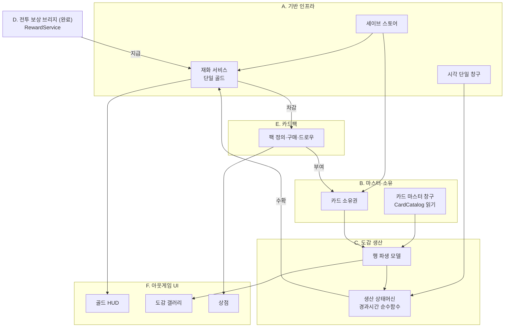

## 클래스 수준 구조 (도메인별)

<!-- 각 도메인 설계 승인 시 이 아래에 클래스도·데이터 흐름 mermaid를 추가한다.
     기존 승인분과 신규분을 구분 표시할 것. -->

### Collection 도메인 (B. 마스터·소유 + C. 도감 생산) — 구현 완료

각 노드 옆 `[관용구 #n]`은 `docs/IDIOMS.md` 항목 번호.

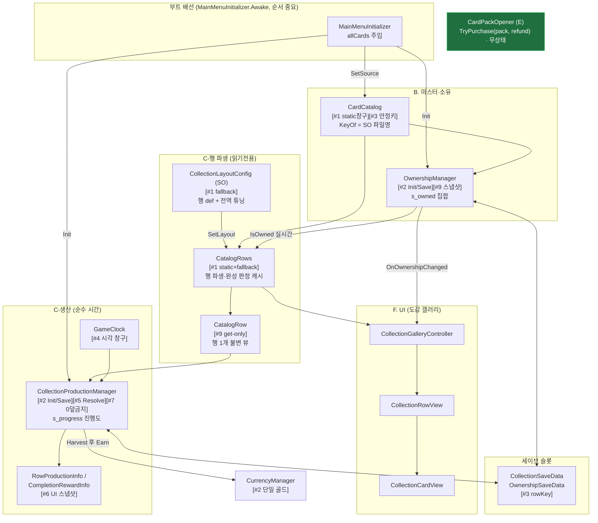

> **부트 2계층(PKG-BOOT 확정)**: 씬무관 전역(`DataSaveManager.Load`·`CurrencyManager.Init`)은 `GameManager.Boot()`(BeforeSceneLoad)가, 씬 카드목록 의존(`SetSource`·`OwnershipManager.Init`·`ProductionManager.Init`)은 `MainMenuInitializer.Awake()`(ExecutionOrder -100)가 담당. `CardPackOpener`는 무상태 파사드가 돼 부트 주입이 없다 — 대상 팩 SO·환급액은 구매처(버튼/첫실행)가 직접 소유해 `TryPurchase`에 넘긴다. `EnsureBoot`(테스트 씬)는 `CardCatalog.IsReady` 가드로 통합 시 no-op.

**핵심 흐름 2줄**
- 소유: 부트가 `CardCatalog.SetSource → OwnershipManager.Init` → 갤러리가 `CatalogRows.Rows`를 그리고 `IsOwned`로 잠금 표시 → `Grant/Revoke` 시 `OnOwnershipChanged`로 재바인딩.
- 생산: 완성 행을 조회하면 `Resolve`가 `GameClock.Since(lastSettle)`로 경과분 누적(cap 클램프) → `Harvest`가 정수분을 `CurrencyManager.Earn`, 소수 보존 후 즉시 영속.

---

### F-17/F-18 도감 생산 UI 배선 (F. UI) — ✅ 씬/프리팹 배선 완료 (CollectionTest.unity)

> 목표: 이미 완비된 `CollectionProductionManager` API(GetInfo/Harvest/HarvestAll/ClaimCompletionReward/OnChanged)를
> 도감 갤러리 UI에 연결. 매니저·세이브·재화 계약은 **변경 없음**(소비만 추가). `:::new` = 이번 신규/확장.

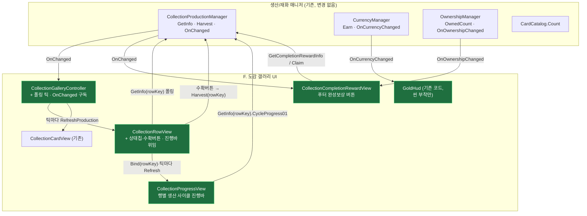

**설계 요지**
- 생산 누적은 시간 함수라 `OnChanged`가 안 뜬다 → 컨트롤러가 **0.5s 폴링 틱**으로 열린 동안 각 행 `RefreshProduction()` 갱신. 수확/완성수령/소유변경은 `OnChanged`/`OnOwnershipChanged`로 즉시 갱신.
- 행 상태 4종 표시: 잠김(수확버튼 off) / 생산중(누적 표시) / 수확가능(버튼 on) / 상한(만땅). 상태는 `GetInfo`의 `State`+`CanHarvest` 조합.
- 매니저/세이브/재화 계약 **불변** — UI는 순수 소비자(경계 준수).

**흐름 시퀀스 — 생산 폴링 + 수확 (Phase 2 구현)**

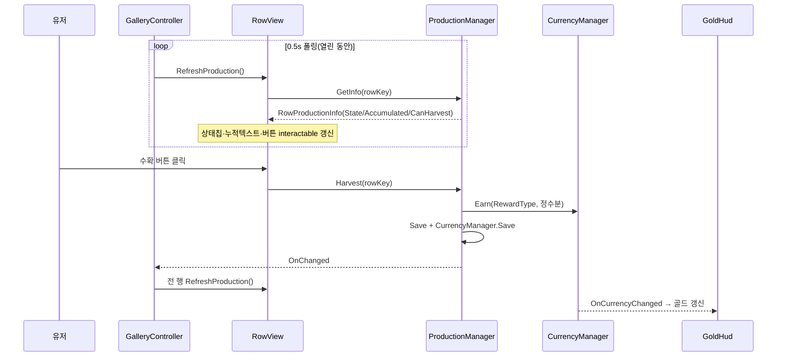

> 근거: 코드 실물 확인(2026-07-24). `CollectionRowView.cs`(상태칩·진행바·수확), `CollectionGalleryController.cs`(Update 폴링+OnChanged), `CollectionProgressView.cs`/`CollectionCompletionRewardView.cs`(신규).

**실제 배선 결과 (2026-07-24, `Assets/Scenes/CollectionTest.unity` + `CollectionRow.prefab`)**

| 컴포넌트 | 부착 위치 | 연결된 필드 → 대상 |
|---|---|---|
| `CollectionGalleryController` | 씬 `CollectionScreen` | `content`→`Gallery/Viewport/Content`, `rowPrefab`→CollectionRow.prefab, `fallbackAllCards`→카드 9장 |
| `CollectionRowView` | `CollectionRow.prefab`(루트) | `cardsContainer`→`Cards`, `cardPrefab`→Card.prefab, `stateLabel`→`Status/StateChip/T`, `harvestButton`→`Status/Action`, `progressView`→`Status/Progress`(ProgressView) (`amountText`는 미배선=옵션) |
| `CollectionProgressView` | `CollectionRow.prefab`의 `Status/Progress` | `fillImage`→`Status/Progress/BarBg/Fill` (`progressText`는 미배선=옵션). **행별 생산 사이클 진행바** |
| `CollectionCardView` | `Card.prefab` | `portrait`/`nameText`/`lockOverlay` (기존) |
| `CollectionCompletionRewardView` | 씬 `BottomBar` | `root`→`CompleteReward`, `claimButton`→`CompleteReward`(Button), `rewardText`→`CompleteReward/In/RT` |
| `GoldHud` | 씬 `TopBar/GoldHud` | `goldText`→`GoldHud/Gold` |

**생산 진행바 = 행별 사이클 진행바 (`CollectionProgressView`)**
- **소유 집계 바가 아니다.** 완성된 각 행이 개별 생산하는 재화의 **"다음 1단위까지의 사이클 진행률"** 을 행마다 표시한다. `CollectionProgressView`가 행 키(`Bind(rowKey)`)로 `GetInfo(rowKey)`를 조회해 `Status/Progress/BarBg/Fill`(Filled 가로)을 구동: 생산중=`CycleProgress01`(소수부) / 만땅=1 / 잠김=0. RowView는 진행바를 이 뷰에 **위임**(`Bind`+매 폴링 틱 `Refresh`)하며 원시 Image를 직접 만지지 않는다(단일 책임).
- `RowProductionInfo.CycleProgress01`(파생 프로퍼티 = `AccumulatedRaw - Accumulated`, 소수부): 한 사이클(재화 1단위)이 차면 바가 0으로 리셋되고 누적 정수가 +1(실시간 채움→완료→누적↑). 사이클 길이 = productionCycleSeconds(기본 15초/단위). **저장 스키마·수확 로직 불변**(표시/파생만). `Status` 컨테이너는 프리팹 기본 비활성이라 **활성화**함.
- `CollectionGalleryController.EnsureBoot()`(독립 씬 전용, `CardCatalog.IsReady`면 no-op): `DataSaveManager.Load()` + `CurrencyManager.Init()` 추가 → 테스트 씬에서도 저장된 골드·진행도 로드. 실제 통합 부트에선 IsReady 가드로 미실행.

> **배선 시 주의(다음 수정 지점)**: `CompletionRewardView`는 `BottomBar`에 붙이고 `root`만 `CompleteReward`를 토글한다 — 뷰를 `CompleteReward` 자신에 붙이면 `root.SetActive(false)` 시 뷰의 `OnDisable`이 구독을 끊어 **다시 못 켜지는 자기비활성 버그**가 난다. / `amountText`는 목업에 대응 노드가 없어 미배선(진행바가 대체) — 숫자 표기가 필요하면 노드 추가 후 연결.

**배선 검증(에디터 인메모리 세이브, 실 저장 미오염)**: fallback 3행 전량 소유→완성, 행0 빌드→시간점프. RowView→ProgressView 위임으로 바 구동: +3분 `사이클 0.5·바 0.5` → 롤오버 시 `누적 +1·바 0` → +24h `Capped·바 1`. 수확 `earned·gold` 반영, 콘솔 에러 0.

> 근거: `OutGame/Save/**`, `OutGame/Currency/CurrencyManager.cs` 실물 확인(2026-07-24).

#### 구조 지도 — 이게 전체 어디에 붙어 있나

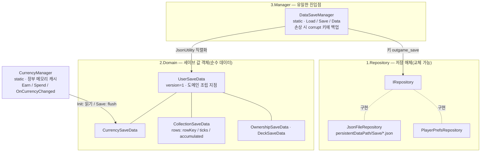

#### 흐름 시퀀스 — 부트 로드와 재화 캐싱

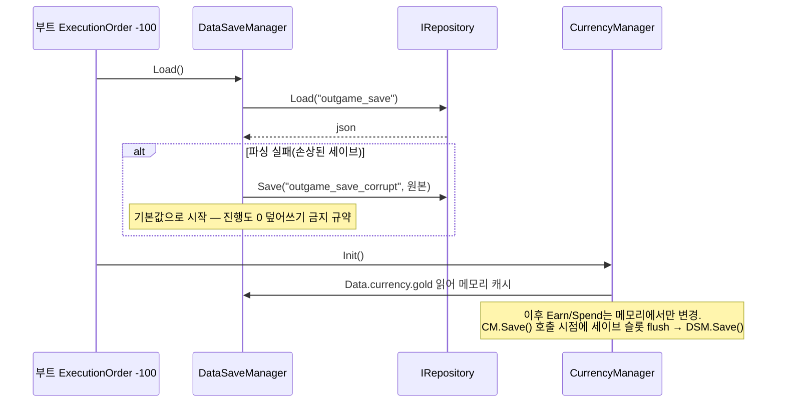

#### 원리 카드 — 왜 이렇게 생겼나

- **3층 분리(Repository/Domain/Manager)**: 저장 매체 교체가 한 줄(`SetRepository`), 스키마는 값 객체로 고립, 진입점은 하나. — `Save/3.Manager/DataSaveManager.cs`
- **재화 캐싱+flush**: Earn/Spend마다 파일 IO를 안 하려고 메모리 장부로 운영, `CurrencyManager.Save()` 시점에만 영속. **트레이드오프: Save() 누락 시 앱 종료로 장부 유실** → 지급/차감 직후 Save() 호출이 규약. — `Currency/CurrencyManager.cs`
- **CollectionRowProgress 필드 3개의 이유**: `rowKey`는 문자열(인덱스 금지 — 카드 추가돼도 진행도 안 밀림) / `lastSettleUtcTicks`는 long(JsonUtility가 DateTime 직렬화 불가) / `accumulated`는 double(수확 시 정수분만 지급, 소수 잔여 보존). — `Save/2.Domain/CollectionSaveData.cs`

**수정 가능성 높은 지점**: 새 재화 추가 = `ECurrencyType` + `CurrencySaveData` 필드 + `CurrencyManager.Init/Save` 매핑 3곳 동시 수정 / 새 세이브 항목 = `UserSaveData`에 값 객체 필드 추가만(리네임·삭제 금지).

#### 파일 지도 — 다이어그램에서 코드로

| 클래스 | 파일 |
|---|---|
| DataSaveManager | `OutGame/Save/3.Manager/DataSaveManager.cs` |
| IRepository · JsonFileRepository · PlayerPrefsRepository | `OutGame/Save/1.Repository/` |
| UserSaveData 외 값 객체 4종 | `OutGame/Save/2.Domain/` |
| CurrencyManager · ECurrencyType | `OutGame/Currency/` |

---

### E. 카드팩 경제 도메인 — ✅ 구현 완료 (2026-07-24, `OutGame/CardPack/`)

> 목표 루프 3단계: `골드 → 카드팩 구매 → 신규 카드셋 획득 → 덱 강화`.
> 핵심 성질: **E는 자체 영속 상태가 없다.** 골드 차감은 `CurrencyManager`가, 카드 소유는 `OwnershipManager`가 이미 영속하므로
> E는 둘을 잇는 **오케스트레이터**일 뿐. **구매=즉시 개봉**(미개봉 팩 재고 없음), 팩 정의는 SO(에디터 데이터), 결과는 소유권에 위임. `:::new` = 이번 신규.

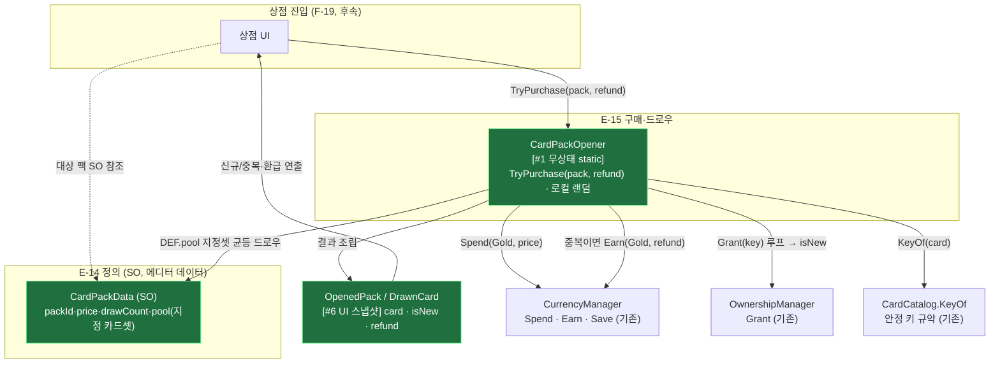

**흐름 시퀀스 — 팩 구매·개봉 (지정 풀 + 중복 환급)**

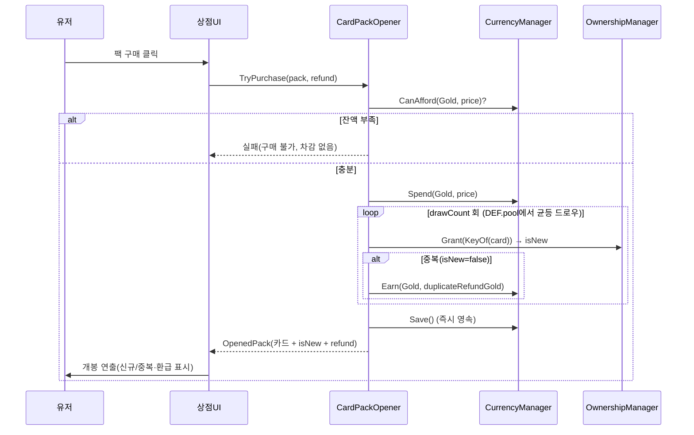

**설계 요지 (원리 카드)**
- **오케스트레이터라 세이브 섹션 없음**: E는 `Spend`·`Earn`(재화)·`Grant`(소유)만 호출하고 모두 이미 영속. E 자체 세이브를 만들면 이중 진실원. 트레이드오프: 구매 이력·pity 카운터가 필요해지면 그때 세이브 섹션 추가.
- **isNew는 Grant 시점에만 안다**: `Grant`는 신규면 true, 이미 소유면 false 반환. 개봉 후엔 전 카드가 `IsOwned=true`라 UI가 사후 판정 불가 → **`OpenedPack`는 생략 불가**(신규 여부·환급의 유일 진실원).
- **팩별 지정 풀**: 드로우 대상은 `CardData` 전체가 아니라 `CardPackData.pool`(에디터 큐레이션). 이는 마스터 목록 복제가 아닌 **부분집합 참조**라 4번째 목록 드리프트 아님. 키는 여전히 `CardCatalog.KeyOf`(단일 규약)로 산출.
- **중복 = 소액 골드 환급**: 장별 `Grant` 반환이 false면 `CurrencyManager.Earn(Gold, refundGold)`. 환급액은 `TryPurchase`의 인자로 구매처(버튼/첫실행)가 직접 넘긴다(상점 SO 전역값 폐기). Spend/Earn을 한 트랜잭션으로 처리 후 `Save()` 1회.
- **로컬 랜덤(비결정론 무방)**: 아웃게임 최초 랜덤. `Battle/MatchRandom` 재사용 금지(경계), 서비스 내부 `System.Random` 인스턴스.
- **상점 SO(CardShop) 폐기**: 진열 팩 목록·환급 전역값을 쥐던 `CardShop` SO와 `SetShop` 주입을 제거. `CardPackOpener`는 무상태 파사드가 되고, 대상 팩 SO·환급액은 각 구매처 뷰가 인스펙터로 소유해 `TryPurchase(pack, refund)`에 직접 넘긴다(진열=뷰 책임).
- **수정 가능성 높은 지점**: 팩 가격·드로우 수·구성 = `CardPackData` SO(코드 미수정) / 환급액 = 구매처 뷰의 `duplicateRefundGold` 필드 / 등급 가중치가 필요해지면 `DEF.pool`을 가중 목록으로 확장.

| 클래스 | 파일 | 태스크 |
|---|---|---|
| `CardPackData` (SO) | `OutGame/CardPack/CardPackData.cs` — `packId·displayName·price·drawCount·pool(List<CardData>)` | E-14 |
| `CardPackOpener` (static, 무상태) | `OutGame/CardPack/CardPackOpener.cs` — `TryPurchase(CardPackData, long refund)` | E-15 |
| `OpenedPack` · `DrawnCard` (값) | `OutGame/CardPack/OpenedPack.cs` — `card · isNew · refund` | E-16 |

---

> ~~상점 목록(ShopController/ShopPackTileView)·독립 씬·MainMenu 통합 진입~~ — **이번 스코프 전부 제외, 후속.**

---

### G. 신규 유저 온보딩 도메인 — ⬜ 설계 승인 대기 (2026-07-27)

> 목표 루프의 **진입부**. 신규 유저가 로비를 보기 전에 스타터 카드 6장을 얻고 첫 전투(튜토리얼)를 경험한다.
> **G는 자체 영속 상태가 없다** — 카드 획득·영속은 E(`CardPackOpener`→`Grant`), 첫 전투는 Battle(`TutorialConfig`)이 이미 소유. G는 **첫실행 진입 + 개봉 씬 오케스트레이션**만 신설한다(별도 BootScene 없음). `:::new` = 이번 신규.
>
> **⚠️ 2026-07-27 갱신 — 첫실행 진입부는 아래 `G-TUT` 절로 대체됐다.** `LobbyFirstRunRedirect`는 **삭제**됐고 그 역할(스타터팩 자동 구매→캐리어→CardPack 전환)은 튜토리얼 스텝 0(`AutoPurchase`)이 수행한다. 첫실행 판정도 `HasAnyOwnedSaved()==false` 대리에서 **영속 진행도(`OutgameTutorialProgress`)** 로 단일화됐다(`HasAnyOwnedSaved()`는 레거시 마이그레이션 1회 판정 전용으로 축소). 아래 구조 지도·시퀀스의 `LobbyFirstRunRedirect` 경로는 **이력 보존용**이며, 캐리어(`PackHandoff`)→`CardPack` 씬 이후 구간만 현재 실물과 같다.

#### 구조 지도 — 구매(뷰 밖) → 캐리어 → PackTest 3D 뜯기

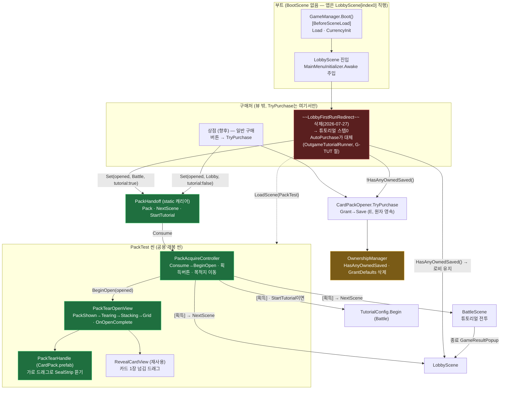

#### 흐름 시퀀스 — 첫 부팅 (로비 진입 → 즉시 리다이렉트 → 3D 뜯기 → [획득] → 튜토리얼 전투)

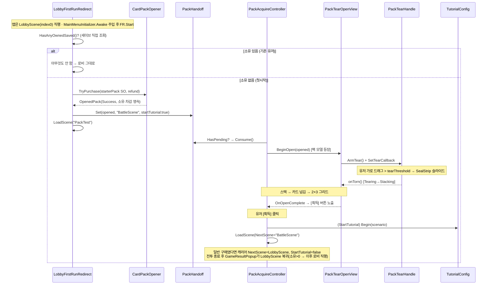

#### 원리 카드 — 왜 이렇게 생겼나

- **구매를 뷰 밖으로, 목적지를 구매한 쪽으로**: `TryPurchase`(소유·차감 원자 영속)와 "획득 후 어디로/튜토리얼 여부"를 상점·`LobbyFirstRunRedirect`가 쥐고 `PackHandoff`에 실어 넘긴다. PackTest는 **첫시작 재판정 없이 캐리어 값으로만 분기** → 별도 리다이렉트 레이어(구 FirstStartBattleRedirect)가 소멸(브레인 1개 = `PackAcquireController`).
- **BootScene 없음(사용자 결정)**: 앱은 기존대로 `LobbyScene`(index 0)으로 직행하고, 로비 상주 컴포넌트가 첫실행만 갈라 즉시 개봉 씬으로 전환한다 — 상점→팩 전환과 동일 경로를 첫실행이 자동으로 탄다. `TryPurchase`는 무상태라 부트 주입 불요 — 대상 팩 SO를 호출부가 직접 소유. **(2026-07-27 갱신)** 그 로비 상주 컴포넌트는 `LobbyFirstRunRedirect`에서 `OutgameTutorialBridge`(스텝 0 `AutoPurchase`)로 대체됐고, 판정 순서도 `MainMenuInitializer.Awake`[-100] 이후 브리지 `Start`가 아니라 **`GameManager.Boot()`가 로드한 진행도**를 읽는 방식이 됐다 → 소유 캐시 준비 여부와 무관.
- **검증된 꼬리 재사용, 리스크는 앞단에 국한**: 스택→넘김→그리드·`OnOpenComplete`는 구 `PackOpeningView`의 상태머신 가드·`OnDisable` 트윈 정리까지 무변경 이식. 새로 만든 건 앞단(3D 팩 등장 + 가로 드래그 뜯기 `PackTearHandle`)뿐.
- **입력은 월드 방식 통일**: 팩(3D BoxCollider)·카드(2D BoxCollider2D)가 같은 `Camera.main` + `OnMouse*` 패턴. 트레이드오프: **씬 카메라 `MainCamera` 태그가 인터랙션 전체를 좌우**(미태그 시 컴파일 통과·런타임 무반응).
- **[획득] 버튼 게이트**: 개봉(그리드 배열) 완료 = `PackTearOpenView.OnOpenComplete` → 컨트롤러가 획득 버튼 노출. 유저가 능동적으로 [획득]을 눌러야 전이.
- **소유==0 신호의 함의**: `GrantDefaults` 전체지급을 **끈 것이 전제**(G-23). 판정은 세이브 직접 조회 `HasAnyOwnedSaved()`(G-24)로 씬 config 순서 무관. **(2026-07-27 갱신)** 첫실행 판정 자체는 진행도(`OutgameTutorialProgress`)로 옮겨졌고 `HasAnyOwnedSaved()`는 레거시 마이그레이션 1회 판정에만 쓰인다 — "소유 0"을 첫실행의 **대리 신호로 쓰던 구조가 소멸**(구매 직후 종료 시 온보딩 영구 스킵 구멍의 원인).

**수정 가능성 높은 지점**: 뜯기 판정·연출 `PackTearHandle.cs`(`tearThreshold`/슬라이드) / 첫시작 라우팅 값 → **`OutgameTutorial.asset` 스텝 0**(`pack`/`duplicateRefundGold`/`nextScene`, 코드 미수정) / 캐리어 계약 `PackHandoff.cs`(NextScene·StartTutorial) / 튜토리얼 시나리오 → **스텝 SO의 `BattleEntry.scenario`**(`PackAcquireController.scenario`는 캐리어 `StartTutorial`이 항상 false라 미사용) / 튜토리얼 보상 여부 `TurnRunner.CaptureResult`(선택 가드).

#### 파일 지도 — 다이어그램에서 코드로

| 클래스/에셋 | 파일 | 태스크 |
|---|---|---|
| ~~`LobbyFirstRunRedirect`~~ (로비 상주·첫시작 구매→캐리어→PackTest) | **폐기**(2026-07-27, 파일 삭제) — 스텝 0 `AutoPurchase`(`OutgameTutorialRunner`)가 흡수. 존치 시 "소유 0"·"stepIndex 0" 이중 판정으로 이중 구매 | G-24 → G-TUT |
| ~~BootScene / BootRouter~~ | **폐기** — BootScene 없이 LobbyScene(index0) 직행 + 로비 리다이렉트 | — |
| `PackHandoff` (static 캐리어) | 신규 `Assets/Scripts/OutGame/CardPack/PackHandoff.cs` | G-27 ✅ |
| ~~`PackTearOpenView`~~ → `PackRevealView` | `Assets/Scripts/UI/Shop/PackRevealView.cs` | G-28 ✅ (아래 절) |
| ~~`PackTearHandle`~~ → `PackClickHandle` | `Assets/Scripts/UI/Shop/PackClickHandle.cs` | G-28 ✅ |
| `PackAcquireController` (캐리어 소비·획득버튼·덱 저장·목적지 이동) | 신규 `Assets/Scripts/UI/Shop/PackAcquireController.cs` | G-27 ✅ / G-28 덱저장 |
| ~~`RevealCardView`~~ | **폐기**(G-28) — 결과 표시는 `CollectionCardView` 재사용 | — |
| `DeckSaveManager.SaveSlotToFile` (공유 계약 **추가**) | `Assets/Scripts/Battle/DeckSaveManager.cs` — 단일 슬롯만 비파괴 저장(전슬롯 flush 금지) | G-28 ✅ |
| `OwnershipManager` (GrantDefaults 삭제 + HasAnyOwnedSaved) | `Assets/Scripts/OutGame/Collection/OwnershipManager.cs` | G-23/24 ✅ |
| 3D 팩 모델 = `Assets/Assets/Prefabs/CardPack.prefab` (BoxCollider) | `PackClickHandle` 부착 (사용자) | G-28 |
| 공용 팩 오픈 씬 = `Assets/Scenes/CardPack.unity` | CardPack+PackRevealView+PackAcquireController+결과패널+획득버튼+MainCamera 태그 (사용자) | G-28 |
| `StarterPack.asset` (CardPackData) | 신규 에셋 (사용자) — price0·drawCount6·pool=기본6장 | G-25 |
| ~~`PackOpeningView`·`PackOpenSceneController`·`FirstStartBattleRedirect`~~ | **폐기**(구매 분리·캐리어 도입으로 대체) | — |
| (선택) 튜토리얼 보상 가드 | `Assets/Scripts/Battle/TurnRunner.cs` 또는 `Reward/RewardService.cs` | G-보상분기 |

---

### G-28 — 개봉 연출 단순화 (클릭 1회 → 패널 fade → 3열 그리드)

#### 구조 위치 (변경분만)

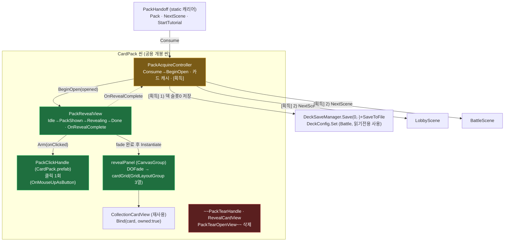

#### 흐름 시퀀스 — 개봉 1회

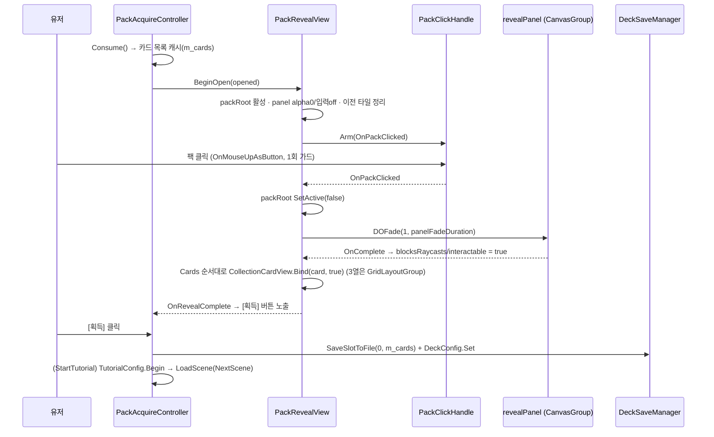

#### 원리 카드

- **연출을 인터랙션 1개로 축약**: 드래그 뜯기·카드별 스와이프 스택은 상태·입력 축이 많아 배선 실패가 곧 소프트락이었다. 클릭 1회 + CanvasGroup fade + `GridLayoutGroup`으로 줄여, 좌표 계산 코드를 레이아웃 컴포넌트에 넘겼다.
- **표시 뷰 단일화**: 결과 카드는 도감 타일 `CollectionCardView`를 그대로 재사용(월드 스프라이트 뷰 폐기) → 카드 표시 진실원이 하나(`displayName`/`fullImage`).
- **데드락 방지 우선**: `packHandle`/`revealPanel`/`cardPrefab`/`cardGrid` 미배선·카드 0장 모두 경고 후 `OnRevealComplete`를 발화 — 획득 버튼이 영구히 숨는 경로를 남기지 않는다.

**수정 가능성 높은 지점**: fade 시간·전이 가드 `PackRevealView.cs`(`panelFadeDuration`, `OnPackClicked`) / 덱 저장 슬롯·정책 `PackAcquireController.SaveOpenedDeck`(슬롯 0 고정).

---

### G-TUT — 아웃게임 첫시작 튜토리얼 (P1~P4) — ✅ 코드+검수+컴파일 에러 0 (씬 배선·SO 저작 대기)

> 첫실행 온보딩을 "한 번 리다이렉트하고 끝"에서 **영속 진행도 + 스텝 해석 + 강제 안내 게이트** 3축으로 재편한 것.
> `LobbyFirstRunRedirect`를 흡수·삭제하고, 로비↔CardPack↔Battle 왕복과 앱 강제종료를 견디는 진행도를 세이브에 둔다.
> **인게임(전투) 튜토리얼 내부 로직은 범위 밖** — 기존 `TutorialConfig`/`TutorialOverlayUI`를 그대로 쓰고, 아웃게임은 **어느 회차에 어느 시나리오를 넘길지만** 책임진다. `:::new` = 이번 신규.

#### 구조 지도 — 영속(진행도) / 해석(러너) / 수명(브리지) / 표시(게이트) 4층

```mermaid
flowchart TD
    subgraph boot["부트 (BeforeSceneLoad)"]
        GM["GameManager.Boot()<br/>Load → TutorialProgress.Init → CurrencyInit"]:::chg
    end

    subgraph persist["영속 — 세이브만 안다"]
        PRG["OutgameTutorialProgress (static)<br/>IsCompleted · StepIndex · Init<br/>CommitStep · Complete · ResetForDebug"]:::new
        SD["TutorialSaveData (슬롯)<br/>outgameStepIndex · outgameCompleted · migrationChecked"]:::new
    end

    subgraph run["해석 — 스텝 실행 (씬 오브젝트를 모름)"]
        RUN["OutgameTutorialRunner (static)<br/>IsRunning · EnsureData · TryGetCurrentStep<br/>EnterCurrentStep · NotifyStepSatisfied"]:::new
        DATA["OutgameTutorialData (SO)<br/>EStepKind{AutoPurchase,WaitClick,BattleEntry}<br/>List&lt;Step&gt; (인덱스 = 세이브 진행도)"]:::new
    end

    subgraph scene["씬 레이어 (UI/Tutorial/)"]
        BRG["OutgameTutorialBridge<br/>씬당 1개 (LobbyScene · CardPack)<br/>Awake:EnsureData · Start:EnterCurrentStep"]:::new
        GATE["OutgameTutorialGateUI<br/>4패널 딤 + 구멍 · 배너 · sortingOrder 300<br/>onClick 구독으로 완료 감지"]:::new
    end

    subgraph anchor["타깃 식별 (씬 경로 문자열 금지)"]
        KEY["EOutgameTutorialAnchor (enum, int 직렬화)<br/>LobbyPlayButton · LobbyPackTab<br/>PackBuyButton · PackAcquireButton"]:::new
        REG["TutorialAnchorRegistry (static)<br/>Register/Unregister/TryGet · OnRegistered"]:::new
        ANC["TutorialAnchor (MonoBehaviour)<br/>OnEnable/OnDisable = 등록/해제"]:::new
        TAB["LobbyTabController.Tab.tutorialAnchor<br/>탭 버튼(프리팹 내부 stripped Button) 대리 등록"]:::chg
    end

    OPENER["CardPackOpener.TryPurchase (E)<br/>Grant→Save 원자 영속"]
    HAND["PackHandoff (static 캐리어)"]
    TUT["TutorialConfig.Begin (Battle, 읽기 사용)"]
    OWN["OwnershipManager.HasAnyOwnedSaved<br/>레거시 마이그레이션 판정 전용으로 축소"]:::chg
    DEAD["~~LobbyFirstRunRedirect~~ 삭제<br/>= 스텝 0 AutoPurchase"]:::dead

    GM --> PRG
    PRG <--> SD
    PRG -.->|"Init 1회 판정"| OWN
    DEAD -.-> RUN
    BRG -->|"EnsureData(멱등)"| RUN
    RUN --- DATA
    RUN -->|"StepIndex 읽기 · CommitStep"| PRG
    RUN -->|"AutoPurchase"| OPENER
    RUN -->|"Set(opened, nextScene, false)"| HAND
    RUN -->|"BattleEntry 진입 시"| TUT
    BRG -->|"ShowGate(rect, button, msg)"| GATE
    GATE -->|"onClick → onSatisfied"| BRG
    BRG -->|"NotifyStepSatisfied"| RUN
    ANC -->|"Register/Unregister"| REG
    TAB -->|"Awake 등록"| REG
    KEY --- REG
    BRG -->|"TryGet(anchor) · OnRegistered 대기"| REG

    classDef new fill:#1f6f3f,stroke:#7CFC9E,color:#fff;
    classDef chg fill:#7a5b16,stroke:#f2c14e,color:#fff;
    classDef dead fill:#5a1f1f,stroke:#e57373,color:#fff;
```

#### 흐름 시퀀스 — 스텝 0~2 (자동 구매 → 개봉 [획득] → 로비 [플레이] → 튜토리얼 전투)

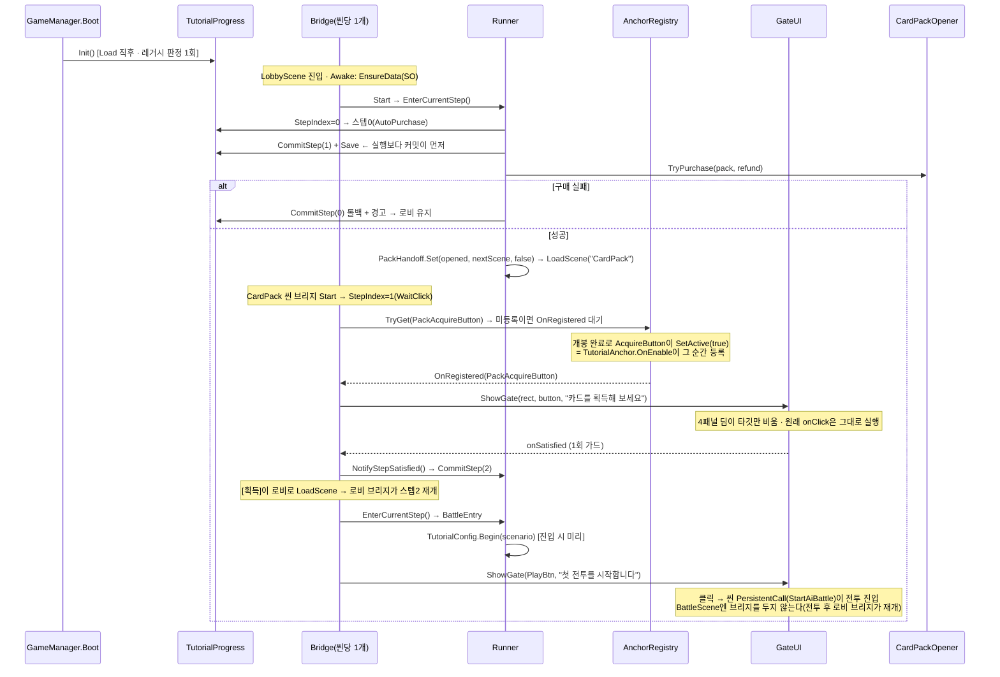

#### 원리 카드 — 왜 이렇게 생겼나

- **완료는 파생이 아니라 스칼라**: `outgameCompleted`가 `outgameStepIndex`보다 **항상 우선**한다. 완료를 `stepIndex >= steps.Count`로 파생시키면 나중에 스텝을 추가한 순간 **이미 끝낸 유저의 튜토리얼이 되살아난다**. 러너는 `CommitAdvance`에서 한 번만 `Complete()`를 확정한다. — `TutorialSaveData.cs` / `OutgameTutorialRunner.cs`
- **커밋이 실행보다 앞선다**: 스텝 0(`AutoPurchase`)은 `CommitStep(idx+1)`+`Save` **후에** `TryPurchase`를 호출한다. 반대 순서면 "구매 직후 앱 종료 → 소유는 생겼는데 진행도는 0" 상태가 되어 온보딩이 영구 스킵된다. 실패는 차감 없이 반환되므로 `CommitStep(idx)` 롤백만으로 원상복구(다음 부트 재시도). — `OutgameTutorialRunner.EnterAutoPurchase`
- **레거시 판정은 계정당 1회(`migrationChecked` 낙인)**: "소유 있음 + 진행도 0 = 구버전 유저" 판정을 매 부트 반복하면, 러너가 아직 한 번도 돌지 못한 상태(SO 미배선·구매 실패 롤백 — **P5·P6 보류 중인 지금의 실제 상태**)에서 수동 구매한 신규 유저까지 완료 처리된다. `stepIndex == 0` 항은 함께 남긴다 — 없으면 **현재 빌드로 진행 중인 세이브**가 업데이트 첫 부팅에 완료 낙인을 맞는다. `ResetForDebug()`는 낙인을 **true로 유지**(되돌리면 남은 소유 탓에 다음 부트가 곧장 완료 처리해 리셋이 무의미). — `OutgameTutorialProgress.Init`
- **타깃은 씬 경로가 아니라 enum 앵커**: 탭 버튼이 Layer Lab 프리팹 내부라 경로 문자열은 취약하고 오타가 검출되지 않는다. `TutorialAnchor`의 `OnEnable/OnDisable`이 그대로 등록/해제가 되므로 **"타깃이 나타나는 시점"을 감지하는 코드가 0줄** — `AcquireButton`의 `SetActive(true)`가 곧 개봉 완료 시점이고, 탭 콘텐츠 토글이 곧 등록 시점이다. enum은 SO에 int로 직렬화되므로 **새 값은 끝에만 추가**(재배치·삭제 금지).
- **구멍은 4패널(셰이더 아님)**: 타깃 rect 기준 상/하/좌/우 `Image` 4장으로 덮어 타깃만 비운다. 구멍이 물리적 공백이라 클릭 통과가 `ICanvasRaycastFilter` 0줄로 성립한다. 완료는 `onClick` **구독**으로만 감지 → 원래 리스너(`StartAiBattle`·`Select`·`OnBuyPressed`·`OnAcquirePressed`)가 그대로 실행되고, 게이트는 `HideGate`/`Clear`/`OnDestroy`에서 반드시 `RemoveListener`.
- **소프트락 방지 불변식**: 딤이 걸린 채 누를 수 있는 것이 0인 상태를 만들지 않는다. 타깃이 `activeInHierarchy == false`거나 `IsInteractable() == false`면 **딤만 숨기고 게이트는 armed 유지** → 다시 누를 수 있게 되면 자동 복귀(`LateUpdate` 매 프레임 판정이라 게이트가 걸린 *뒤* 잠기는 경로도 커버). 타깃에 `Button`이 없으면 아예 게이트를 걸지 않는다.
- **씬 이름을 보지 않는 재개**: 브리지는 씬 로드마다 `StepIndex`를 읽어 그대로 재개한다. 앵커가 이 씬에 없으면 조용히 대기하고 나중에 등장하면 켜진다. `AutoPurchase`는 커밋이 실행보다 앞서므로 개봉 씬 브리지가 재실행할 수 없다. 클릭 직후 다음 스텝이 `AutoPurchase`면 진입을 넘긴다 — 방금 누른 버튼의 `LoadScene`과 자동 전환이 경합해 목적지가 뒤집히기 때문.
- **SO 주입은 브리지가(부트가 아니라)**: `CardPack.unity`에는 `MainMenuInitializer`가 없다. static은 씬 전환에 살아남지만 **CardPack 단독 Play**(`PackStandaloneBoot` 워크플로)에서 깨진다 → 브리지가 `Awake`에서 멱등 주입(다른 에셋 주입 시도는 경고 후 기존 유지).
- **전투 시작은 클릭 리스너가 아니라 스텝 진입 시**: `TutorialConfig.Begin`을 `BattleEntry` 진입 순간에 호출한다. 클릭 리스너로 하면 `PlayBtn`의 씬 PersistentCall이 런타임 리스너보다 먼저 `LoadScene`을 돌려 순서 의존이 생긴다. `Begin`은 덱/스크립트 큐 세팅뿐이고 `TutorialConfig`는 휘발이라 재진입도 멱등. → **`LobbyMatchLauncher`·`PackShowcaseController`·`PackAcquireController` 무수정.**

**수정 가능성 높은 지점**: 스텝 순서·문구·팩·시나리오 = `OutgameTutorial.asset`(코드 미수정) / 새 타깃 = `EOutgameTutorialAnchor` 끝에 값 추가 + 씬에 `TutorialAnchor` 부착 / 게이트 외형 = `OutgameTutorialGateUI.BuildUI`(현재 코드 빌드, 아트 스킨 교체는 이 메서드 내부만) / 개봉 씬 경로 = `OutgameTutorialRunner.PackOpenScene` 상수.

#### 파일 지도 — 다이어그램에서 코드로

| 클래스/에셋 | 파일 | 패키지 |
|---|---|---|
| `TutorialSaveData` (세이브 값 객체) | 신규 `Assets/Scripts/OutGame/Save/2.Domain/TutorialSaveData.cs` | P1 ✅ |
| `UserSaveData.tutorial` 슬롯 (VERSION 1 유지) | `Assets/Scripts/OutGame/Save/2.Domain/UserSaveData.cs` — 1줄 추가 | P1 ✅ |
| `OutgameTutorialProgress` (static, 진행도 단일 창구) | 신규 `Assets/Scripts/OutGame/Tutorial/OutgameTutorialProgress.cs` | P1 ✅ |
| `GameManager.Boot()` 진행도 Init | `Assets/Scripts/Core/GameManager.cs` — 1줄(Load 직후·CurrencyInit 앞) | P1 ✅ |
| 튜토리얼 리셋 2종(진행도만 / 소유까지) | `Assets/Scripts/OutGame/Collection/Debug/OwnershipDebugTool.cs` — ContextMenu | P1 ✅ |
| `EOutgameTutorialAnchor` (enum 키) | 신규 `Assets/Scripts/OutGame/Tutorial/EOutgameTutorialAnchor.cs` | P2 ✅ |
| `TutorialAnchorRegistry` (static 등록소 + `OnRegistered`) | 신규 `Assets/Scripts/OutGame/Tutorial/TutorialAnchorRegistry.cs` | P2 ✅ |
| `TutorialAnchor` (MonoBehaviour, 수명주기 등록) | 신규 `Assets/Scripts/OutGame/Tutorial/TutorialAnchor.cs` | P2 ✅ |
| `OutgameTutorialData` (SO, `EStepKind`+`Step`+`steps`) | 신규 `Assets/Scripts/OutGame/Tutorial/OutgameTutorialData.cs` — `Create → Card Battle/Outgame Tutorial` | P2 ✅ |
| `OutgameTutorialGateUI` (4패널 딤 게이트, `Ensure()` 파사드) | 신규 `Assets/Scripts/UI/Tutorial/OutgameTutorialGateUI.cs` | P3 ✅ |
| `OutgameTutorialRunner` (static, 스텝 해석·실행) | 신규 `Assets/Scripts/OutGame/Tutorial/OutgameTutorialRunner.cs` | P4 ✅ |
| `OutgameTutorialBridge` (씬당 1개, 수명 연결) | 신규 `Assets/Scripts/UI/Tutorial/OutgameTutorialBridge.cs` | P4 ✅ |
| `LobbyTabController.Tab.tutorialAnchor` (탭 버튼 대리 등록) | `Assets/Scripts/UI/Lobby/LobbyTabController.cs` — 필드 1 + `Awake` 3줄 | P4 ✅ |
| `OwnershipManager.HasAnyOwnedSaved` 용도 축소(주석) | `Assets/Scripts/OutGame/Collection/OwnershipManager.cs` — 레거시 마이그레이션 판정 전용 | P4 ✅ |
| ~~`LobbyFirstRunRedirect`~~ | **삭제** — 스텝 0 `AutoPurchase`가 흡수 | P4 ✅ |
| `Assets/SO/TutorialConfig/Outgame/OutgameTutorial.asset` (스텝 0~13) | 저작 완료 — 전투 3회 · 구매 사이클 2회 | P6 ✅ |

#### 씬/에셋 인계 (코드 밖 — 사용자)

| 씬/에셋 | 작업 |
|---|---|
| `Assets/Scenes/New/LobbyScene.unity` | 구 `LobbyFirstRunRedirect` GameObject의 **Missing Script 제거** 후 `OutgameTutorialBridge` 부착(`data` ← `OutgameTutorial.asset`) / `MatchContent/PlayBtn`에 `TutorialAnchor`(`key = LobbyPlayButton`) |
| `Assets/Scenes/CardPack.unity` | `AcquireButton`에 `TutorialAnchor`(`key = PackAcquireButton`) / `PackOpenDirector`에 `OutgameTutorialBridge`(같은 에셋) |
| `Assets/SO/TutorialConfig/Outgame/OutgameTutorial.asset` | 14스텝. 0=`AutoPurchase`(pack←StarterPack, `nextScene`=**LobbyScene**, refund 10) · 1=`WaitPackOpen` · 2=`WaitClick`(PackAcquireButton) · 3=`BattleEntry`(scenario←TutorialScenario) · 4~8·9~13=구매 사이클(`WaitClick`(LobbyPackTab) → `WaitPurchase`(PackBuyButton) → `WaitPackOpen` → `WaitClick`(PackAcquireButton) → `BattleEntry`(TutorialScenario2/3)) |
| `UIPoolManager` 캔버스 | `sortingOrder` **1 → 400** (`LobbyScene.unity` / `MainMenu.unity`). 게이트 300 > 팝업 상속값 1이라 **실패 팝업이 딤 아래로 묻혀 [확인]을 못 누른다** |

> `nextScene`은 **개봉 후 목적지**다(개봉 씬 `"CardPack"`은 러너 상수). 스텝 0의 `nextScene`을 `BattleScene`으로 두면 안 된다 — 전투 진입은 스텝 2가 담당한다.
> 게이트 UI는 코드 빌드라 **신규 프리팹·Addressable 등록이 없다**(`UIPrefab` 라벨 체크 대상 아님).

#### P5·P6 해결 내역

- **앵커 배선 완료**: `LobbyTabController.tabs[1].tutorialAnchor = LobbyPackTab` / `PackShowcaseController.packData` ← `NormalPack.asset` / 그 `buyButton`(BuyBtn_0)에 `TutorialAnchor(PackBuyButton)`.
- **완료 판정이 두 갈래로 갈렸다**: 3D 팩 개봉은 `PackClickHandle`의 물리 클릭이라 uGUI 게이트를 걸 수 없고(Overlay 딤이 3D를 덮어 강조가 은폐가 된다), 구매는 눌러도 실패할 수 있다. → kind `WaitPackOpen`(딤 없이 배너만, `GateUI.ShowBanner`)과 `WaitPurchase`(딤만 걸고 클릭은 완료가 아님)를 추가하고, 완료는 **결과 신호**가 확정한다.
  - `PackRevealView.OnAnyPackOpened` / `PackShowcaseController.OnAnyPurchased` (둘 다 static event) → `OutgameTutorialBridge`가 구독. **뷰는 구독자를 모른다** — `TutorialAnchorRegistry.OnRegistered`와 같은 방향의 관용구.
  - `GateUI.ShowGate(_onSatisfied: null)` = 클릭 리스너 미부착(딤 유지). 이것이 `WaitPurchase`의 구현.
- **결과 기반 커밋 해결**: 구매 실패 시 진행도가 앞서 나가지 않는다.
- **경제 데드락 대응(값 무수정)**: `PackShowcaseController`가 잔액으로 구매 버튼을 잠그고(`CurrencyManager.CanAfford` + `OnCurrencyChanged` 구독), `GateUI.RefreshVisibility`의 기존 소프트락 방어가 딤을 자동으로 걷는다 → 유저가 전투로 골드를 벌고 돌아오면 그 스텝이 그대로 재개된다. Play 실측 후 부족하면 `RewardConfig.minGold` / `NormalPack.price` 조정(코드 무수정).
- **전투 사이 진입 깜빡임 제거**: `BattleEntry` 완료 직후에는 다음 스텝을 이 씬에서 진입시키지 않는다(`PlayBtn`이 이미 `LoadScene`을 걸어 곧 사라질 게이트가 한 프레임 뜬다) — 로비 복귀 시 그 씬의 브리지가 재개한다.
