# 아웃게임 구조도 (STRUCTURE)

> 사용자의 설계 승인과 구조 파악의 기준 문서.
> 도메인 설계 확정 시, 구조 변경 시마다 갱신한다 (CLAUDE.md 아웃게임 운영 정책).
> 갱신 주체: outgame-engineer 또는 메인. 근거 없는 노드 금지 — 실제 파일이 있거나 승인된 설계여야 한다.

## 갱신 이력

| 날짜 | 변경 | 승인 |
|---|---|---|
| (초기) | 문서 생성. 도메인 수준 뼈대만 반영, 클래스 수준 구조도는 idioms-onboarding 역주행 및 다음 설계 세션에서 채운다 | - |
| 2026-07-23 | Collection(B/C) 클래스 수준 구조도 추가 (idioms-onboarding 역주행, 구현 완료분 기준) | - |
| 2026-07-24 | Save·재화(A) 섹션 추가 — **시각 브리핑 형식 기준 예시**(구조 지도+시퀀스+원리 카드+파일 지도). 이후 모든 브리핑·recap은 이 형식을 따른다 | - |
| 2026-07-24 | **F-17/F-18 생산 UI 배선 설계 추가 (⬜ 승인 대기)** — 도감 갤러리에 행 생산상태·수확·진행바·완성보상·골드 HUD를 매니저 API에 연결. 신규 노드는 `:::new` 표식 | ⬜ |
| 2026-07-24 | **F-17/F-18 생산 UI 배선 구현 완료 (Phase 2)** — RowView 상태칩·수확, Controller 폴링, ProgressView/CompletionRewardView 신규. 매니저·세이브·재화 계약 불변(순수 소비). 손 배선 인계 `COLLECTION_UI_WIRING.md` | ✅ |
| 2026-07-24 | **씬/프리팹 실배선 완료 (`CollectionTest.unity`)** — RowView `stateLabel`/`harvestButton`/신규 `productionFill`(Fill을 Filled로 전환·진행바 구동)+Status 활성화, 씬 `CompletionRewardView`(BottomBar)·`GoldHud` 부착. `EnsureBoot`에 Load/CurrencyInit 보강. 에디터 검증: 5h경과 fill 0→0.208, 수확 gold 0→50, 에러 0 | ✅ |
| 2026-07-24 | **생산 진행바 = 단위 사이클 + 행별 전용 뷰로 정리** — 진행바 의미를 `누적/상한`→`다음 1단위까지 사이클 진행률`(`CycleProgress01`)로. `CollectionProgressView`를 소유 집계 바에서 **행별 생산 진행바**로 재작성(행 키 `Bind`), RowView는 원시 `productionFill` 제거 후 이 뷰에 위임. 프리팹 `Status/Progress`에 ProgressView 부착. 저장·수확 계약 불변 | ✅ |
| 2026-07-24 | **E. 카드팩 경제 클래스 구조 추가 (⬜ 설계 승인 대기)** — `CardPackData`/`CardShop`(SO)·`CardPackOpener`(static)·`OpenedPack`(값). E는 자체 세이브 없는 **A(재화)·B(소유) 오케스트레이터**. 구매=즉시개봉(팩 재고 없음)·**팩별 지정 풀 드로우**·**중복 시 소액 골드 환급**. 신규 노드 `:::new` | ⬜ |
| 2026-07-24 | **E. 카드팩 경제 구현 완료 (E-14/15/16)** — `OutGame/CardPack/`에 4파일 생성. 설계와 일치. API 확정: 배선 `SetShop(CardShop)`, 결과 `OpenedPack`(class)+`DrawnCard`(readonly struct)+`EPackOpenResult`(enum: Success/PackNotFound/InsufficientGold/EmptyPool/SpendFailed). 로컬 `System.Random`. 재화·소유 계약 순수 소비(불변). SO 에셋 생성·상점 배선은 사용자/메인 검증 | ✅ |
| 2026-07-24 | **tcg-reviewer 심화 재검 반영 (2건 수정)** — ① **무료팩 허용**: 공유 재화 API `CurrencyManager.Spend` 계약 변경(0 이하 거부→음수만 거부, 0은 잔액변경 없이 성공). price=0 팩 구매 가능해짐(사용자 지시). Spend 사용처는 CardPackOpener 1곳뿐 → 회귀 없음. ② **null 풀 방어**: 드로우 시 null 카드 항목 `continue` 스킵(환급 오지급 차단). #3 저장순서(유저 유리, 재화 유실 없음)는 프로토타입 무시·기록만. 컴파일 에러 0 | ✅ |
| 2026-07-27 | **PKG-BOOT 통합 부트 배선 (✅ 구현+검수 완료)** — `MainMenuInitializer`에 `[SerializeField] CardShop cardShop` + `CardPackOpener.SetShop(cardShop)` 1줄 추가. `Load`/`CurrencyInit`은 `GameManager.Boot()`가 이미 소유 → 중복 미추가(부트 2계층 확정). null→빈 상점 fallback으로 PKG-TUNE 에셋과 독립 진행. 계약 동결 표 "통합 부트 순서" 🧊 동결. tcg-reviewer 검수: 발견 0(경계·이중진실원·계약 무결). 에셋 배선·Play 통합검증은 사용자 재량 | ✅ |
| 2026-07-24 | **F-19 카드팩 개봉 루프 (✅ 구현+검수 완료)** — 스코프 최종 축소: 상점 목록·독립 씬·MainMenu 진입 전부 제외. **카드팩 클릭→개봉 연출+카드 순차 등장→획득** 루프만. `PackOpeningView`(연출 오케스트레이션·옵션 EnsureBoot)+`RevealCardView`(카드 등장 애니·신규/중복 뱃지) 2클래스. 단일 팩 버튼(고정 packId), 팝업 풀링 미사용(씬 상주 뷰), DOTween 연출. 순수 뷰(세이브 없음), E `CardPackOpener` 소비. **tcg-reviewer 검수: 계약·경계·이중처리 무결, 코루틴 안전성 2건(좀비 잠금·트윈 미정리) 수정**(try/finally+OnDisable StopAllCoroutines/DOKill, RevealCardView OnDestroy DOKill). 컴파일 0. 연출·배선은 Play 검증 대기 | ✅ |
| 2026-07-24 | **F-19 개봉 인터랙션 재구현 (스택→드래그 넘김→2×3 그리드)** — `PackOpeningView`를 순차 등장 코루틴에서 **상태머신(Idle/Stacking/Grid)** 으로 재작성. `RevealCardView`에 월드 드래그(`OnMouseDown/Drag/Up`+`ScreenToWorldPoint`)·`SetDraggable`/`SetSortingOrder`/`FadeIn/Out`/`MoveTo`·`SetSwipeCallback` 추가(스케일인 Reveal→데이터 바인딩만). 넘긴 카드는 파괴 안 하고 그리드 재사용. 재진입=상태가드, `OnDisable`에서 카드 트윈 `KillAllTweens`. 계약(CardPackOpener/OpenedPack/CurrencyManager/OwnershipManager) 불변·순수 뷰. 컴파일·드래그/연출은 메인/사용자 검증 대기 | ✅ |
| 2026-07-24 | **tcg-reviewer 검수 + nit 3건 수정** — critical/warn 0(이중처리·계약·경계·재클릭·좀비트윈 무결). 개선: ① Grid enum 데드상태→그리드 연출 완료까지 Grid 유지 후 Idle(`CoGridToIdle`) ② 드래그 중 `SetDraggable(false)` 시 홈으로 즉시 리셋(잔상 방지) ③ 복귀 중 재드래그 드리프트→홈 슬롯(`m_homeLocalPos`) 기준 고정. OnDisable 잔상 2건은 의도(다음 개봉 ClearSpawned 정리)로 유지. 컴파일 0 | ✅ |
| 2026-07-27 | **PKG-TUNE 튜닝 SO 부트 배선 (✅ 코드+검수 완료)** — 미배선이던 두 SO 부트 주입을 코드로 실현: `RewardService.SetConfig`→`DataLibrary.InitializeSingleton`(GameTiming 선례 복제, `[SerializeField] BattleReward`), `CatalogRows.SetLayout`→`MainMenuInitializer.Awake`(SetSource 직후, `[SerializeField] CollectionLayoutConfig`). 보상 공식은 현행 유지(승패 무관 `Max(cards×perCard, minGold)`, 필드 확장 없음 — 사용자 결정). `BattleReward` Tooltip 오타만 수정. CardShop은 PKG-BOOT 배선분 재사용. 미배선(null) 시 기존 fallback 보존(null-safe). tcg-reviewer: critical/warn 0(경계·이중진실원·계약·결정론 무결). 에셋 생성·인스펙터 할당·Play E2E는 사용자 인계 | ✅ |
| 2026-07-24 | **구매 흐름 디버그 E2E 검증 통과 (Unity_RunCommand, 인메모리 격리)** — 6케이스: 잔액부족(InsufficientGold·차감0)/성공신규(−50+환급, 소유부여)/중복환급(−50+10×중복)/무료팩(price0 Success=Spend수정검증)/팩없음(PackNotFound·차감0)/실SO진단. 차감·환급 산술 정확, 격리로 실 세이브 미오염 확인. **미결(사용자 조치): 실제 `NormalPack.Pool` 비어있음(poolCount=0→EmptyPool), packId='0'** — 에디터에서 Pool 카드 채우고 packId 의미있는 값 권장 | ✅ |

## 도메인 수준 구조 (OUTGAME_ROADMAP 기준)

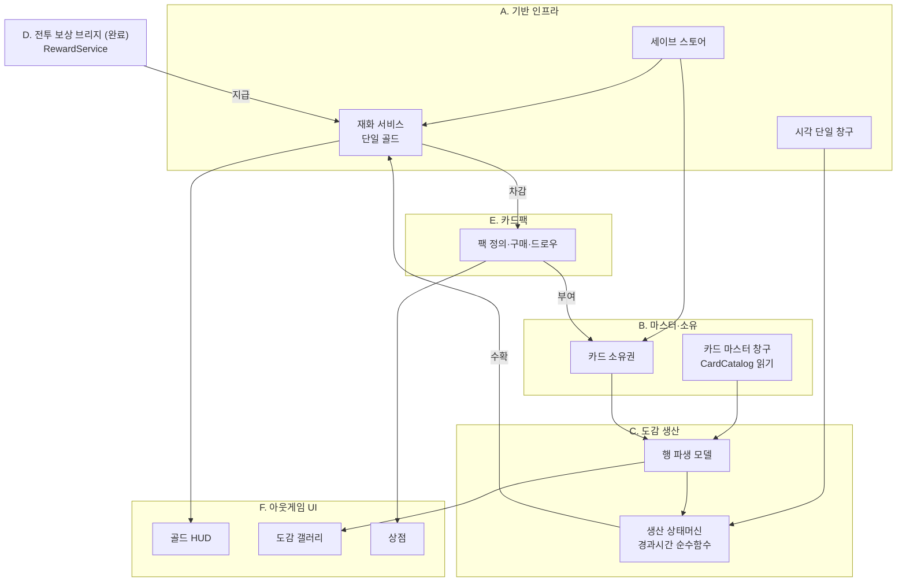

## 클래스 수준 구조 (도메인별)

<!-- 각 도메인 설계 승인 시 이 아래에 클래스도·데이터 흐름 mermaid를 추가한다.
     기존 승인분과 신규분을 구분 표시할 것. -->

### Collection 도메인 (B. 마스터·소유 + C. 도감 생산) — 구현 완료

각 노드 옆 `[관용구 #n]`은 `docs/IDIOMS.md` 항목 번호.

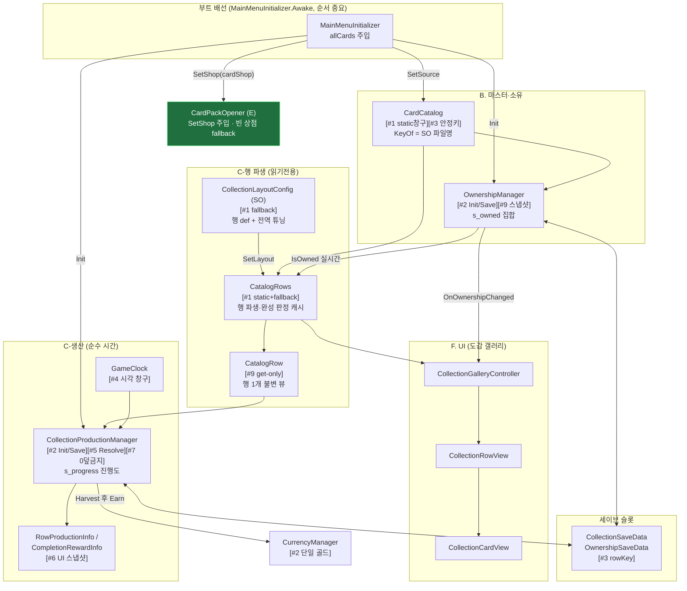

> **부트 2계층(PKG-BOOT 확정)**: 씬무관 전역(`DataSaveManager.Load`·`CurrencyManager.Init`)은 `GameManager.Boot()`(BeforeSceneLoad)가, 씬 카드목록 의존(`SetSource`·`OwnershipManager.Init`·`ProductionManager.Init`·`CardPackOpener.SetShop`)은 `MainMenuInitializer.Awake()`(ExecutionOrder -100)가 담당. `SetShop`은 `CardShop` SO 의존이라 후자에 속함(null이면 빈 상점 fallback). `EnsureBoot`(테스트 씬)는 `CardCatalog.IsReady` 가드로 통합 시 no-op.

**핵심 흐름 2줄**
- 소유: 부트가 `CardCatalog.SetSource → OwnershipManager.Init` → 갤러리가 `CatalogRows.Rows`를 그리고 `IsOwned`로 잠금 표시 → `Grant/Revoke` 시 `OnOwnershipChanged`로 재바인딩.
- 생산: 완성 행을 조회하면 `Resolve`가 `GameClock.Since(lastSettle)`로 경과분 누적(cap 클램프) → `Harvest`가 정수분을 `CurrencyManager.Earn`, 소수 보존 후 즉시 영속.

---

### F-17/F-18 도감 생산 UI 배선 (F. UI) — ✅ 씬/프리팹 배선 완료 (CollectionTest.unity)

> 목표: 이미 완비된 `CollectionProductionManager` API(GetInfo/Harvest/HarvestAll/ClaimCompletionReward/OnChanged)를
> 도감 갤러리 UI에 연결. 매니저·세이브·재화 계약은 **변경 없음**(소비만 추가). `:::new` = 이번 신규/확장.

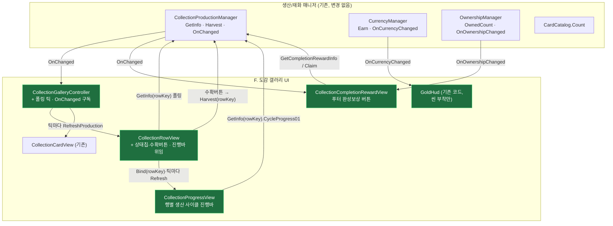

**설계 요지**
- 생산 누적은 시간 함수라 `OnChanged`가 안 뜬다 → 컨트롤러가 **0.5s 폴링 틱**으로 열린 동안 각 행 `RefreshProduction()` 갱신. 수확/완성수령/소유변경은 `OnChanged`/`OnOwnershipChanged`로 즉시 갱신.
- 행 상태 4종 표시: 잠김(수확버튼 off) / 생산중(누적 표시) / 수확가능(버튼 on) / 상한(만땅). 상태는 `GetInfo`의 `State`+`CanHarvest` 조합.
- 매니저/세이브/재화 계약 **불변** — UI는 순수 소비자(경계 준수).

**흐름 시퀀스 — 생산 폴링 + 수확 (Phase 2 구현)**

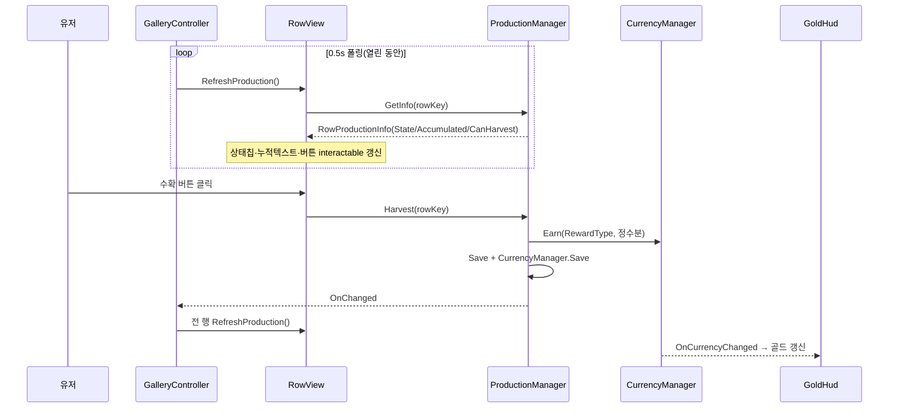

> 근거: 코드 실물 확인(2026-07-24). `CollectionRowView.cs`(상태칩·진행바·수확), `CollectionGalleryController.cs`(Update 폴링+OnChanged), `CollectionProgressView.cs`/`CollectionCompletionRewardView.cs`(신규).

**실제 배선 결과 (2026-07-24, `Assets/Scenes/CollectionTest.unity` + `CollectionRow.prefab`)**

| 컴포넌트 | 부착 위치 | 연결된 필드 → 대상 |
|---|---|---|
| `CollectionGalleryController` | 씬 `CollectionScreen` | `content`→`Gallery/Viewport/Content`, `rowPrefab`→CollectionRow.prefab, `fallbackAllCards`→카드 9장 |
| `CollectionRowView` | `CollectionRow.prefab`(루트) | `cardsContainer`→`Cards`, `cardPrefab`→Card.prefab, `stateLabel`→`Status/StateChip/T`, `harvestButton`→`Status/Action`, `progressView`→`Status/Progress`(ProgressView) (`amountText`는 미배선=옵션) |
| `CollectionProgressView` | `CollectionRow.prefab`의 `Status/Progress` | `fillImage`→`Status/Progress/BarBg/Fill` (`progressText`는 미배선=옵션). **행별 생산 사이클 진행바** |
| `CollectionCardView` | `Card.prefab` | `portrait`/`nameText`/`lockOverlay` (기존) |
| `CollectionCompletionRewardView` | 씬 `BottomBar` | `root`→`CompleteReward`, `claimButton`→`CompleteReward`(Button), `rewardText`→`CompleteReward/In/RT` |
| `GoldHud` | 씬 `TopBar/GoldHud` | `goldText`→`GoldHud/Gold` |

**생산 진행바 = 행별 사이클 진행바 (`CollectionProgressView`)**
- **소유 집계 바가 아니다.** 완성된 각 행이 개별 생산하는 재화의 **"다음 1단위까지의 사이클 진행률"** 을 행마다 표시한다. `CollectionProgressView`가 행 키(`Bind(rowKey)`)로 `GetInfo(rowKey)`를 조회해 `Status/Progress/BarBg/Fill`(Filled 가로)을 구동: 생산중=`CycleProgress01`(소수부) / 만땅=1 / 잠김=0. RowView는 진행바를 이 뷰에 **위임**(`Bind`+매 폴링 틱 `Refresh`)하며 원시 Image를 직접 만지지 않는다(단일 책임).
- `RowProductionInfo.CycleProgress01`(파생 프로퍼티 = `AccumulatedRaw - Accumulated`, 소수부): 한 사이클(재화 1단위)이 차면 바가 0으로 리셋되고 누적 정수가 +1(실시간 채움→완료→누적↑). 사이클 길이 = productionCycleSeconds(기본 15초/단위). **저장 스키마·수확 로직 불변**(표시/파생만). `Status` 컨테이너는 프리팹 기본 비활성이라 **활성화**함.
- `CollectionGalleryController.EnsureBoot()`(독립 씬 전용, `CardCatalog.IsReady`면 no-op): `DataSaveManager.Load()` + `CurrencyManager.Init()` 추가 → 테스트 씬에서도 저장된 골드·진행도 로드. 실제 통합 부트에선 IsReady 가드로 미실행.

> **배선 시 주의(다음 수정 지점)**: `CompletionRewardView`는 `BottomBar`에 붙이고 `root`만 `CompleteReward`를 토글한다 — 뷰를 `CompleteReward` 자신에 붙이면 `root.SetActive(false)` 시 뷰의 `OnDisable`이 구독을 끊어 **다시 못 켜지는 자기비활성 버그**가 난다. / `amountText`는 목업에 대응 노드가 없어 미배선(진행바가 대체) — 숫자 표기가 필요하면 노드 추가 후 연결.

**배선 검증(에디터 인메모리 세이브, 실 저장 미오염)**: fallback 3행 전량 소유→완성, 행0 빌드→시간점프. RowView→ProgressView 위임으로 바 구동: +3분 `사이클 0.5·바 0.5` → 롤오버 시 `누적 +1·바 0` → +24h `Capped·바 1`. 수확 `earned·gold` 반영, 콘솔 에러 0.

> 근거: `OutGame/Save/**`, `OutGame/Currency/CurrencyManager.cs` 실물 확인(2026-07-24).

#### 구조 지도 — 이게 전체 어디에 붙어 있나

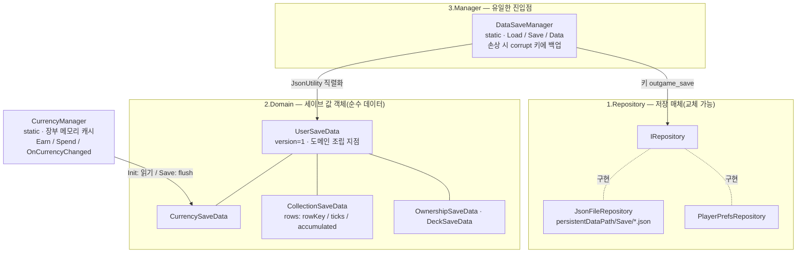

#### 흐름 시퀀스 — 부트 로드와 재화 캐싱

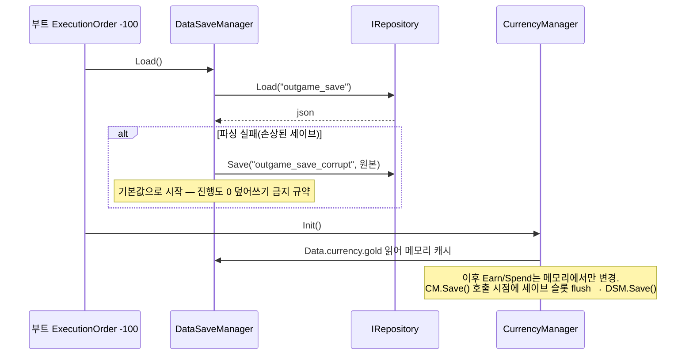

#### 원리 카드 — 왜 이렇게 생겼나

- **3층 분리(Repository/Domain/Manager)**: 저장 매체 교체가 한 줄(`SetRepository`), 스키마는 값 객체로 고립, 진입점은 하나. — `Save/3.Manager/DataSaveManager.cs`
- **재화 캐싱+flush**: Earn/Spend마다 파일 IO를 안 하려고 메모리 장부로 운영, `CurrencyManager.Save()` 시점에만 영속. **트레이드오프: Save() 누락 시 앱 종료로 장부 유실** → 지급/차감 직후 Save() 호출이 규약. — `Currency/CurrencyManager.cs`
- **CollectionRowProgress 필드 3개의 이유**: `rowKey`는 문자열(인덱스 금지 — 카드 추가돼도 진행도 안 밀림) / `lastSettleUtcTicks`는 long(JsonUtility가 DateTime 직렬화 불가) / `accumulated`는 double(수확 시 정수분만 지급, 소수 잔여 보존). — `Save/2.Domain/CollectionSaveData.cs`

**수정 가능성 높은 지점**: 새 재화 추가 = `ECurrencyType` + `CurrencySaveData` 필드 + `CurrencyManager.Init/Save` 매핑 3곳 동시 수정 / 새 세이브 항목 = `UserSaveData`에 값 객체 필드 추가만(리네임·삭제 금지).

#### 파일 지도 — 다이어그램에서 코드로

| 클래스 | 파일 |
|---|---|
| DataSaveManager | `OutGame/Save/3.Manager/DataSaveManager.cs` |
| IRepository · JsonFileRepository · PlayerPrefsRepository | `OutGame/Save/1.Repository/` |
| UserSaveData 외 값 객체 4종 | `OutGame/Save/2.Domain/` |
| CurrencyManager · ECurrencyType | `OutGame/Currency/` |

---

### E. 카드팩 경제 도메인 — ✅ 구현 완료 (2026-07-24, `OutGame/CardPack/`)

> 목표 루프 3단계: `골드 → 카드팩 구매 → 신규 카드셋 획득 → 덱 강화`.
> 핵심 성질: **E는 자체 영속 상태가 없다.** 골드 차감은 `CurrencyManager`가, 카드 소유는 `OwnershipManager`가 이미 영속하므로
> E는 둘을 잇는 **오케스트레이터**일 뿐. **구매=즉시 개봉**(미개봉 팩 재고 없음), 팩 정의는 SO(에디터 데이터), 결과는 소유권에 위임. `:::new` = 이번 신규.

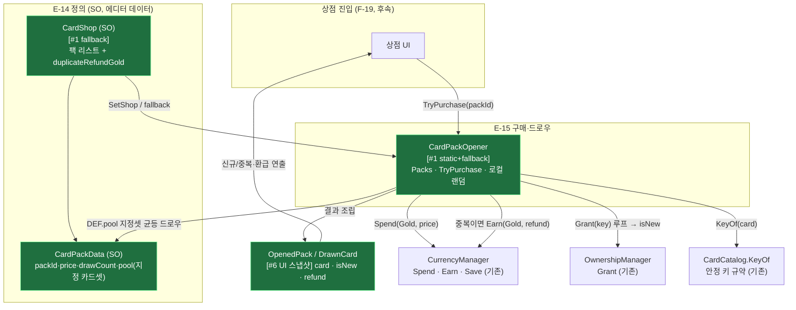

**흐름 시퀀스 — 팩 구매·개봉 (지정 풀 + 중복 환급)**

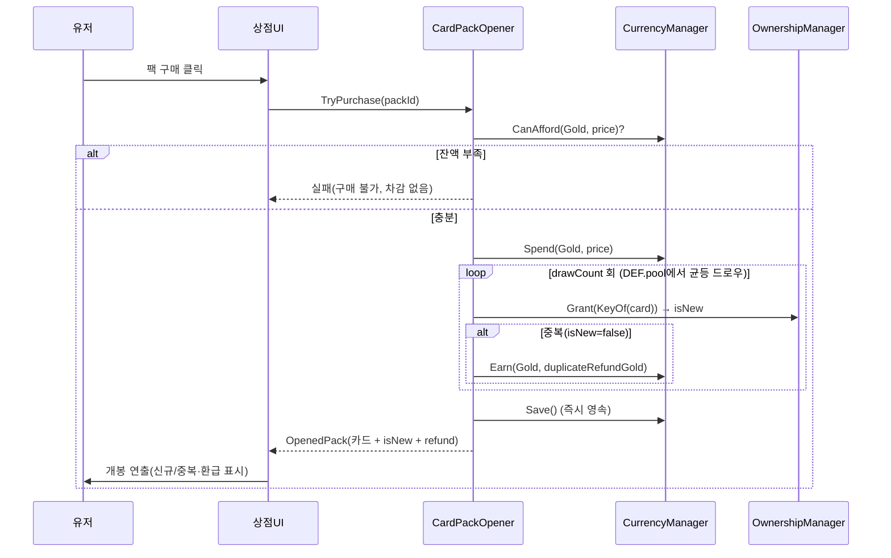

**설계 요지 (원리 카드)**
- **오케스트레이터라 세이브 섹션 없음**: E는 `Spend`·`Earn`(재화)·`Grant`(소유)만 호출하고 모두 이미 영속. E 자체 세이브를 만들면 이중 진실원. 트레이드오프: 구매 이력·pity 카운터가 필요해지면 그때 세이브 섹션 추가.
- **isNew는 Grant 시점에만 안다**: `Grant`는 신규면 true, 이미 소유면 false 반환. 개봉 후엔 전 카드가 `IsOwned=true`라 UI가 사후 판정 불가 → **`OpenedPack`는 생략 불가**(신규 여부·환급의 유일 진실원).
- **팩별 지정 풀**: 드로우 대상은 `CardData` 전체가 아니라 `CardPackData.pool`(에디터 큐레이션). 이는 마스터 목록 복제가 아닌 **부분집합 참조**라 4번째 목록 드리프트 아님. 키는 여전히 `CardCatalog.KeyOf`(단일 규약)로 산출.
- **중복 = 소액 골드 환급**: 장별 `Grant` 반환이 false면 `CurrencyManager.Earn(Gold, duplicateRefundGold)`. 환급액은 `CardShop` 전역값. Spend/Earn을 한 트랜잭션으로 처리 후 `Save()` 1회.
- **로컬 랜덤(비결정론 무방)**: 아웃게임 최초 랜덤. `Battle/MatchRandom` 재사용 금지(경계), 서비스 내부 `System.Random` 인스턴스.
- **수정 가능성 높은 지점**: 팩 가격·드로우 수·구성 = `CardPackData` SO(코드 미수정) / 환급액 = `CardShop.duplicateRefundGold` / 등급 가중치가 필요해지면 `DEF.pool`을 가중 목록으로 확장.

| 클래스 | 파일(예정) | 태스크 |
|---|---|---|
| `CardPackData` (SO) | `OutGame/CardPack/CardPackData.cs` — `packId·displayName·price·drawCount·pool(List<CardData>)` | E-14 |
| `CardShop` (SO) | `OutGame/CardPack/CardShop.cs` — `List<CardPackData> packs · duplicateRefundGold` | E-14 |
| `CardPackOpener` (static) | `OutGame/CardPack/CardPackOpener.cs` — `Packs · GetPack · TryPurchase` | E-15 |
| `OpenedPack` · `DrawnCard` (값) | `OutGame/CardPack/OpenedPack.cs` — `card · isNew · refund` | E-16 |

---

### F-19 카드팩 개봉 루프 (F. UI) — ✅ 구현 완료 (프리팹/씬 배선 사용자 인계)

> **스코프(최종)**: 상점 목록·독립 씬·MainMenu 통합 진입 전부 제외. 핵심 루프 하나만 —
> **카드팩 클릭(구매) → 개봉 연출 + 카드 순차 등장 → 카드 획득**.
> **F-19는 순수 뷰**(세이브 없음): E `CardPackOpener`를 소비. 로직은 E가 원자적으로 끝내고, 뷰는 연출만. `:::new` = 이번 신규.
> 결정: 단일 카드팩 버튼(고정 packId) / `PackOpeningView`에 옵션 `EnsureBoot` 내장(아무 씬에서 테스트, 통합 시 no-op).

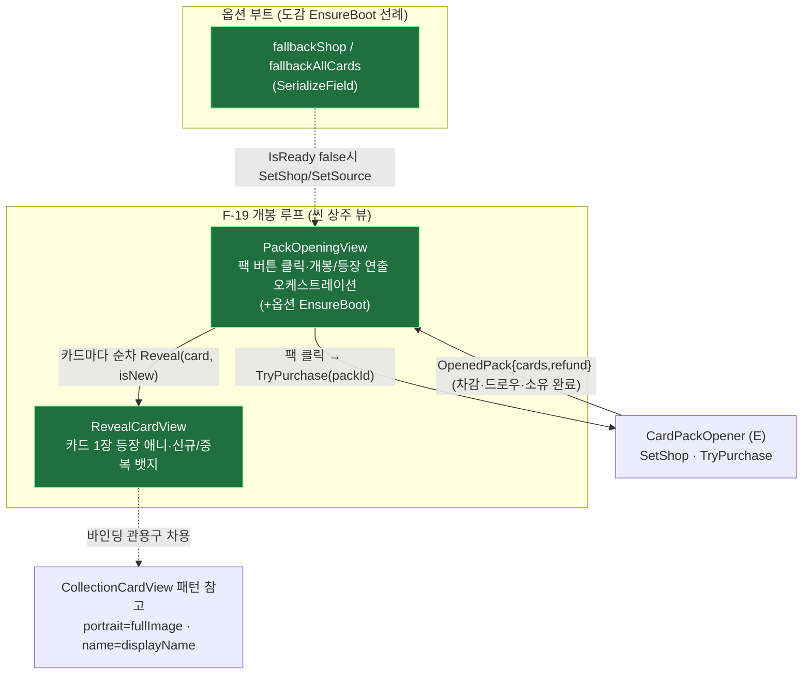

**흐름 — 개봉 인터랙션 3단계 (스택→드래그 넘김→2×3 그리드)**

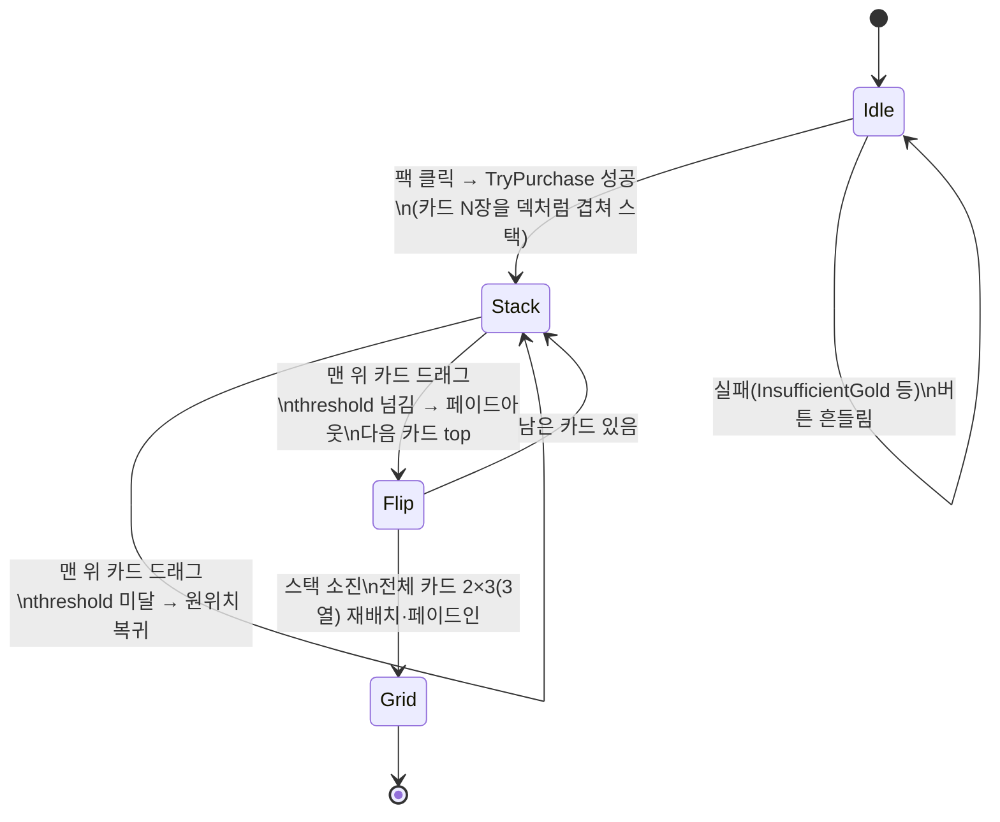

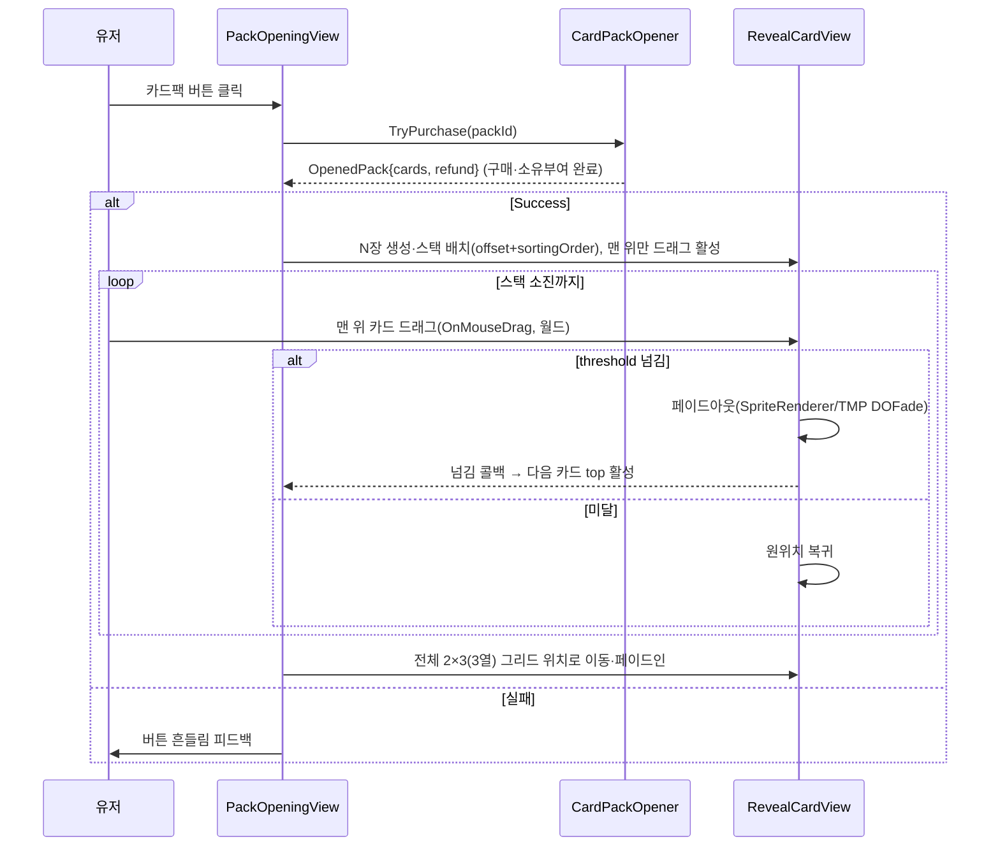

**설계 요지 (원리 카드)**
- **로직은 E, 뷰는 연출만**: `TryPurchase`가 차감·드로우·소유부여를 원자적으로 끝냄 → 뷰는 "이미 획득한" `OpenedPack.Cards`를 인터랙션으로 공개할 뿐. 연출·데이터가 분리돼 정합 안전(연출 중단돼도 데이터 정상, 그리드에서 카드 파괴 안 함).
- **상태머신 3단계(Idle→Stacking→Grid→Idle)로 재진입 차단**: `PackOpeningView.m_state`가 Idle일 때만 개봉 허용. Stacking(드래그 진행) 중 재클릭 무시. 그리드 배치 시작과 동시에 Idle 복귀 → 다음 클릭이 `ClearSpawned`로 그리드 정리.
- **월드 드래그(uGUI 아님)**: 카드는 SpriteRenderer+BoxCollider2D라 `OnMouseDown/Drag/Up` + `Camera.main.ScreenToWorldPoint`로 넘김. 시작점 대비 월드 이동거리가 `dragThreshold` 이상이면 페이드아웃+콜백, 미만이면 `DOLocalMove` 원위치. 맨 위 카드만 `SetDraggable(true)`.
- **스택 겹침 = sortingOrder 밴드**: `SetSortingOrder(rank)`가 카드마다 `rank*밴드 + 내부 baseOrder`로 정렬 → 카드끼리 렌더 순서 섞임 방지, 카드 내부 아트↔텍스트 앞뒤 관계는 baseOrder로 보존. 페이드는 자식 SpriteRenderer/TMP 전체 `DOFade`(CardAnimator.FadeView 관용구).
- **팝업 풀링 미사용**: 단일 루프라 씬 상주 뷰가 더 단순(`PooledUIBase`/`UIPrefab` 라벨 불필요).
- **옵션 EnsureBoot**: 도감 `CollectionGalleryController.EnsureBoot` 선례 — `CardCatalog.IsReady` false일 때만 `Load`·`SetSource(fallbackAllCards)`·`Init`·`SetShop(fallbackShop)`. 통합 시 no-op.
- **수정 가능성 높은 지점**: 스택 오프셋·그리드 간격·연출 타이밍 `PackOpeningView.cs`(SerializeField) / 드래그 threshold·복귀·페이드 `RevealCardView.cs`(SerializeField) / 그리드 정렬 수식 `PackOpeningView.LayoutGrid`.

| 클래스 | 파일 | 책임 | 태스크 |
|---|---|---|---|
| `PackOpeningView` (MonoBehaviour) ✅ | `Assets/Scripts/UI/Shop/PackOpeningView.cs` | 팩 클릭·구매·상태머신(스택 배치/넘김 오케스트레이션/그리드)·옵션 EnsureBoot | F-19 |
| `RevealCardView` (MonoBehaviour) ✅ | `Assets/Scripts/UI/Shop/RevealCardView.cs` | 카드 1장: 데이터 바인딩·월드 드래그 넘김·페이드/이동·sortingOrder 겹침 | F-19 |

**프리팹/씬 배선 (문서화 → 실배선 사용자/메인)**
- `PackOpeningView` 부착 오브젝트: `packButton`(Button) + `cardsContainer`(Transform, 스택/그리드 부모) + `cardPrefab`(RevealCardView) + 튜닝값(`stackOffset`/`gridCellSize`/각 duration) + 옵션 부트(`fallbackShop`/`fallbackAllCards`).
- `RevealCardView` 카드 프리팹 필수: **`BoxCollider2D`**(월드 드래그 피킹) + `illustration`(SpriteRenderer)·`nameText`/`hpText`/`refundText`(월드 TMP_Text)·`newBadge`/`dupBadge`(GameObject) + `dragThreshold`/`swipeFadeDuration`/`returnDuration`.
- **페이드 대상은 코드가 자동 수집**(자식 전체 SpriteRenderer/TMP_Text) — 필드 배선 불필요, 카드 프리팹 하위에 두기만 하면 됨. sortingOrder도 자식 전체 Renderer에 적용.
- `cardsContainer`는 **직교 카메라 평면(z 고정) 하위**에 두고 카드 프리팹에 BoxCollider2D가 있어야 `OnMouse*`가 동작(누락 시 컴파일 통과·드래그 무반응).
- 팝업 풀링 미사용이라 `UIPrefab` 라벨 **불필요**(씬 상주).

> ~~상점 목록(ShopController/ShopPackTileView)·독립 씬·MainMenu 통합 진입~~ — **이번 스코프 전부 제외, 후속.**
