# 아웃게임 구조도 (STRUCTURE)

## 유저 세이브 — 클라우드 단일 진실원 (2026-08-27 갱신)

Firestore 문서 `envs/{envId}/users/{uid}/save/current`가 **유일한 진실원**이다. 로컬 캐시도, 오프라인 폴백도 없다 — 원격에 닿지 못하면 게임이 진행되지 않는다.
(2026-08-25판 "쓰기 전용 미러 / PlayerSaveSync" 서술은 폐기 — `PlayerSaveSync` · `4.Sync/` · `BootInstaller`는 코드에 없다.
2026-08-26판 "로컬 캐시 봉투" 서술도 폐기 — `PlayerSaveCacheEnvelope` · `1.Repository/` 는 삭제됐다.)

### 계층 지도

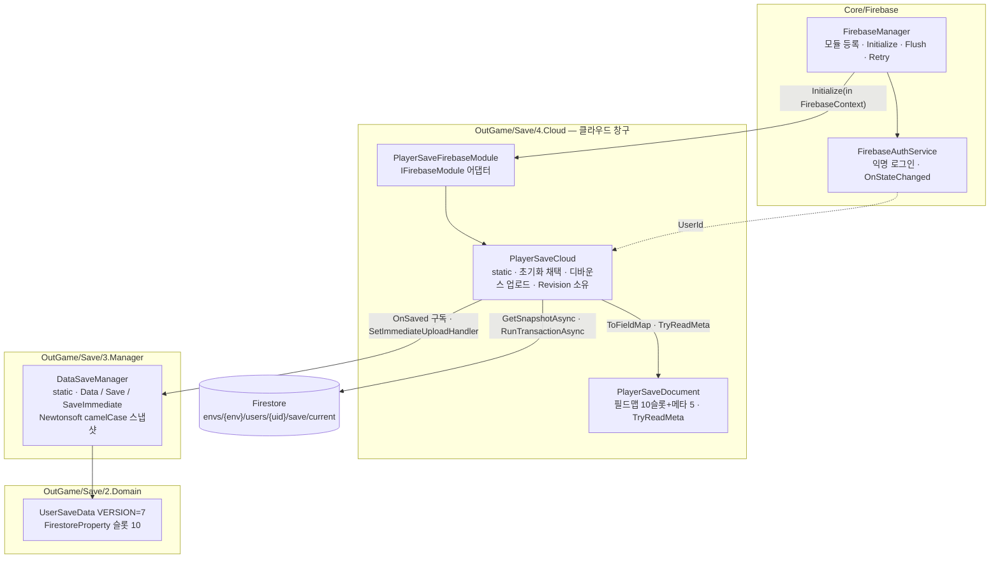

- 세이브는 **3계층**(2.Domain / 3.Manager / 4.Cloud)이다. 폴더 번호는 리넘버링하지 않아 1번만 비어 있다.
- 3계층은 4계층을 **참조하지 않는다**. 배선은 `DataSaveManager.OnSaved`(이벤트)와 `SetImmediateUploadHandler`(콜백) 두 개뿐이다.
- `DataSaveManager.Save()` 는 디스크를 만지지 않는다 — 메모리 세이브가 바뀌었음을 `OnSaved` 로 통지할 뿐이고, 착지는 전부 업로드다.
- 스냅샷과 원격 문서가 같은 키를 내야 대조가 되므로 Newtonsoft는 camelCase(`ProcessDictionaryKeys=false`)로 `[FirestoreProperty]` 이름과 맞춰 둔다.
- 문서 쓰기는 항상 `SetOptions.Overwrite` — MergeAll이면 삭제가 전파되지 않는다.
- `FlushPendingAsync`는 모듈마다 있다: 세이브는 `PlayerSaveCloud.FlushAsync`, 스펙 동기화(`BattleContentFirebaseModule`)는 원격 쓰기가 없어 `UniTask.CompletedTask`. 한 모듈이 동기 throw하면 `WhenAll` 이전에 터져 나머지 모듈의 flush까지 죽는다(2026-08-26 수정).

### 초기화 채택 — 원격만

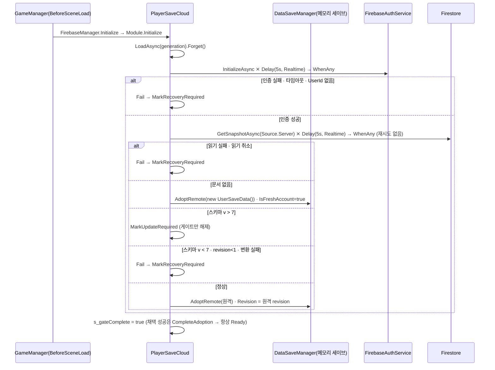

`InitializationInstaller.Start`가 `PlayerSaveCloud.IsGateComplete`를 폴링해 기다리고, 게이트 통과 후 `InstallSaveDependent()` 한 곳에서 세이브 의존 매니저(`CurrencyManager.Init` 등)를 전부 설치한다. 스타터 지급의 유일한 근거는 `IsFreshAccount`(= 원격 문서 부재)이며, 설치 끝에 `DataSaveManager.SaveImmediate()`로 첫 문서를 만든다.

### 저장 → 업로드

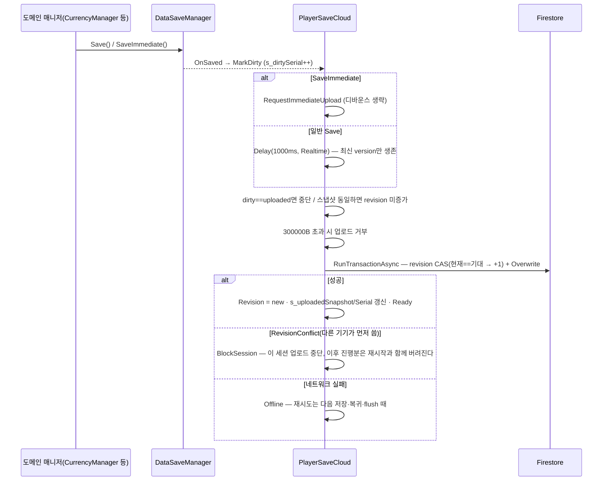

### 실패 표면 — 3분할 (2026-08-26 P3)

세이브 진실원이 클라우드고 로컬 복구선이 없다. 실패의 **성질**이 다르면 표면도 갈라야 한다.

| 클라우드 상태 | 진입 | 표면 | 소유 |
|---|---|---|---|
| `Failed` | `PlayerSaveCloud.Fail()` — 초기화 게이트 **전** | 복구 화면 — 안내 문구 + 재시도·종료 2버튼 | `LoadingCoverView.ShowRecovery` |
| `Blocked` | `PlayerSaveCloud.BlockSession()` — 게이트 **후** | 재시작 요구 모달 1회 (`SimpleYNPopup`) | `CloudSyncStatusWatcher` |
| `Offline` | 업로드 3회 연속 실패 | 상시 배너 (`UiSortingOrder.CloudSyncBanner` = 940) | `CloudSyncBannerView` |

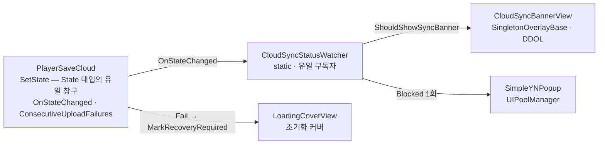

- **판정은 MonoBehaviour 밖(`CloudSyncStatusWatcher`)에 둔다** — 배너 프리팹 로드가 실패해도 차단 모달은 떠야 한다.
- `Offline` 은 **업로드 실패 축으로만** 남는다. 채택 경로에는 `Offline` 이 없다 — 초기화에서 원격에 못 닿으면 `Failed` 다.
- **임계값(3)은 `PlayerSaveCloud` 가 쥔다**(`ShouldShowSyncBanner`). UI가 세면 오탐한다 — 인증이 끊긴 업로드는
  요청을 띄우지도 못하고 `Offline` 이 되는데, "시도했으나 실패"와 "애초에 못 올림"은 `UploadAsync` 안에서만 구분된다.
- `BlockSession` 은 `MarkRecoveryRequired()` 를 부르지 않는다 — 게이트 뒤라 화면을 못 바꾸면서 `IsReady` 만
  false로 떨어뜨렸다. `IsReady`/`IsTerminated` 소비자는 초기화 경로 둘뿐이다.
- 모달의 "계속"은 이번 세션을 마저 보게 해 줄 뿐이다 — 로컬 복구선이 없어 그 뒤 진행분은 서버에 올라가지 않는다.

### 초기화 실패 — 대기 없이 재시도 / 종료

초기화가 실패하면 **기다리지 않고** 안내 + 재시도·종료 2버튼 패널로 전환한다(모바일 표준).
재시도는 **실패한 단계만** 다시 태운다 — 씬 재로드도 Firebase 재초기화도 없다.
`GameManager.RetryInitialize` · `FirebaseManager.Reinitialize` 는 삭제된 채로 둔다(되살리지 않았다).

- 실패 확정 예산: 망 끊김이 확실하면 **0초**(`PlayerSaveCloud.LoadCoreAsync` 가
  `Application.internetReachability` 로 선체크), 그 외 최악 **10초**(auth 5s + 읽기 5s).
  읽기 자동 재시도는 없다 — 재시도의 주체는 사람이다.
- `LoadingCoverView.ShowRecovery` 는 `UpdateRequired` · `RecoveryRequired` 두 종점의 유일한 출구 화면이다.
  재시도(`retryButton`)는 **`UpdateRequired` 일 때만 숨는다** — 판정은 `GameInitialization.CanRetry` 가 갖고 뷰는 묻기만 한다.
  초기화 대기 타임아웃(느린 적재)도 포함이다: 감추면 느린 초기화가 막다른 길이 된다.
- 문구는 세 갈래다: 업데이트 필요 / 에셋 로드 실패(`CardArtCache.HasFailed` · `UiPrefabCache.HasFailed`) / 그 외 서버 연결 실패.
- 복구 문구는 진행바(`Slider_LoadingBar_Green`) **밖**의 `RecoveryPanel/Text_Recovery` 다.
  안에 두면 `progressBar.SetActive(false)` 가 문구까지 함께 끈다(2026-08-26 수정).
- **순서 계약의 주인은 `InitializationInstaller.RestartBoot()` 하나다** — 실패한 캐시 되돌리기
  (`CardArtCache.ResetIfFailed` / `UiPrefabCache.ResetIfFailed`) → `GameInitialization.ResetForRetry`
  → `PlayerSaveCloud.ResetForRetry` → 게이트 재기동. 뷰는 화면만 되돌리고 이 하나를 부른다.
- **재시도 전용 적재 경로는 없다** — 애셋 선로드를 게이트 첫 줄(`StartAssetLoads`)에서 걸어,
  게이트를 다시 걸면 재적재가 따라온다. 재진입 방어 2개(게이트 사본 1개 강제 ·
  `UiPrefabCache` generation 토큰)는 [FIRESTORE_SAVE_ROADMAP.md](FIRESTORE_SAVE_ROADMAP.md) P3 참조.

### 비동기 관용구

| 축 | 방식 | 근거 |
|---|---|---|
| 실행 | UniTask 단일 (`UniTaskVoid` + `.Forget()`), 코루틴은 게이트 폴링뿐 | `PlayerSaveCloud.LoadAsync`, `InitializationInstaller.Start` |
| 타임아웃 | `UniTask.WhenAny(작업, UniTask.Delay(ms, DelayType.Realtime))` | auth·read 5s / 트랜잭션 10s. `ignoreTimeScale`은 씬 로드 정지가 첫 델타에 실려 5초가 1프레임에 소진된다(실측 705ms) |
| 취소 | `s_generation` 카운터 대조 (CancellationToken 미사용) | 매 await 뒤 `_generation != s_generation` 확인 |
| 중복 억제 | `s_pendingVersion`(디바운스 세대) · `s_dirtySerial`/`s_uploadedSerial`(변경 유무) · `s_uploadedSnapshot`(내용 동일) | 3중 게이트 |
| 직렬화(업로드) | `s_uploading` 플래그 + `UniTaskCompletionSource`로 진행 중 업로드 대기 | `FlushAsync` |
| 스레드 | Firebase 콜백은 스레드 미보장 → `UniTask.SwitchToMainThread()` 후 상태 전이 | `HandleAuthStateChangedAsync` |
| 재시도 | 초기화 읽기·업로드 모두 내부 재시도 없음 — 초기화는 복구 화면의 재시도 버튼(`InitializationInstaller.RestartBoot`)이 받는다 | `OnApplicationPause(false)` → `RetryPending`, `OnApplicationQuit` → `FlushPendingAsync().Forget()` |

`OnApplicationPause(true)`는 `CurrencyManager.Save()`(잔액을 메모리 세이브에 flush)를 먼저 하고 `FirebaseManager.FlushPendingAsync()`를 await한다. 종료 콜백에는 await 창이 없어 킥만 하고, 로컬 복구선이 없으므로 못 올린 변경분은 그대로 유실된다.

> 사용자의 설계 승인과 구조 파악의 기준 문서.
> 도메인 설계 확정 시, 구조 변경 시마다 갱신한다 (CLAUDE.md 아웃게임 운영 정책).
> 갱신 주체: outgame-engineer 또는 메인. 근거 없는 노드 금지 — 실제 파일이 있거나 승인된 설계여야 한다.


## 도메인 수준 구조 (OUTGAME_ROADMAP 기준)

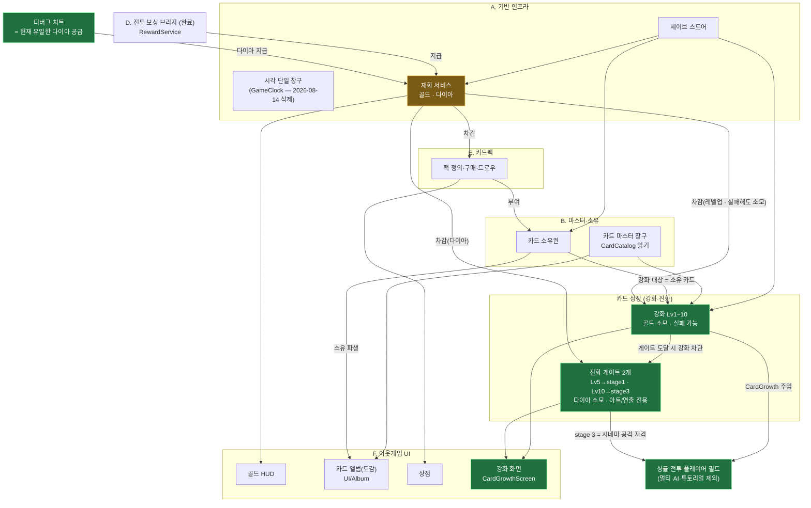

> 이 그림에서 성장 노드(`:::new`)는 **도메인 문자를 아직 받지 않았다** — `OUTGAME_ROADMAP.md`의 도메인 분류(A~H) 밖에 신설된 축이라, 로드맵 편입 세션에서 문자를 부여할 때까지 이름으로만 부른다.
> **도메인 C(도감 방치 생산)는 2026-08-14 코드·에셋째 삭제됐다** — 행 파생 모델·생산 상태머신·수확이 전부 사라졌고 신규 도감(카드 앨범, `OutGame/Album/`)이 그 자리를 대신한다. 로드맵의 C절은 당시 계획 기록으로만 남는다. 시각 창구 `GameClock`도 소비처가 0이 되어 같이 삭제됐다.
> `재화 서비스`가 `:::chg`인 이유: 로드맵의 "단일 골드" 확정 스코프가 진화 비용 때문에 **골드 + 다이아 2종**으로 바뀌었다(보드 변경 로그 2026-08-04). 다만 다이아 **공급 경로는 아직 디버그 치트 하나뿐**이다 — `ENHANCE_ECONOMY.md`가 주 공급원으로 설계했던 도감 생산이 폐기됐으므로 공급원 재설계가 남아 있다.

## 클래스 수준 구조 (도메인별)

<!-- 각 도메인 설계 승인 시 이 아래에 클래스도·데이터 흐름 mermaid를 추가한다.
     기존 승인분과 신규분을 구분 표시할 것. -->


### 도감 카드 상세 오버레이 — 좌우 화살표·스와이프 넘기기 (F. UI) — ✅ 코드+검수+프리팹 배선 완료 (2026-08-04, Play 검증 대기)

> 목표: 상세를 닫았다 다시 열지 않고 **도감 배열 순서 그대로** 옆 카드로 넘어간다.
> **순환**(마지막 ↔ 첫 카드가 이어짐, 상점 캐러셀 `PackCarouselView`와 같은 규약), null 슬롯(authoring 누락)은 넘기기가 건너뛴다. `:::new` = 이번 신규.

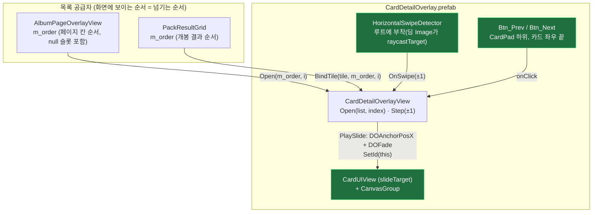

**흐름 시퀀스 — 목록 끝 카드를 "다음"으로 넘기기**

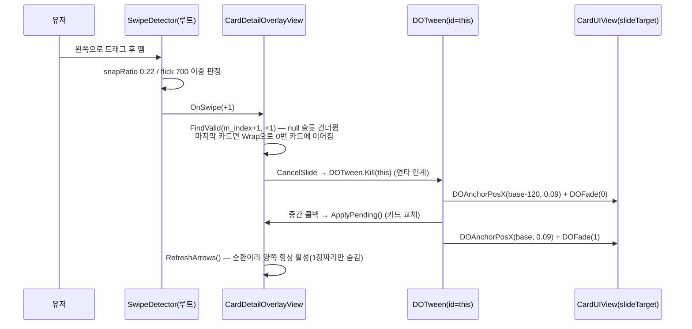


### E. 카드팩 경제 도메인 — ✅ 구현 완료 (2026-07-24, `OutGame/CardPack/`)

> 목표 루프 3단계: `골드 → 카드팩 구매 → 신규 카드셋 획득 → 덱 강화`.
> 핵심 성질: **E는 자체 영속 상태가 없다.** 골드 차감은 `CurrencyManager`가, 카드 소유는 `OwnershipManager`가 이미 영속하므로
> E는 둘을 잇는 **오케스트레이터**일 뿐. **구매=즉시 개봉**(미개봉 팩 재고 없음), 팩 정의는 SO(에디터 데이터), 결과는 소유권에 위임. `:::new` = 이번 신규.

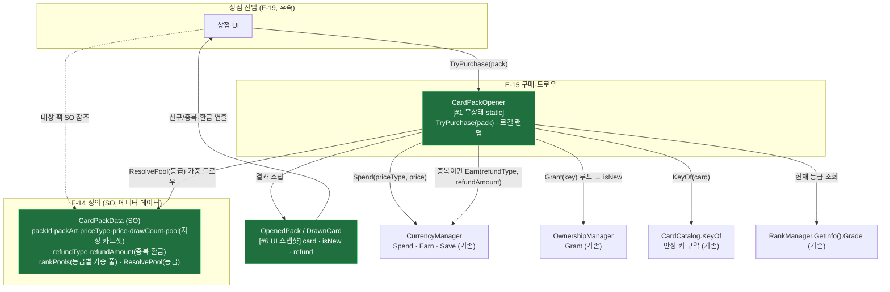

**흐름 시퀀스 — 팩 구매·개봉 (지정 풀 + 중복 환급)**


**설계 요지 (원리 카드)**
- **오케스트레이터라 세이브 섹션 없음**: E는 `Spend`·`Earn`(재화)·`Grant`(소유)만 호출하고 모두 이미 영속. E 자체 세이브를 만들면 이중 진실원. 트레이드오프: 구매 이력·pity 카운터가 필요해지면 그때 세이브 섹션 추가.
- **isNew는 Grant 시점에만 안다**: `Grant`는 신규면 true, 이미 소유면 false 반환. 개봉 후엔 전 카드가 `IsOwned=true`라 UI가 사후 판정 불가 → **`OpenedPack`는 생략 불가**(신규 여부·환급의 유일 진실원).
- **팩별 지정 풀**: 드로우 대상은 `CardData` 전체가 아니라 `CardPackData.pool`(에디터 큐레이션). 이는 마스터 목록 복제가 아닌 **부분집합 참조**라 4번째 목록 드리프트 아님. 키는 여전히 `CardCatalog.KeyOf`(단일 규약)로 산출.
- **랭크별 풀 오버라이드 (2026-08-06)**: `rankPools`(`RankPackPool` = minGrade + `WeightedCard` 목록)가 있으면 `ResolvePool(현재 등급)`이 "minGrade ≤ 현재 등급 중 최고 등급" 항목을 적용(등급별 통풀 재저작, 하위 등급과 합산 없음). 매치 없거나 비면 기존 `pool`을 weight 1 취급으로 폴백 → `rankPools` 빈 팩(튜토리얼 3종)은 기존 동작 그대로. weight 0 이하 = 1(균등) 취급, 카드 제외는 리스트 삭제로. 풀 해석은 데이터(`CardPackData`)가 소유 — 상점 미리보기가 생기면 같은 메서드를 쓴다(현재 미리보기 소비자 없음).
- **중복 = 소액 환급**: 장별 `Grant` 반환이 false면 `CurrencyManager.Earn(refundType, refundAmount)`. 종류·액수 **둘 다 `CardPackData`가 쥔다**(2026-08-10 이관 — 구매처는 아무것도 넘기지 않는다). 결제 재화(`priceType`)와 무관하게 저작할 수 있다: UltraPack은 Diamond로 사고 Gold로 환급한다. Spend/Earn을 한 트랜잭션으로 처리 후 `Save()` 1회.
- **로컬 랜덤(비결정론 무방)**: 아웃게임 최초 랜덤. `Battle/MatchRandom` 재사용 금지(경계), 서비스 내부 `System.Random` 인스턴스.
- **상점 SO(CardShop) 폐기**: 진열 팩 목록·환급 전역값을 쥐던 `CardShop` SO와 `SetShop` 주입을 제거. `CardPackOpener`는 무상태 파사드가 되고, **진열할 팩 목록**만 각 구매처 뷰가 인스펙터로 소유한다(진열=뷰 책임). 환급은 2026-08-10에 팩 SO로 다시 모였다 — 뷰는 `TryPurchase(pack)`에 팩만 넘긴다.
- **수정 가능성 높은 지점**: 팩 가격·드로우 수·구성·등급별 풀/확률·**중복 환급 종류/액수** 전부 `CardPackData` SO(코드 미수정). ("가중 목록으로 확장" 예고는 `rankPools`로 실현.)

| 클래스 | 파일 | 태스크 |
|---|---|---|
| `CardPackData` (SO) | `OutGame/CardPack/CardPackData.cs` — `packId·displayName·packArt(Sprite)·priceType·price·drawCount·uniqueDraw·refundType·refundAmount·pool(List<CardData>)·rankPools(List<RankPackPool>)·ResolvePool(ERankGrade)` | E-14 |
| `WeightedCard` · `RankPackPool` (값, co-locate) | `OutGame/CardPack/CardPackData.cs` — `card·weight(0 이하=1)` / `minGrade·cards` | E-14 |
| `CardPackOpener` (static, 무상태) | `OutGame/CardPack/CardPackOpener.cs` — `TryPurchase(CardPackData)` | E-15 |
| `OpenedPack` · `DrawnCard` (값) | `OutGame/CardPack/OpenedPack.cs` — `card · isNew · refund` | E-16 |

---


> ~~상점 목록(ShopController/ShopPackTileView)·독립 씬·MainMenu 통합 진입~~ — **이번 스코프 전부 제외, 후속.**

---


### G-28 — 개봉 연출 단순화 (클릭 1회 → 패널 fade → 3열 그리드)

> **(2026-07-27) 이 단순화는 되돌려졌다 → 아래 G-29.** 아래 내용은 그 시점의 구조 기록으로 남긴다.

#### 구조 위치 (변경분만)

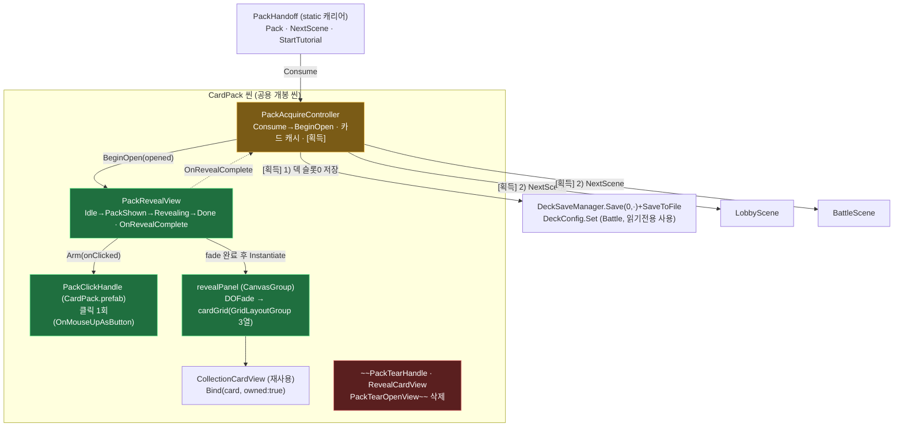

#### 흐름 시퀀스 — 개봉 1회

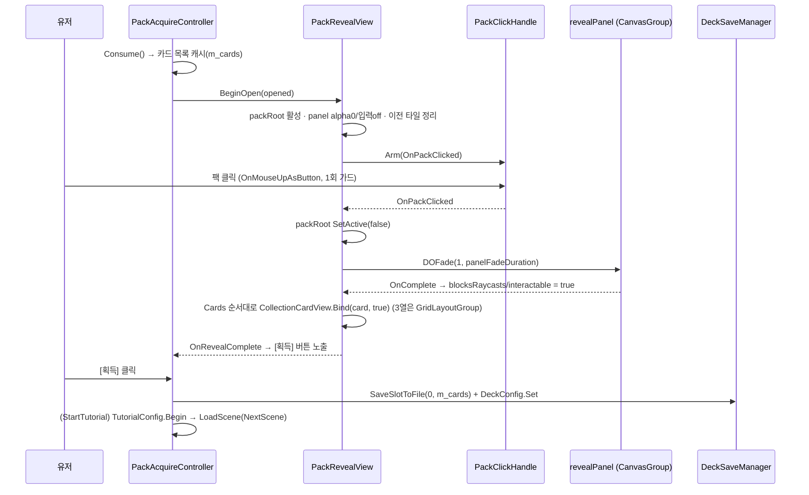

#### 원리 카드

- **연출을 인터랙션 1개로 축약**: 드래그 뜯기·카드별 스와이프 스택은 상태·입력 축이 많아 배선 실패가 곧 소프트락이었다. 클릭 1회 + CanvasGroup fade + `GridLayoutGroup`으로 줄여, 좌표 계산 코드를 레이아웃 컴포넌트에 넘겼다.
- **표시 뷰 단일화**: 결과 카드는 도감 타일 `CollectionCardView`를 그대로 재사용(월드 스프라이트 뷰 폐기) → 카드 표시 진실원이 하나(`displayName`/`fullImage`).
- **데드락 방지 우선**: `packHandle`/`revealPanel`/`cardPrefab`/`cardGrid` 미배선·카드 0장 모두 경고 후 `OnRevealComplete`를 발화 — 획득 버튼이 영구히 숨는 경로를 남기지 않는다.

**수정 가능성 높은 지점**: fade 시간·전이 가드 `PackRevealView.cs`(`panelFadeDuration`, `OnPackClicked`) / 덱 저장 슬롯·정책 `PackAcquireController.SaveOpenedDeck`(슬롯 0 고정).

---

### G-29 — 개봉 연출 재확장 (스와이프 뜯기 → 카드 더미 한 장씩 넘기기)

**의도·단계별 상세·열린 항목의 진실원 = [`docs/PACK_OPEN_DIRECTION.md`](../PACK_OPEN_DIRECTION.md).** 여기엔 구조 노드만 남긴다.

#### 구조 위치 (변경분만)

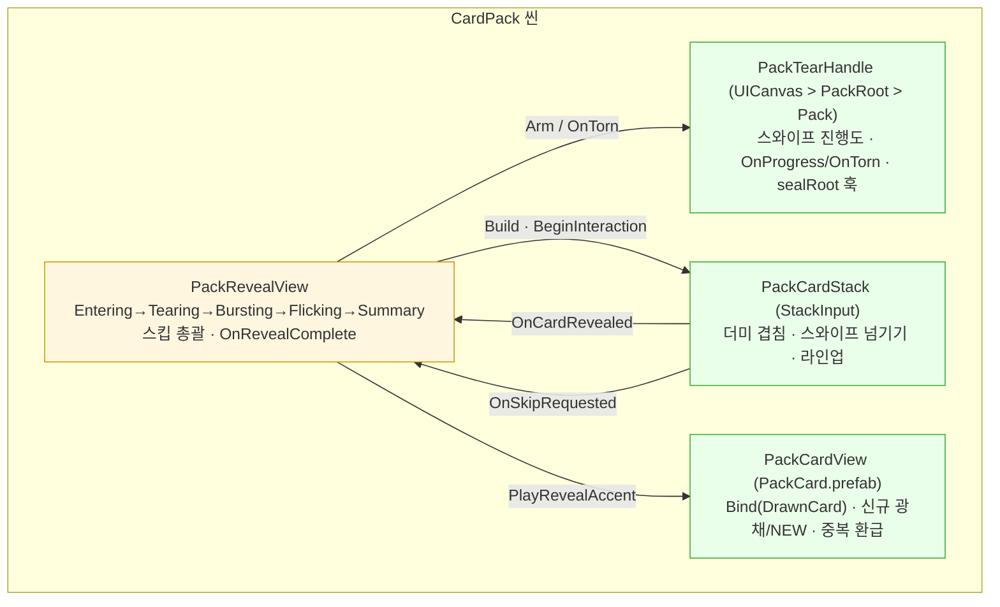


### G-TUT — 아웃게임 첫시작 튜토리얼 (P1~P4) — ✅ 코드+검수+컴파일 에러 0 (씬 배선·SO 저작 대기) / 2026-07-31 **챕터(N편) 2계층 재편** / 2026-08-03 **기능 해금(잠금) 축 추가**

> 첫실행 온보딩을 "한 번 리다이렉트하고 끝"에서 **영속 진행도 + 스텝 해석 + 강제 안내 게이트** 3축으로 재편한 것.
> `LobbyFirstRunRedirect`를 흡수·삭제하고, 로비↔CardPack↔Battle 왕복과 앱 강제종료를 견디는 진행도를 세이브에 둔다.
> **인게임(전투) 튜토리얼 내부 로직은 범위 밖** — 기존 `TutorialConfig`/`TutorialOverlayUI`를 그대로 쓰고, 아웃게임은 **어느 회차에 어느 시나리오를 넘길지만** 책임진다. `:::new` = 이번 신규.

#### 구조 지도 — 영속(진행도) / 해석(러너) / 수명(브리지) / 표시(게이트) 4층

```mermaid
flowchart TD
    subgraph boot["초기화 (BeforeSceneLoad)"]
        GM["GameManager.Boot()<br/>Load → TutorialProgress.Init → CurrencyInit"]:::chg
    end

    subgraph persist["영속 — 세이브만 안다"]
        PRG["OutgameTutorialProgress (static)<br/>IsCompleted · ChapterIndex · StepIndex · Init<br/>CommitStep(챕터,스텝) · Complete · ResetForDebug · JumpForDebug"]:::chg
        SD["TutorialSaveData (슬롯)<br/>outgameChapterIndex · outgameChapterStepIndex<br/>outgameCompleted · migrationChecked<br/>(outgameStepIndex = 플랫 시절 잔재, 동결)"]:::chg
    end

    subgraph run["해석 — 스텝 실행 (씬 오브젝트를 모름)"]
        RUN["OutgameTutorialRunner (static)<br/>IsRunning · ChapterCount · EnsureData · TryGetCurrentStep<br/>EnterCurrentStep · NotifyStepSatisfied<br/>TryGetNext = 자리 올림(빈 챕터 스킵) 단일 진실원<br/>디버그: StepCountOf · ChapterLabelOf · TryGetStepAt<br/>RewindForDebug(좌표) → OnRewound"]:::chg
        DATA["OutgameTutorialData (SO)<br/>List&lt;OutgameTutorialChapter&gt;<br/>조립 목록일 뿐 — 종류별 필드·실행은 스텝이 가진다"]:::chg
        CHAP["OutgameTutorialChapter ([Serializable], SO 아님)<br/>label(기획 'N편'과 1:1) · steps · TryGetStep<br/>챕터 하나 = 준비 스텝들 → 전투 스텝"]:::new
        STEP["OutgameTutorialStep (abstract SO) + 6종<br/>WaitClick · BattleEntry · WaitPurchase<br/>WaitPackOpen · AutoPurchase · AutoBattle<br/>Anchor · Completion · LeavesScene · Enter(ctx)<br/>unlocks(기능 해금) · UseDim(딤 사용 여부)"]:::chg
        CTX["OutgameTutorialStepContext (readonly struct)<br/>ChapterIndex · StepIndex + 다음 좌표(러너가 미리 계산)<br/>CommitAdvance · Rollback · CompleteIfLast<br/>스텝이 진행도를 건드리는 유일한 창구<br/>커밋 대상은 주입된 싱크 → G-TUT2"]:::chg
        DATA --> CHAP
        CHAP --> STEP
        RUN -->|"Enter(ctx)"| STEP
        STEP --> CTX
    end

    subgraph scene["씬 레이어 (UI/Tutorial/)"]
        BRG["OutgameTutorialBridge (온보딩 전용)<br/>씬당 1개 — 현재 LobbyScene뿐<br/>(개봉이 씬→로비 오버레이로 이관돼 CardPack 브리지 소멸)<br/>Awake:EnsureData · Start:EnterCurrentStep<br/>온보딩이 끝나면 게이트를 건드리지 않는다 → G-TUT2"]:::new
        GATE["OutgameTutorialGateUI<br/>전면 딤(350) + 타깃 Canvas 승격(351)<br/>포커스링 · 손가락 · 메시지 = 프리팹 저작<br/>onClick 구독으로 완료 감지<br/>UseDim=false면 딤·승격 생략(잠금이 대신 막는다)<br/>안내 문구는 항상 화면 중앙"]:::chg
        GPF["OutgameTutorialGate.prefab<br/>브리지가 [SerializeField]로 보유<br/>미배선 시 딤+문구 코드 폴백"]:::new
    end

    subgraph anchor["타깃 식별 (씬 경로 문자열 금지)"]
        KEY["EOutgameTutorialAnchor (enum, int 직렬화)<br/>LobbyPlayButton · LobbyPackTab<br/>PackBuyButton · PackAcquireButton"]:::new
        REG["TutorialAnchorRegistry (static)<br/>Register/Unregister/TryGet · OnRegistered"]:::new
        ANC["TutorialAnchor (MonoBehaviour)<br/>OnEnable/OnDisable = 등록/해제"]:::new
        TAB["LobbyTabController.Tab.tutorialAnchor<br/>탭 버튼(프리팹 내부 stripped Button) 대리 등록"]:::chg
    end

    subgraph feat["기능 해금 (딤과 별개 축) — 2026-08-03"]
        FEAT["EOutgameFeature (enum, int 직렬화)<br/>로비 탭 5종 · LobbyPlay · PackBuy/Carousel<br/>DeckCreate/EditToggle/AutoEquip · CollectionHarvest"]:::new
        FLOCK["OutgameFeatureLock (static)<br/>IsUnlocked · Refresh · OnChanged · ForceUnlockAllForDebug<br/>세이브 없음 — 좌표에서 매번 파생(캐시+lazy 무효화)"]:::new
        FLV["FeatureLockView (MonoBehaviour)<br/>interactable + Resources/UI/LockOverlay 런타임 생성<br/>controlInteractable=false면 룩만 담당"]:::new
        FTAB["LobbyTabController.Tab.unlockFeature<br/>탭 버튼에 FeatureLockView 런타임 부착 + Select 가드"]:::chg
    end

    OPENER["CardPackOpener.TryPurchase (E)<br/>Grant→Save 원자 영속"]
    HAND["PackHandoff (static 캐리어)"]
    TUT["TutorialConfig.Begin (Battle, 읽기 사용)"]
    BATTLE["BattleScene<br/>브리지 없음 (복귀 시 로비 브리지가 재개)"]
    OWN["OwnershipManager.HasAnyOwnedSaved<br/>레거시 마이그레이션 판정 전용으로 축소"]:::chg
    DEAD["~~LobbyFirstRunRedirect~~ 삭제<br/>= 스텝 0 AutoPurchase"]:::dead

    GM --> PRG
    PRG <--> SD
    PRG -.->|"Init 1회 판정"| OWN
    DEAD -.-> RUN
    BRG -->|"EnsureData(멱등)"| RUN
    RUN --- DATA
    RUN -->|"StepIndex 읽기 · CommitStep"| PRG
    RUN -->|"AutoPurchase"| OPENER
    RUN -->|"Set(opened, nextScene, false)"| HAND
    RUN -->|"BattleEntry · AutoBattle 진입 시"| TUT
    RUN -->|"AutoBattle → LoadScene(BattleScene)"| BATTLE
    BRG -->|"Ensure(gatePrefab) → Instantiate"| GPF
    GPF --- GATE
    BRG -->|"ShowGate(rect, button, msg)"| GATE
    GATE -->|"onClick → onSatisfied"| BRG
    BRG -->|"NotifyStepSatisfied"| RUN
    ANC -->|"Register/Unregister"| REG
    TAB -->|"Awake 등록"| REG
    KEY --- REG
    BRG -->|"TryGet(anchor) · OnRegistered 대기"| REG
    FEAT --- FLOCK
    STEP -->|"unlocks(누적 합집합)"| FLOCK
    FLOCK -->|"EnumerateUpTo(좌표)"| RUN
    FLV -->|"IsUnlocked · OnChanged 구독"| FLOCK
    FTAB --> FLV
    BRG -->|"ApplyStepOnce · 완주 시 Refresh()"| FLOCK
    GATE -.->|"잠금이 원인이면 경고로 지목"| FLV
    DBGS["TutorialAuthoringWindow (에디터 창, 플레이 전용 아님)<br/>Tools > Card Battle > 튜토리얼 저작 도구<br/><b>왼쪽 목록(스텝당 한 줄) / 오른쪽 상세</b> — 값·상태·문제·되감기를 고른 하나에 모은다<br/>온보딩·트리거를 같은 목록 코드로 그린다. 구 OutgameTutorialStepWindow를 흡수했다"]:::new
    VSTATE["TutorialSequenceState (에디터)<br/>OutgameFeatureLock.Recalculate의 거울 — 스텝마다 누적 해금·일시 잠금을 미리 굽는다<br/>fail-open 3종(stalled·디버그·미실행)은 일부러 모델링하지 않는다"]:::new
    VLD["TutorialValidator (에디터)<br/>저작 규칙 정적 판정 — 초기화 LogWarning으로만 있던 규약을 창으로 승격<br/>앵커 잠김 · stepId 중복 · 덱게이트 미폐쇄 · 필수 참조 미배선 …"]:::new
    AMETA["TutorialAnchorMeta (에디터)<br/>앵커 한 줄 = 잠금 기능 · 화면 · 등록처<br/>TutorialActionMeta와 같은 관용구(인덱스=enum, static 생성자 검증)"]:::new
    EOPS["TutorialSequenceEditOps (에디터)<br/>추가·복제·삭제·순서·<b>편 간 이동</b>·챕터 조작의 단일 창구<br/>stepId 계약(추가·복제=부여 · 이동=유지 · 삭제=소각)과 Undo가 여기 산다<br/>구조를 바꾸면 되감기 예약을 걷는다(예약은 좌표라 밀리면 엉뚱한 곳까지 재생한다)"]:::new
    DBGS -->|"편집 모드(지연 실행)"| EOPS
    EOPS -->|"TakeNextStepIdForEditor · EditorSteps"| STEP
    DBGS --> VSTATE
    DBGS --> VLD
    VLD --> VSTATE
    VLD --> AMETA
    VSTATE -.->|"규칙을 베낀 정본(어긋나면 오탐)"| FLOCK
    AMETA -.->|"Gate 근거 = Attach 호출부·탭 짝"| FLV
    RWD["OutgameTutorialRewind (static)<br/>Schedule/Cancel = PlayerPrefs 좌표 1줄(에디터가 쓰고 초기화가 읽는다)<br/>ApplyWipeIfScheduled = 세이브 슬롯 전량 첫실행 + 좌표 심기<br/>ApplyReplayIfScheduled = 좌표 직전까지 DeckGrant·팩 풀 재생 후 예약 소비"]:::new
    BOOT2["GameManager.Boot: Load → <b>Wipe</b> → CurrencyManager.Init (매니저 캐싱 전)<br/>BootInstaller.Install 끝: EnsureData → <b>Replay</b> (배선 완료 후)"]:::chg
    DBGS -->|"Schedule(좌표)"| RWD
    RWD --- BOOT2
    BOOT2 --> PRG
    RWD -->|"TryGetStepAt · StepCountOf"| RUN

    classDef new fill:#1f6f3f,stroke:#7CFC9E,color:#fff;
    classDef chg fill:#7a5b16,stroke:#f2c14e,color:#fff;
    classDef dead fill:#5a1f1f,stroke:#e57373,color:#fff;
```

#### 흐름 시퀀스 — 1편~3편 머리 (초기화 → 첫 전투 직행 → 로비 복귀 → 상점 [구매])

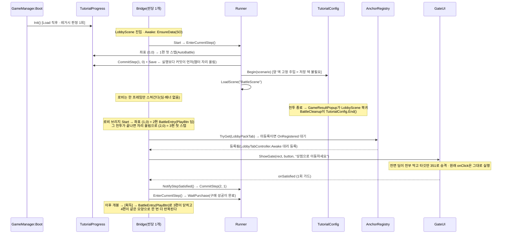


### G-TUT2 — 트리거 기반 튜토리얼 (탭 첫 진입 1회) — 🔄 코드 진행 중 (씬 배선·SO 저작 대기) / 2026-08-03 신설

> G-TUT의 온보딩은 **단조 증가 좌표 하나**뿐이라 "덱 탭에 처음 들어갔을 때 1회" 같은 **선형 시퀀스 밖에서 발화하는 축**을 담을 자리가 없다.
> 온보딩을 손대지 않고 **트리거 축을 병렬로 추가**한다. 표시(`OutgameTutorialGateUI`)·타깃(`TutorialAnchorRegistry`)·스텝 SO(`MessageStep`/`WaitClickStep`)는 **전부 재사용** — 신규는 "언제 발화하고 어디에 1회 낙인을 찍는가"뿐이다.
> 첫 대상은 **덱 탭 / 도감 탭 첫 진입**. 발화 API는 범용이라 이후 "덱 편집 첫 진입" 등이 코드 변경 없이 붙는다.
>
> 2026-08-13: 온보딩 마지막 챕터였던 **카드 강화 안내가 도감 탭 트리거(`CollectionTabFirstEnter`)로 이관**됐다.
> 온보딩에는 랭크 승급 연출(`EnterFirstRank` + `unlocksAll`) 한 스텝만 남아 그 자리가 곧 졸업이다.
>
> 2026-08-13: **첫 진화 안내(`FirstEvolutionReady`)** 추가 — 발화 축이 탭 밖으로 처음 나갔다.
> 강화가 다 끝나(`_onFinished`) 다음 한 방이 첫 진화로 판정되면 `CardDetailOverlayView`가 직접 `Fire`한다.
> 관문 레벨을 화면이 적지 않는다(`IsEvolutionLevel` + `EvolutionStage == 0`) — 곡선이 관문의 주인이다.
>
> 2026-08-24: 위 **첫 진화 안내 철회.** 진화가 다이아를 무는 벽이라 대준 한 방이었는데,
> 진화 재화가 강화와 같은 조각으로 통일되면서 벽이 사라졌다. 발화처(`CardDetailOverlayView`)와
> 조회 창구(`TriggeredTutorialRunner.IsRunningTrigger`)를 제거했고, `TriggeredTutorial.asset`에는
> 원래부터 이 트리거의 엔트리가 없어 실제로 뜬 적이 없다. `EOutgameTutorialTrigger.FirstEvolutionReady`
> 값은 세이브(`completedTriggers`, 이름 문자열)와 뒤 항목 보존을 위해 남긴다.
>
> 2026-08-14: **키워드 강화 안내(`KeywordGrowthFirstOpen`)** 추가 — 발화 축이 탭·강화 결과에 이어 **화면 열림**까지 왔다.
> 그리고 "무엇이 공짜인가"의 주인이 코드에서 **저작(`TutorialStepDef.freeOfCharge`)**으로, 소진 원장이
> `CardGrowthManager`에서 **`OutgameTutorialGuide`로** 옮겨 세 축(카드 강화·진화·키워드 강화)이 같은 원장을 본다.

#### 두 축 대조 — 무엇이 갈리고 무엇이 같은가

| 축 | 온보딩(G-TUT) | 트리거(G-TUT2) |
|---|---|---|
| 발화 | 초기화 시 좌표 재개 (pull) | `TriggeredTutorialRunner.Fire(trigger)` (push) |
| 진행 좌표 | 세이브 영속 `(챕터, 스텝)` | **메모리만** — 앱 종료 시 처음부터 |
| 1회 낙인 | `outgameCompleted` 스칼라 | `completedTriggers`에 **완주 시점** 키 1개 |
| 스텝 SO | 공유 | 공유 (단 커밋 대상이 메모리 싱크) |
| 게이트 UI | 공유 (`OutgameTutorialGateUI` 싱글턴) | 공유 |
| 우선순위 | 항상 우선 | 온보딩 `IsRunning` 중엔 발화 억제 |

#### 구조 지도 — 온보딩과 갈리는 지점만

```mermaid
flowchart TD
    subgraph persist["영속 — 세이브만 안다 (창구는 그대로 하나)"]
        PRG["OutgameTutorialProgress (static)<br/>+ IsTriggerDone · MarkTriggerDone · ClearTriggersForDebug"]:::chg
        SD["TutorialSaveData 슬롯<br/>+ List&lt;string&gt; completedTriggers<br/>(enum 이름 문자열 — 추가만)"]:::chg
    end

    subgraph sink["진행도 싱크 — 커밋이 어디로 가는가"]
        ISINK["ITutorialProgressSink<br/>Commit(챕터,스텝) · Complete"]:::new
        PSINK["PersistentTutorialProgressSink<br/>온보딩 전용 · Progress에 위임"]:::new
        MSINK["MemoryProgressSink (러너 내부)<br/>트리거 전용 · 세이브에 닿지 않는다"]:::new
        ISINK --- PSINK
        ISINK --- MSINK
    end

    subgraph run["해석 — 러너 2개 (static 분리)"]
        RUN["OutgameTutorialRunner<br/>온보딩 — IsRunning이 곧 '온보딩 중'"]:::chg
        TRUN["TriggeredTutorialRunner (static)<br/>Fire · EnsureData · IsRunning<br/>EnterCurrentStep · NotifyStepSatisfied · Abort<br/>HasPending(trigger) — 표시 판정 창구<br/>event OnActivated · OnChanged"]:::new
        TDATA["TriggeredTutorialData (SO)<br/>List&lt;TriggeredTutorialEntry&gt;"]:::new
        TENT["TriggeredTutorialEntry ([Serializable])<br/>trigger · label · steps<br/>씬을 떠나는 마지막 스텝 불변식 없음"]:::new
        STEP["OutgameTutorialStep + 파생 (공유, 무수정)"]
        CTX["OutgameTutorialStepContext<br/>+ 싱크 주입 — 커밋 대상이 생성자 인자"]:::chg
        TDATA --> TENT
        TENT --> STEP
        TRUN -->|"Enter(ctx: 메모리 싱크)"| STEP
        RUN -->|"Enter(ctx: 영속 싱크)"| STEP
        STEP --> CTX
    end

    subgraph scene["씬 레이어 — 브리지 2개, 게이트 1개"]
        BRG["OutgameTutorialBridge<br/>+ ApplyCurrentStep 최상단 IsRunning 가드"]:::chg
        TBRG["TriggeredTutorialBridge (LobbyScene 1개)<br/>Awake:구독 · Start:재개 pull<br/>팩 구매·개봉 구독 없음 · 억제 모드 없음<br/>지원 완료조건: Confirm · Click · Enhance · KeywordEnhance · LobbyReturn · CardDetailReturn<br/>강화 연출 중엔 앵커 재등록을 무시(비활성 버튼에 게이트를 걸지 않는다)"]:::chg
        GATE["OutgameTutorialGateUI (싱글턴 1개)<br/>ShowGate · ShowMessageGate · Clear"]
    end

    KEY["EOutgameTutorialTrigger (enum)<br/>DeckTabFirstEnter · CollectionTabFirstEnter · KeywordGrowthFirstOpen (+ FirstEvolutionReady = 폐기, 값만 보존)<br/>세이브엔 이름 문자열 → 리네임 금지"]:::new
    TAB["LobbyTabController.Tab.tutorialTrigger<br/>Select(idx, fireTrigger) — Start는 false<br/>+ alertDotPrefab: 탭 **아이콘**에 알림 점 런타임 부착"]:::chg
    BOOT["BootInstaller<br/>+ TriggeredTutorialData 주입"]:::chg

    ADOT["AlertDotView (abstract, UI/Common)<br/>등장 팝 · 상시 맥동 · 퇴장 — 판정 없음<br/>파생: LobbyEntryAlertDot(랭크보상·강화·모험) · TutorialAlertDot"]:::new
    TDOT["TutorialAlertDot<br/>HasPending && FeatureLock.IsUnlocked"]:::new
    ADOT --- TDOT
    TAB -->|"AddComponent + Bind"| TDOT
    TDOT -->|"HasPending · OnChanged 구독"| TRUN

    TAB -->|"유저 탭 전환 시 Fire"| TRUN
    KGP["KeywordGrowthPanel<br/>Open() 끝에서 Fire — SetVisible·Build 뒤라야 앵커가 서 있다<br/>칸/업그레이드 버튼 앵커를 코드로 등록·해제"]:::new
    KGM["KeywordGrowthManager<br/>TryGetStepAt 단일 퍼널(표시=활성=소모)<br/>event OnEnhanced(성공만) · NotifyCostRuleChanged"]:::new
    FREE["OutgameTutorialGuide — 무료 한 방 원장<br/>HasFreeShot · ConsumeFreeShot · ResetFreeShotForDebug<br/>무엇이 공짜인지는 저작(freeOfCharge)이 정한다"]:::new
    GROW["CardGrowthManager.TryGetStepAt<br/>원장을 직접 쥐지 않고 Guide에 묻는다"]:::chg
    KGP -->|"Fire(KeywordGrowthFirstOpen)"| TRUN
    KGM -->|"OnEnhanced"| TBRG
    GROW --- FREE
    KGM --- FREE
    FREE -->|"현재 스텝 조회"| TRUN
    KEY --- TRUN
    BOOT -->|"EnsureData(멱등)"| TRUN
    TBRG -->|"EnsureData · OnActivated 구독"| TRUN
    TBRG -->|"NotifyStepSatisfied"| TRUN
    TRUN -->|"완주 시 MarkTriggerDone"| PRG
    PRG <--> SD
    CTX -->|"주입된 싱크로 위임"| ISINK
    PSINK --> PRG
    MSINK --> TRUN
    TBRG -->|"ShowGate · ShowMessageGate"| GATE
    BRG -->|"온보딩 중일 때만"| GATE

    classDef new fill:#1f6f3f,stroke:#7CFC9E,color:#fff;
    classDef chg fill:#7a5b16,stroke:#f2c14e,color:#fff;
```

---

### G-TUT3 — 해금 안내 (키워드·시너지를 처음 열었을 때) — 2026-08-14

강화로 키워드가, 1차 진화로 시너지가 열린다. 그 순간 설명은 이미 상세창에 깔려 있으므로
**없는 것은 지식이 아니라 그것을 읽게 만드는 유도**다. 두 겹으로 답한다.

| 겹 | 언제 | 무엇 |
|---|---|---|
| 매번 | 잠김 판이 걷힐 때마다 | 그 줄로 스크롤이 따라가고 칩 → 설명이 순차로 들어온다 (`SectionRevealFx`) |
| 처음 1회 | 그 개념을 처음 열었을 때 | 전면 오버레이 한 장 (`UnlockIntroOverlay`) |

**트리거 튜토리얼 축(G-TUT2)을 쓰지 않는 이유** — `TriggeredTutorialRunner.IsOpen`이
"온보딩 졸업 후"로 잠겨 있어 첫 해금이 온보딩 중에 일어나면 영영 발화하지 않는다.
얼굴도 다르다(손가락+말풍선 vs 축하 오버레이). 그래서 **낙인만 같은 세이브 슬롯을 빌린다.**

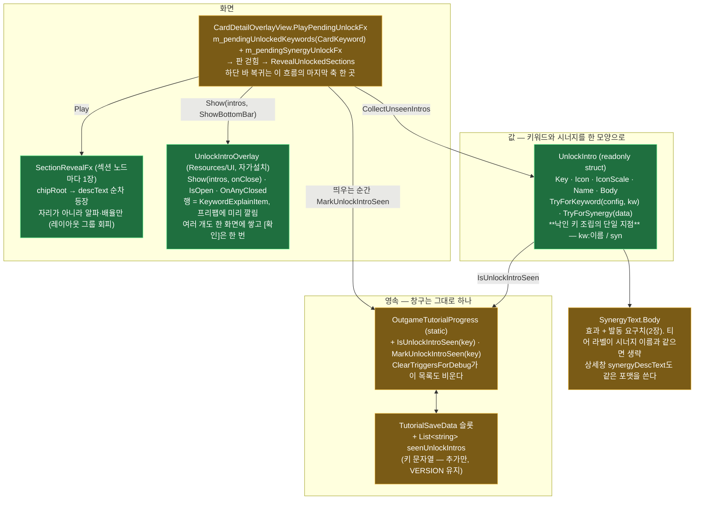

불변식 몇 개:
- **낙인은 닫힐 때가 아니라 띄우는 순간** 찍는다 — 읽는 도중 앱이 죽어도 다시 세우지 않는다(내용은 상세창에 남아 있다).
- 카드를 넘기거나 창을 닫으면 `DropPendingUnlockFx`가 대기를 버린다 → 오버레이도 뜨지 않는다.
- 하단 바를 되돌리는 곳은 `RevealUnlockedSections`의 끝 **한 곳**뿐이다(오버레이가 서면 그 닫힘이 곧 끝).


### H. 랭크 — 표시용 티어 진행도 — ✅ 코드 전량 완료(H-28~H-32) + 로비 씬 배선 완료 (2026-07-27)

> 목표 루프의 **엔드포인트 표기**를 실물로 세운다. 단 실력 지표가 아니라 **표시용 진행도**(칭호)다.
> **왜 로컬로 가능한가**: 로비 Match 탭은 100% AI전이고(`LobbyMatchLauncher.StartAiBattle` 단일 배선), PvP UI는 런타임에 도달 불가한 `MainMenu.unity`에만 있다. 클라 권위 + RPC 무검증이라 위조 가능하지만, **보상·난이도·매칭에 아무 영향이 없으므로 위조돼도 잃는 게 없다** → 서버 권위가 전제되지 않는다.
> **H는 자체 계약 소비가 거의 없다** — 재화·소유·생산·팩 어느 것도 안 건드리고, 세이브 슬롯 1개와 전투 종료 훅 1줄만 쓴다. `:::new` = 신규, `:::chg` = 기존 파일 소규모 수정.
> ⚠️ **정산 규칙은 아래 "랭크 강등 개방"에서 재작성됐다** — "티어 임계치를 하한으로 클램프해 강등을 막는다"는 서술은 폐기됐고, `RankApplyResult`에 `IsTierDown`이 추가됐다. 아래 시퀀스는 갱신본이다.

#### 구조 지도 — 4갈래(영속 / 판정 / 주입 / 표시)

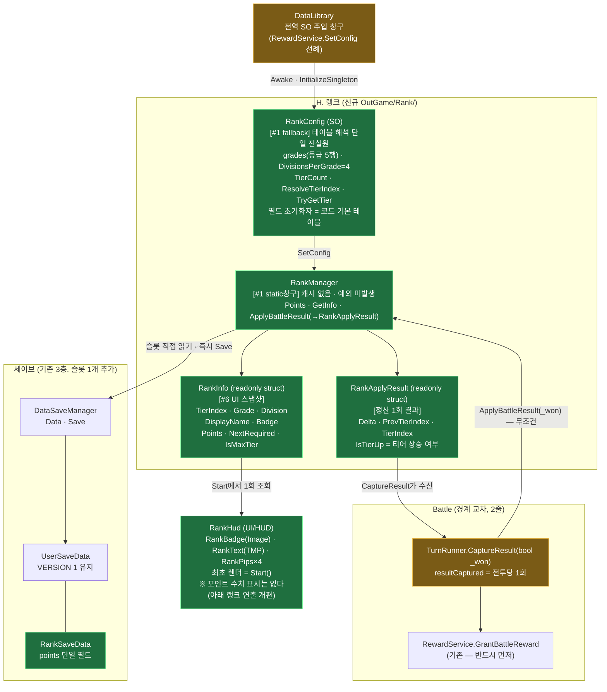

#### 흐름 시퀀스 — 전투 종료 → 로비 배지 갱신

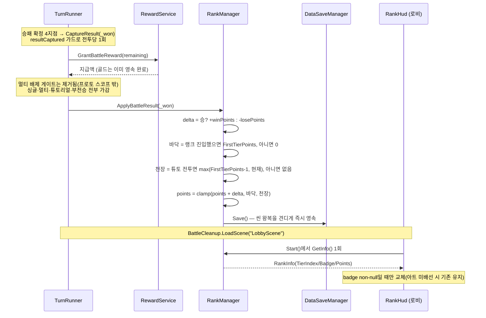


### H-33. 랭크 티어 달성 보상 — ✅ 완료 (2026-07-27, 코드 + 씬 저작)

> 표시용 진행도였던 랭크에 **보상 엔드포인트**를 붙인다. 티어에 도달하면 골드를 **순차로 1회씩** 수령한다.
> **`RankManager`는 무수정** — 보상은 신규 static 창구 `RankRewardManager`로만 흐르고, 달성 판정만 `RankManager.GetInfo()`에 위임한다(동결 계약 무접촉).
> ⚠️ 이 "무수정·동결" 서술은 **H-33 시점 기록**이다. 이후 등급 재설계에서 **동결이 해제**돼 `GetInfo`·`ApplyBattleResult`가 재작성되고 private 헬퍼 3개(`ResolveTierIndex`/`ResolveTierFloor`/`FindNextTier`)가 제거됐다. 공개 API·불변식은 보존됐다(아래 재설계 항목 참조).
> 스코프: 골드 1종(프로젝트 재화가 `Gold` 단일) · 20티어 전부 · 광고 2배 없음.

#### 구조 지도 — 판정/영속/표시

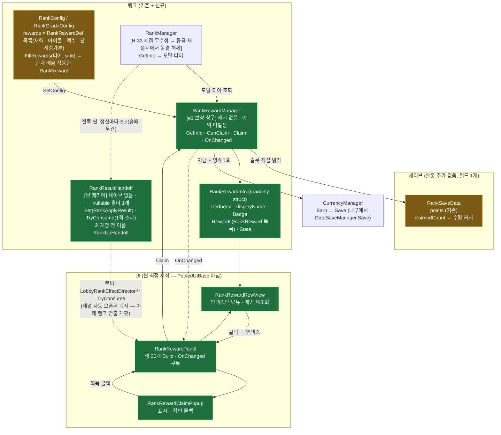

### 랭크 연출 개편 — 자동 팝업 폐지 · 배지 반응 (2026-08-10)

보상 패널이 로비 복귀 즉시 자동으로 열리던 흐름을 걷어내고, **받을 것이 있다는 알림 점**과 **배지 반응**으로 나눴다.
포인트 수치 표시(`RankBadge/PointText`)는 화면에서 삭제했다 — 증감량은 조각 개수로만 비친다.

| 바뀐 것 | 전 | 후 |
|---|---|---|
| 캐리어 | `RankUpHandoff` · **티어 상승일 때만** 실림 | `RankResultHandoff` · 정산마다 실림(`Delta==0 && !IsTierUp`이면 스스로 거름). 연속 전투는 `Delta` 누적 + 도달 최고 티어 |
| 소비처 | `RankRewardPanel.Start` 코루틴 | `LobbyRankEffectDirector`(`GainEffectLayer`에 부착 — 탭과 무관하게 항상 활성) |
| 복귀 화면 | 승급 연출 후 **패널 자동 오픈** | 조각이 배지로 수렴 → 승급 연출 → 끝. 패널은 유저가 `RankReward` 버튼으로 연다 |
| 보상 안내 | 없음(패널이 직접 떴다) | `LobbyEntryAlertDot` 배선(`RankReward/Dot`) — `HasAnyClaimable` 단일 근거 |

**연출 순서의 근거**: 조각이 다 꽂힌 **뒤에** 핍이 켜진다. 그래서 `RankHud.BuildTierUp`의 "과거 상태 되돌리기"를 시퀀스 첫 콜백에서 **조립 시점 즉시 실행**으로 옮겼다 — 앞 단계가 도는 동안 새 핍이 이미 켜져 있으면 인과가 뒤집힌다.
디렉터가 승급 시퀀스만 **커버 아래에서 조립해 `Pause`**로 들고 있다가 조각이 끝난 뒤 `Play`하는 이유도 같다(유저가 처음 보는 화면이 "오르기 전"이어야 한다).

**단계를 한 시퀀스에 중첩하지 않는다.** `RankHud`는 탭 전환 등에서 자기 연출을 스스로 `Kill`하는데, 중첩된 하위를 밖에서 죽이면 부모 시퀀스가 어긋난다(DOTween은 네스티드 트윈의 개별 제어를 지원하지 않는다). 그래서 디렉터는 코루틴으로 `Play` → `WaitForKill` → 다음 단계 순으로 잇는다 — 개편 전 `RankRewardPanel.Start`가 쓰던 관용구와 같다.
같은 이유로 디렉터 `OnDisable`은 **재생에 닿지 못한 승급 시퀀스를 걷는다** — 정지한 채 남으면 `RankHud.Render`의 연출 가드를 영영 막아 표시가 과거에 고착된다.

| 신규/변경 파일 | 역할 |
|---|---|
| `UI/Lobby/LobbyRankEffectDirector.cs` 🆕 | 캐리어 소비 · 커버 대기 · 승리/패배/승급 조립. 재화 디렉터와 분리(타임라인이 다르고 마스터 공유 이득이 없다) |
| `UI/HUD/RankHud.cs` | `pointText` 제거 · `BadgeRect` / `PlayGainImpact(bool)` / `BuildLossReaction()` 추가 |
| `OutGame/Rank/RankResultHandoff.cs` | 개명 + 병합 규칙 재작성 |
| `UI/Rank/RankRewardPanel.cs` · `RankRewardRowView.cs` | 자동 오픈 경로와 `PlayTierUpEffect` 제거(최상위 행은 `readyPulse`가 이미 상시 강조) |
| `UI/Common/LobbyEntryAlertDot.cs` | **코드 무수정** — 구독·최초 렌더·`m_started` 가드까지 완비돼 있었고 배선만 없었다 |

**알려진 한계**: 튜토리얼 졸업(`OutgameTutorialRunner.CompleteSequence`)은 로비 세션 **중간**에 `Set`을 부르므로 디렉터의 `Start`가 지난 뒤다 → 그 결과는 다음 로비 진입에서 소비된다(개편 전과 동일).


### 랭크 강등 개방 — ±25 심플 사다리 · 튜토 언랭크 확정 (2026-08-10)

승패마다 ±25, 단계 간격도 25 → **1승 = 1단계 상승, 1패 = 1단계 강등**. 사다리를 양방향으로 열었다.

| 축 | 전 | 후 |
|---|---|---|
| 정산 하한 | 가감 **전** 티어의 `RequiredPoints` → 강등 구조적으로 불가 | 랭크 진입 뒤엔 `FirstTierPoints`(브론즈 1) 하나뿐 → 티어 사이 강등은 열림 |
| 정산 상한 | 없음 | **튜토리얼 전투**에만 `max(FirstTierPoints - 1, 현재 포인트)` — 몇 승을 해도 랭크에 진입하지 못한다 |
| 언랭크 복귀 | (해당 없음) | **없다.** 언랭크는 "튜토리얼 중"이라는 뜻을 이미 갖고 있어 의미가 두 갈래로 갈린다 |
| 캐리어 병합 | `Min(prev)/Max(tier)` — 상승만 가정 | **처음 실린 출발 → 마지막 도달**(센티널 `-1`만 예외로 언제 실리든 이긴다). 승·패가 섞이면 최소/최대는 거짓말을 한다(승1패1이 "승급"으로 보고됐다) |

#### ⚠️ 졸업 낙인은 마지막 튜토 전투보다 **먼저** 찍힌다

이것이 이 설계에서 가장 반직관적인 지점이고, 천장 규칙이 지금 모양인 유일한 이유다.

마지막 챕터의 마지막 스텝은 `BattleStart`(덱 확인 화면의 "전투 시작" 버튼)다. 게이트 만족 = 씬 이탈이므로 `NotifyStepSatisfied` → `CompleteSequence` → `TryEnterFirstTier`가 **전투가 열리기 전에** 끝난다. 즉 마지막 튜토 전투는 이미 브론즈 1(=100점)에 선 채로 정산된다.

- 천장 판정을 `IsRanked`로 하면 → 그 전투가 랭크 전투로 새어 100+25 = **브론즈 2**로 졸업한다.
- 천장을 `FirstTierPoints - 1`로 **고정**하면 → 그 전투가 100을 99로 끌어내려 **강등 + 언랭크 복귀**가 된다.
- 그래서 천장은 `max(FirstTierPoints - 1, 현재 포인트)` — "튜토 전투는 랭크를 **올리기만** 하고 첫 티어는 넘지 않는다". 마지막 전투에선 천장과 바닥이 둘 다 100이라 승패 무관 브론즈 1을 지킨다.

판정 입력은 `TurnRunner`가 `TutorialConfig.IsActive`를 넘긴다(랭크가 튜토리얼 도메인을 직접 보지 않게). `TutorialConfig.Begin`은 한 단계 앞 `BattleEntry` 스텝에서 걸리므로 마지막 전투에서도 참이다.
**부작용 1건(승인됨)**: 튜토 4승째는 75→99라 결과 팝업에 `+24`가 뜬다.

> 승점이 10이던 때는 100+10 = 110으로 브론즈 2 문턱(125)에 못 미쳐 이 누수가 드러나지 않았다. 한 판이 정확히 한 단계가 되면서 노출됐다.

#### 강등 연출 — 강도는 빈도를 따른다

별 하나 제거는 패배마다 나오는 흔한 일이고 등급 강등은 드물다. 그래서 **같은 등급 안 하락은 조용히, 등급이 갈릴 때만 크게** 때린다.

- **별 1개 제거**: 꺼질 칸이 뒤에서부터 하나씩, `UiPunch`에 **음수 세기**를 넘겨 켜질 때와 반대로 움츠러들었다 돌아온다.
- **등급 강등**: 켜진 별을 전부 끄고 → 배지가 아래 등급으로 갈리며 `DOShakeAnchorPos` + 어두워짐 → **새 등급 별 4칸을 한 번에 스냅**한다.
  칸을 하나씩 켜는 건 승급의 문법이라 여기서 재사용하면 *"별이 늘었다 = 올랐다"*로 읽힌다 — 강등에서 순차 점등 금지.
- 흔들림·색은 **시퀀스 멤버**로 단다(콜백 안에서 따로 띄우면 시퀀스가 죽어도 살아남아 배지가 어긋난 채 굳는다). 콜백 뒤에는 `Join`이 아니라 `Append` — 길이 0인 콜백은 시퀀스 길이를 늘리지 않아 `Append`가 곧 "콜백과 같은 시각"이고 기준점이 분명하다.

**디렉터 규칙**: 증감 부호와 티어 변화 방향이 어긋나면(여러 판 합산) 티어 쪽이 지배적인 소식이라 조각을 생략하고, 강등이 뒤따르면 손실 반응도 생략한다 — 배지가 두 번 식는다.

| 변경 파일 | 내용 |
|---|---|
| `OutGame/Rank/RankManager.cs` | `ApplyBattleResult(_won, _tutorial)` 바닥/천장 재작성 · `RankApplyResult.IsTierDown` 추가 |
| `Battle/TurnRunner.cs` | `TutorialConfig.IsActive`를 정산에 넘긴다 |
| `OutGame/Rank/RankResultHandoff.cs` | 병합을 "처음 출발 → 마지막 도달"로 교체 |
| `OutGame/Rank/RankConfig.cs` | 코드 기본값 25/25로 애셋과 동기화(이중 진실원 제거) |
| `UI/HUD/RankHud.cs` | `m_tierUpSeq` → `m_tierSeq`(승급·강등 공용 가드) · `BuildTierDown` · `StageGradeDown` · `StagePipOff` 추가 |
| `UI/Lobby/LobbyRankEffectDirector.cs` | 강등도 커버 아래에서 조립·`Pause` · `PlayPointChange` 가드 3분기 |
| `OutGame/Debug/OutgameDebugActions.cs` | `TIER ±`가 결과를 캐리어에 실어 **씬 재진입 시 연출을 재생**한다(없으면 강등 연출을 볼 길이 전투뿐) |

**보상은 무수정** — `RankRewardManager.StateOf`가 티어 인덱스가 아니라 **포인트 기준**이고 `Claimed` 낙인을 먼저 보므로, 강등해도 수령분은 유지되고 미수령 상위 행만 `Locked`로 되돌아간다(이미 강등을 전제한 코드였다).


### 랭크 진행 호 — 배지를 감싸는 게이지 (2026-08-14)

핍 4칸은 *"지금 몇 단계"*만 답하고 *"다음 별까지 얼마나"*는 답하지 못했다. 단계 간격 20~60에 승리 +10이라 **한 단계가 2~6승**인데, 그 사이의 승리는 화면에 아무 흔적을 남기지 않았다. `RankInfo.NextRequired`는 이미 계산돼 있었으나 **소비처가 0곳**이었다.

#### 배치가 이미 원이었다

`RankPips`의 `HorizontalLayoutGroup`은 **`m_Enabled: 0`**이라 저작 좌표가 곧 런타임 배치다. 네 핍 `(-150,-80) (-60,0) (60,0) (150,-80)`은 **중심 `(0,-158.125)` · 반지름 `169.13` 원 위에 오차 없이** 놓이고 각 간격은 41.7°로 균일하다. 그 원의 중심은 `RankBadge` 중심에서 12px 아래 — 별들은 처음부터 배지를 감싸는 링이었다.

호를 **위쪽 중심 166.6°(±83.3°)**로 두고 4등분하면 경계가 `-83.3 / -41.7 / 0 / +41.7 / +83.3`이고 **별 하나가 각 칸의 정중앙**에 온다.

- 채움 머리가 K번 칸에 있다 ⟺ K단계 ⟺ K번 별이 켜져 있다 — **기존 핍 의미·좌표 무변경**
- 채움 `1.0` = 호의 오른쪽 끝 = **승급선**. 4단계를 3개 간격에 욱여넣지 않아도 되는 유일한 매핑이다
- 호 = 연속 진행, 별 = 이산 단계. 역할이 겹치지 않는다

`Image Type=Filled / Radial360`은 `fillOrigin=Top`에서만 시작하므로, 호를 위쪽 중심에 세우는 방법은 **루트를 span의 절반만큼 돌리는 것**뿐이다(링은 회전 대칭이라 그림은 그대로다). 가시 범위 자체도 `fillAmount` 상한(`span/360`)이 만든다 — 원 한 바퀴를 그린 뒤 잘라내지 않는다.

#### 연출은 기존 시간축에 그대로 얹힌다

`LobbyRankEffectDirector`는 이미 **조각 완료 → 티어 변화** 순서라, 호가 별에 닿고 → 그다음에 별이 켜진다.

| 시점 | 호 |
|---|---|
| 캐리어 소비 직후(커버 아래) | `PrepareProgress(Points - Delta)` — 전투 직전 위치로. `Delta`가 클램프 뒤 실증감이라 이 뺄셈이 곧 그때 값이다 |
| 조각 1개 도착마다 | `PlayGainImpact(_arrived, _total)`이 출발↔도착을 등분해 한 칸씩 전진 |
| 등급 승급 파열 프레임 | `promote.Build`의 `_onBurst`에서 `BlowOutPips`와 **같은 프레임**에 새 등급 출발선으로 되감김 |
| 포인트 손실 | 조각이 없는 경로 — 감소 트윈을 `BuildLossReaction` 시퀀스에 `Join`. **요요 없이 한 방향**(줄어든 자리가 곧 지금 값) |
| 모든 `OnKill` / `Render()` | 진실값에 안착(조각 연출이 통째로 생략되는 경로들의 폴백) |

등급이 갈리는 판의 도착지는 새 등급의 자리가 아니라 **옛 등급의 승급선(1.0)**이다 — 그 뒤는 파열이 이어받는다.

| 신규/변경 파일 | 내용 |
|---|---|
| `Prefabs/UI/LobbyUI/RankInfo.prefab` 🆕 | 랭크 표시 전체(배지·티어명·핍·호). `LobbyCanvas`는 이걸 중첩 인스턴스로 문다 |
| `UI/HUD/RankProgressArc.cs` 🆕 | 호 1개. `SetRatio` / `TweenTo` / `Stop`. `Awake`가 span에서 회전과 track `fillAmount`를 파생 |
| `Prefabs/UI/LobbyUI/RankProgressArc.prefab` 🆕 | `Track`(어둡게) + `Fill`(금색), 스프라이트는 `BasicFrame_CircleLine_155_White2`(실제 도넛, 바깥 r=77 안 r=72). `sizeDelta 351.9` = 스트로크 중심을 핍 반지름 169.13에 맞춘 값 |
| `OutGame/Rank/RankManager.cs` | `GetInfoAt(long)` 분리(연출이 '전투 직전' 스냅샷을 묻는다) · `RankInfo.TierRequired` 추가 · `TierProgress` / `GradeProgress` 파생 |
| `UI/HUD/RankHud.cs` | `arc` 배선 · `PrepareProgress(long)` 추가 · `PlayGainImpact(bool)` → **`PlayGainImpact(int, int)`** |
| `UI/Lobby/LobbyRankEffectDirector.cs` | `PrepareProgress` 호출 1줄 · 도착 콜백이 `(_arrived, _total)`을 그대로 넘김 |

**랭크 표시 전체가 `RankInfo.prefab`으로 빠졌다.** `LobbyCanvas`의 `MatchContent/RankInfo`는 이제 그 프리팹의 중첩 인스턴스이고(형제 1번, `pos (0,209)` `size 700x700` — 좌표 무변경), 배지·티어명·핍 4개·호가 전부 그 안에 있다. 랭크 표시를 만질 때 LobbyCanvas를 열 필요가 없다.

```
RankInfo.prefab            [RankHud]
├ RankBadge                 └ RankText
└ RankPips                  (HorizontalLayoutGroup은 m_Enabled: 0 — 저작 좌표가 곧 배치)
  ├ RankProgressArc        ← 형제 0 = 별들보다 앞 = 뒤에 깔린다 (RankProgressArc.prefab 중첩)
  └ Pip1~Pip4
```

호가 `pipsRoot`의 자식이라 **언랭크에서 별 줄과 함께 통째로 꺼지는** 이득이 따라온다.

#### LobbyCanvas를 열지 않고 구조를 바꾸는 법 (2026-08-14 실측)

`LoadPrefabContents` + `SaveAsPrefabAsset`이 금지된 이 프리팹도 **targeted API로는 안전하게 고칠 수 있다.**

**노드를 프리팹으로 빼내기** — 프리뷰 씬 사본을 `PrefabUtility.UnpackPrefabInstance(inst, OutermostRoot, AutomatedAction)`로 먼저 푼다(에셋은 안 건드린다. 안 풀면 *"Can't save part of a Prefab instance as a Prefab"*). 그다음 대상 노드에 `SaveAsPrefabAsset`. 안쪽 중첩(탭·호)은 `OutermostRoot`라 인스턴스로 남는다.

**노드를 인스턴스로 교체** — 같은 프리뷰 씬에서 새 인스턴스를 붙여 `ApplyAddedGameObject` → 옛 노드를 `DestroyImmediate` → `ApplyRemovedGameObject(inst, 미리 잡아 둔 에셋측 노드, AutomatedAction)`. 에셋측 노드는 지우기 **전에** `GetCorrespondingObjectFromSource`로 잡아 둬야 한다.

> ⚠ 이때 git diff는 **130삽입 / 704삭제**로 무섭게 보이지만 Unity의 YAML 문서 재배열이 섞인 것이다. 줄 수로 판정하지 말고 `.backup_lobby/tools/dump2.js`로 **계층을 덤프해 대조**할 것 — 실제로 바뀐 것은 `RankInfo` 한 줄뿐이었다.

**자식만 더할 때**는 언팩도 필요 없다. 다음 조합이면 diff가 **순수 추가(116삽입 / 0삭제)**로 떨어진다:

1. `EditorSceneManager.NewPreviewScene()`에 `PrefabUtility.InstantiatePrefab(canvasAsset, preview)` — 열린 씬을 안 건드린다
2. 인스턴스 안에서 자식을 붙이고 `PrefabUtility.ApplyAddedGameObject(child, CANVAS, AutomatedAction)` — **추가된 그 오브젝트 하나만** 에셋에 쓴다
3. `ClosePreviewScene`

**`AssetDatabase.SaveAssets()`를 부르면 안 된다.** 같은 절차에 이 한 줄을 붙였더니 144삽입/**31삭제**가 나고 무관한 중첩 프리팹의 `m_IsActive`·`m_SizeDelta`·좌표가 함께 갈렸다 — 에디터에 떠 있던 무관한 dirty가 같이 flush된 것이다. 필드 배선도 `AssetDatabase.SaveAssetIfDirty(대상)`만 쓴다.

> `git checkout`으로 되돌린 뒤에는 **`AssetDatabase.ImportAsset(path, ForceUpdate)`로 메모리를 디스크에 맞춘다.** 안 하면 다음 저장이 옛 메모리 상태를 도로 쓴다.

**경계**: 최대 티어는 `TierProgress = 1` 고정(더 갈 곳이 없는데 게이지를 비워 두면 오해가 된다). 등급 바닥에 걸려 패배해도 포인트가 안 깎이는 구간에서는 호도 그대로다.


### 매치 덱 선택·편집 (`UI/Match/`) — ✅ 코드+검수 완료 (2026-08-03), 프리팹·씬 저작 대기

전투 진입 직전 화면에서 **덱을 고르고 그 자리에서 수정**하는 흐름. 편집 본체는 로비와 같은 `DeckEditController`를 그대로 쓰고, 매치는 그 위에 셸과 가로 리스트만 얹는다.

#### 구조 위치 (🆕 = 이번 신규)

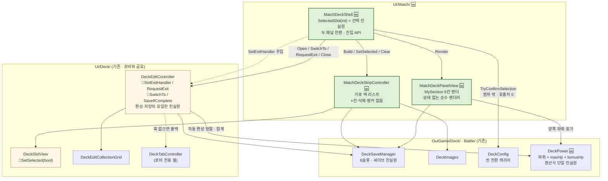

#### 흐름 — 전투 씬 진입 → 덱 확정 → 전투 시작

```mermaid
sequenceDiagram
    actor U as 유저
    participant GI as GameInitializer
    participant PV as MatchDeckPanelView
    participant SH as MatchDeckShell
    participant ST as MatchDeckStripController
    participant ED as DeckEditController
    participant SV as DeckSaveManager

    Note over GI: BattleScene 진입 · battleIntro.Await()로 보드는 화면 밖
    GI->>SH: await RunSelectionAsync(ct)
    SH->>SH: EnsureBoot() · Open()
    SH->>PV: Render(SelectedSlot)

    U->>PV: EditButton
    PV->>SH: OpenEditor()
    SH->>SH: SelectedSlot = ResolveSlot(현재)
    SH->>ST: Build(SelectedSlot, OnStripSlotClicked)
    ST->>SV: IsSlotValid / GetDisplayName (유효 슬롯만)
    SH->>ED: Open(SelectedSlot)
    ED->>SV: Load(slot) → m_working 사본

    Note over U,ED: 카드 한 장 교체 (m_dirty=true, 세이브 무접촉)

    U->>ST: 다른 덱 칸 클릭
    ST-->>SH: OnStripSlotClicked(newSlot)
    SH->>ST: SetSelected(newSlot)
    SH->>ED: SwitchTo(newSlot)
    ED->>ED: SaveIfComplete()
    alt 6/6 완성
        ED->>SV: SaveSlot(이전 slot, m_working)
    else 미완성
        Note over ED: 폐기 (팝업 없음)
    end
    ED->>ED: Open(newSlot) → m_working 재적재

    U->>ED: 좌하단 뒤로가기
    Note over SH,ED: 셸이 코드로 건 리스너 → RequestExit()
    ED->>ED: OnBackClicked() → SaveIfComplete() → ExitEditor()
    ED-->>SH: m_onExit (주입 훅)
    SH->>ED: Close()
    SH->>ST: Clear()
    SH->>PV: Render(SelectedSlot)
    PV->>SV: GetSlot(SelectedSlot)
    Note over PV: CardVisualView.Bind(card, true) ×6<br/>(null이면 스스로 SetActive(false))

    U->>PV: BattleButton
    PV->>SH: Confirm()
    SH->>SH: TryConfirmSelection() → DeckConfig.Set(GetSlot)
    SH-->>GI: true (게이트 통과)
    GI->>GI: InitializeSinglePlayerFields() → PlayIntroAndStart()
```

> BackButton은 `Cancel()` → 게이트가 false를 돌려주고, **어디로 돌아갈지는 호스트가 정한다**(셸은 씬을 모른다).


### 카드 성장 — 강화 + 진화 (`OutGame/Growth/`) — ✅ 코드 완료 (2026-08-04) / SO 에셋·씬 배선·진화 아트 대기

> 카드 한 장에 붙는 **영구 성장**. 강화(수직·골드·확률)와 진화(문·다이아·확정)가 한 축에서 맞물린다 —
> 진화는 스탯을 1도 바꾸지 않고 **강화를 여는 열쇠 + 아트/연출 자격**으로만 존재한다.
> 경제 설계(왜 두 재화인가, 왜 실패가 있는가)의 진실원은 [`ENHANCE_ECONOMY.md`](./ENHANCE_ECONOMY.md). 이 절은 **구조**만 다룬다.
> `:::new` = 이번 신규, `:::chg` = 기존 파일 소규모 수정.

#### 구조 지도 — 4갈래(영속 / 판정 / 표시 / 전투 주입)

```mermaid
flowchart TD
    subgraph save["세이브 (기존 3층, 슬롯 1개 추가)"]
        DSM["DataSaveManager<br/>Data · Save"]
        USD["UserSaveData<br/>VERSION 1 유지"]
        GSD["CardGrowthSaveData<br/>version=1 · entries[]<br/>cardKey / level / evolutionStage"]:::new
    end

    subgraph growth["OutGame/Growth/ (신규)"]
        CFG["CardGrowthConfig (SO)<br/>[#1 fallback] 곡선 단일 진실원<br/>전역 기본식 + 레벨 오버라이드<br/>evolutionGates(코드 기본 2개)<br/>TryGetStep · TryGetPendingGate · HpBonusAt"]:::new
        MGR["CardGrowthManager<br/>[#1 static창구][#2 Init/Save]<br/>s_growth 캐시 · 로컬 System.Random<br/>GrowthOf · TryEnhance · TryEvolve<br/>OnGrowthChanged"]:::new
        ERES["EnhanceResult (readonly struct)<br/>Outcome(EEnhanceOutcome 6종) · Level"]:::new
        STEP["GrowthStep (readonly struct)<br/>Level · HpGain · Cost · SuccessRate"]:::new
    end

    subgraph neutral["Card/ (Battle·OutGame 공용 중립 값)"]
        CG["CardGrowth (readonly struct)<br/>Level · HpBonus · EvolutionStage"]:::new
    end

    subgraph cur["재화 (기존 창구, 종류 1개 추가)"]
        CUR["CurrencyManager<br/>Spend/CanAfford/Earn"]
        DIA["ECurrencyType.Diamond<br/>+ CurrencySaveData.diamond"]:::chg
    end

    subgraph battle["Battle (경계 교차 — 값 주입만)"]
        GI["GameInitializer.GrowthProvider<br/>set-only 주입점"]:::chg
        BF["BattleField.Initialize(_growthOf)<br/>싱글 플레이어 필드에만 전달"]:::chg
        CI["CardInstance<br/>maxHp = data.maxHp + HpBonus<br/>evolutionStage"]:::chg
        CIN["CardCinematicRules<br/>CINEMA_ATTACK_STAGE = 3"]
    end

    BOOT["BootInstaller [-200]<br/>SetConfig → Init → GrowthProvider"]:::chg
    DPW["DeckPower.MaxHpOf(card, _applyGrowth=true)<br/>아웃게임 표시 단일 진실원"]:::chg

    subgraph ui["표시 (소비만)"]
        SCR["CardGrowthScreen<br/>강화·진화 화면 1장"]:::new
        CVV["CardVisualView.Bind(card, owned, _applyGrowth)"]:::chg
        DET["CardDetailOverlayView<br/>레벨·진화 행"]:::chg
        MPV["MatchDeckPanelView<br/>상대 덱만 _applyGrowth:false"]:::chg
        GHUD["CurrencyHud(type = Diamond)<br/>같은 컴포넌트 재사용"]:::chg
    end

    DSM --> USD
    USD --- GSD
    MGR -->|"Init: 캐시 / Save: flush"| DSM
    CFG -->|SetConfig| MGR
    BOOT --> CFG
    BOOT -->|Init| MGR
    MGR --> CG
    MGR --> ERES
    CFG --> STEP
    MGR -->|"Spend(Gold) / Spend(Diamond)"| CUR
    CUR --- DIA
    BOOT -->|"GrowthProvider = MGR.GrowthOf"| GI
    GI -->|"싱글 · 플레이어 필드만"| BF
    BF -->|"ctor 인자"| CI
    CI --> CIN
    MGR -->|HpBonusOf| DPW
    DPW --> CVV
    DPW --> DET
    DPW --> MPV
    SCR -->|"TryEnhance / TryEvolve"| MGR
    MGR -->|OnGrowthChanged| SCR
    MGR -->|OnGrowthChanged| DET
    CUR -->|OnCurrencyChanged| GHUD

    classDef new fill:#1f6f3f,stroke:#7CFC9E,color:#fff;
    classDef chg fill:#7a5b16,stroke:#f2c14e,color:#fff;
```

#### 흐름 시퀀스 — 강화 1회(실패 포함) → 게이트 → 진화 → 전투 반영

```mermaid
sequenceDiagram
    actor U as 유저
    participant SCR as CardGrowthScreen
    participant MGR as CardGrowthManager
    participant CFG as CardGrowthConfig
    participant CUR as CurrencyManager
    participant DSM as DataSaveManager
    participant BF as BattleField (다음 전투)

    U->>SCR: 강화 버튼
    SCR->>MGR: TryEnhance(card)
    MGR->>MGR: IsReady? (미초기화면 결제 전 거부 = NotReady)
    MGR->>CFG: TryGetPendingGate(level, stage)
    alt 게이트가 걸려 있다
        MGR-->>SCR: BlockedByEvolution (소모 0)
    else 통과
        MGR->>CFG: TryGetStep(level + 1) → Cost / SuccessRate / HpGain
        MGR->>CUR: CanAfford → Spend(Gold, Cost)
        Note over MGR: 여기서부터 골드는 이미 나갔다
        MGR->>MGR: s_rng.NextDouble() 판정 (SuccessRate 미만이면 성공)
        alt 성공
            MGR->>DSM: entry.level += 1 → Save()
        else 실패
            Note over MGR: 레벨 유지 — 세이브 무접촉
        end
        MGR->>CUR: Save() (실패해도 잔액이 변했다)
        MGR-->>SCR: OnGrowthChanged + EnhanceResult(Success/Failed, Level)
    end

    Note over U,SCR: Lv5 도달 → 이후 강화는 전부 BlockedByEvolution
    U->>SCR: 진화 버튼 → SimpleYNPopup 확인
    SCR->>MGR: TryEvolve(card)
    MGR->>CUR: Spend(Diamond, gate.cost)
    MGR->>DSM: entry.evolutionStage = gate.toStage → Save()
    Note over MGR: 실패 확률 없음 · 스탯 변화 없음

    Note over BF: 다음 전투(싱글) — BootInstaller가 꽂아둔 provider
    BF->>MGR: GrowthOf(card) → CardGrowth
    BF->>BF: CardInstance(maxHp = data.maxHp + HpBonus,<br/>evolutionStage = 세이브 우선)
```

---

### 신규 도감 = 카드 앨범 (`OutGame/Album/`) — 테마 → 페이지 → 칸, 보상 3단 — ✅ **데이터 축 + UI 축 + 앨범 저작 완료 (2026-08-06 DATA/UI, 2026-08-07 ASSET) — Play 검증 대기**

> **네이밍 은유 = 스티커 앨범.** 도감(圖鑑)은 **앨범**이고, 앨범에는 **페이지**가 있고, 페이지에는 카드를 꽂는 **칸(슬롯)** 이 있다. 이 은유가 요구된 3계층에 1:1로 맞아떨어져서, 클래스 이름만 읽어도 그게 무엇인지 알 수 있다.
> **"챕터"는 의도적으로 피했다** — 튜토리얼이 이미 `TutorialSaveData.outgameChapterIndex`로 챕터를 쓰고 있어 같은 단어가 두 도메인을 가리키게 된다.
> **"Collection" 접두어는 당시 구 도감이 점유하고 있었다** — `CollectionTheme`·`CollectionThemeConfig`·`CollectionProgressView` 등. 이름이 겹치면 병존 기간에 어느 쪽 파일인지 구분이 안 됐다.

> 기존 도감(`OutGame/Collection/` 행+생산 축)을 **대체한** 새 축. **구 도감은 2026-08-14에 코드·에셋째 삭제됐고 병존은 끝났다** — 도감 축은 이제 앨범 하나다.
> 폴더·접두어를 **`Album`으로 물리 분리**한 판단(`OutGame/Album/` · `UI/Album/`)이 그 삭제로 실증됐다 — 구 파일이 섞였다면 "라인 단위 수술"이었을 것이 폴더 통째 삭제로 끝났다.

**구조 정리 (2026-08-18)** — 동작·낙인 키·소비자 API 무변경으로 `OutGame/Album/` 내부만 재편했다. `CardAlbum`(334줄)에서 **조립**(`AlbumBuilder`)과 **진단**(`AlbumValidator`, `#if UNITY_EDITOR`)을 떼어내 조회 파사드 86줄로 줄였고, 테마·페이지의 공통 축을 `AlbumSection`으로 올려 `OwnedCountOf`/`TotalCountOf`/`IsComplete` 오버로드 6→3, `AlbumRewardManager`의 페이지·테마 판정 중복을 `InfoOf`/`StateOf(AlbumSection)` 한 쌍으로 합쳤다.

> **`RewardKey` 조립은 파생 생성자에 그대로 뒀다** — 기반이 `접두사 + Key`로 조립하면 페이지 낙인이 `p:테마/페이지` → `p:페이지`가 되어 결정 #3이 깨진다. 기반은 `HasStableKey`면 받은 문자열을, 아니면 `null`을 담을 뿐이다.
> **`Cards`는 공통 축에 올리지 않았다** — 테마는 null 제외 평탄화, 페이지는 null 포함 칸 순서라 이름만 같고 계약이 다르다. 공통은 완성 판정 모수인 `CardIds`뿐이다.
> **삭제한 데드 API**: `TryGetTheme`/`TryGetPage`(+ 이것만 쓰던 인덱스 딕셔너리 2개), `AlbumSignature` 캐시 시그니처(→ `CardAlbumConfig.OnValidate`가 에디터 저작 변경 시 `InvalidateIfSource`), `HasAnyClaimable`/`ClaimableCountOf`/`ResetForDebug`, `AlbumTheme.Index`, `AlbumPage.ThemeKey`, `AlbumRewardInfo.Tier` + `EAlbumRewardTier`.
> `HasAnyClaimable`은 랭크의 `LobbyEntryAlertDot`에 대응하는 **앨범 알림 점이 없어서** 죽어 있던 것이다 — 그 UI를 만들 때 `ClaimableCountOf`와 함께 되살릴 것.

**실측 전제 (설계 당시 = 2026-08-06 기준. 아래 구 도감 관련 항목은 2026-08-14 삭제로 소멸했다)**

- 로비 도감 탭(`LobbyTabController` idx 4 → `Tab_Collection.prefab`)에서 **실제로 도는 건 `CollectionGridController`(평면 4열 그리드) 하나뿐**이었다. 행·생산·수확 UI(`CollectionGalleryController`)는 `CollectionScreen.prefab`·`CollectionTest.unity`에만 있어 **역참조 0건 = 로비에서 도달 불가**였다. → 지금 탭 idx 4는 `Tab_Collection_New.prefab`(앨범) 하나뿐이다.
- 테마 축(`CollectionThemes`/`CollectionThemeConfig`/`CollectionThemeListController`/`CollectionThemeRowView`/`CollectionTabController`)은 코드만 있고 **에셋 0건 + 어떤 프리팹·씬에도 미부착 = 완전 휴면**이었다. → 전부 삭제됐다.
- ⚠️ **`Boot.prefab` 배선은 여전히 `BootInstaller`의 필드 일부만 채운다**(2026-08-14 실측) — 프리팹에 배선된 것은 `cardRegistry`·`albumConfig`·`tutorialData`·`deckImageCatalog`·`starterDeck`·`growthConfig`이고, **`triggeredTutorialData`·`keywordGrowthConfig`는 null**이다. 전자는 `StartScene.unity`가 **씬 오버라이드**로만 꽂아 `LobbyScene` 단독 Play에서 null이 되는 기존 함정이 남아 있다. 신규 SO 배선은 **반드시 `Boot.prefab` 레벨**에 한다. (구 `collectionLayout` 배선 라인이 아직 YAML에 남아 있으나 대응 `SerializeField`가 사라져 Unity가 무시하며, 다음 프리팹 저장 시 자동으로 걷힌다.)
- **도감에 "완성 보상 수령" 개념이 코드에 전혀 없었다.** 수령 선례는 랭크(`RankRewardManager`)뿐이었고 **페이지 개념도 데이터 모델에 없었다**. → 앨범이 3단 수령(`AlbumRewardManager`)으로 채웠다.
- 카드 총량 = **현재 31장**(`Assets/SO/Cards/*.asset`) / **계획 90장**(사용자 확정 2026-08-06).

**저작 스케일 (사용자 확정 2026-08-06)**

| 항목 | 값 | 성격 |
|---|---|---|
| 페이지 1장 | **3×3 = 9칸** | 프리팹 `GridLayoutGroup` 3열 저작값. 칸 수는 `page.Cards.Count` 파생 — **코드에 `9`도 `3`도 박지 않는다** |
| 테마 1개 | **페이지 수 자유** | `AlbumThemeDef.pages` 리스트 길이. 향후 페이지 추가 가능이 요구사항 |
| 도감 전체 | **90장 계획**(현재 31장) | `CardAlbumConfig.themes` 리스트 길이 |

**실제 저작 (2026-08-07, PKG-ALBUM-ASSET)** — 테마 **9개**. 갤러리 `Content`가 `GridLayoutGroup` 3열이고 목업 셀이 `Cell_00`~`Cell_08` 9개라, **9개가 빈 줄 없이 3×3을 채우는 수**다. 테마 이름·아이콘·순서는 그 목업 셀에서 그대로 옮겼다(자연·동화·영화·요리·불가사의·조각품·우주·바다·축제).

| 테마 | 페이지 | 실카드 | 비고 |
|---|---|---|---|
| `Theme_Nature`(자연) | P1~P4 | **31장** 전부 | 시너지 묶음 배치. P4는 4장 + **null 5칸**(3×3 유지, 완성 모수 제외 → 4/4로 완성 가능) |
| 나머지 8개 | P1 | 0장 | **목업** — 페이지 1장 × null 9칸. 카드가 늘면 여기로 옮겨 담는다 |

**셀 비주얼은 2단이다 (2026-08-07)** — 색만 다르면 **스킨 저작**, 구조가 다르면 **프리팹 교체**.

| 축 | 저작 | 쓰는 때 |
|---|---|---|
| 스킨 3종 | `AlbumThemeDef.icon` / `frame` / `namePlate` | 셀 구조는 같고 **색·아이콘만** 다를 때(현재 테마 9개 전부) |
| 셀 교체 | `AlbumThemeDef.cellPrefab` (`GameObject`) | 테마마다 **셀 구조 자체**가 다를 때. 비우면 갤러리 기본 셀 |

기본 셀은 `Tabs/Album/AlbumThemeCell.prefab`으로 **독립 에셋**이고 `AlbumTabController.cellTemplate`이 이걸 가리킨다. 테마 디자인을 바꾸려면 이 프리팹을 복제·수정해 그 테마의 `cellPrefab`에 꽂으면 된다 — 나머지 테마는 영향받지 않는다.
셀마다 갈리는 비주얼은 실측 **3종뿐**(`Button_Thumb` 프레임 · `Button_Thumb/Icon/Image` 아이콘 · `Button_Thumb/Plate_Name` 이름판)이고 나머지(체크·게이지 배경·Fill·보상 아이콘)는 전부 동일해서, 지금 9테마는 프리팹 1개 + 스킨 저작으로 충분하다.

> **`cellPrefab`이 `AlbumThemeCellView`가 아니라 `GameObject`인 이유** — 저작 축(`OutGame/Album/`)이 UI 축(`UI/Album/`)을 참조하면 병존 경계가 지키려는 의존 방향이 뒤집힌다. 대신 `AlbumTabController.ResolveCellPrefab`이 컴포넌트 유무를 확인하고, 없으면 **기본 셀로 떨어뜨리고 `LogError`** 한다.
> **목업 프리팹에 색을 칠해두는 건 대안이 아니다** — `Build()`가 `galleryContent`의 자식을 전부 `Destroy`한다(템플릿이 프리팹 에셋이 된 뒤로는 `Cell_00`도 예외가 아니다). 런타임 셀은 전부 프리팹 클론이라, 저작하지 않으면 9칸이 **전부 Green 프레임**이 된다. 목업이 알록달록해 보이는 건 에디터에서뿐이다.
> 테마 수가 이미 SO 저작값이므로, 셀 비주얼만 프리팹에 남기면 **이중 진실원**이 된다(테마 추가 시 양쪽을 손대야 하고 순서가 어긋나면 "자연 테마에 동화 프레임"이 조용히 뜬다).
> **템플릿을 프리팹 에셋으로 바꿀 때 같이 고친 함정**: `Build()`의 `cellTemplate.gameObject.SetActive(false)`는 씬 오브젝트 전제였다 — 에셋에 그대로 걸면 **프리팹 파일이 비활성으로 저장**된다. `scene.IsValid()`로 가드한다.
> **셀 교체는 그리드 순서를 잃는다** — `Instantiate`는 항상 맨 뒤에 붙으므로 `Refresh`가 `SetSiblingIndex(i)`로 자리를 되돌린다. 안 하면 저작을 바꾼 테마만 갤러리 끝으로 밀린다.

**게이지는 전부 마스크 방식이다 (2026-08-07)** — `AlbumGaugeView`가 `fill`(Type=Filled)과 `fillRect`(마스크형) 중 **`fillRect`가 배선돼 있으면 그쪽을 쓴다**. 앨범의 게이지 **12곳 전부** `fillRect` 경로다.

| 게이지 | 위치 | 스프라이트 |
|---|---|---|
| 앨범 전체 | `Row_TotalGauge/Gauge_Total` | `Slider_Basic01_Fill_Green` (border 2/4/6/31) |
| 페이지 | `Panel_PageOverlay/.../Gauge_Page` | 〃 |
| 테마 셀(실사용) | `AlbumThemeCell.prefab` | `Slider_Icon01_Fill_Orange` (border 2/5/6/42) |
| 목업 셀 9개 | `Content/Cell_00`~`08` | `Slider_Basic01_Fill_Green` |

> **고친 결함 2종**: 셀 `Fill`은 **`Sliced`인데 `fillAmount`로 채우려 해서 전혀 차오르지 않았고**(Sliced에서 `fillAmount`는 무효), 나머지 게이지는 **9-slice 스프라이트를 `Filled`로 써서 끝단이 늘어나고 있었다**. Layer Lab의 Fill 스프라이트는 사실상 전부 9-slice라 `Filled`가 애초에 맞지 않는다.
> 해법은 키트 원본(`Slider_Icon01_Orange.prefab`)과 같은 **`FillMask`(`Mask`, `showMaskGraphic=false`) → `FillArea` → `Fill`** 계층이고, `AlbumGaugeView`가 `Fill`의 `anchorMax.x`를 비율로 조절한다. 마스크 스프라이트는 계열마다 짝이 있다(`{계열}_Fill_{색}` → `{계열}_FillMask`).
> **`FillMask`는 `SetSiblingIndex(0)`** — `Label_Value`·`Icon_Reward`보다 뒤에 그려져야 숫자가 안 가린다. `Mask`는 자기 자식만 자르므로 형제인 라벨·아이콘은 영향받지 않는다.
> **비율 0에서 `Fill`을 끈다** — 9-slice는 좌우 border 합(2+6px)이 최소 너비라, 폭을 0으로 줘도 조각이 남는다.

> **목업 테마도 페이지를 1장은 줘야 한다** — `AlbumPageOverlayView.Open`이 `Pages.Count == 0`이면 "빈 테마"로 판정해 오버레이를 아예 열지 않는다. 셀을 눌렀는데 아무 반응이 없는 것으로 보인다.
> **목업 테마에도 `rewards`를 저작했다** — 빈 리스트면 `AlbumChestView`가 상자를 통째로 숨겨(`SetActive(false)`) 그 셀만 레이아웃이 달라 보인다. 영구 미완성이라 지급은 열리지 않는다.
> **감수한 로그**: 목업 테마는 실카드 0장이라 `ValidateAlbum`이 "카드 0장 페이지" 경고 8건을 낸다. 저작이 채워지면 자연 소멸한다.

> 세 값 **전부 SO 저작값**이라 코드 변경 없이 바뀐다. 테마마다 페이지 수가 달라도 된다(리스트 길이가 곧 페이지 수).
> 현재 31장이므로 **첫 저작은 페이지가 부분적으로 빈다** — 빈 칸은 `null` 슬롯이 되고, `CardAlbum`이 완성 판정 모수에서 제외하므로 "9칸 중 4장만 저작된 페이지"는 `4/4`로 완성 가능하다(아래 함정 절 참조). 카드가 채워지는 대로 저작을 늘리면 그 페이지가 다시 미완성으로 내려가는데, 수령 낙인은 `Claimed` 최우선 판정이라 재지급되지 않는다.

#### 클래스도

```mermaid
flowchart TD
    subgraph AUTH["저작 (에디터)"]
        CFG["CardAlbumConfig (SO)<br/>앨범 저작 1장<br/>themes[] · albumReward"]:::new
        TDEF["AlbumThemeDef<br/>테마 저작 항목<br/>themeId · displayName<br/>스킨: icon · frame · namePlate<br/>cellPrefab(선택 · 셀 통째 교체)<br/>rewards[] · pages[]"]:::new
        PDEF["AlbumPageDef<br/>페이지 저작 항목<br/>pageId · rewards[] · cards[]"]:::new
        RDEF["AlbumRewardDef (struct)<br/>보상 1건 — 계층마다 리스트 저작(복수 가능)<br/>currency · amount · icon"]:::new
    end
    subgraph DERIVE["구조 파생 (읽기 전용 · 무저장)"]
        BOOK["CardAlbum (static)<br/>앨범 구조 읽기 창구 = 조회만<br/>SetSource · Invalidate · Themes<br/>OwnedCountOf/TotalCountOf/IsComplete(AlbumSection)"]:::chg
        BUILD["AlbumBuilder (internal static)<br/>저작 def → 런타임 뷰 조립<br/>Build(CardAlbumConfig)"]:::new
        SEC["AlbumSection (abstract)<br/>테마·페이지 공통 축<br/>Key · Rewards · CardIds<br/>HasStableKey · RewardKey"]:::new
        THEME["AlbumTheme : AlbumSection<br/>테마 1개 런타임 뷰<br/>RewardKey='t:id'<br/>Pages · Cards(null 제외)"]:::chg
        PAGE["AlbumPage : AlbumSection<br/>페이지 1장 런타임 뷰<br/>RewardKey='p:테마/페이지'<br/>Index · Cards(null 포함)"]:::chg
        VALID["AlbumValidator (internal static)<br/>저작↔카탈로그 드리프트 진단<br/>#if UNITY_EDITOR · ContextMenu 전용"]:::new
    end
    subgraph CLAIM["보상 수령 (유일한 저장 축)"]
        RMGR["AlbumRewardManager (static)<br/>3단 보상 수령 창구<br/>캐시·Init 없음 = 초기화 무접촉<br/>GetPage/Theme/AlbumInfo · CanClaim* · Claim*<br/>공용 판정 InfoOf/StateOf(AlbumSection) · OnChanged"]:::chg
        RINFO["AlbumRewardInfo (readonly struct)<br/>보상 UI 스냅샷<br/>Rewards[] (복수)<br/>Owned/Total · State"]:::chg
        SAVE["AlbumRewardSaveData<br/>수령 낙인 슬롯<br/>List&lt;string&gt; claimedKeys<br/>(UserSaveData.albumReward · VERSION 1 유지)"]:::new
    end
    subgraph UI["UI (UI/Album/ · 실측 7파일 — 그리드·스테퍼는 오버레이에 흡수)"]
        TAB["AlbumTabController<br/>Tab_Collection_New 루트<br/>앨범 게이지·보상 + 갤러리 빌드<br/>OpenThemePage(테마, 페이지) · PageOverlay"]:::new
        TBTN["AlbumThemeCellView<br/>테마 셀 1개(AlbumThemeCell.prefab)<br/>아이콘·프레임·이름판·n/N·상자·✓"]:::new
        PANEL["AlbumPageOverlayView<br/>페이지 오버레이 + ◀ n/N ▶ 스테퍼<br/>(Tab_Collection_New 내부)<br/>ShownAsOwned = 표시의 단일 진실원<br/>+ TryGetSlotRect · SetInteractionLocked"]:::new
        SLOT["AlbumCardSlotView<br/>칸 1개(Slot_00 템플릿 클론 풀)<br/>칸의 그래픽 = 슬리브 하나(루트엔 Image 없음)<br/>Sleeve → NumberLabel → CardHolder/Card<br/>번호는 카드가 덮어 저절로 가려진다"]:::new
        BOX["AlbumChestView (Serializable 소품)<br/>보상 상자 · 3계층 공용 · 탭 즉시 수령"]:::new
        PROG["AlbumGaugeView (Serializable 소품)<br/>n/N 게이지 · 3계층 공용"]:::new
        RSLOT["CurrencyRewardSlotView (UI/Common · Serializable 소품)<br/>재화 보상 칸 1개 · 아이콘+수량<br/>앨범 보상 요약과 랭크 보상 행·팝업이 공용<br/>※ 개명·이관 전 이름 AlbumRewardSlotView"]:::new
    end
    subgraph INS["삽입(수록) 연출 (UI/Album/Insert/ · 실측 7파일 · 전량 휘발성 · 저장 0)"]
        IQ["AlbumInsertQueue (static)<br/>획득 카드 → 세션 캐리어<br/>Enqueue · TryConsume(1회 소비)<br/>저장 안 함 (CardPackRewardHandoff와 같은 모양)"]:::new
        IM["AlbumInsertMask (static)<br/>'소유 확정 · 화면 미수록' 단일 진실원<br/>HideAll/Reveal/Clear · IsHidden<br/>HiddenCountIn(Page/Theme) · HiddenTotal · OnChanged"]:::new
        IP["AlbumInsertPlan (static)<br/>카드 목록 → AlbumInsertStep[]<br/>(테마→페이지→칸) 앨범 순회로 정렬<br/>미배치 카드는 _unplaced로 반환 + LogWarning"]:::new
        ISS["AlbumInsertSession (MonoBehaviour)<br/>상태 머신 브레인<br/>PageTurn → Spawn → AwaitDrag → Seat<br/>IsRunning · SkipAll · 3중 위장 해제"]:::new
        IDR["AlbumInsertCardDragger<br/>세로 1축 드래그 → 진행도(0~1)<br/>**스와이프에 걸쳐 누적**(리셋은 스폰 때 1회)<br/>OnProgress/OnSeat/OnRelease/OnGrab"]:::chg
        ISV["AlbumSleeveView (그림의 단일 진실원)<br/>드래그 카드 홀더를 슬롯 rect에 정렬<br/>진행도 → 위치+기울기+좌우어긋남 (SetProgress)<br/>봉투 AllowedTilt × seed(스와이프마다 NudgeTilt)<br/>저항 LUT BakeResistance · 씰 표현 없음"]:::chg
        IHV["AlbumInsertHintView<br/>손가락 힌트 · 하단 안내문구 · 건너뛰기<br/>값 원본 = OutgameTutorialGateUI"]:::new
        IPF["Panel_AlbumInsert (Tab_Collection_New 내)<br/>Blocker_Drag · CardHolder/CardUIView<br/>Hint_Finger · Label_Guide · Button_Skip<br/>씰 없음 — 진짜 칸에 직접 꽂는다"]:::new
    end
    OWN["OwnershipManager<br/>IsOwned (동결 계약)"]
    CAT["CardCatalog.KeyOf<br/>= SO 파일명 (동결 계약)"]
    CUR["CurrencyManager<br/>Earn / Save (동결 계약)"]
    BOOTI["BootInstaller<br/>+2줄 SetSource"]:::chg
    DET["CardDetailOverlayView<br/>(기존 재사용 · 무수정)"]
    GAIN["LobbyGainEffectDirector<br/>팩 획득 연출 → 삽입 세션 진입점"]:::chg
    DBG["OutgameDebugActions.ForceAlbumInsertSession<br/>F8 → 'ALBUM INSERT x3'"]:::chg

    CFG --> TDEF --> PDEF
    TDEF -.-> RDEF
    PDEF -.-> RDEF
    BOOTI -->|SetSource| BOOK
    CFG --> BOOK
    BOOK -->|"조립 위임(lazy 1회)"| BUILD
    CFG --> BUILD
    CFG -.->|"ContextMenu 앨범 배치 검증"| VALID
    BUILD --> THEME --> PAGE
    SEC -.->|상속| THEME
    SEC -.->|상속| PAGE
    CAT -->|카드 키| BOOK
    OWN -->|"소유 집합 = 진행도의 유일한 원천"| BOOK
    BOOK -->|완성 판정| RMGR
    RMGR --> RINFO
    RMGR <-->|"슬롯 직독"| SAVE
    RMGR -->|Earn → Save 1회| CUR
    TAB --> TBTN
    TAB -->|테마 클릭| PANEL
    PANEL --> SLOT
    RINFO --> BOX
    BOOK --> PROG
    RMGR -->|OnChanged| TAB
    RMGR -->|OnChanged| PANEL
    OWN -->|OnOwnershipChanged| TAB
    SLOT -->|"Open(페이지 칸 순서, null 제외)"| DET

    GAIN -->|"Enqueue + HideAll (탭 열리기 전)"| IQ
    GAIN -->|"Select(4, false) → 다음 프레임 Begin()"| ISS
    DBG -.->|강제 실행| IQ
    IQ -->|TryConsume| ISS
    BOOK -->|"앨범 순회로 (테마→페이지→칸) 해석"| IP
    IP -->|스텝 배열| ISS
    ISS -->|"Reveal / Clear (그림만)"| IM
    ISS -->|"Open(theme,page) · TryGetSlotRect · 잠금"| PANEL
    ISS -->|OpenThemePage| TAB
    IDR -->|진행도 0~1| ISS
    ISS -->|SetProgress · YAt| ISV
    ISS <-->|안내 표시 / 건너뛰기| IHV
    IM -->|"OnChanged → RefreshPage 전량 재계산"| PANEL
    IM -->|OnChanged → 총 게이지 차감| TAB
    IM -->|HiddenCountIn 차감| TBTN
    IPF -.->|부착 대상| ISS
    SLOT -.->|"정렬 대상 rect 제공(TryGetSlotRect)"| ISV

    classDef new fill:#1f6f3f,stroke:#7CFC9E,color:#fff;
    classDef chg fill:#7a5b16,stroke:#f2c14e,color:#fff;
    classDef todo fill:#6b2222,stroke:#ff9a9a,color:#fff;
```

#### 확정 설계 결정 5개 (각각 "안 그러면 무엇이 깨지나")

| # | 결정 | 안 그러면 |
|---|---|---|
| 1 | **페이지는 명시 저작**(`List<AlbumPageDef>` + `pageId`). 자동 9청크 금지 | 자동 청크 + 인덱스 키면 카드 1장 삽입에 페이지 내용이 밀려 **이미 준 보상이 다시 Claimable**이 된다(재화 복제). 첫-카드-키로 만들면 삽입 지점 이후 **모든 페이지 키가 새 키**가 되어 낙인이 전멸한다. `CollectionThemes.BuildEmpty()`가 세운 "저작물성 데이터는 자동 생성 금지"의 연장 — 보상이 붙은 페이지는 테마보다 더 강한 저작물이다 |
| 2 | **진행도는 저장하지 않는다** — `OwnershipManager.IsOwned`의 순수 파생. 저장하는 건 **수령 낙인**뿐 | 진행도를 저장하면 기존 생산 축이 겪은 "완성/미완성 전이마다 정산 시각을 당기는" 보정 로직과 세이브 마이그레이션 부채를 그대로 물려받는다 |
| 3 | **수령 낙인 = 접두 네임스페이스 문자열 리스트**(`p:테마/페이지` · `t:테마` · `b`). 랭크의 `claimedCount` 단조 커서 **사용 불가** | 도감 완성은 소유 집합의 함수라 **부분순서**다(3테마를 먼저 완성하고 1테마를 나중에 완성 가능, 카드 추가로 완성이 **취소**되기도 한다). 커서로 표현하면 "3테마 수령"이 "1·2테마 수령"으로 해석된다. 비트마스크는 비트 위치=인덱스라 세이브 규약(인덱스 금지) 정면 위반 |
| 4 | **수령 창구는 캐시·`Init` 없이 세이브 슬롯 직독**(`RankRewardManager` 패턴) → **초기화에 줄이 0개 추가** | 캐시를 두면 "초기화를 안 거친 씬에서 도감이 열림 → 빈 캐시 → 첫 수령 `Save()` → 기존 낙인 전멸 → 전량 재수령"이 열린다. 기존 매니저들이 `if (!s_initialized) return;`으로 막고 있는 그 경로를 **구조로 없앤다** |
| 5 | **`StateOf`는 `Claimed`를 최우선 검사**, 3종 배타(`Locked`/`Claimable`/`Claimed`) | 완성 후 카드가 추가돼 미완성으로 되돌아간 뒤 다시 완성되면 **재수령이 뚫린다**. 랭크가 같은 이유로 같은 순서를 쓴다 |

#### 병존 경계 (2026-08-06 착수 당시) — **병존은 2026-08-14 구 도감 삭제로 끝났다**

신규가 **읽기만** 하는 것: `OwnershipManager.IsOwned` · `CardCatalog.KeyOf` · `CurrencyManager.Earn`/`Save` · `CardDetailOverlayView.BindTile`(무수정 재사용). — **이 관계는 지금도 유효하다.**
당시 리뷰 체크리스트였던 "구 도감 타입 12종을 참조하지 않는다"는 **대상이 전부 삭제**돼 더 이상 검사할 것이 없다.

착수 당시 기존 코드 수정은 **3파일 4줄**(BootInstaller·UserSaveData·CollectionThemeConfig), 프리팹은 신규 `Tab_Collection_New` + `LobbyCanvas` 재배선이었다:

| 파일 | 변경 |
|---|---|
| `Core/BootInstaller.cs` | `[SerializeField] CardAlbumConfig albumConfig` + `CardAlbum.SetSource(albumConfig)`. (당시 앵커였던 `CollectionThemes.SetSource`는 삭제됐고, 지금 이 호출은 `PackSpec.Init()` 뒤·`OwnershipManager.Init()` 앞이다) |
| `OutGame/Save/2.Domain/UserSaveData.cs` | `albumReward` 슬롯 1줄, 당시 **`VERSION` 1 유지**(슬롯 추가는 버전 유지가 규약). → **2026-08-14 `collection` 슬롯 삭제로 `VERSION`이 2로 올랐다**(삭제는 버전을 올린다) |
| ~~`OutGame/Collection/CollectionThemeConfig.cs`~~ | 이중 진실원 방어선이던 `[CreateAssetMenu]` 봉인. **파일째 삭제(2026-08-14)** — 방어할 대상이 사라져 무효 |
| ~~`Tab_Collection.prefab`~~ | 구 탭은 재배선으로 도달 불가 상태였다가 **2026-08-14 프리팹째 삭제**. 탭 idx 4는 `Tab_Collection_New.prefab` 하나뿐이다 |
| `Tab_Collection_New.prefab` + `LobbyCanvas.prefab` | UI 컴포넌트 4건 부착 + 배선(MCP 일괄 수술): 목업 퍼시스턴트 onClick 11건 제거, 상자 Button 3곳 추가, 게이지 Fill 3곳 Filled(Horizontal) 전환, `tabs[4].content` 교체 |

#### 배치 규약 (충돌 회피)

- **오버레이는 `Tab_Collection_New.prefab` 안 패널(`Panel_PageOverlay`)로 둔다.** `CardDetailOverlay`처럼 `LobbyCanvas.prefab` 직속에 두면 대기 중인 `PKG-ENTRY`·`PKG-HUD`와 **3항목 클리크**가 되고, `.prefab` YAML은 머지가 불가해 도감이 대기줄에 선다.
- `Tab_Collection_New.prefab`은 `LobbyCanvas` 안 **중첩 인스턴스**다 → **프리팹 에셋 레벨에서만 편집**, 인스턴스 오버라이드 금지(오버라이드를 걸면 `LobbyCanvas.prefab`이 변해 클리크로 승격된다).
- 프리팹 참조는 **프리팹 레벨에 저작**. 씬 오버라이드로 하면 `LobbyScene.unity`가 4번째 경합 파일이 되고, 나중에 누가 Apply All 하면 조용히 어긋난다.
- `sortingOrder`는 **400 미만** 유지(`UIPoolManager` 팝업 400 / 튜토리얼 게이트 350·351·352).

#### 알려진 함정

- **완성 보상은 계층마다 `rewards` 리스트(복수 저작 가능, 2026-08-06).** 빈 리스트 = 보상 미저작 → **상자 숨김 + `Claimable` 불성립**(`CanClaim*`·알림 뱃지 미점등). 단 낙인 검사가 최우선이라 **기수령 낙인은 보상을 비워도 `Claimed` 유지**(재수령 안 뚫림). 수령은 리스트 순회 `Earn`(amount≤0 스킵) 후 `CurrencyManager.Save()` **1회** — 건별 Save 금지. 표시: 상자 아이콘 = 첫 보상, 앨범 `RewardSlot` 3칸 초과 저작은 앞칸만 + 경고.
- **null 슬롯 = 페이지 영구 잠금.** 3×3 페이지에 카드를 4장만 저작하면 나머지 5칸이 영원히 미소유로 잡혀 페이지 완성 보상이 절대 안 열린다. → **`CardAlbum` 한 곳에서 "null 슬롯은 완성 판정 모수에서 제외"를 정의**하고 `n/N` 분모도 거기서만 산출한다.
- **키 폴백에 `displayName`을 넣지 말 것.** 표시 축이라면 리네임 손해가 없지만, 여기서 리네임은 곧 **수령 기록 소실 → 재지급**이다. `themeId`/`pageId`는 필수, 없으면 `HasStableKey = false` + `LogError` + 그 보상 영구 `Locked`.
- **`Claim` 순서 불변식**: `CanClaim 재검증 → 저작 조회 → CurrencyManager.Earn → 낙인 Add → CurrencyManager.Save() 1회 → OnChanged`. `DataSaveManager.Save()`를 따로 앞세우면 **골드 미반영 상태가 디스크에 기록**된다(`CurrencyManager.Save()`가 내부에서 부른다).
- ~~**카드 배치가 두 곳에 저작된다**(신규 `CardAlbumConfig` ↔ 기존 `CollectionLayoutConfig`)~~ → **2026-08-14 해소.** 구 도감이 삭제되면서 `CollectionLayoutConfig`도 함께 사라졌다. 카드 배치의 저작 창구는 **`CardAlbumConfig` 하나**다.

#### 카드 삽입(수록) 연출 (`UI/Album/Insert/`, 실측 7파일) — 🔄 코드 완료 (2026-08-09) / **프리팹 배선·씰 아트 대기**

**한 줄**: 팩 개봉으로 이미 소유가 확정된 신규 카드를, 도감에서 **유저가 직접 슬리브에 밀어 넣는** 연출. 소유·저장은 한 줄도 건드리지 않고 **그림만** 잠시 되돌린다.

진입은 `LobbyGainEffectDirector`가 하고(카드 착지 연출 `OnComplete`), 세션은 `Panel_PageOverlay` 자식으로 살면서 `(테마→페이지→칸)` 순서로 카드를 한 장씩 소비한다. 상태 머신: `PageTurn → Spawn → AwaitDrag ⇄ Return → Seat` 반복 → `Finish`.

| 지금 있는 것 | 아직 없는 것 (미완) |
|---|---|
| 코드 7파일(`Insert/`) + 기존 6파일 수정 + 디버그 버튼(F8 → `ALBUM INSERT x3`) | **`Panel_AlbumInsert.prefab` 미생성** — 배선 전엔 `ResolveInsertSession`이 null을 물고 `CancelInsertSession()`으로 조용히 물러난다(카드는 그냥 꽂힌다) |
| `AlbumCardSlot.prefab` 슬리브 일원화 완료(2026-08-10) — 루트에 `Image` 없음 / `Sleeve`(유일 그래픽·버튼 타깃) → `NumberLabel` → `CardHolder`(CanvasGroup)→`Card` | **씰 전용 아트 미교체** — 지금은 `ItemFrame02_Single_Navy`를 빌려 쓰는 중이다 |

```mermaid
sequenceDiagram
    autonumber
    actor U as 유저
    participant GD as LobbyGainEffectDirector
    participant Q as AlbumInsertQueue
    participant M as AlbumInsertMask
    participant S as AlbumInsertSession
    participant PV as AlbumPageOverlayView
    participant DR as AlbumInsertCardDragger

    U->>GD: 팩 개봉 종료 (신규 카드 N장)
    GD->>Q: Enqueue(cards)
    GD->>M: HideAll(cards)  ※탭 열리기 전
    M-->>PV: OnChanged → RefreshPage (해당 칸이 빈 칸으로)
    GD->>GD: 카드 착지 연출 재생 → OnComplete
    GD->>GD: Select(도감 탭, fireTrigger:false) + 1프레임 양보
    GD->>S: Begin()
    S->>Q: TryConsume() (1회 소비)
    S->>S: AlbumInsertPlan.Build → (테마→페이지→칸) 스텝
    loop 스텝마다
        S->>PV: Open(theme, page) + SetInteractionLocked(true)
        S->>PV: TryGetSlotRect(slot)  ※ForceUpdateCanvases 이후
        S->>DR: Interactable = true
        loop 다 들어갈 때까지 스와이프 반복
            U->>DR: 아래로 밀기 (OnGrab → NudgeTilt: 이번 각도 추첨)
            DR-->>S: OnProgress(p, 누적) → 봉투×seed로 까딱이며 점점 수렴
            alt 임계(0.92) 이상 또는 완전 삽입
                DR-->>S: OnSeat
            else 임계 미만에서 손 뗌
                DR-->>S: OnRelease → reboundAmount만큼만 되뱉음 (민 만큼은 남는다)
            end
        end
        S->>M: Reveal(card)
        M-->>PV: OnChanged → RefreshPage (슬롯 카드 ON · 게이지 +1)
        S->>S: 같은 프레임에 드래그 카드 OFF (이음매 0프레임)
    end
    S->>M: Clear() (Finish / SkipAll / OnDisable 공통)
    S->>PV: SetInteractionLocked(false) + 이탈 가드 해제
```

> **왜 세이브에 "미수록" 상태를 두지 않았나** — 이 연출은 **전적으로 휘발성**이다. 소유는 팩 개봉 시점에 `OwnershipManager`가 이미 확정했고, 삽입은 그 사실을 화면에서 **잠깐 미루는 것**뿐이다. 세션 중 앱을 끄면 카드는 그냥 꽂힌 상태가 된다(설계상 허용). 그 대가로 **세이브 스키마 · `CardAlbum` · `AlbumRewardManager` 계약이 전부 무변경**이고 `UserSaveData.VERSION`도 그대로다. 반대로 "미수록"을 저장했다면 도감 진행도가 소유 집합의 순수 파생이라는 [확정 설계 결정 2]가 즉시 깨지고, 미수록 플래그와 소유 집합이 어긋난 세이브를 복구할 마이그레이션이 필요해진다. `AlbumInsertMask`가 카드 **id(int)** 집합을 쓰는 것도 같은 이유로 안전하다 — 디스크에 닿지 않으므로 세이브 규약(문자열 키·인덱스 금지)의 적용 대상이 아니다.
> **위장은 슬롯 조작이 아니라 "소유 판정의 합성"이다** — `AlbumPageOverlayView.RefreshPage()`는 `OwnershipManager.IsOwned`로 페이지 전체를 **매번 전량 재계산**한다. 세션이 슬롯을 직접 꺼두면 성장 통지·보상 수령·탭 재진입 **어떤 통지 하나**만 튀어도 위장이 통째로 벗겨진다. 그래서 개입점은 판정 함수 한 곳뿐이다: `ShownAsOwned(_card) = IsOwned && !AlbumInsertMask.IsHidden` (`AlbumPageOverlayView.cs:240`). **표시의 단일 진실원은 여전히 `RefreshPage()` 하나**이고, 세션은 `Reveal()`만 호출해 재계산을 유발한다. 위장이 꺼져 있으면 `IsHidden`은 항상 false → **평상시 동작은 변경 전과 완전 동치**다.
> **`BuildOwnedOrder`(`:258`)도 같은 함수를 써야 한다** — 여기를 빼먹으면 아직 안 꽂은 카드가 상세 넘겨보기 목록으로 샌다. 게이지·상자도 마찬가지로 **표시값에서만** 차감한다(`AlbumPageOverlayView.cs:219` 페이지 게이지, `AlbumTabController.cs:115` 총 게이지, `AlbumThemeCellView.cs:34` 테마 n/N). 실제 보상 판정(`AlbumRewardManager`)은 손대지 않으므로 **마지막 칸을 꽂는 순간 상자가 등장**하는 것이 보상 신호가 된다.
> **마스킹·잘라내기를 쓰지 않는다(`RectMask2D`·스텐실·셰이더 컷 전부)** — 가림은 **그리기 순서**가 한다. 칸은 **실제 슬리브와 같은 두 겹**이다(2026-08-10 확정): `Sleeve_Back(불투명, 포켓 바닥) → NumberLabel → InsertDock → Card → Sleeve_Front(반투명 비닐)`. 슬롯 루트에는 `Image`가 **없다**(버튼 타깃·레이캐스트는 `Sleeve_Back`이 받는다). 드래그 카드는 `InsertDock`으로 **부모가 옮겨져** 번호를 덮으며 비닐 뒤로 잠긴다. 얻는 것: TMP·런타임 아이콘 머티리얼 문제 없음, 레이캐스트 컬링 문제 없음.
> **앞면 알파는 "칸이 비었는가" 하나로만 정해진다** — 빈 칸 `emptyFrontAlpha(0.4)`, 꽂힌 칸 `0`. `Bind`가 매번 이 값을 다시 세우므로 **연출용 별도 상태가 없고**, 어느 경로로 `RefreshPage`가 와도 칸의 톤이 스스로 옳은 값으로 돌아온다. 삽입 연출은 그 사이를 잇는 트윈 하나(`SettleFront(revealDuration)`)일 뿐이다.
> **폐기한 두 가지(되돌리지 말 것)** — ① 씰을 카드 **위** 한 겹으로만 두고 소유 시 알파를 낮추는 방식: 패널에 복제 씰(`Sleeve_Slot`)이 필요해져 화면에 씰이 두 벌 생긴다. ② 평소 알파 0인 덮개를 삽입 중에만 불투명하게 씌우는 방식: **그 칸만 어두워져 다른 칸과 눈에 띄게 달라진다**(실기 확인). 두 겹 구조는 이 둘을 동시에 피한다.
> **`Sleeve`·`NumberLabel`은 칸이 아니라 "보이는 그림" 앵커(0.0728~0.9272 / 0.0154~0.9846)를 쓴다** — `GridRatioFitter`가 `artUsableRatio`로 **셀을 일부러 겹쳐** 배치하기 때문이다(`Frame.png`의 좌우 7.2%·상하 1.5% 투명 여백만큼 `spacing`이 음수). 씰을 셀 전체에 그리면 그 투명분만큼 **옆 칸 씰과 겹쳐 보인다**(2026-08-10 실기 확인). 반대로 `CardHolder`는 셀 전체(stretch 0~1)여야 한다 — 카드 스프라이트가 그 투명분을 품고 있어야 보이는 크기가 개편 전과 같다. **두 앵커가 다른 것이 버그가 아니라 이 그리드의 전제**다.
> **도감 번호는 포켓 바닥에 인쇄된 것처럼 둔다** — `NumberLabel`은 `Sleeve_Back` 바로 뒤 형제이자 `InsertDock`·`Card`보다 **앞 형제**다. 그래서 카드가 꽂히면 **번호가 저절로 가려지고**, 삽입 중에도 카드가 내려온 만큼 번호가 덮이는 그림이 공짜로 나온다 — `Bind`에 "소유면 번호 끄기" 분기가 없다.
> **패널의 복제 씰(`Sleeve_Slot`)은 삭제했다**(2026-08-10) — 예전에는 드래그 카드가 패널에 있어 진짜 칸보다 위에 그려지므로, 카드를 가릴 씰이 패널에도 하나 더 필요했다(`AlbumCardSlot` 인스턴스를 그대로 띄웠다). **씰이 카드 뒤로 내려간 지금은 가릴 것이 없으므로 그 복제본은 화면에 씰이 두 개 존재하는 비용만 남는다.** 실측으로도 씬에 `AlbumCardSlotView`가 10개(진짜 칸 9 + 복제 1)였다. 지금은 9개다.
> **`AlbumSleeveView`는 부모를 옮긴다** — `AlignTo(slotRect, dock)`가 `cardHolder`를 대상 칸의 `InsertDock`으로 `SetParent`한다. 칸 안으로 들어가면 좌표계가 곧 칸이라 중앙이 (0,0)이고 레이어 변환이 사라진다(폴백: dock이 null이면 예전처럼 패널 좌표계, 가림 없음). **홈 부모는 Awake가 아니라 첫 이동 직전에 기억**하고 `Release()`가 되돌린다 — 안 되돌리면 다음 세션이 남의 칸 안에서 시작한다. `Finish`가 이 호출의 유일한 자리다.
> **한 번에 안 들어간다 — 여러 번 나눠 꽂는다**(2026-08-10 재설계) — 실제로 카드를 슬리브에 꽂을 때처럼 ① 한 스와이프로 다 안 들어가고 ② 스와이프마다 **까딱 다른 각도**로 걸리며 ③ 그 까딱거림이 **깊어질수록 수렴**한다. 임계 미만에서 손을 떼도 **처음으로 되돌아가지 않는다** — `AlbumInsertCardDragger.m_pushed`가 스와이프 경계에서 리셋되지 않고 누적되고(리셋은 스폰 때 한 번뿐), 세션은 `reboundAmount(0.05)`만큼만 되뱉는다(`AlbumInsertSession.Rebound`). **여기서 진행도를 0으로 되돌리면 이 연출의 전제가 통째로 무너진다**(옛 `ReturnToStart`).
> **덜덜거림 = stick-slip, 물리 엔진이 아니다** — 카드가 매끄럽게 미끄러지면 "판이 내려간다"로 읽힌다. 실제 마찰은 **붙었다 미끄러졌다**를 반복하므로, 손가락은 연속으로 움직여도 카드 깊이는 `slipStep(카드 높이의 3.5%)` 눈금으로 **내림(Floor)** 한다 — 다음 눈금에 닿기 전까지 카드가 버티는 것이 곧 정지마찰이다(`AlbumSleeveView.SetProgress`). 미끄러지는 눈금마다 각도가 `Hash11(눈금번호)`로 튄다(난수가 아니라 **눈금 번호의 함수**라 되감아도 같은 값 → 지직거리지 않는다). 여기에 손가락이 닿아 있는 동안 `LateUpdate`가 Perlin 잔떨림(각도 0.7°·가로 1.2%)을 덧칠한다 — **밀리지 않고 버티는 순간에도 떨어야** 빡빡하다고 읽힌다. 잔떨림은 계산된 자세(`m_basePos`/`m_baseAngle`) 위에 얹었다 걷는 덧칠이라 `SetProgress`의 순수성을 건드리지 않고, 진폭이 봉투에 비례해 **다 들어갈수록 저절로 잦아든다**.
> **각도 수렴은 코드가 아니라 봉투가 만든다** — 깊이 `d`까지 들어간 카드가 씰 입구 폭 안에 남을 수 있는 최대 각도 `θmax(d) = atan2(d,a) − acos(C/R)` (`a`=카드 반폭, `C=a·(1+mouthClearance)`, `R=√(a²+d²)`)가 **봉투**다(`AlbumSleeveView.AllowedTilt`). 실제 각도 = **봉투 × seed(-1~1)**이고, seed는 스와이프마다 새로 뽑힌다(`NudgeTilt`, `HandleGrab`에서 호출). 봉투가 `d`에 대해 단조 감소하므로 **seed를 아무리 흔들어도 진폭이 저절로 줄어든다 — 각도를 직접 줄이는 코드는 없다.** 새 seed로는 `tiltBlendDepth(7%)`만큼 밀리는 동안 갈아탄다(시간이 아니라 깊이로 — 되감아도 같은 값이 나오게).
> **물리 콜라이더를 쓰지 않는 이유** — 위 식은 전부 **진행도의 순수 함수**라 되밀림·안착 트윈으로 되감아도 각도가 정확히 되돌아온다(콜라이더는 상태가 어긋난다). "기울 수 있는 구간일수록 잘 안 들어간다"는 저항은 `∫dx/(1−r(x))`를 **스폰 때 33칸 표로 한 번 굽고**(`BakeResistance`) 런타임엔 역참조만 한다. ⚠ 저항은 실제 각도가 아니라 **봉투**로 잰다 — seed로 재면 진행도→깊이 매핑이 스와이프마다 달라져 손을 대는 순간 카드가 순간이동한다. 총 수고는 1로 정규화하므로 **드래그 임계 계약(진행도 1 = 카드 높이만큼 밀기)은 무변경**이다.
> **위치를 묻는 창구(`YAt`)는 없앴다** — 저항이 들어간 뒤로 진행도와 거리가 비례하지 않아, "목표 y만 받아 `DOAnchorPosY`" 사용법이 곧 **각도가 그 자리에 얼어붙는 버그**가 된다. 그래서 카드가 움직이는 길은 `SetProgress` 하나뿐이고, 안착·되밀림도 `AlbumInsertSession.TweenProgress`(`DOTween.To` + `SetTarget(cardHolder)`)로 진행도를 몬다. `SetTarget`이 필수인 이유: `HandleGrab`의 `CardHolder.DOKill()`이 이 트윈도 걷어야 되밀림 중 다시 잡았을 때 트윈과 손가락이 카드를 동시에 끌지 않는다. 되밀린 뒤 `dragger.SyncProgress(to)`로 누적을 맞추지 않으면 다음 스와이프 첫 프레임에 카드가 그만큼 순간이동한다.
> **임계는 PackCardStack에서 의도적으로 갈라졌다** — 개봉 넘기기는 한 스와이프로 끝나는 동작이라 `seatThreshold 0.6` + `flickSpeed 700`이 맞지만, 꽂기는 나눠 미는 동작이라 그대로 두면 **첫 스와이프에 끝나 버린다**. 삽입 쪽은 `seatThreshold 0.92` / `flickSpeed 0`(플릭 지름길 없음)이고, 진행도가 1에 닿으면 손을 떼기 전에도 `OnDrag`에서 안착시킨다. 프리팹(`Tab_Collection_New.prefab`)에도 같은 값으로 반영돼 있다 — **인스펙터 값이 코드 기본값을 덮으므로 둘을 같이 본다.**
> **안착 순간의 각도 0은 계약이다** — 기하 봉투만으로는 끝에서 2~3°가 남는다. `uprightFrom(0.75)`부터 SmoothStep으로 마저 펴고 좌우 어긋남(`shiftRatio`)도 각도에 매달아 함께 회수해, 진행도 1에서 카드가 **정확히 칸 중앙·무회전**이 되게 한다. 아래 "이음매 0프레임"이 성립하는 전제다.
> **안착의 이음매는 0프레임** — 진행도 1에서 드래그 카드는 진짜 칸의 카드와 같은 자리·같은 크기로 비닐 뒤에 잠겨 있다. `AlbumInsertMask.Reveal(card)` → 칸이 같은 그림을 그리고, **같은 프레임에** 드래그 카드를 끈다. 남은 것은 비닐을 걷는 일뿐이다.
> **조상에 마스크가 없다는 것이 전제다** — `Slot_00 → Grid_Slots → Panel_Page → Frame → Panel_PageOverlay → … → LobbyCanvas` 전 구간에 `RectMask2D`·`Mask`·`ScrollRect`가 없음을 실측 확인했다(2026-08-10). 그래서 칸 안으로 들어간 카드가 진행도 0(칸 한 칸 위)에서도 잘리지 않는다. **여기에 마스크를 추가하면 첫 행 카드가 사라진다.**
> **씰은 켜고 끄거나 흔들지 않는다** — 칸의 그래픽이 씰 하나뿐이므로 알파를 소유 여부로 바꾸면 칸의 재질감이 갈린다. 빈 칸/꽂힌 칸의 차이는 **씰이 아니라 그 위에 카드가 있느냐**로만 표현한다(`ownedSleeveAlpha`·`CardGroup`은 이 개편으로 삭제).
> **불변식: 위장 영구 잔존 = 카드 영구 실종.** 위장이 켜진 채 세션이 죽으면 유저는 "뽑았는데 도감에 없는 카드"를 보게 되고, 소유는 살아 있으므로 **재획득으로도 복구되지 않는다**. 그래서 해제는 3중이다 — ① `AlbumInsertSession.OnDisable`/`OnDestroy`의 `ReleaseGuards()`(멱등, `Finish`와 겹쳐도 안전) ② `AlbumPageOverlayView.OnDisable`에서 `if (!AlbumInsertSession.IsRunning) AlbumInsertMask.Clear();` ③ `AlbumInsertMask`의 `[RuntimeInitializeOnLoadMethod(SubsystemRegistration)]`(도메인 리로드를 꺼두면 static 집합이 이전 플레이를 물고 넘어온다). 여기에 더해 세션에 **도달하지 못한** 모든 경로(RectTransform 아님·카드 연출 미조립·세션 미발견)가 `LobbyGainEffectDirector.CancelInsertSession()`으로 수렴한다. **이 네 갈래 중 어느 하나도 "중복이니까" 지우지 말 것.**
> **탈출로는 건너뛰기 하나** — 세션 중 `pageOverlay.SetInteractionLocked(true)` + `LobbyTabController.SetLeaveGuard(_p => { SkipAll(); _p(); })`. 다른 탭으로 나가려 하면 남은 전부를 안착시킨 뒤 보낸다. `LobbyGainEffectDirector`가 도감 탭을 열 때 **`Select(4, false)` 고정** — `true`면 도감 첫 진입 튜토리얼이 발화해 딤이 세션을 덮는다.
> **`GridRatioFitter`가 cellSize를 런타임에 정한다** — 슬롯 rect는 `yield return null; Canvas.ForceUpdateCanvases();` **이후에만** 진짜 값이다(`AlbumInsertSession.cs:194`). 그 전에 읽으면 카드가 엉뚱한 자리에 뜬다. 같은 이유로 진입부(`LobbyGainEffectDirector.BeginInsertSession`)도 탭을 켠 뒤 한 프레임을 양보한다.
> **`DOKill`은 타깃 단위** — 안착 트윈은 `CardHolder`, 카드 비주얼 펀치는 `CardVisualView`로 노드를 나눈다(`PackCardStack`이 이미 밟은 함정).
> **값 원본이 바깥에 있는 두 곳** — 드래그 임계(`seatThreshold 0.6` / `flickSpeed 700` / `flickMinProgress 0.15`)는 `PackCardStack`, 힌트 펄스(`1.08f / 0.6s`)와 하단 문구 여백(`220f`)은 `OutgameTutorialGateUI`가 원본이다. 한쪽만 만지면 개봉 넘기기·튜토리얼 안내와 손맛이 갈라진다(각 파일 상단 주석에 명시).

**프리팹 배선 대기 목록(에디터 작업)**: `AlbumCardSlot.prefab` 씰 아트 교체(구조는 완료 — 루트 `Image`가 씰) / `Panel_AlbumInsert.prefab` 신규(`Blocker_Drag`는 alpha 0 · **`raycastTarget=true`**, 끄면 드래그가 조용히 안 들어온다 / `Button_Skip` 퍼시스턴트 onClick 비울 것) / `Panel_PageOverlay.prefab` 루트 **직계 마지막 자식**으로 추가(`Grid_Slots` 안에 넣으면 그리드 마스크에 카드가 잘린다) / `LobbyCanvas.prefab`의 `LobbyGainEffectDirector`에 `lobbyTabController`·`collectionTabIndex=4`·`albumTabController` 배선.

---

### 재화 획득·연출의 재화별 분리 (`OutGame/Currency/`, `UI/HUD/`, `UI/Common/`) — ✅ 코드 완료 (2026-08-06, Play 검증 대기)

**한 줄**: 재화 종류(`ECurrencyType`)가 지급원부터 HUD 숫자 롤업까지 끊기지 않고 흐른다. 이전에는 획득량이 `long` 하나로만 흘러 연출이 골드 전용으로 굳어 있었다.

#### 고친 실제 결함

`LobbyCanvas.prefab`의 `StatusBar_Group_Dark` 루트에는 **HUD가 2장**(`type:0` Gold, `type:1` Diamond) 붙어 있는데, 연출기와 랭크 팝업이 `FindFirstObjectByType<GoldHud>()`로 **아무거나 하나**를 집었다. 어느 쪽이 잡힐지는 컴포넌트 등록 순서에 달렸고, `RankRewardClaimPopup.goldHud`는 미배선(fileID 0)이라 **항상** 그 폴백을 탔다 → 골드 연출이 다이아 텍스트 위에서 노는 경로가 이미 열려 있었다.

#### 세 축

| 축 | 무엇을 | 어떻게 |
|---|---|---|
| **값** | 획득량 `long` → **쌍** | `readonly struct CurrencyGain(Type, Amount)`. 여러 재화가 섞이는 곳(로비 합산·랭크 보상 수령)만 `CurrencyGainBucket`(종류당 1칸 고정 배열, 가변 싱크라 class) |
| **HUD 조회** | 타입 탐색 → **종류 조회** | `CurrencyHud`의 `static Dictionary<ECurrencyType, CurrencyHud>` + `TryGet`. `OnEnable` 등록 / `OnDisable`은 **본인일 때만** Remove(씬 전환 시 새 HUD의 OnEnable이 먼저 돌 수 있다) / `TryGet`이 파괴된 잔재 정리 |
| **연출 상태** | 싱글턴 1벌 → **재화별 슬롯** | `CurrencyGainEffectPlayer`가 `m_bursts`·`m_current`·`m_coinSprites`를 `ECurrencyType.Count` 크기 배열로. 재화별 `CoinBurstEffect`는 **자식 `Burst_{type}` 노드**로 분리 |

#### 단일 진실원

- ~~**팩 결제·환급 재화** = `CardPackData.priceType` **하나**. 구매처(쇼케이스·튜토리얼 스텝)는 환급 **액수**만 넘긴다.~~ → **2026-08-10 개정**: 환급이 결제에서 떨어져 나갔다. 아래 "중복 환급 저작의 팩 SO 이관" 참조.
- **전투 보상 재화** = `BattleReward.rewardType`. 기본값 `Gold` → 기존 에셋 재저작 불필요. (같은 축이던 `CatalogRow.RewardType`은 2026-08-14 구 도감 삭제로 사라졌다.)
- ~~**랭크 보상 재화** = `RankGradeConfig.rewardType`(4단계 공용)~~ → **2026-08-10 개정**: 재화 1종 스키마를 폐기하고 `RankGradeConfig.rewards`(`RankRewardDef` 목록 = 재화·아이콘·액수·단계증가분)로 바꿨다. 티어별 지급액의 단일 진실원은 `RankConfig.FillRewards` — 단계 배율(`amount + (단계-1) * amountPerDivision`)이 여기서만 계산된다. `RankConfig.asset`은 재저작했다(골드 값은 종전 그대로, 다이아 추가).

#### 흐름

```
지급원                        캐리어                       연출
RewardService.GrantBattleReward → BattleRewardHandoff ─┐
CardPackOpener(→OpenedPack.TotalRefund) → CardPackRewardHandoff ─┤→ CurrencyGainBucket
                                                       └→ LobbyGainEffectDirector
                                                            → CurrencyGainEffectPlayer.BuildGain(bucket)
                                                                → 종류별 CurrencyHud.BeginGainRollUp
                                                            → (신규 카드가 있으면)
                                                              AlbumInsertQueue.Enqueue + AlbumInsertMask.HideAll   ← 탭 열리기 전에 위장
                                                                → 카드 착지 연출 OnComplete
                                                                  → Select(도감 탭, fireTrigger:false) → 1프레임 양보
                                                                    → AlbumInsertSession.Begin()
                                                                      → AlbumInsertPlan (테마→페이지→칸)
                                                                        → 드래그 안착마다 AlbumInsertMask.Reveal
                                                                          → OnChanged → AlbumPageOverlayView.RefreshPage

RankRewardManager.Claim(RankConfig.FillRewards → 재화별 Earn) → RankRewardClaimPopup → CurrencyGainEffectPlayer.BuildGain(Bucket)
```

캐리어 소비는 **드레인 방식** — `TryConsume(CurrencyGainBucket _into)`가 호출자 버킷에 합친다(`out`으로 새 버킷을 내보내면 로비가 둘을 다시 합칠 API가 하나 더 필요해진다).

#### 개명 (`.cs` + `.cs.meta` 동반 `git mv` → guid 유지, 배선 무손실 실증)

| 전 | 후 | 비고 |
|---|---|---|
| `UI/HUD/GoldHud.cs` | `CurrencyHud.cs` | 프리팹 3곳 배선 유지, Missing Script 0 |
| 위 클래스 `goldText` | `valueText` | **`[FormerlySerializedAs("goldText")]` 필수** |
| `UI/Common/GoldGainEffectPlayer.cs` | `CurrencyGainEffectPlayer.cs` | 씬 인스턴스 0장(전량 런타임 자가설치)이라 개명 리스크 0 |
| `RankTier.RewardGold` · `RankRewardInfo.RewardGold` | `Reward`(`CurrencyGain`) | 직렬화 아님 |

**SO 필드명은 전부 유지**(`goldPerCard`·`minGold`·`price`) — 이름만 골드에 고정돼 있고 값은 "액수"로 여전히 유효하다. (`rewardGold`는 2026-08-10 랭크 보상 복수 재화화에서 `rewards` 목록으로 대체돼 사라졌다.) 개명하면 저작 자산 위험만 늘고 얻는 게 없다. (`duplicateRefundGold`는 2026-08-10 이관에서 삭제됐다 — 아래 절 참조.)

#### 알려진 잔여 이슈 (스코프 밖)

- **표시 아이콘·코인 스프라이트는 여전히 프리팹에 골드로 굳어 있다** — `GameResultPopup`의 코인, `RankRewardClaimPopup.claimBurst`(스프라이트 + **코인이 날아갈 목적지**), `PackRevealView`의 환급 칩. 숫자·잔액은 종류를 따라가지만 **다이아 랭크 티어를 저작하는 순간 코인은 골드 텍스트로 날아가고 숫자는 다이아에서 오른다**. 재화 아이콘을 `ECurrencyType`으로 조회하는 창구가 다음 수순이다(HUD 이웃 아이콘 차용 `FindIconSpriteNear`는 HUD 경로에서만 동작한다).
- **같은 재화를 두 소스가 동시에 올릴 때의 Hold 경합**은 기존 동작 유지(마지막 Hold가 이김). `Play`(m_current 추적)와 `BuildGain`(호출자 시퀀스에 위임, 미추적)이 같은 종류에서 겹치면 앞 코인이 `ClearCoins`로 걷힌다 — 리팩터링 이전과 동일하며 회귀 아님.
- **같은 종류 HUD 2장 공존 시** 나중에 켜진 쪽이 꺼지면 레지스트리가 비고 살아 있는 쪽이 재등록되지 않는다. 현재 배치(종류당 1장)에선 미발현.
- 비활성 HUD는 등록되지 않으므로 **그 재화 연출이 스킵**된다(이전엔 비활성 HUD를 찾아 숫자만 올렸다). 지급·저장과 무관해 무해.

---

### 중복 환급 저작의 팩 SO 이관 (`OutGame/CardPack/`) — ✅ 코드+에셋 완료 (2026-08-10, Play 검증 대기)

**한 줄**: "중복 카드에 무엇을 얼마나 돌려주는가"가 구매처 뷰·튜토리얼 스텝에서 **`CardPackData` 하나**로 모였다.

#### 왜

환급은 팩의 규칙인데 저작 위치가 팩 밖에 있었다. 그 결과 두 가지가 굳어 있었다.

- **액수**가 `PackShowcaseController.duplicateRefundGold`(뷰 인스펙터) 1개 → `ResolvePack`이 캐러셀 인덱스와 무관하게 같은 값을 반환 → **팩별 차등 불가**. 튜토리얼은 같은 값을 스텝에 또 저작(이중 저작).
- **종류**가 `priceType`에 묶여 → 다이아로 결제하는 `UltraPack`이 **다이아를 환급**(팩 가격 80에 중복 1장당 10).

#### 무엇이 바뀌었나

| | 전 | 후 |
|---|---|---|
| 종류 | `CardPackData.priceType` (결제와 공유) | `CardPackData.refundType` (독립) |
| 액수 | 호출자가 인자로 전달 | `CardPackData.refundAmount` (`[Min(0)]`) |
| 진입점 | `TryPurchase(pack, _refundGold)` | `TryPurchase(pack)` |

**삭제된 심볼**: `PackShowcaseController.duplicateRefundGold`·`m_forcedRefund` / `TutorialStepDef.duplicateRefundGold`·`DuplicateRefundGold`·`UsesRefundGold` / `TutorialStepDefDrawer`의 `"duplicateRefundGold"` 노출 분기.
**축소된 시그니처**: `ResolvePack(out CardPackData)` / `TutorialStepDef.TryGetForcedPack(out CardPackData)` / `OutgameTutorialRunner.TryGetForcedPack(out CardPackData)`.

#### 저작값 (전 팩 명시 — 필드 초기값에 기대지 않는다)

| 에셋 | priceType / price | refundType / refundAmount |
|---|---|---|
| `NormalPack` | Gold 200 | Gold 10 |
| `SpecialPack` | Gold 500 | Gold 10 |
| `UltraPack` | **Diamond 80** | **Gold 10** ← 종류만 전환(액수는 추후 밸런싱) |
| `StarterPack` · `SynergyPack` | Gold 0 | Gold **0** |
| `KeywordPack` | Gold 0 | Gold 10 |

`Tab_Pack.prefab` · `OutgameTutorial.asset` · `TriggeredTutorial.asset`에서 `duplicateRefundGold` 키 전량 제거.

#### 남은 것 (스코프 밖)

- 환급 칩·총합 배지의 **코인 아이콘은 여전히 프리팹에 골드로 굳어 있다**. 지금 저작값은 전 팩 Gold라 표시가 맞지만, `refundType`을 Diamond로 저작하는 순간 아이콘만 골드로 남는다 — 위 "알려진 잔여 이슈"의 재화 아이콘 조회 창구와 같은 문제다.
- `PackStandaloneBoot.dummyRefund`는 유지(테스트 씬이 임의 값으로 연출을 검증하는 더미 — 지갑을 건드리지 않는다). 종류만 `dummyPack.RefundType`을 따른다.


### 매칭 연출 (`OutGame/Match/`, `UI/Match/`) — ✅ 코드+검수+프리팹 저작·배선 완료 (2026-08-13, Play 검증 대기)

**한 줄**: 로비 "대전 입장"과 출전 덱 화면 **사이**에 상대를 찾는 연출을 끼웠다. 전투 상대는 여전히 로컬 AI다 — 매칭은 체감을 만드는 껍데기이고, 나중에 실제 Photon 매칭으로 갈아끼울 접합점만 남겼다.

#### 왜

PlayBtn을 누르면 곧장 덱 화면이 떠서, 상대가 어디서 왔는지 유저가 느낄 순간이 없었다. "누군가와 붙는다"는 대치감이 붙는 자리가 진입 체인에 없었다.

기존 PvP UI(`UI/MainMenu/RandomMatchPanel`)는 재활용하지 못한다 — 로직 전부가 Photon 콜백(`OnPlayerJoinedRoom`)에 묶여 있고 덱 게이트를 아예 거치지 않으며, 스크립트를 참조하는 씬·프리팹이 0개다(도달 불가 유물). 이번 작업은 그 파일을 건드리지 않는다.

#### 구조 위치 (🆕 = 이번 신규)

```mermaid
graph TD
    subgraph MatchData["OutGame/Match/ 🆕"]
        IMM["IMatchmaker 🆕<br/>UniTask&lt;MatchOpponent?&gt; FindOpponentAsync(ct)<br/>취소·실패는 예외가 아니라 null"]
        FAKE["FakeMatchmaker 🆕<br/>1.0~1.6s 대기 후 상대 생성<br/>UnityEngine.Random (MatchRandom 무접촉)"]
        OPP["MatchOpponent 🆕<br/>Profile + Deck + IsValid"]
        PROF["MatchProfile 🆕<br/>OfLocalPlayer / OfOpponent<br/>닉네임·티어·랭크명·배지·동상"]
        HOFF["MatchOpponentHandoff 🆕<br/>비소비형 캐리어 (읽는 쪽 아직 없음)"]
        POOL["OpponentProfilePool 🆕 (SO)<br/>닉네임·동상 후보 풀"]
    end

    subgraph MatchUI["UI/Match/ 🆕 + 기존"]
        MSHELL["MatchmakingShell 🆕<br/>RunMatchAsync 게이트<br/>탐색→발견→대치→진입"]
        MPV["MatchProfileView 🆕<br/>카드 한 장 렌더러<br/>null 스프라이트는 저작값 유지"]
        DSHELL["MatchDeckShell (기존)<br/>RunSelectionAsync 게이트"]
    end

    subgraph Host["UI/Lobby/ · Battle/"]
        LML["LobbyMatchLauncher<br/>🔸RunEntryChainAsync<br/>🔸ConfirmOpponent<br/>🔸MatchShell (런타임 생성)"]
        RANK["RankManager<br/>TierIndex · GetInfo"]
        AIDECK["AIDeckConfig<br/>GetDeckForTier"]
        DCFG["DeckConfig<br/>씬 전환 캐리어"]
        TRUN["TurnRunner.Cleanup<br/>🔸MatchOpponentHandoff.Clear"]
    end

    LML -->|await| MSHELL
    LML -->|await| DSHELL
    LML -.->|new| FAKE
    MSHELL -->|FindOpponentAsync| IMM
    FAKE -.->|구현| IMM
    FAKE --> OPP
    FAKE --> POOL
    FAKE --> AIDECK
    OPP --> PROF
    PROF --> RANK
    MSHELL --> MPV
    MPV --> PROF
    LML -->|Set| HOFF
    LML -->|SetEnemyDeck<br/>확정 단일 지점| DCFG
    TRUN -->|Clear| HOFF

    style IMM fill:#dff0d8,stroke:#3c763d,stroke-width:2px
    style FAKE fill:#dff0d8,stroke:#3c763d,stroke-width:2px
    style OPP fill:#dff0d8,stroke:#3c763d,stroke-width:2px
    style PROF fill:#dff0d8,stroke:#3c763d,stroke-width:2px
    style HOFF fill:#dff0d8,stroke:#3c763d,stroke-width:2px
    style POOL fill:#dff0d8,stroke:#3c763d,stroke-width:2px
    style MSHELL fill:#dff0d8,stroke:#3c763d,stroke-width:2px
    style MPV fill:#dff0d8,stroke:#3c763d,stroke-width:2px
    style LML fill:#fcf8e3,stroke:#8a6d3b
```

#### 흐름 — PlayBtn → 매칭 → 덱 확정 → 전투

```mermaid
sequenceDiagram
    actor U as 유저
    participant LML as LobbyMatchLauncher
    participant MS as MatchmakingShell
    participant MM as IMatchmaker
    participant DS as MatchDeckShell
    participant DC as DeckConfig

    U->>LML: PlayBtn (대전 입장)
    LML->>LML: m_running 가드 · SetMultiplayer(false)
    Note over LML: TutorialConfig.IsActive && !ShowDeckGate → 즉시 EnterBattle (매칭 미경유)
    LML->>LML: HasAnyValidSlot() 검사 (덱 없으면 매칭 전에 차단)

    alt UseMatchmaking — 튜토 전투가 아니고 프리팹이 배선됨
        LML->>MS: await RunMatchAsync(Matchmaker, ct)
        MS->>MS: ① 탐색중 — 내 프로필 Render · 상대 빈 틀 · 점 애니메이션
        MS->>MM: FindOpponentAsync(m_cts.Token)
        alt 취소 버튼
            MM-->>MS: null
            MS-->>LML: null → 로비 그대로 (false 복귀)
        else 상대 확정
            MM-->>MS: MatchOpponent (프로필 + 덱)
            MS->>MS: ② 발견 — 상대 Render + 펀치 · 취소 잠금 (foundHold)
            MS->>MS: ③ 대치 — VS 켜고 두 프로필 충돌 (versusHold)
            MS-->>LML: MatchOpponent
        end
    end

    LML->>LML: ConfirmOpponent(t_opponent)
    LML->>DC: SetEnemyDeck(상대 덱) — 확정 단일 지점
    Note over LML: 튜토·폴백 갈래는 Handoff.Clear, 매칭 갈래는 Handoff.Set

    LML->>DS: await RunSelectionAsync(ct)
    DS-->>LML: true (전투 시작) / false (뒤로가기)
    LML->>LML: EnterBattle() → SceneCurtainView.LoadScene("BattleScene")
```

> 호스트는 **`LobbyMatchLauncher`**다. 위 「매치 덱 선택·편집」 절의 시퀀스는 게이트를 `GameInitializer`가 여는 구버전 서술이다 — 현행은 로비가 씬 로드 **전에** 두 게이트를 연달아 돌린다.

#### 튜토리얼 게이트 — 술어는 `TutorialConfig.IsActive` 하나

| 좌표 | 경로 | 매칭 |
|---|---|---|
| ch0-0 `AutoBattle` | `StartAiBattle` 미경유 (`SceneManager.LoadScene` 직행) | 없음 |
| ch1-0 `BattleEntry` (showDeckGate=0) | `IsActive && !ShowDeckGate` 조기 반환 | 없음 |
| ch2-9 `BattleEntry` (showDeckGate=1) | `UseMatchmaking`이 false → 덱 화면 직행 | **없음** ← 최대 회귀 위험 지점 |
| ch2-15 `BattleStart` | 위와 같음 (마지막 튜토 전투) | 없음 |
| ch3-7 `WaitClick`@LobbyPlayButton (졸업 클릭) | `TurnRunner.Cleanup`이 이미 `TutorialConfig.End()`를 했다 | **있음** |

`IsActive`를 고른 이유는 그것이 **정확히 "튜토 전투 3판"의 수명**이기 때문이다(`TutorialStepExecutor`가 켜고 `TurnRunner.Cleanup`이 끈다). 기각한 후보:

- **`OutgameTutorialRunner.IsRunning`** — 한 판 늦다. Unity `Button.onClick`은 persistent → runtime 순이라 ch3-7 졸업 클릭에서 `StartAiBattle()`이 먼저 돌고 `CompleteSequence()`가 뒤에 온다(`TutorialStepExecutor.cs:73` 주석이 그 순서를 명시). 즉 졸업 클릭 순간에도 여전히 true다.
- **`EOutgameFeature`** — 판별력이 없다. ch3-0 `EnterFirstRank`가 `unlocksAll=1`이라 ch3-7 시점엔 전부 해금 상태다.

ch3에 4번째 튜토 전투를 끼워 넣어도 `IsActive`는 자동으로 따라간다.

#### 상대 확정의 단일 진실원 유지

`DeckConfig.SetEnemyDeck` 호출은 여전히 `ConfirmOpponent` 안 **세 갈래**뿐이다(튜토 / 매칭 / 폴백). 매치메이커가 프로필과 덱을 **한 값(`MatchOpponent`)으로 묶어** 반환하고 호스트가 그 값에서 갈라 싣기 때문에, "매칭 화면에 뜬 상대 == 덱 화면 EnemySection == 실제 전투 상대"가 값 동일성으로 보장된다.

**상대 랭크 표시는 `MatchProfile.OfOpponent`가 내 `RankManager.GetInfo()`를 그대로 비춘다.** 상대 덱(`AIDeckConfig.GetDeckForTier`)과 카드 레벨(`RankManager.AiCardLevelOf`)이 실제로 내 `TierIndex`를 쓰므로, 표시만 티어표에서 따로 읽으면 언랭크 유저에게 "나=언랭크 / 상대=브론즈 1"로 짝짝이가 된다.

#### 저작값

| 축 | 값 | 위치 |
|---|---|---|
| 탐색 대기 | 1.0 ~ 1.6s (랜덤) | `FakeMatchmaker` 생성자 기본값 |
| 발견 뜸 (`foundHold`) | 0.7s | `MatchmakingShell` 인스펙터 |
| 대치 뜸 (`versusHold`) | 0.8s | 〃 |
| 충돌 거리 (`versusApproach`) | 60px (0이면 이동 없이 VS만) | 〃 |
| 닉네임 후보 | 25개 + 숫자 꼬리(1~999) | `Assets/SO/OpponentProfilePool.asset` |
| 동상 후보 | 미저작 (프리팹 저작 이미지 유지) | 〃 |

취소 버튼은 **① 탐색중에만** 살아 있다. ② 발견 이후 잠그는 이유: 이미 뽑은 상대를 버리고 다시 누르면 다른 상대가 나와, 유저가 상대를 고르는 장치로 오해할 수 있다.

#### 프리팹 저작 — 로비에 얹지 않고 런타임에 띄운다

원본은 Layer Lab `GUI Pro-SuperCasual/Prefabs/Prefabs_DemoScene_Panels/Loading_Maching.prefab`의 배리언트(`Assets/Assets/Prefabs/UI/MatchUI/MatchmakingRoot.prefab`). 위 배너 = 상대(`ProfileFrame_Empty` → `ProfileFrame` 교체로 탐색→발견이 성립), 아래 파란 배너 = 나, 중앙 `Title_Line03_Group_VS`.

**`MatchDeckRoot`와 달리 `LobbyCanvas.prefab`에 인스턴스를 얹지 않는다.** `PrefabUtility.LoadPrefabContents(LobbyCanvas)`가 `[ExecuteAlways]` 컴포넌트를 실제로 돌려서, 저장할 때 SafeArea `m_AnchorMax`가 런타임 계산값(`y: 0.954`)으로 굳고 탭 focus의 `m_Father`·형제 순서까지 함께 커밋된다(실측 129줄 오염). 대신 `LobbyMatchLauncher.MatchShell`이 첫 매칭 때 `Instantiate(matchShellPrefab, transform.parent)`로 띄우고 캐시한다 — 부모는 덱 화면과 같은 SafeArea이고, 로비 프리팹에 들어가는 것은 **참조 2줄**(`matchShellPrefab` / `profilePool`)뿐이다.

저작 시 걸린 함정 둘: 원본 루트에 데모용 **missing script**가 있어 그대로는 배리언트 저장이 거부된다(재귀 `RemoveMonoBehavioursWithMissingScript` 필요). `Button_Cancel`에는 **`Button` 컴포넌트가 없고 `Image`만** 있어 `AddComponent<Button>()` + `targetGraphic` 지정이 필요하다.

---

### 향후 확장 — 실제 Photon 매칭으로 교체

Photon Fusion 2.1.1과 결정론 락스텝 대전 코드(`Scripts/Network/`)는 **이미 완성돼 BattleScene에도 배선돼 있다** — 진입 UI가 없어 도달 불가일 뿐이다. `DeckConfig.SetMultiplayer(true)` + 러너에 2명이 붙으면 그대로 돈다.

#### 교체 지점은 한 줄

```csharp
// LobbyMatchLauncher
IMatchmaker Matchmaker => m_matchmaker ??= new FakeMatchmaker(aiDeckConfig, profilePool);
//                                         └─ new PhotonMatchmaker(...) 로 바꾸면 끝
```

UI에 손댈 것이 없는 이유:

- **취소가 `CancellationToken`으로 표현돼 있다** → 실제 구현은 `_ct.Register(() => NetworkSession.Instance.Disconnect())` 한 줄이면 유저 취소가 룸 퇴장으로 이어진다.
- **결과가 `MatchOpponent` 값이다** → 화면은 "닉네임·랭크·덱을 그린다"만 알고, 그 값이 원격에서 왔는지 모른다.
- **대기 시간의 주인이 매치메이커다** → `FakeMatchmaker`의 `UniTask.Delay`가 진짜 대기로 바뀌어도 셸이 가진 연출 박자(발견 이후)는 그대로 산다.

#### 그때 함께 손봐야 할 것

| 자리 | 지금 | 실제 매칭에서 |
|---|---|---|
| `LobbyMatchLauncher.StartAiBattle` L41 | `DeckConfig.SetMultiplayer(false)` 못 박음 | `MatchOpponent`에 `IsRemote`를 더해 `ConfirmOpponent`에서 갈라야 한다 |
| `MatchOpponent.IsValid` | 페이크는 항상 덱이 찬다 | 상대 덱이 배틀 씬(`SyncInitialDecks`)에서 도착 → 이 시점엔 **프로필만** 온다. `IsValid`를 미리 넣어 둔 이유가 이것 |
| `MatchmakingShell.RunStagesAsync` | 덱이 빈 상대도 통과시킨다(폴백은 호스트 전담) | 그대로 유효 — 셸은 `null`만 거른다 |
| `MatchDeckShell` 게이트 | 매칭 뒤 덱 화면을 연다 | 상대가 타임아웃 없이 무한 대기하게 되므로 **멀티는 덱 게이트를 건너뛰거나 제한 시간이 필요**하다 |
| 매칭 실패 | 취소와 같은 `null`로 합류 | "상대를 못 찾았다"는 취소와 구분해 안내하거나 AI 폴백으로 떨어뜨려야 한다 |
| `MatchProfile.OfOpponent` | 내 랭크를 그대로 비춤 | 원격 상대의 실제 랭크를 와이어로 받아야 한다(현재 프로토콜에 프로필 메시지 없음) |

#### 그 밖에 열려 있는 자리

- **내 닉네임·아바타·프레임**은 `ProfileManager`가 진실원이고 **`UserSaveData.profile` 슬롯에 영속화된다**(2026-08-25). `MatchProfile.OfLocalPlayer`가 그 값을 읽는다 — 옛 `MatchProfile.LOCAL_NICKNAME = "나"` 상수는 없어졌다. 슬롯 추가라 **`VERSION`은 6 유지**(위 규약과 같다). 세이브에 남은 id가 `ProfileConfig`에서 사라졌으면 `Default*Id`로 폴백한다.
- **`MatchOpponentHandoff`는 아직 write-only**다. 덱 화면 `EnemyInfoBar`에 상대 닉네임을 붙일 때가 첫 소비처이고, 비소비형으로 만든 이유가 그 화면이다(`MatchDeckPanelView.Render`가 편집 화면을 오갈 때마다 다시 그려서 1회 소비면 두 번째 렌더에 이름이 사라진다).
- **상대 동상**(`OpponentProfilePool.avatars`) 미저작. 지금은 프리팹 저작 이미지가 모든 상대에 공통으로 나간다.
# (폐기) Firestore save migration T0~T3 (2026-08-25)

아래 T0~T3 노트가 서술하는 `PlayerSaveSync` · `PlayerSaveSyncMetadata` · `BootInstaller` · `GameManager.BootState`는 2026-08-26 기준 코드에 존재하지 않는다. 현행 구조는 문서 상단 "유저 세이브 — 클라우드 단일 진실원"을 본다. 기록용으로만 남긴다.

# Firestore save migration T0 (2026-08-25)

- `GameManager.BootState` is the boot gate. `UpdateRequired` prevents `BootInstaller` initialization and keeps `LoadingCoverView` visible with an update message.
- Failed Firestore uploads keep the latest pending payload but do not self-reschedule. Retry occurs only after a new local save, authentication recovery, or application resume.
- `PlayerSaveSyncMetadata` is a profile-local sidecar containing UID, profile ID, confirmed full SHA-256, remote revision, and schema version. T0 records it but does not use it to skip startup uploads until T1 verifies the remote document.
# Firestore save migration T1 dry-run (2026-08-25)

- `PlayerSaveSync` reads `users/{uid}/save/{current|test}` from the server with a finite five-second timeout before allowing any remote write.
- T1 validates schema, revision, payload size, JSON completeness, and the 16-character wire hash, then classifies local/remote/base as `InSync`, `LocalAhead`, `RemoteAhead`, `Diverged`, or a guarded failure.
- T1 is deliberately read-only: it never replaces local data, updates remote data, or trusts metadata to skip startup inspection. Pending local payload remains available for the later transactional migration stage.
# Firestore save migration T2/T3 (2026-08-25)

- `BootInstaller` now installs infrastructure in `Awake`, waits for `PlayerSaveSync`, then installs all save-dependent managers exactly once before `GameManager` becomes `Ready`.
- Reconciliation is active: `RemoteAhead` uses backup plus atomic local replacement, `RemoteMissing` and `LocalAhead` use revision/hash transactions, `InSync` skips the startup write, and conflicts are preserved as local sidecars with remote writes disabled.
- Authentication, timeout, invalid remote data, future schema, stale sessions, and account ownership mismatches never overwrite local or remote data.
